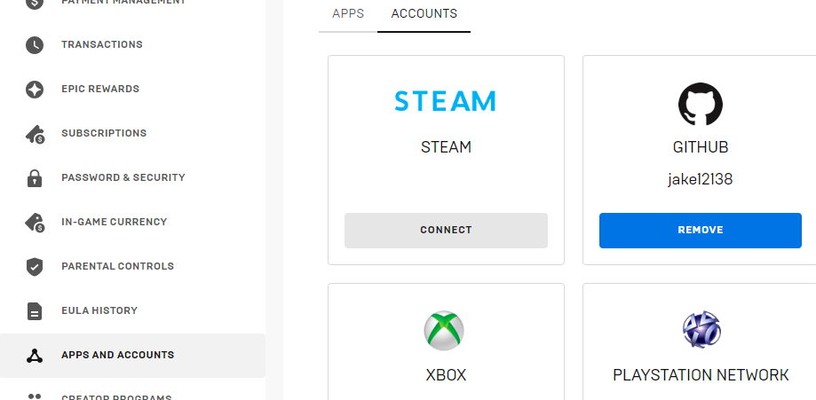

# Ubuntu安装
参考： https://blog.csdn.net/willian113/article/details/114920818

- **下载Unreal Engine 4.24源码**
Unreal Engine的源码是在Github上开源的，但是，其源码是private的，必须要加入其开发社区才能够访问。
- **绑定Github账号**
  成功注册之后访问Unreal Engine网站并登录，点击个人(PERSONAL)，再依次点击连接(CONNECTIONS)、账户(ACCOUNTS)，选择Github并输入信息，验证后绑定成功。之后Epic会给绑定邮箱里发送邮件，点击又建立的链接即可加入其开发社区
  
- **下载源代码**
  在成功绑定Github账号之后就可以访问Unreal Engine的源代码了。可以用以下命令下载Unreal Engine 4.24版
  ```shell
  git clone -b 4.24 https://github.com/EpicGames/UnrealEngine.git
  ```

# 2 UE项目文件
在UE项目中会存在几个目录
- **Binaries**：项目编译生成的文件、热加载c++类会使用到
- **Config**：目录下存在各个.ini文件，记录的是项目的各种配置,包括UE界面的布局、偏好设置等，一般不去手动改它。
- **Content**：该目录下的文件与UE编辑器下的项目文件是对应的，我们在UE编辑器中内容浏览器中看到的文件就是着这个目录下的文件
- **Content/Collections**:UE引擎使用过程中，UE引擎产生的一些中间文件和快捷文件，不要去修改它们
- **Content/Developers**:UE引擎使用过程中，UE引擎产生的一些中间文件和快捷文件，不要去修改它们
- **Content/StarterContent**：项目的资源文件
- **Content/StarterContent/Architecture**：
- **Content/StarterContent/Audio**:
- **Content/StarterContent/Blueprints**:
- **Content/StarterContent/HDRI**:
- **Content/StarterContent/Maps**:
- **Content/StarterContent/Materials**:存储Unreal处理好的资源，向下兼容，高版本可以读取低版本的资源，但低版本Unreal不能读取高版本的资源
- **Content/StarterContent/Particles**:
- **Content/StarterContent/Props**:
- **Content/StarterContent/Shapes**:
- **Content/StarterContent/Textures**:
- **Content/$(项目名)**:
- **Intermediate**：存储引擎使用或生成过程中的中间件，当项目完成后，需要传递给别人时可以删除。如果删除，那么下一次构建时需要等待的时间久一些
- **Saved**：包含日志、备份、自动保存的信息
- **Source**：存储C++源文件
- **$(项目名).uproject**：项目文件, 存放于项目的根目录

如果需要将自己的项目交给别人，所需要提供的最小内容是Config、Content和.uproject文件


# Windows 安装
在windows下安装unreal需要安装Visual Studio installer, 然后再Visual Studio installer种安装Visual Studio的时候需要同时安装组件``后才能在Unreal编辑器中通过C++创建项目。
