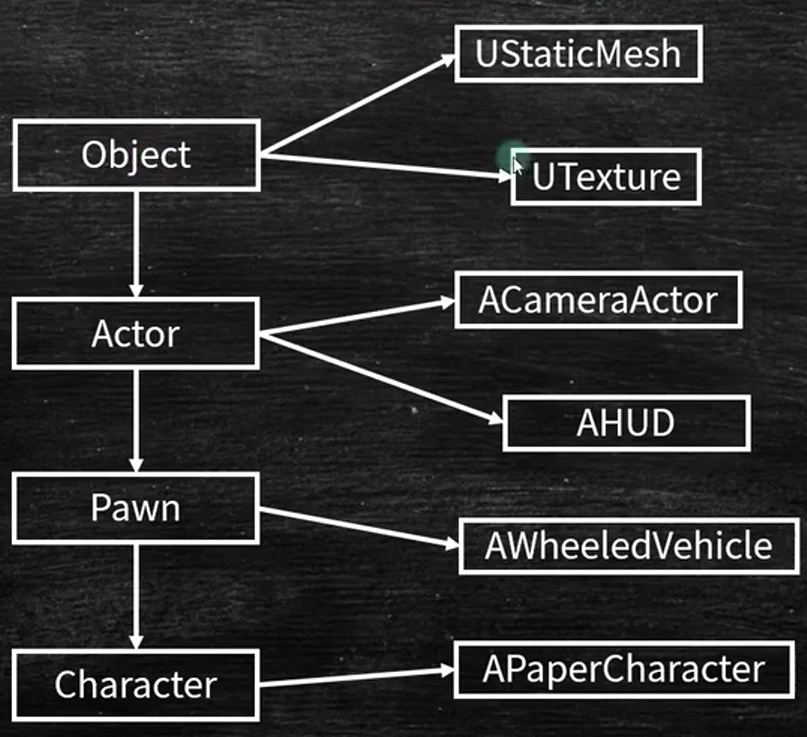

[toc]

资料来源：
https://docs.unrealengine.com/4.27/zh-CN/Basics/UnrealEngineTerminology/
# 1 蓝图
蓝图可视化脚本（Blueprint Visual Scripting） 系统（或缩写 蓝图（Blueprints））是一种功能齐全的游戏脚本系统，它允许你在虚幻编辑器（Unreal Editor）中通过基于节点的界面来创建游戏元素。和许多常见脚本语言一样，你可以用它在引擎中定义面向对象的类或对象。在使用UE4时，你会发现使用蓝图定义的类一般也统称蓝图
# 2 Actor
所有可以放入关卡的对象都是 Actor，比如摄像机、静态网格体、玩家起始位置。Actor支持三维变换，例如平移、旋转和缩放。你可以通过游戏逻辑代码（C++或蓝图）创建（生成）或销毁Actor。
在C++中，AActor是所有Actor的基类。

# 3 Component
当你为Actor添加组件后，该Actor便获得了该组件所提供的功能。例如：
聚光灯组件（Spot Light Component）允许你的Actor像聚光灯一样发光，
旋转移动组件（Rotate Movement Component）能使你的Actor四处旋转，
音频组件（Audio Component）将使你的Actor能够播放声音。
组件必须绑定在Actor身上，它们无法单独存在。

# 4 Paw
是一个特殊的Actor, 可以被controller控制, 接受外界的输入并作出响应。一般用于游戏角色或则NPC.

# 5 动作映射
**动作映射（Action Mapping）：**

动作映射用于将输入事件（例如按下一个按键）映射到游戏中的特定动作。通过定义动作映射，您可以将特定的用户输入与游戏中的功能关联起来。例如，将按键映射到跳跃动作，按下该按键时角色会执行跳跃操作。
在Unreal引擎中，可以在输入设置中配置动作映射，并通过蓝图或代码处理这些映射事件。

# 6 轴映射
**轴映射（Axis Mapping）：**

轴映射用于将输入事件的连续变化（例如滚动鼠标滚轮或按住按键连续移动摇杆）映射到游戏中的轴（例如水平移动轴或上下移动轴）。通过定义轴映射，您可以捕捉输入事件的变化并将其映射到游戏中合适的轴上。这使您可以实现类似角色移动、摄像机旋转等连续运动的效果。
在Unreal引擎中，可以在输入设置中配置轴映射，并通过蓝图或代码处理这些映射事件。轴映射通常提供了一些额外的选项，如灵敏度、缩放和偏移等，以便更好地调整输入事件与游戏中轴的映射关系。