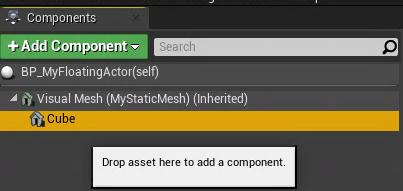
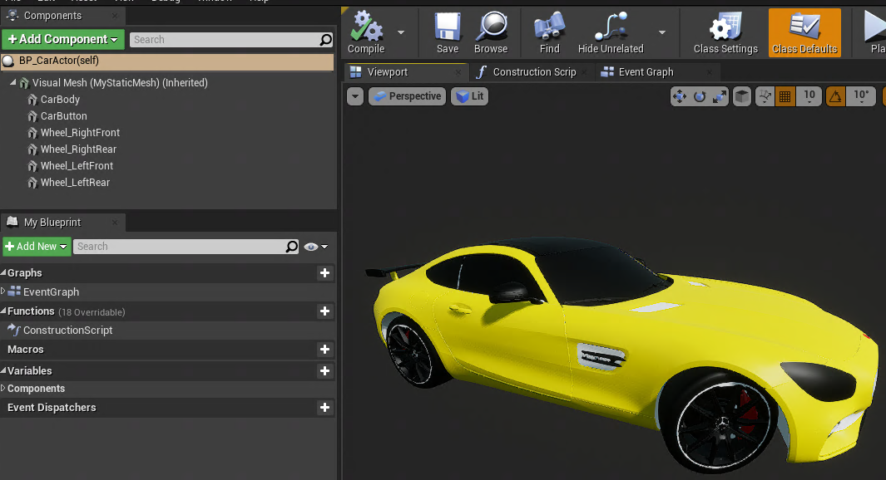
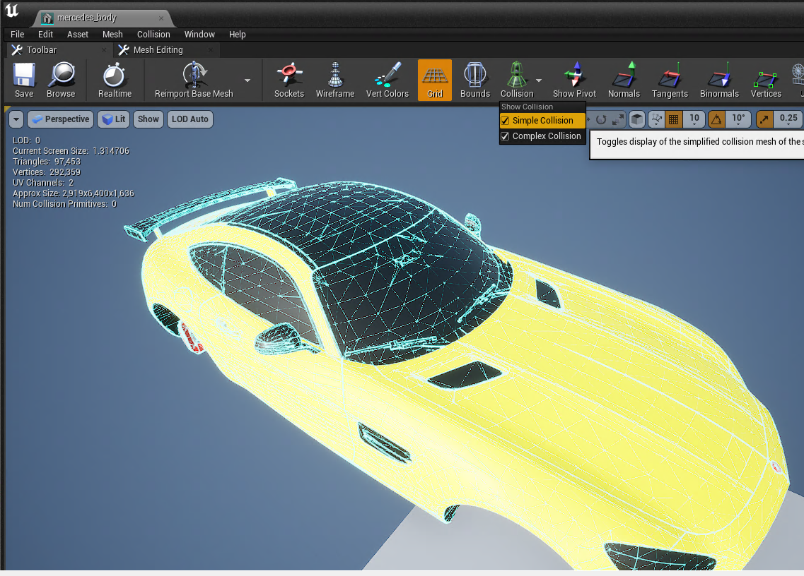
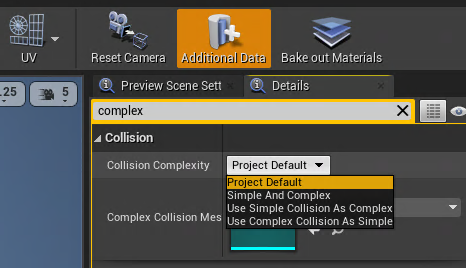
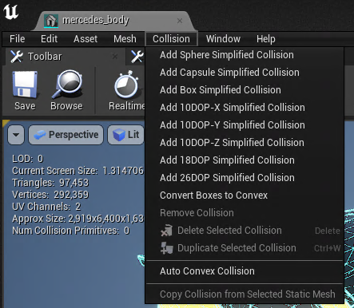
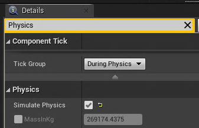
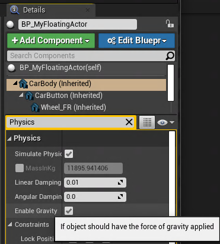
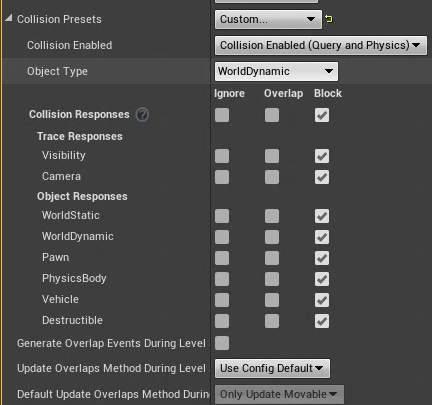
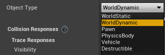

[toc]
# 1 创建C++类
（方法一）
1. 单击选中在内容浏览器下的```C++类```-->工程同名文件夹
   如果没有```C++类```这个目录，可以点击Unreal编辑器右下角的```视图选择项```，勾选```显示C++类```
2. 在内容浏览器下的```过滤器```中，在空白处右击，选择```新建C++类```
3. 根据提示选择创建C++类的父类
4. 根据提示给创建的类起名字和选择路径，一般选择$(工程根目录)/Source/$(工程名)/
5. 点击```创建类```即可。创建的C++类可以在所选择的路径下找到，并在其中编写代码

(方法二)
1. 在虚幻编辑器 中，点击 文件（File） 下拉菜单，然后选择 新建C++类...（New C++ Class...） 命令。
2. 此时将显示 选择父类（Choose Parent Class） 菜单。可以选择要扩展的现有类，将其功能添加到自己的类。选择需要继承的父类，因为其是可在场景中放置的最基本对象类型，然后点击 下一步（Next）。
3. 在 为新Actor命名（Name Your New Actor） 菜单中，将Actor命名为xxx，然后点击 创建类（Create Class）。

**注意**:如果要在Unreal编辑器的`内容浏览器`种看到`C++类`这个目录，需要在创建工程的时候选择C++类选线

# 2 创建蓝图
创建蓝图之前，一般在Content目录下创建一个新的存放蓝图的文件夹Blueprints(非硬性要求)
## 2.1 基于C++类上创建蓝图
1. 在```内容浏览器```上中的```C++类```点击选中我们创建的C++类。
2. 右击，选择```创建基于xxx的蓝图类```
3. 然后根据提示给创建的蓝图类命名和设置存放路径后点击```创建蓝图类按钮```即可，一般放在Content/Blueprints下

## 2.2 创建关卡蓝图
**关卡蓝图**：每一个关卡有且仅有一张关卡蓝图。一般关卡蓝图用于测试、设置当前关卡一些独特的内容、摄像机转换等。
打开关卡蓝图, 需要点击Unreal编辑器工具栏中的```蓝图```，选择```打开关卡蓝图(Open Level Blueprint)```


# 3 删除自定义的C++类
1. 关闭Unreal
2. 在```$(工程根目录)/Source/$(工程名)/```下将我们创建的C++类的头文件和cpp文件删除
3. 删除```$(工程根目录)/Binaries/```目录（包括Binaries）
4. 如果Unreal是运行在Windows下，那么右击```$(工程根目录)/$(工程名).uproject```文件，选择```Genarate Visual Studio project files```。(该步骤非必须，如果不做，那在打开Unreal的时候，也会要求去做)
5. 重新打开Unreal，如果没有做第4步，会提示要求做

# 4 给蓝图添加组件
1. 在`Content Browser`窗口中，找到我们创建的蓝图类，双击它进入蓝图编辑窗口<font color=gray>（在创建时我们将蓝图类放了Content/Blueprints目录下）</font>
2. 在`Components`窗口中点击`Add Component`, 然后就可以在其中搜索想要添加的组件

可以在这里添加多个组件，这样可以做到由多个组件共同组成一个完整模型



# 5 给模型添加碰撞检测
## 5.1 初始设置
1. 在Unreal编辑器中，在`内容浏览器`中导入的模型的目录中，双击模型进入模型编辑界面
2. 在`Collision`下勾选简单碰撞(Simple Collision)和复杂碰撞(Complex Collision)

3. 可以在`Details`区域设置复杂碰撞的程度（搜索Complex），在`Collision Complexity`中进行选择。

**Project Default**：默认碰撞，按照程序的要求，当程序要求复杂碰撞就用复杂碰撞检测，程序要求简单碰撞就用简单碰撞检测。
**Simple And Complex**：就是默认碰撞
**Use Simple Collision As Complex**：使用简单碰撞作为复杂碰撞，这时候即使程序中要求使用复杂碰撞，也会忽略这个要求，从而使用简单碰撞
**Use Complex Collision As Simple**：使用复杂碰撞作为简单碰撞，这时候即使程序中要求使用简单碰撞，也会忽略这个要求，从而使用复杂碰撞
## 5.1 创建碰撞检测盒体
在模型窗口顶部选择`Collision`, 会出现各个碰撞的选项。
可以添加多个碰撞检测盒体，这些盒体取并集来完成碰撞检测。

**Add Box Simplified Collision**：添加简单盒体碰撞。添加之后会在用一个长方体包裹住模型，这个长方体就是碰撞检测的范围。我们可以在视图窗口选择这个盒体(点击盒体的线)，对它进行旋转、平移、缩放。
**Add Sphere Simplified Collision**：添加球体碰撞检测。
**Add Capsule Simplified Collision**：添加柱形球体碰撞检测。
**Add 10DOP-X Simplified Collision**：按照X轴生成10面的碰撞区域。
**Add 10DOP-Y Simplified Collision**：按照Z轴生成10面的碰撞区域。
**Add 10DOP-Z Simplified Collision**：按照Z轴生成10面的碰撞区域。
**Add 18DOP Simplified Collision**:生成18面的碰撞检测区域
**Add 26DOP Simplified Collision**:生成26面的碰撞检测区域
**Auto Convex Collision**：自动生成碰撞检测区域，选择该选项后，在右侧调节参数后点击`Apply`按钮进行生成。

## 5.2 添加物理模拟
### 5.2.1 在蓝图模板中添加重力
在蓝图木板中添加物理模拟后，通过这个蓝图模板创建所有实例都具有对应模拟物理特性。
1. 双击我们创建的蓝图类
2. 选择`Component`窗口中的根组件
3. 在跟组件的`Details`窗口中搜索Physics, 勾选`Simulate Physics`

4. 运行后，就会产生重力效果，从而使在世界中的对应Actor收到重力的作用。
### 5.2.2 给单独的实例添加物理模拟
在世界窗口中选中Actor, 在`Details`区域搜索Physics，勾选`Simulate Physics`，同时勾选`Enable Gravity`. 如果需要该实例不受重力影响，就取消勾选`Enable Gravity`。

**注意**：
如果是对我们创建从C++蓝图模板进行修改还需要在`Details`区域选中我们添加的组件后，再搜索Physics进行操作。可能搜索不到。（`Static Mesh`需要有东西才能模拟重力）

## 6 开启控制台命令
在Unreal编辑器中点击`Play`运行后，鼠标点击视图窗口后，按下键盘的`~`键(Tab键上方)。就可以在视图窗口内下方输入命令。用于实时操作和调试。
以下是常用的几个命令：
- **show Collision**: 显示场景中的碰撞体积
- **t.MaxFPS <帧率>**：将帧率设置到指定的帧率

## 7 碰撞通道与击中信息设置--自定义碰撞方式
在`Details`区域中的`Collision Presets`中可以配置碰撞方式。
在`Collision Presets`设置为Custom, 设置成为Custom后下面会出现如下几个选项

`Collision Presets`选项默认为`BlockAllDynamic`----阻挡所有Actor。选为Custom后为自定义碰撞方式。
在自定义碰撞方式下,有以下几个选项：
- **Collision Enabled**：是否启用碰撞

|Collision Enabled的值|描述|
|---------------------|---|
|No Collision|不启用碰撞|
|Query Only(No Physics Collision)|仅发生在程序内部上查询路径上是否有被挡住的结果，不会实际去产生碰撞|
|Physics Only(No Query Collsion)|会实际产生碰撞，但不会查询|
|Collision Enabled|进行查询和实际碰撞|

- **Object Type**：设置物品的类型.该设置会对应下面`Object Responses`选项中的设置。

- **Collision Responses**：可以统一设置下面几项的选项。
`Ignore`:标识忽略。
`Overlap`:勾选后会生成重叠事件，能够感知有谁根自身进行了重叠，但是并不会去阻挡与自身重叠的东西。
`Block`:会将对应的东西档在自身之外


- **Trace Responses**: 追踪相关的设置，其下有两个设置项
`Visibility`: 对可见性的物体的设置，用于设置可以被看见的物体的碰撞方式
`Camera`: 对摄像机的碰撞设置。设置成Block后，摄像机也可以产生碰撞

- **Object Responses**：设置各个种类的`Object Type`(参见上面的object Type设置项)与自身的碰撞方式。
例如，勾选了`WorldStatic`选项为Ignore, 那么当`Object Type`为WorldStatic与自身相遇时，就不会发生碰撞。这样就可以设置不同种类的`Object Type`是否与自身发生碰撞了。而对于与自身碰撞的实例，也有它自己的设置，只有当碰撞双方都能与对方发生碰撞是，才会实际发生碰撞。