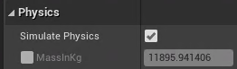

[toc]
# 1 介绍
UStaticMeshComponent是一个静态网格组件。
所需头文件`#include <Components/StaticMeshComponent.h>`

# 2 创建UStaticMeshComponent对象
创建UStaticMeshComponent使用CreateDefaultSubject<UStaticMeshComponent>模板函数。
```c++
template<class TReturnType>
TReturnType* CreateDefaultSubject(FName SubjectName, bool bTransient = false);
```
**作用**: 创建一个默认的组件。如果在创建的C++类中调用了这个函数。那么在基于该C++类创建蓝图的时候，添加的组件就是这个函数返回值对应的组件，组件名称为返回值所对应的变量名。
**参数**：
- SubjectName: 该组件在系统中的一个标识，不可重复
- bTransient: 

**示例**:
```c++
AFloatingActor::AFloatingActor()
{
	PrimaryActorTick.bCanEverTick = true;
	StaticMeshComponent* VisualMesh = CreateDefaultSubobject<UStaticMeshComponent>(TEXT("MyStaticMesh"));
}
```
# 3 UStaticMeshComponent中的函数
## 3.1 将UStaticMeshComponent添加到父组件中
```c++
void USceneComponent::SetupAttachment(class USceneComponent* InParent, FName InSocketName = NAME_None);
```
**作用**: 将自身作为子组件，添加到InParent父组件上
**参数**:
- InParent： 父组件
- InSocketName： 

**示例**:
```c++
AFloatingActor::AFloatingActor()
{
    StaticMeshComponent* VisualMesh = CreateDefaultSubobject<UStaticMeshComponent>(TEXT("MyStaticMesh"));
    
    /*RootComponent是AActor的成员变量*/
    VisualMesh->SetupAttachment(RootComponent);
}
```

## 3.2 AddForce
```c++
virtual void AddForce(FVector Force, FName BoneName = NAME_None, bool bAccelChange = false);
```
**作用**: 给UStaticMeshComponent添加一个力，用于使物体产生位移
**参数**: 
- Force：力，用于使物体产生位移
- BoneName: 例句要施加到骨骼的名称
- bAccelChange: 是否是速度的改变。如果是false,表明Force参数是代表力，即计算的时候施加给物体的力与其质量和重力加速度来算物体的速度和位移。如果该值为true, 则表明Force参数的含义是速度，那么会把Force的值当成速度来计算作为Actor的初速度。

**示例**:
```c++
/******* 变量定义 ***********/
// 将变量设置为在任何地方都能编辑
UPROPERTY(EditAnywhere, Category="My Actor Property | physics")
FVector InitForce; // 初始力
 
UPROPERTY(EditAnywhere, Category="My Actor Property | physics")
FVector InitTorque; // 初始力矩


/******* cpp代码 ***********/
AFloatingActor::AFloatingActor()
{
	PrimaryActorTick.bCanEverTick = true;

	VisualMesh = CreateDefaultSubobject<UStaticMeshComponent>(TEXT("MyStaticMesh"));
	VisualMesh->SetupAttachment(RootComponent);
	InitTorque = FVector(0.0f);
	InitForce = FVector(0.0f)
}

void AFloatingActor::BeginPlay()
{
	Super::BeginPlay();
	VisualMesh->AddForce(InitForce); // 施加初始力
	VisualMesh->AddTorque(InitTorque); // 施加初始力矩
}
```

通过以上代码设置后，编译。在Unreal编辑器中就可以看到并编辑InitForce和InitTorque的值了。不过这个值一般很大，这是因为在我们启动物理模拟后，Unreal引擎会自动生成这个对象在世界中的重量(Kg)，在`Details`区域下的`Physics`-->`MassInKg`.

对于这么大的重量需要比较大的力才能推动Actor移动得比较明显。也可以勾选`MassInKg`然后自己修改重量

## 3.3 AddTorque
```c++
void AddTorque(FVector Torque, FName BoneName = NAME_None, bool bAccelChange = false);
```
**作用**: 给UStaticMeshComponent添加一个力矩，用于使物体产生旋转
**参数**: 
- Force：添加的力矩
- BoneName: 例句要施加到骨骼的名称
- bAccelChange: 是否是速度的改变

**示例**：
参考[3.2 AddForce](#32-addtorque)


