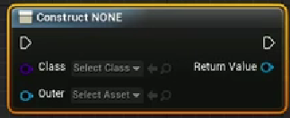
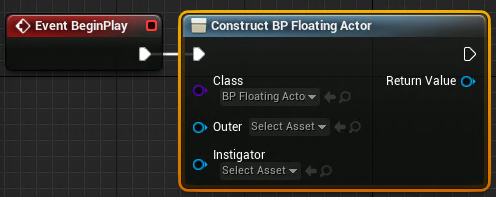

# 1 关卡蓝图---BeginPlay
在关卡蓝图中，右击后搜索```BeginPlay```后会创建BeginPlay事件节点，这是游戏开始的时候，由Unreal进行调用。
# 2 关卡蓝图---实例化Objiect类
```Construct Object from class```用于实例化继承自Object的C++类.

1. 在```Select Class```选择需要实例化的类
2. 在```Outer```处选择输出成什么资源，一般还是选择跟Class处一致
3. 在Return Value处可以直接调用所选类的函数或者提升为变量(Promote to variable)，然后在后面调用。

如果在第2步选择实例化类的时候，选择了继承自```AActor```的类，则会变成

- 在Instigator中选择对应的UI对象.
- 按住alt键，点击节点之间的连接线可以断开连接