[toc]
# 1 创建Pawn
根创建C++类流程一样，只是把所继承的类改为继承Pawn.
创建好的代码为：
头文件：
```c++ 
#pragma once
#include "CoreMinimal.h"
#include "GameFramework/Pawn.h"
#include "MyPawn.generated.h"

UCLASS()
class STATING_API AMyPawn : public APawn
{
	GENERATED_BODY()
public:
	// Sets default values for this pawn's properties
	AMyPawn();
protected:
	// Called when the game starts or when spawned
	virtual void BeginPlay() override;
public:	
	// Called every frame
	virtual void Tick(float DeltaTime) override;
	// Called to bind functionality to input
	virtual void SetupPlayerInputComponent(class UInputComponent* PlayerInputComponent) override;
};
```

# 2 给创建的Pawn添加根组件
在构造函数中通过`CreateDefaultSubject`给`RootComponent`赋值

```c++
// 头文件
#pragma once

#include "CoreMinimal.h"
#include "GameFramework/Pawn.h"
#include "MyPawn.generated.h"

UCLASS()
class STATING_API AMyPawn : public APawn
{
	GENERATED_BODY()
public:
	// Sets default values for this pawn's properties
	AMyPawn();
	
    UPROPERTY(VisibleAnywhere, Category="My Pawn Property")
	class UStaticMeshComponent* VisibleMesh;
	
    UPROPERTY(VisibleAnywhere, Category="My Pawn Propwerty")
	class UCameraComponent* MyCamera;
protected:
	// Called when the game starts or when spawned
	virtual void BeginPlay() override;

public:	
	// Called every frame
	virtual void Tick(float DeltaTime) override;

	// Called to bind functionality to input
	virtual void SetupPlayerInputComponent(class UInputComponent* PlayerInputComponent) override;	
};
```
-------------------------
```c++
// cpp 构造函数
#include "Components/StaticMeshComponent.h"
AMyPawn::AMyPawn()
{
 	// Set this pawn to call Tick() every frame.  You can turn this off to improve performance if you don't need it.
	PrimaryActorTick.bCanEverTick = true;

    // 创建默认的RootComponent
	RootComponent = CreateDefaultSubobject<USceneComponent>(TEXT("RootComponent"));

    // 创建默认的静态网格
	VisibleMesh = CreateDefaultSubobject<UStaticMeshComponent>(TEXT("VisibleMesh"));

    // 将静态网格附加到RootComponent上
	VisibleMesh->SetupAttachment(GetRootComponent());
}
```
代码编辑完成后，在Unreal编辑器中编译，编译完成后，再创建基于C++类的蓝图。创建蓝图完成后像这样：
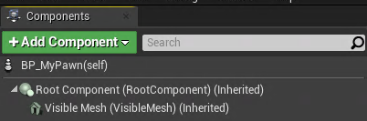
正如我们再代码中编写的那样，创建了RootComponent根组件，然后将VisibleMesh附加到根组件上。

# 3 添加UCameraComponent组件
```c++
// cpp 构造函数
#include "Components/StaticMeshComponent.h"
#include "Camera/CameraComponent.h"
AMyPawn::AMyPawn()
{
    // Set this pawn to call Tick() every frame.  You can turn this off to improve performance if you don't need it.
    PrimaryActorTick.bCanEverTick = true;

    // 创建默认的RootComponent
    RootComponent = CreateDefaultSubobject<USceneComponent>(TEXT("RootComponent"));

    // 创建默认的静态网格
    VisibleMesh = CreateDefaultSubobject<UStaticMeshComponent>(TEXT("VisibleMesh"));

    // 将静态网格附加到RootComponent上
    VisibleMesh->SetupAttachment(GetRootComponent());

    MyCamera = CreateDefaultSubobject<UCameraComponent>(TEXT("MyCamera"));
    MyCamera->SetupAttachment(RootComponent);

    // 设置CameraComponent组件相对于父组件的位置
    MyCamera->SetRelativeLocation(FVector(-300.0f, 0.0f, 300.0f));
    
    // 设置CameraComponent组件相对于父组件的旋转角度
    MyCamera->SetRelativeRotation(FRotator(-45.0f, 0.0f, 0.0f)); 
}
```
代码编写完后再Unreal编辑器中编译，然后打开蓝图给VisibleMesh添加`Static Mesh` 和材质`Materials`
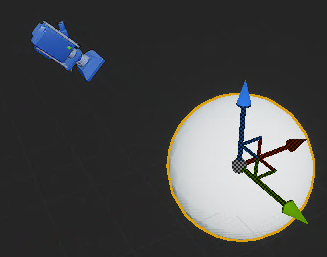

# 4 替换初学者内容包中的Pawn
将我们自己创建的Pawn替换初学者内容包中的Pawn来作为玩家。
1. 在`内容浏览器`中的`C++类`区域选择继承自`Game Mode Base`的类，如果没有就自己创建一个c++类，选择继承`Game Mode Base`类。
2. 基于创建的游戏模式类，创建蓝图。
3. 双击创建的蓝图，进入蓝图编辑界面。在`Details`区域中`Classes`的`Default Pawn Class`选项选择前面基于Pawn创建的BP_MyPawn蓝图类。然后编译保存
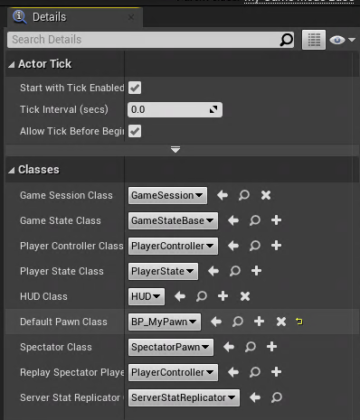
4. 打开`World Setting`。在`World Outliner`中选中根节点，右击。即可找到`World Setting`选项
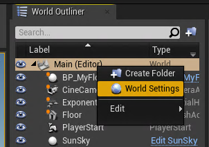
5. 在`Game Mode`下的`GameMode Override`中选择我们前面创建的基于`Game Mode Class`的蓝图类BP_MyGameModeBase
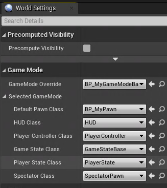
6. 这时候点击`Play`就会发现我们自己创建的Pawn就替换变成了游戏角色，但是还不能移动和旋转视角。
下面将添加视角和移动
7. 在我们创建的BP_MyPawn蓝图类中，在`Details`区域中设置`Auto Prossess Player`为`Player 0`。 这里的Player 0的含义表示在网络游戏中，我们自己操控的本地角色或则单机游戏中我们操控的角色。
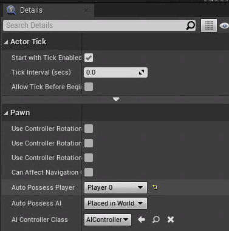

8. 在我们创建的c++类`MyPawn`的构造函数中添加代码
`AutoPossessPlayer = EAutoReceiveInput::Player0;`

# 5 给Pawn类添加输入--按键映射（控制Pawn移动）
1. 在工具栏中打开`Setting`
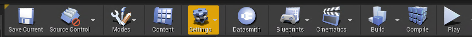
2. 打开`Project Setting`
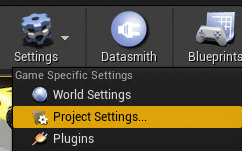
3. 在`Project Seeting`中找到`input`设置项
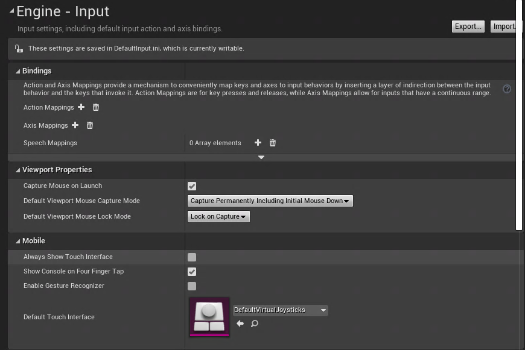
4. 在`input`设置界面里面有`Action Mapping`和`Axis Mapping`, 它们分别是动作银色和轴映射。动作映射和轴映射概念见[动作映射](2_UE中的名词和术语.md#5-动作映射)、[轴映射](2_UE中的名词和术语.md#6-轴映射)
5. 因为要通过按键来控制Pawn的移动，因此我们需要添加`轴事件`.点击 `Axis Mapping`后面的加号添加一个轴事件，并重新命名。如下命名为ForwarldPawn. 再点击我们MoveForward后面的+号，可以创建触发这个事件的行为，如按键、鼠标事件等。
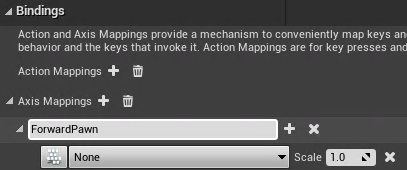
6. 在上面创建的触发事件中选择触发移动Pawn的事件，这里选择`W`为向前、`S`表示向后
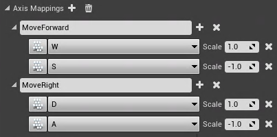
这样创建好后，当我们按下这个按键时，Unreal引擎就会不断地调用我们创建的这个事件对应的函数。
事件后面的`Scale`的值就是传给这个函数的值，每次被调用就传入Scale，从而可以根据Scale的值来做游戏逻辑。按照同样的方式可以添加左右移动
7. 以上我们在Unreal编辑器中进行了按键事件的设置，接下来需要在代码里绑定事件映射。
在我们创建的类中定义好前后、左右移动的函数，函数名自定义，但建议根上面创建事件时起的名字一致。
```c++
private:
	void MoveForward(float value); // 前后移动
	void MoveRight(float value); // 左右移动
```

**函数实现**:
```c++
void AMyPawn::MoveForward(float value){
	Valocity.X = FMath::Clamp(value, -1.0f, 1.0f)*MaxSpeed;
	UE_LOG(LogTemp, Warning, TEXT("move forward %f"), value);
}

void AMyPawn::MoveRight(float value){
	Valocity.Y = FMath::Clamp(value, -1.0f, 1.0f)*MaxSpeed;
	UE_LOG(LogTemp, Warning, TEXT("move right value=%f"), value);
}

void AMyPawn::Tick(float DeltaTime)
{
	Super::Tick(DeltaTime);

	/*乘以DeltaTime后就能实现移动速度与帧率无关，因为如果两帧之间间隔大的话，下面计算出的位移也大；两帧之间间隔小，计算出的位移也小*/
	AddActorLocalOffset(Valocity*DeltaTime, true);
}
```


8. 绑定我们定义的函数
需要头文件`#include "Components/InputComponent.h"`.
在`SetupPlayerInputComponent`函数的实现中添加
```c++
void AMyPawn::SetupPlayerInputComponent(UInputComponent* PlayerInputComponent)
{
	Super::SetupPlayerInputComponent(PlayerInputComponent);

	// 绑定我们定义的函数到InputComponent中
	PlayerInputComponent->BindAxis(TEXT("MoveForward"), this, &AMyPawn::MoveForward);
	PlayerInputComponent->BindAxis(TEXT("MoveRight"), this, &AMyPawn::MoveRight);
}
```
这样当我们一直按住定义的按键后，每一帧都会调用`MoveForward`、`MoveRight`并将对应事件的`Scale`值作为参数传入。
**BindAxis函数介绍**
```c++
template<class UserClass>
FInputAxisBinding& BindAxis( const FName AxisName, UserClass* Object, typename FInputAxisHandlerSignature::TUObjectMethodDelegate< UserClass >::FMethodPtr Func )
```
**作用**: 将函数绑定到InputComponent上
**参数**：
- <font color=blue>AxisName</font>:绑定事件的名字
- <font color=blue>Object</font>: 待绑定函数所属的实例对象
- <font color=blue>Func</font>: 函数地址