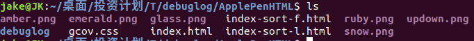

# gcov代码覆盖率工具
## 1.1 gcov工具介绍
gcov是随着gcc一起发布的用于代码覆盖率统计的工具，一般配合其图形工具lcov一起使用。
## 1.2 安装gcov
gcov不需要单独安装, 安装gcc的时候会自动安装。
## 1.3 gcov使用
下面以针对ApplePen.c文件的覆盖率统计为例，说明使用方法。</br>
```c
#include <stdio.h>
int main(int argc, char** argv){
    if(argc > 2){
        printf("I have a apple\n");
    }else{
        printf("I have a pen.\n");
    }
    return 0;
}
```
1. **_编译_**
  ```shell
  gcc -fprofile-arcs -ftest-coverage ApplePen.c -o ApplePen
  ```
  因为添加了‘-ftest-coverage’选项，编译完成后，会生成：ApplePen.gcno，由-ftest-coverage产生，它包含了重建基本块图和相应的块的源码的行号的信息.
  **注意**：
  - 如果要对生成库的代码进行代码覆盖率测试，还需要在生成.o文件处添加这-fprofile-arcs -ftest-coverage两个选项。
2. **_运行_**
  ```shell
  ./ApplePen
  ```
  这一步会生成ApplePen.gcda, 由加了-fprofile-arcs编译参数的编译后的文件运行所产生的，它包含了弧跳变的次数和其他的概要信息。
  等待程序运行完毕后会在$(GCOV_PREFIX)目录下生成*.gcda文件.具体在$(GCOV_PREFIX)目录下的什么未知跟你的代码排版有关。$(GCOV_PREFIX)默认为你的编译环境路径.
  如果运行环境跟编译环境不是同一个机器，还需要将运行环境中生成的*.gcda文件复制到编译环境同目录下。
  **注意1：** 如果涉及到交叉编译，将执行程序拿到其他机器上运行。因为编译路径和在其他机器上的运行路径可能不同，这会导致生成**.gcda文件失败(编译环境的GCOV_PREFIX路径在运行环境下不存在)。在这种情况下可以设置环境变量**GCOV_PREFIX**和 **GCOV_PREFIX_STRIP**。GCOV_PREFIX就是制定生成数据文件的前缀，GCOV_PREFIX_STRIP就是 需要在原来的路径上去掉多少层目录，这2个变量配合使用就能把数据文件生成到我们想要的地方。
  ```shell
  export GCOV_PREFIX="<运行环境的路径>"
  export GCOV_PREFIX_STRIP=4  #(数字为编译环境的目录层数) 
  ``` 
  **注意2**：对于在其他机器上运行，需要将第一步生成的ApplePen.gcno放到运行程序的同级目录。

3. **_生成代码覆盖信息_**
   ```shell
   gcov ApplePen.c
   ```
   这一步生成ApplePen.c.gcov, 这就是代码覆盖信息，其中包含了代码覆盖的统计数据，数字代表了每行代码被执行的次数及行号。到这一步，就可以打开hello.c.gcov查看代码覆盖率，但是不够直观，因此需要借助LCOV实现代码覆盖率统计数据的图形化显示。
   **注意**：
   - 执行gcov命令的路径要跟编译路径(看编译该对象的makefile文件路径)一致，而参数的路径设置为相对路径即可。如果出现"Cannot open source file xxx"的打印，就说明路径有问题。
4. **_生成lcov可读文件_**
   ```shell
   lcov -d . -t '<第3步生成的*.gcov文件>' -o '<生成之后的lcov文件,自命名.info>' -b . -c
   ```
   **注意**：
   - 如果在第2步生成的.gcda文件单独拷贝到了源码的路径，就需要cd到对应源码路径下执行lcov命令。
   - 如果在第2步生成的.gcda文件包含运行的相对目录拷贝到编译目录下，那么lcov命令在编译目录下执行即可。
5. **_生成图形化展示结果_**
   ```shell
   genhtml -o <生成的html文件的存放路径> <第4步生成的*.info文件>
   ```
   这会在<生成的html文件的存放路径>中生成html文件，借助浏览器可以直观地看到统计数据。
   