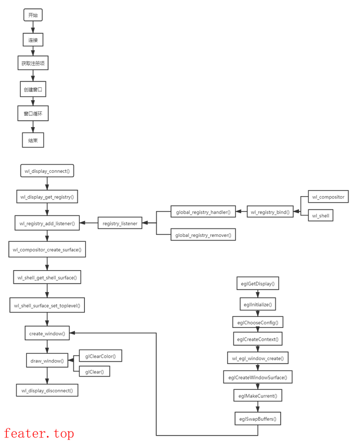

[toc]
# 1 Wayland介绍
wayland协议是用于与本地窗口通信的协议，可以与EGL配合使用，生成EGL所需的EGLNativeDisplayType和EGLNativeWindowType。
wayland协议是一个client-server模式的，通过client由app自己绘制完图形buffer后提交给wayland-server，wayland-server汇总其他所有app的绘制buffer在屏幕上绘制出整体界面。
# 2 Wayland创建流程

示例代码见 <font color="#87CEFA">MyOpenGLES_FW/UIEngine/src/GLEnv/WaylandWindow.cpp-->WaylandWindow::initWayland()函数</font>

## 2.1 wayland API
### 2.1.1 wl_display_connect
**函数原型**:
```c
struct wl_display* wl_display_connect(const char *name);
```
**描述**:
通过socket建立与wayland Server端的连接返回wl_display。
**参数**：


### 2.1.2 wl_display_get_registry
**函数原型**:
```c
static struct wl_registry*
wl_display_get_registry(struct wl_display *wl_display)
```
**描述**:
 申请创建registry，得到代理对象wl_registry。这个个对象相当于Client在Server端放的一个用于嗅探资源的Observer。Client通过它得到Server端有哪些Global对象的信息。Server端有一系列的Global对象，如wl_compositor, wl_shm等。
 **参数**：
 - **<font color="green">wl_display</font>**: wayland客户端，由wl_display_connect返回

### 2.1.3 wl_registry_add_listener
**函数原型**:
```c
static int
wl_registry_add_listener(struct wl_registry *wl_registry,
			 const struct wl_registry_listener *listener, void *data)
```
**描述**:
 让Client监听刚才创建的wl_registry代理对象。这样， 当Client调用wl_display_get_registry()函数或者有新的Global对象加入到Server端时，Client就会收到event通知。
  **参数**：
  - **<font color="green">wl_registry</font>**: wayland client在server的嗅探器，由wl_display_get_registry创建。
  - **<font color="green">wl_registry_listener</font>**： 回调函数结构体，内部有两个回调函数指针，需要我们自己实现并赋值。
  ```c
  // 当server中有可用的global对象时回调一次
  void (*global)(void *data,
		       struct wl_registry *wl_registry,
		       uint32_t name,
		       const char *interface,
		       uint32_t version);
  // 当server中有global对象消失时回调一次
  void (*global_remove)(void *data,
			      struct wl_registry *wl_registry,
			      uint32_t name);
  ```
  - **<font color="green">data</font>**：传入参数，在调用回调函数时，这个值会作为参数data传给wl_registry_listener内部的两个回调函数,用于处理自定义的行为。

### 2.1.4 wl_display_roundtrip
**函数原型**:
```c
int wl_display_roundtrip(struct wl_display *display);
```
**描述**:
等待前面的请求全被Server端处理完，它同步了Client和Server端。这意味着到这个函数返回时，Server端有几个Global对象，回调处理函数registry_handle_global()应该就已经被调用过几次了。 registry_handle_global()中会判断是当前这次event代表何种Global对象，然后调用wl_registry_bind()进行绑定，得到远程服务对象的本地代理对象。这些代理对象类型可以是wl_shm, wl_compositor等，但本质上都是wl_proxy类型.
  **参数**：
  - **<font color="green">display</font>**: wayland客户端，由wl_display_connect返回。

### 2.1.5 wl_registry_bind
**函数原型**:
```c
static void *
wl_registry_bind(struct wl_registry *wl_registry, uint32_t name, const struct wl_interface *interface, uint32_t version)
```
**描述**:
获取wayland server上的global对象。这个函数应在wl_registry_add_listener添加的回调函数结构体listener中的global回调函数中使用。
**参数**：
- **<font color="green">wl_registry</font>**：wayland client在server的嗅探器，由wl_display_get_registry创建。
- **<font color="green">name</font>**：跟wl_registry_listener.global回调函数的name一致
- **<font color="green">interface</font>**：wayland server上global对象的名字，包含"wl_compositor"、"wl_shell"、"wl_output"、"xdg_shell"、"zwp_fullscreen_shell_v1"、"ivi_application"等
- **<font color="green">version</font>**：对应global对象的版本号，跟wl_registry_listener.global回调函数的version参数一致

### 2.1.6 wl_compositor_create_surface
**函数原型**:
```c
static struct wl_surface *
wl_compositor_create_surface(struct wl_compositor *wl_compositor)
```
**描述**:
通过在wl_registry_listener.global回调函数中调用wl_registry_bind绑定的wl_compositor服务创建Server端的weston_surface，并返回代理对象 wl_surface。
**参数**:
- **<font color="green">wl_compositor</font>**：Server端的weston_surface的代理

### 2.1.7 wl_shell_get_shell_surface
**函数原型**:
```c
static struct wl_shell_surface*
wl_shell_get_shell_surface(struct wl_shell *wl_shell, struct wl_surface *surface)
```
**描述**:
通过wl_registry_listener.global回调函数中调用wl_registry_bind绑定的wl_shell服务创建Server端的shell_surface，返回代理对象 wl_shell_surface。有些例子中用的是 xdg_surface，它和wl_shell_surface的作用是一样的。xdg_surface是作为wl_shell_surface将来的替代品，但还没进Wayland核心协议。

为什么一个窗口要创建两个surface呢？因为Wayland协议假设Server端对Surface的管理分两个层次。以Weston为例，Compositor只负责合成（代码主要在compositor.c），它相当于Android中的SurfaceFligner，它所看到的主要是weston_surface。而Weston在启动时会加载shell模块（如desktop-shell.so，代码主要在desktop-shell/shell.c），它相当于Android中的WindowManagerService，它所看到的主要是shell_surface。shell_surface在结构上是weston_surface的进一步封装，为了做窗口管理。这样，合成渲染和窗口管理的模块既可以方便地相互访问又保证了较低的耦合度
**参数**:
- **<font color="green">wl_shell</font>**: 通过wl_registry_bind获取的struct wl_shell*对象
- **<font color="green">surface</font>**: 通过wl_compositor_create_surface获取的Server端的weston_surface代理对象

### 2.1.8 wl_egl_window_create
**函数原型**:
```c
struct wl_egl_window*
wl_egl_window_create(struct wl_surface *surface,
		     int width, int height);
```
**描述**:
创建EGLNativeWindowType,用于EGL的eglCreateWindowSurface创建surface，在eglplatform.h中有```typedef struct wl_egl_window  *EGLNativeWindowType;```
**参数**:
- **<font color="green">surface</font>**: 由wl_compositor_create_surface创建
- **<font color="green">width</font>**: 窗口的宽
- **<font color="green">height</font>**: 窗口的高

# 3 wayland操作
## 3.1 获取鼠标点击事件(待确认)
要使用 Wayland 提供的 API 获取鼠标点击事件，您需要使用 Wayland 协议定义的接口和事件。下面是使用 Wayland API 获取鼠标点击事件的一般步骤：

1. **创建连接**：使用 `wl_display_connect` 函数建立与 Wayland 服务器的连接。这将返回一个 `wl_display` 对象，它表示与 Wayland 服务器的通信。

2. **获取 registry**：使用 `wl_display_get_registry` 函数从 `wl_display` 对象获取 `wl_registry` 对象。`wl_registry` 是 Wayland 协议的注册表，用于管理和获取各种全局对象。

3. **监听 registry 全局对象**：使用 `wl_registry_add_listener` 函数注册一个监听器，以便在全局对象可用时进行通知。

4. **处理 registry 全局对象**：实现监听器中的回调方法，例如 `registry_global` 和 `registry_global_remove` 方法。在 `registry_global` 方法中，您可以识别和获取所需的全局对象，如 `wl_seat` 对象（表示输入设备）。

5. **获取输入设备**：使用 `wl_registry_bind` 函数从 `wl_registry` 获取 `wl_seat` 对象。您可以通过显示名称或 ID 来选择合适的 `wl_seat` 对象。

6. **监听输入设备**：使用 `wl_seat_add_listener` 函数注册一个监听器，以便在输入设备事件发生时进行通知。

7. **处理输入设备事件**：实现监听器中的回调方法，例如 `seat_handle_capabilities` 和 `seat_handle_pointer` 方法。在 `seat_handle_capabilities` 方法中，您可以检查输入设备的功能，并在其中包含鼠标功能时注册鼠标事件监听器。

8. **监听鼠标事件**：使用 `wl_pointer_add_listener` 函数注册一个鼠标事件监听器。

9. **处理鼠标事件**：实现鼠标事件监听器中的回调方法，例如 `pointer_handle_button` 方法。在这些回调方法中，您可以处理鼠标点击事件并执行相应的操作。

通过以上步骤，您就可以使用 Wayland 提供的 API 获取鼠标点击事件了。具体的代码实现将涉及到更多的细节和方式，因此您需要参考 Wayland 的 API 文档和示例代码以获得更多的指导和使用方法。