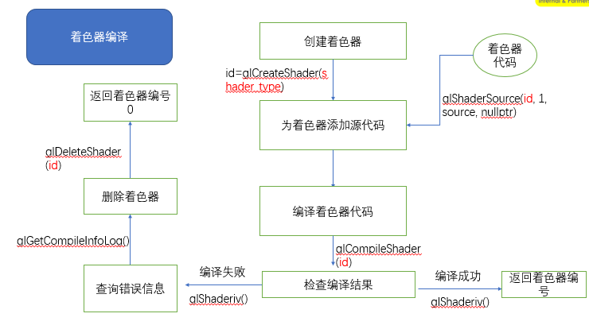
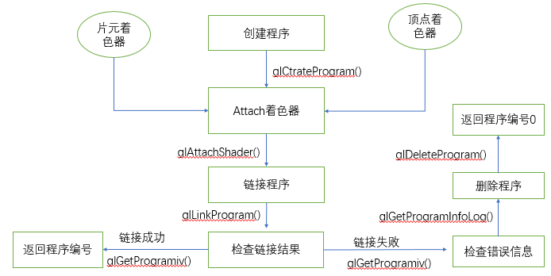

[toc]
# 1 创建着色器流程

示例代码
```c++
// 创建顶点着色器
GLuint Shader::createShader(const char* vertexShaderSource){
    // 创建一个空的顶点着色器(创建片段着色器使用GL_FRAGMENT_SHADER)
    GLuint shaderId = glCreateShader(GL_VERTEX_SHADER);
    
    // 替换顶点着色器中的代码
    glShaderSource(shaderId, 1, &vertexShaderSource, nullptr);

    // 编译顶点着色器
    glCompileShader(shaderId);
    
    // 查询编译结果
    GLint compileResult = 0;
    glGetShaderiv(shaderId, GL_COMPILE_STATUS, &compileResult);
    if(compileResult==0){
        /* 如果编译失败，打印编译日志 */
        // 获取日志的长度
        GLint logLength = 0;
        glGetShaderiv(shaderId, GL_INFO_LOG_LENGTH, &logLength); 

        GLchar* compileLog = new GLchar[logLength];
        GLsizei logSize = 0;
        glGetShaderInfoLog(shaderId, sizeof(compileLog), &logSize, compileLog);
        // 删除顶点着色器
        glDeleteShader(shaderId);
        LOGE("compile shader error:%s",compileLog);
        delete compileLog;
        return 0;
    }
    return shaderId;
}
```

## 1.1 创建着色器相关的API
### 1.1.1 glCreateShader
**函数原型**：
```c++
GLuint glCreateShader (GLenum type);
```
**描述**：
创建一个空的着色器对象，并返回一个可以引用的非零值(shader ID，着色器句柄)
**参数**：
- **<font color="green">type</font>**: 创建着色器的类型：
  GL_VERTEX_SHADER:顶点着色器，
  GL_FRAGMENT_SHADER:片段着色器

**返回值**：
正常返回一个大于0的值，失败返回0。返回的大于0的值是一个shader对象的句柄，类似于文件描述符。

### 1.1.2 glShaderSource
**函数原型**:
```c++
// 替换着色器对象中的源代码,先前存储在着色器对象中的任何源代码都将被完全替换
void  glShaderSource (GLuint shader,
                      GLsizei count,
                      const GLchar *const*string,
                      const GLint *length);
```
**参数**:
- **<font color="green">shader</font>**：着色器的ID <font color="gray">(由glCreateShader返回)</font>
- **<font color="green">counts</font>**: 着色器的个数
- **<font color="green">string</font>**: 着色器代码
- **<font color="green">length</font>**: 指定字符串长度的数组。如果length为NULL，则认为每个字符串都以null结尾, 如果length不是NULL，则它指向包含字符串的每个相应元素的字符串长度的数组.

**错误值**:
- GL_INVALID_OPERATION：不支持着色器编译器
- GL_INVALID_VALUE：shader不是OpenGL生成的值
- GL_INVALID_OPERATION：shader不是着色器对象
- GL_INVALID_VALUE：count比0小

### 1.1.3 glCompileShader
**函数原型**:
```c++
void glCompileShader (GLuint shader);
```
**描述**：
glCompileShader 编译指定的储存有字符串源码的 shader 对象。

编译的状态将会储存在 shader 对象的状态部分中。如果编译 shader 没有错误，可就绪使用，那么状态值将设置为 GL_TRUE，否则返回 GL_FALSE。可以使用 glGetShaderiv 函数带上指定的 shader ID与 GL_COMPILE_STATUS 常量值。

shader 的编译可能会由于不符合 OpenGL Shading Language Specification（OpenGL 着色器语言规范）的原因而失败。编译是否成功，相关的编译信息可以通过调用 glGetShaderInfoLog来获取 shader 对象的信息日志。
**参数**:
- **<font color="green">shader</font>**： 着色器句柄，由glCreateShader返回

### 1.1.4 glGetShaderiv
**函数原型**:
```c++
void glGetShaderiv (GLuint shader, GLenum pname, GLint *params);
```
**描述**：
 从着色器对象返回一个参数（用来检测着色器编译是否成功,或则获取shader的其他状态信息）
**参数**：
- **<font color="green">shader</font>**: 着色器对象句柄
- **<font color="green">pname</font>**:指定着色器对象的参数。 可接受的符号名称为
(1)<font color="violet">GL_SHADER_TYPE</font>：
shader_type:着色器类型
用来判断并返回着色器类型，若是顶点着色器返回GL_VERTEX_SHADER，若为片元着色器返回GL_FRAGMENT_SHADER.
(2)<font color="violet">GL_DELETE_STATUS</font>:
detele status：删除状态
判断着色器是否被删除，是返回GL_TRUE,否则返回GL_FALSE,
(3)<font color="violet">GL_COMPILE_STATUS</font>:
compile_status:编译状态
用于检测编译是否成功，成功为GL_TRUE，否则为GL_FALSE.
(4)<font color="violet">GL_INFO_LOG_LENGTH</font>:
information log length： log是日志的意思，所以是返回着色器的信息日志的长度
用于返回着色器的信息日志的长度，包括空终止字符（即存储信息日志所需的字符缓冲区的大小）。 如果着色器没有信息日志，则返回值0。
(5)<font color="violet">GL_SHADER_SOURCE_LENGTH</font>:
SHADER_SOURCE_LENGTH:着色器源码长度
返回着色器源码长度，不存在则返回0

### 1.1.5 glGetShaderInfoLog
**函数原型**:
```c++
void  glGetShaderInfoLog (GLuint shader, GLsizei bufSize, GLsizei *length, GLchar *infoLog);
```
**描述**：
获取shader的编译日志，并将信息存入传出参数infoLog中。一个 shader 对象的日志信息可能包含诊断信息，警告信息，和其他关于编译操作的信息。当一个 shader 对象被创建时，它的日志信息将会被设置为一个 0 长度的字符串。
**参数**：
- **<font color="green">shader</font>**: 着色器对象句柄
- **<font color="green">bufSize</font>**: 传入缓冲区infoLog的长度
- **<font color="green">length</font>**: 返回 infoLog（不包括空结尾符）的字符串长度。如果不需要返回字符串的长度，那么 length 传入 NULL。
- **<font color="green">infoLog</font>**: 存储日志信息的buffer

### 1.1.6 glDeleteShader
**函数原型**:
```c++
void glDeleteShader(GLuint shader);
```
**描述**：
删除指定的shader对象
**参数**：
- **<font color="green">shader</font>**: 着色器对象句柄

# 3 GL渲染程序创建
在创建完着色器后，需将顶点着色器和片段着色器链接成一个程序用于openGL的渲染。当使用这个程序的时候，openGL的渲染就会使用我们定义的这个程序来完成渲染流程。
## 3.1 创建GL渲染程序流程

示例代码
```c++
GLuint Shader::getProgramFromSource(const char* vertexShaderSource, const char* fragmentShaderSource){
    // 创建顶点着色器和片段着色器
    GLuint vertexShaderId = createShader(vertexShaderSource, GL_VERTEX_SHADER);
    GLuint fragmentShaderId = createShader(fragmentShaderSource, GL_FRAGMENT_SHADER);
    
    // 创建一个GL渲染程序
    GLuint program = glCreateProgram();

    // 将顶点着色器和片段着色器添加到GL渲染程序中
    glAttachShader(program, vertexShaderId);
    glAttachShader(program, fragmentShaderId);

    // 链接程序
    glLinkProgram(program);

    // 链接完程序后可见shader删除释放资源(除非后续还要继续使用)，这不会影响到program
    glDeleteShader(vertexShaderId);
    glDeleteShader(fragmentShaderId);

    // 查询链接状态
    GLint programStatus = 0;
    glGetProgramiv(program, GL_LINK_STATUS, &programStatus);
    if(programStatus == GL_FALSE){
        // 如果链接失败，则查看链接日志
        GLint logSize = 0;
        glGetProgramiv(program, GL_INFO_LOG_LENGTH, &logSize); // 获取日志的长度

        GLchar* programLog= new GLchar[logSize];
        glGetProgramInfoLog(program, logSize, nullptr, programLog);
        glDeleteProgram(program);
        LOGE("compile gl program error: %s", programLog);
        delete programLog;
        return 0;
    }
    return program;
}
```

## 3.2 创建GL渲染程序相关API

### 3.2.1 glCreateProgram
**函数原型**:
```c++
GLuint glCreateProgram (void);
```
**描述**:
创建一个空的GL渲染程序对象
**返回值**：
创建成功则返回GL渲染程序对象的句柄，否则返回0.

### 3.2.2 glAttachShader
**函数原型**:
```c++
void glAttachShader (GLuint program, GLuint shader);
```
**说明**:
将经过了glCompileShader的着色器对象关联到program渲染程序对象上。
**参数**:
- **<font color="green">program</font>**: GL渲染程序对象的句柄
- **<font color="green">shader</font>**： 着色器对象的句柄，注意这里的shader是通过glCompileShader函数编译成功的着色器对象句柄

### 3.2.3 glLinkProgram
**函数原型**:
```c++
void glLinkProgram(GLuint program);
```
**说明**:
将顶点着色器和片段着色器链接到program程序对象上。
链接成功后程序对象日志信息会被更新，程序对象会在链接操作时生成。在链接操作后，应用程序释放修改附加的shader对象，编译附加 shader 对象，解除附加 shader 对象，删除 shader 对象，与 附加额外的 shader对象。这些操作都不会影响程序对象的日志信息或是程序的其他部分。
**参数**:
- **<font color="green">program</font>**: L渲染程序对象的句柄

### 3.2.4 glGetProgramiv
**函数原型**:
```c++
void glGetProgramiv(GLuint program, GLenum pname, GLint *params);
```
**说明**:
从program对象返回一个参数的值. 通过pname参数指定获取值的类型
**参数**：
- **<font color="green">program</font>**: L渲染程序对象的句柄
- **<font color="green">pname</font>**: 获取程序的信息类型，包含以下几个类型
1)<font color="violet">GL_LINK_STATUS</font>：
程序链接状态，成功返回GL_TRUE，失败返回GL_FALSE
2)<font color="violet">GL_DELETE_STATUS</font>：
如果program当前标记为删除，则params返回GL_TRUE，否则返回GL_FALSE
3)<font color="violet">GL_INFO_LOG_LENGTH</font>：
params返回program信息日志中的字符数，包括空终止字符（即，存储信息日志所需的字符缓冲区的大小）。 如果程序没有信息日志，则返回值0。
4)<font color="violet">GL_ATTACHED_SHADERS</font>：
params返回附加到program的着色器对象的数量。
5)<font color="violet">GL_ACTIVE_ATTRIBUTES</font>：
params返回program的激活状态的属性变量数。
6)<font color="violet">GL_ACTIVE_UNIFORMS</font>：
params返回program的激活状态的Uniform变量的数量
- **<font color="green">params</font>**: 传出参数，获取到program的信息.

### 3.2.5 glGetProgramInfoLog
**函数原型**:
```c++
void glGetProgramInfoLog(GLuint program, GLsizei bufSize, GLsizei *length, GLchar *infoLog);
```
**说明**:
获取程序链接的日志信息
**参数**：
- **<font color="green">program</font>**: GL渲染程序对象的句柄
- **<font color="green">bufSize</font>**: 存储日志的buffer长度
- **<font color="green">length</font>**:返回infoLog中返回的字符串的长度（不包括空终止符）。如果不需要返回则传入NULL
- **<font color="green">infoLog</font>**: 指定用于返回信息日志的字符数组。

### 3.2.6 glDeleteProgram
**函数原型**:
```c++
void GL_APIENTRY glDeleteProgram (GLuint program);
```
**说明**:
glDeleteProgram释放内存并使与着色器指定的着色器对象关联的ID无效。 这个命令有效地撤消了对glCreateProgram的调用的影响。

如果程序对象正在被用作当前渲染状态的一部分，则它将被标记为删除，但在它不再是任何渲染上下文的当前状态的一部分之前不会被删除。 如果要删除的程序对象附加了着色器对象，那么这些着色器对象将自动分离但不会被删除，除非它们已被标记为先前调用glDeleteShader而被删除。 程序的值0为0将被忽视。

要确定对象是否已标记为删除，请使用参数program和GL_DELETE_STATUS调用glGetProgramiv。
**参数**：
- **<font color="green">program</font>**: GL渲染程序对象的句柄
