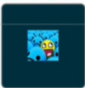
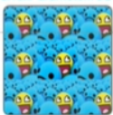
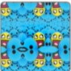
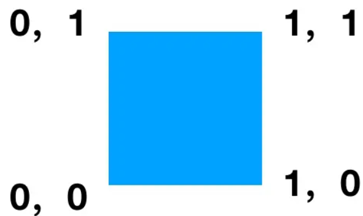
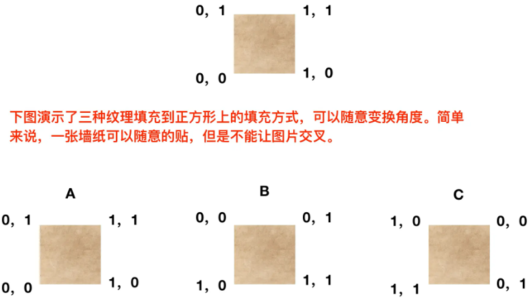
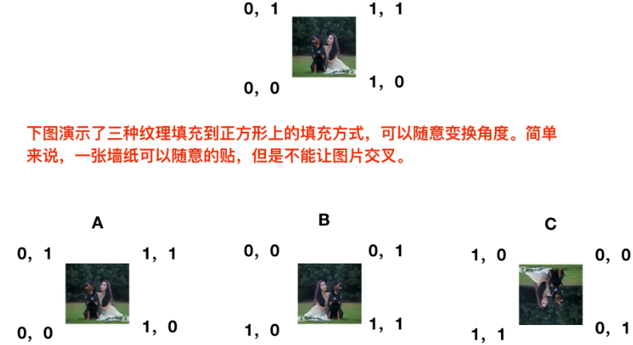

# 1 创建纹理的步骤
1. 创建一个空的纹理对象
    ```c
    void glGenTextures(GLsizei n, GLuint *textures);
    ```
    **描述**：
    创建n个空的纹理，并将纹理ID存储在textures中。
    **参数**：
    - **<font color=green>n</font>**: 需要创建纹理的个数
    - **<font color=green>textures</font>**: 传出参数，存储创建的纹理的数组，大小不小于n
2. 绑定纹理
    ```c
    void glBindTexture(GLenum target, GLuint texture);
    ```
    **描述**：
    将对应纹理绑定到target对应的纹理卡槽上。
    **参数**：
    - **<font color=green>target</font>**: 纹理卡槽，创建2D纹理的话，指定为**GL_TEXTURE_2D**
    - **<font color=green>texture</font>**: 纹理ID
3. 给纹理设置数据
    ```c
    void glTexImage2D(GLenum target, 
                    GLint level,
                    GLint internalformat,
                    GLsizei width, 
                    GLsizei height, 
                    GLint border,  // 必须为0
                    GLenum format, 
                    GLenum type,
                    const void *pixels);
    ```
    **描述**:
    给纹理设置数据，即设置每个点的颜色值
    **参数**：
    - **<font color=green>target</font>**: 纹理ID
    - **<font color=green>level</font>**: 指定详细程度编号。级别0是基本图像级别。级别n是第n个缩略图缩小图, 一般指定为0
    - **<font color=green>internalformat</font>**:指定纹理的内部格式。必须是下列符号常量之一：**GL_ALPHA，GL_LUMINANCE，GL_LUMINANCE_ALPHA，GL_RGB，GL_RGBA**。
    - **<font color=green>width</font>**:纹理图片的宽
    - **<font color=green>height</font>**:纹理图片的高
    - **<font color=green>border</font>**：指定边框的宽度。必须为0。
    - **<font color=green>format</font>**：指定纹理数据的格式。必须匹配internalformat。下面的符号值被接受：GL_ALPHA，GL_RGB，GL_RGBA，GL_LUMINANCE，和GL_LUMINANCE_ALPHA。
    - **<font color=green>type</font>**:指定纹理数据的数据类型。下面的符号值被接受：**GL_UNSIGNED_BYTE，GL_UNSIGNED_SHORT_5_6_5，GL_UNSIGNED_SHORT_4_4_4_4，和GL_UNSIGNED_SHORT_5_5_5_1**。
    - **<font color=green>pixels</font>**: 纹理数据
4. 设置纹理过滤和环绕方式
    ```c
    void glTexParameteri(GLenum target, GLenum pname, GLint param);
    ```
    **参数**:
    - **<font color=green>target</font>**:活动纹理单元的目标纹理.GL_TEXTURE_2D表示2D纹理
    - **<font color=green>pname</font>**:纹理参数的标记名，可以设置的值如下：
    **GL_TEXTURE_MIN_FILTER**：缩小过滤。因为一张纹理图片是有宽高的，当我们将这个纹理图片设置到需要绘制的矩形框时，这个矩形框的大小不一定跟纹理图片的大小一样，这就可能会造成纹理图片的缩放。如果纹理需要缩小时，设置这个值用于配置缩小纹理的方式。
    **GL_TEXTURE_MAG_FILTER**：放大过滤。纹理需要放大时选择这个参数。
    **GL_TEXTURE_WRAP_S**：沿S轴方向的环绕。纹理的坐标系统叫做ST坐标系统，和xy坐标系统一样，s对应x，t对应y，因此GL_TEXTURE_WRAP_S和GL_TEXTURE_WRAP_T表示超出范围的纹理处理方式。
    **GL_TEXTURE_WRAP_T**：沿T轴方向的环绕。
    其中前两个为设置过滤方式，后两个是设置环绕方式。
    - **<font color=green>param</font>**:过滤或环绕方式的值，可以为。当纹理伸缩时，这样绘制出的图片有颗粒感
    **GL_NEAREST**:过滤。当纹理伸缩时以以最近的一个像素的颜色值来填充
    **GL_LINEAR**: 线性过滤。当纹理伸缩时以线性渐变的中间值来填充。当纹理伸缩时，这样绘制出的图片更平滑
    **GL_REPEAT**：重复的环绕方式。当我们设置的纹理坐标并没有覆盖整个矩形框时，这时候绘制出的纹理也不能覆盖全部的矩形框，如下：纹理并没有填充满整个矩形框。
    
    这时候就需要设置在这种情况下纹理的填充方式。GL_REPEAT方式就是以重复的纹理来填充满整个矩形框，效果如下
    
    **GL_MIRRORED_REPEA**：镜像环绕。以镜像的方式将纹理填充满整个矩形框，效果如下。
    
    **GL_CLAMP_TO_EDGE**：以纹理的边缘颜色值填充。效果如下：
    

**注意**
以上的第2，3参数需要对应，过滤和过滤相关的参数对应；环绕和环绕参数相对应。
一般来讲，在创建纹理的时候，参数2的值GL_TEXTURE_MIN_FILTER，GL_TEXTURE_MAG_FILTER，GL_TEXTURE_WRAP_S，GL_TEXTURE_WRAP_T都要分别设置，即这个函数调用4次

# 2 纹理坐标
要使用纹理绘制图元，我们必须在绘制每个顶点之前为该顶点指定纹理坐标，图元的每个顶点各自对应纹理坐标，用来标明该从纹理图像的哪个部分采样（采样：采集片段颜色），之后在图形的其它片段上进行片段插值(Fragment Interpolation)。

## 2.1 纹理坐标系和顶点坐标系
2D纹理坐标在x和y轴上，范围为0到1之间。使用纹理坐标获取纹理颜色叫做采样(Sampling)。纹理坐标起始于(0, 0)，也就是纹理图片的左下角，终始于(1, 1)，即纹理图片的右上角。顶点坐标系的(0,0)点是位于窗口中心的，所以和纹理坐标系是不同的，映射有方向的纹理图片要注意翻转问题。


## 2.2 无方向性的纹理

## 2.3 有方向性的纹理
在方向重要的情况下，是不能随意变换角度的。


# 3 创建纹理示例代码
```c++
GLint w,h,channel;
unsigned char* data = stbi_load(file, &w, &h, &channel, 4);
if(data == nullptr){
    LOGE("create texture failed from %s ", file);
    return nullptr;
}
if(channel == 4){
    channel = GL_RGBA;
}else if(channel == 3){
    channel == GL_RGB;
}else{
    LOGE("unKown format");
    return nullptr;
}
GLuint textureID;
glGenTextures(1, &textureID); // // 创建一个纹理
glBindTexture(GL_TEXTURE_2D, textureID); // 绑定纹理
// 给纹理卡槽绑定的textureID的设置数据
glTexImage2D(GL_TEXTURE_2D, 0, channel, w, h, 0, channel, GL_UNSIGNED_BYTE, data);
// 设置过滤方式
glTexParameteri(GL_TEXTURE_2D, GL_TEXTURE_MAG_FILTER, GL_LINEAR);
glTexParameteri(GL_TEXTURE_2D, GL_TEXTURE_MIN_FILTER, GL_LINEAR);
// 设置环绕方式
glTexParameteri(GL_TEXTURE_2D, GL_TEXTURE_WRAP_S, GL_CLAMP_TO_EDGE);
glTexParameteri(GL_TEXTURE_2D, GL_TEXTURE_WRAP_T, GL_CLAMP_TO_EDGE);
stbi_image_free(data);
LOGD("create a textue success");
return std::make_shared<TextureWrapper>(w, h, textureID, channel);
```

