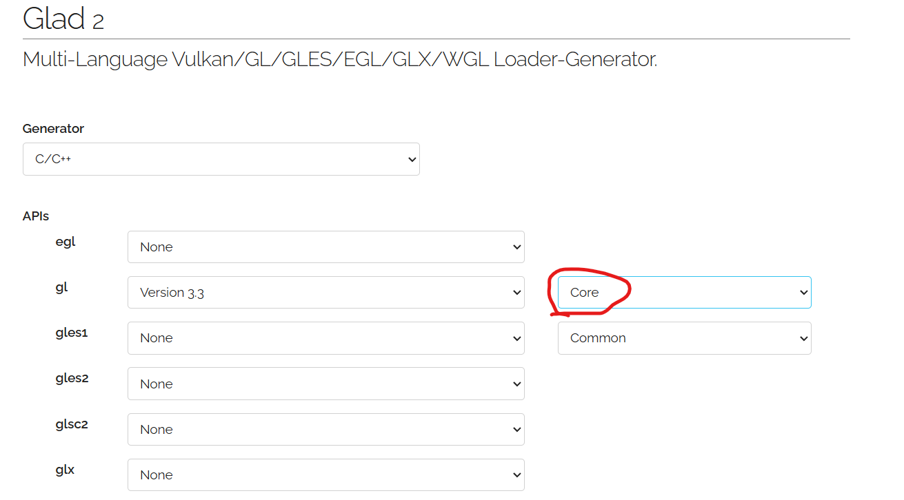
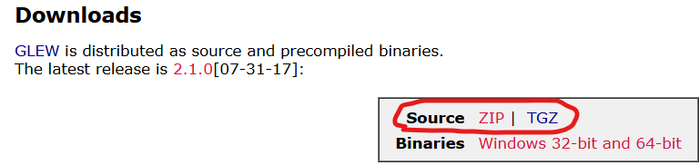

[toc]

# 1 glad
在https://gen.glad.sh/或https://glad.dav1d.de/上在线生成glad库。

生成的代码可以直接用于开发工程

**glad的作用**：
因为OpenGL只是一个标准/规范，具体的实现是由驱动开发商针对特定显卡实现的。由于OpenGL驱动版本众多，它大多数函数的位置都无法在编译时确定下来，需要在运行时查询。所以任务就落在了开发者身上，开发者需要在运行时获取函数地址并将其保存在一个函数指针中供以后使用。取得地址的方法因平台而异，在Windows上会是类似这样：

```c
// 定义函数原型
typedef void (*GL_GENBUFFERS) (GLsizei, GLuint*);
// 找到正确的函数并赋值给函数指针
GL_GENBUFFERS glGenBuffers  = (GL_GENBUFFERS)wglGetProcAddress("glGenBuffers");
// 现在函数可以被正常调用了
GLuint buffer;
glGenBuffers(1, &buffer);
```

你可以看到代码非常复杂，而且很繁琐，我们需要对每个可能使用的函数都要重复这个过程。幸运的是，有些库能简化此过程，其中GLAD是目前最新，也是最流行的库。

# 2 glfw库
GLFW是一个专门针对OpenGL的C语言库，它提供了一些渲染物体所需的最低限度的接口。它允许用户创建OpenGL上下文、定义窗口参数以及处理用户输入。

- 在https://www.glfw.org/download.html下载glfw编译好的二进制文件或者源码。
- **官方文档**：https://www.glfw.org/docs/latest/window_guide.html

# 3 glew
在https://glew.sourceforge.net/下载源码。

windows下我这边用的源码使用virtual studio进行编译成的库。
资源对应resource/glew-2.1.0。使用virtual studio编译时，工程在resource/glew-2.1.0/build下打开


# 文档

- **纹理**: https://learnopengl-cn.github.io/01%20Getting%20started/06%20Textures/