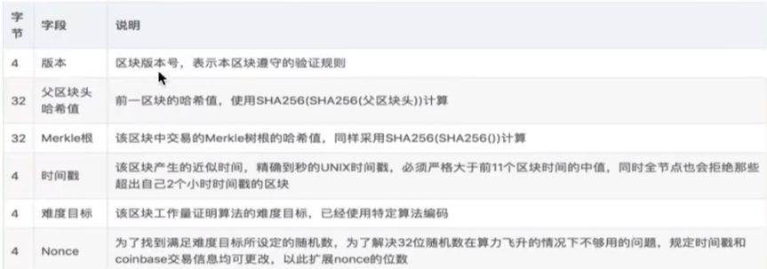

[toc]

# 1 网址
购买币： https://www.blockchain.com
开发者： https://developer.bitcoin.org/
比特币结构： https://developer.bitcoin.org/reference/block_chain.html
RPC参考： https://developer.bitcoin.org/reference/rpc/index.html

# 2 比特币的结构
## 2.1 比特币链简化结构

## 2.2 比特币结构
**区块结构**:

**区块头**
- 版本号： 标识该区块遵守的验证规则
- 父区块头哈希: 前一区块的哈希值
- Markel跟： 该区块中交易的Merkel树根的哈希值
- 时间戳： 精确到秒的时间戳
- 难度目标： 该区块的工作量证明算法的难度目标，已经使用特定算法编码
- Nonce: 为了找到满足难度目标所设定的随机数，为了解决32位随机数在算力飞升的情况下不够用的问题，规定时间戳和coinbase交易交易信息均可修改，以此拓展Nonce的位数

注意： 区块不存储自身的hash值，节点接收区块后独立计算并存储在本地

**区块体**：
区块体中包含各个交易信息，交易信息中有coinbase交易和普通转账交易。
coinbase交易是块中的第一条交易，挖矿奖励矿工。

普通交易包括付款方、收款方、付款金额、手续费等。

# 3 地址
比特币地址是base58编码的字符串，包含地址版本号、哈希和错误检测校验和(用于捕获错别字)
该地址可以通过任何媒介传输，包括阻止发送者与接收者通信的单向媒介，并且可以进一步编码为另一种格式，例如包含“比特币:”URI的QR码。
**比特币地址产生规则**：
对随机字符串进行哈希运算，产生32字节的私钥，使用base58。前面有版本号，所以可以根据地址迅速判断是属于哪个网络地址（主网络、测试网络、本地网络）。

# 4 交易
每笔交易都以一个四字节的交易版本号为前缀，该版本号告诉比特币同行和矿工使用哪一套规则来验证它。这允许开发人员为未来的事务创建新规则，而不会使以前的事务无效。
普通交易的输入（input）是资金的来源，输出（output）是资金的流向.
挖矿交易没有输入，只有输出

# 5 数字签名
数字签名的作用是防篡改和确认发送者的身份。
签名需要想要签名的数据和私钥。
而数字签名的验证需要 想要签名的数据、数字签名和公钥
可用对金额、公钥、新生成的公钥进行签名。

# 6 比特币分叉
比特币分叉分为硬分叉和软分叉。其中硬分叉的一个典型代表就是比特币的扩容。最开始比特币的区块大小是1Mb，而每一笔交易的大小大概为250kb, 出卡ui时间大概10分钟。这样计算下来，每秒大概能处理7笔交易。这对于全球用户来说太慢。因此比特币的创始人决定为比特币进行扩容，扩容到每个区块8Mb, 这样每秒的交易数量就达到56笔。
但扩容并不是所有的比特币矿工都做了更新，对于旧的比特币软件，不能接收8Mb的区块，如果这些矿工坚持不更新软件，那么比特币链就会永久分叉，这被成为硬分叉。而新的支持8Mb的新链被称为比特币现金（Bitcoin Cash）, 而之前的比特币链被成为比特币（Bitcoin）

软分叉是可以合并的，常见的软分叉像篡改数据

# 7 出块时间
系统根据当前出块时间动态调整难度值（每2016个块调整一次，两周），使得时间稳定在10分钟左右，包括同步时间、校验时间、计算时间等。如果不控制在10分钟左右出块，那么比特币就不能保证稳定的发行，秩序就会混乱。安全性和适用性的权衡，太快出块容易分叉，需要频繁处理，太慢影响使用体验。

# 8 比特币转账流程

1. 当A向B转账时，会先创建一个交易
2. 创建的交易会广播到全网，由全网的其他节点进行验证该交易是否有效（余额是否足够、是否消费的是自己的余额等）
3. 校验通过后，各个节点竞争挖矿的权利
4. 获取挖矿权利的节点将交易信息广播给全网，由全网其他节点验证
5. 验证通过后将交易信息记录到自己本地的数据库中