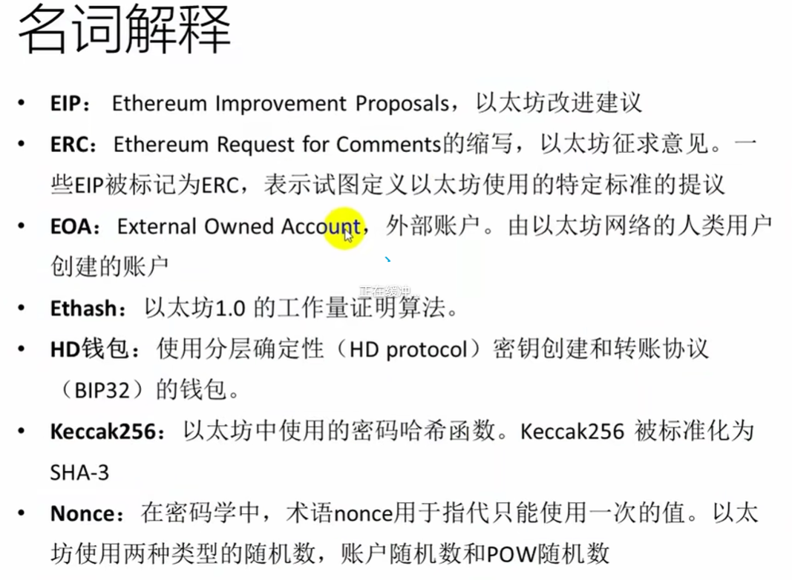

[toc]

# 1 以太坊参考资料
- 《精通以太坊》---https://github.com/ethereumbook/ethereumbook
- 《以太坊白皮书》---https://github.com/ethereum/wiki/wiki/White-Paner
- 《以太坊黄皮书》--- 《以太坊：一种安全去中心化的通用交易账本 拜占庭版本》
- 《以太坊官方文档》--- http://www.ethdocs.org/en/latest/index.html
- 《Solidity官方文档》--- https://solidity.readthedocs.io/en/latest

- 以太坊区块浏览器---https://etherscan.io
- 在线solidity编辑器--- remix.ethereum.org
- ectherscan获取信息的API-- https://docs.etherscan.io/api-endpoints/accounts
- gate.io交易平台 ---  https://www.gate.io/zh
- gate.io的API文档https://www.gate.io/docs/developers/apiv4/zh_CN/#%E6%9F%A5%E8%AF%A2%E6%89%80%E6%9C%89%E5%B8%81%E7%A7%8D%E4%BF%A1%E6%81%AF  
  示例：GET https://api.gateio.ws/api/v4/spot/currencies
- 以太坊托管infura平台---https://www.infura.io/
  https://mainnet.infura.io/v3/167f2bb6bdbc447f9ea3844bd719edf6
- 以太坊托管alchemy平台---https://dashboard.alchemy.com/
  https://ethereum.org/zh/developers/docs/apis/json-rpc#json-rpc-methods
- 以太坊RPC接口文档----https://ethereum.org/zh/developers/docs/apis/json-rpc#json-rpc-methods
- etherscan平台API文档----https://docs.etherscan.io/api-endpoints/accounts
- geth使用电子书--https://goethereumbook.org/ethereum-development-with-go-zh.pdf
- UniSwap平台网址（Uniswap 是一种基于以太坊区块链的去中心化交易协议和平台）-- https://app.uniswap.org
- UniSwap的API文档----https://www.chainnodes.org/docs
  https://thegraph.com/docs/zh/querying/graphql-api/
  https://thegraph.com/hosted-service/subgraph/uniswap/uniswap-v3 (uniswap api在线测试)

- https://faucet.quicknode.com/ethereum/goerli 以太坊领取测试币网址

https://eth-mainnet.g.alchemy.com/v2/XWEGKNtx35vN2KyKws6TxU_MtqQbWHrh
{"jsonrpc":"2.0","method":"eth_getLogs","params":[{"fromBlock":"0x1","toBlock":"0x123d98","address":"0x27cb40ce7eb4d078196923d608eb903a17e0c0ed","topics":["0xddf252ad1be2c89b69c2b068fc378daa952ba7f163c4a11628f55a4df523b3ef"]}],"id":74}

https://www.infura.io/faucet/linea  以太坊水龙头地址
https://nileex.io/join/getJoinPage  tron水龙头地址
https://coinfaucet.eu/en/btc-testnet/  比特币水龙头地址

# 2 以太坊重大分叉
- Block #200000
"Ice Age" -引入指数难度增加的硬分叉，促使向Proof-of-Stake过渡。
- Block #1192000
"The DAO"-扭转了被攻击的DAO合约并导致以太坊(回退被攻击的交易记录的链)和以太坊经典(保留被攻击的记录的链)分裂成两个竞争系统的硬分叉。
ETC是以太坊经典的代币，ETH是以太坊的代币
- Block #2463000
“Tangerine Whistle”-改变某些lo运算的gas 计算，并从拒绝服务攻击中清除累积状态，该攻击利用了这些操作的低gas 成本。
- Block #267500
"Spurious Dragon”-一个解决更多拒绝服务攻击媒介的硬分叉，以及另一种状态清除。此外，还有重放攻击保护机制。

# 3 以太坊组成部分
- p2p网络
以太坊在以太坊主网络上运行，该网络可在TCP端口30303上寻址，并运行一个名为DE=Vp2p的协议。

- 交易（Transaction）
以太坊交易是网络消息，其中包括发送者(sender)，接收者(receiver)，值(value）和数据的有效载荷( payload) 。

- 以太坊虚拟机（EVM）
以太坊状态转换由以太坊虚拟机（EVM）处理，这是一个执行字节码（机器语言指令）的基于堆栈的虚拟机。

- 数据库
以太坊的区块链作为数据库（通常是Google的LevelDB）本地存储在每个节点上，包含序列化后的交易和系统状态。

- 客户端
以太坊有几种可互操作的客户端软件实现，其中最突出的是Go-Ethereum (Geth)和 Parity。

# 4 以太坊中重要概念

- **账户**
包含地址，余额和随机数，以及可选的存储和代码的对象。
在以太坊中是给每个账户分配了存储空间的
  - 普通账户(EOA)，存储和代码均为空
  - 合约账户(Contract)，包含存储和代码

- **地址**
一般来说，这代表一个EOA或合约，它可以在区块链上接收或发送交易。更具体地说，它是ECDSA(椭圆曲线)公钥的keccak散列的最右边的160位。

- **交易（Transaction）**
  - 可以发送以太币和信息
  - 向合约发送的交易可以调用合约代码，并以信息数据为函数参数
  - 向空用户发送信息，可以自动生成以信息为代码块的合约账户

- **gas**
以太坊用于执行智能合约的虚拟燃料。以太坊虚拟机使用核算机制来衡量gas的消耗量并限制计算资源的消耗。

- **以太**
以太坊的货币单位称为以太（ether)，也可以表示为ETH或符号三。以太币的发行规则:
  - 挖矿前：
  2014年7月/8月间，为众筹大约发行了7200万以太币。这些币有的时候被称之为“矿前”。众筹阶段之后，以太币每年的产量基本稳定，被限制不超过7200万的25%
  - 挖矿产出
  1）区块奖励
  2）叔块奖励： 
  有些区块被挖得稍晚一些，因此不能作为主区块链的组成部分。比特币称这类区块为“孤块”，并且完全舍弃它们。但是，以太币称它们为“叔块”(uncles），并且在之后的区块中，可以引用它们。如果叔块在之后的区块链中作为叔块被引用，每个叔块会为挖矿者产出区块奖励的7/8。这被称之为叔块奖励。
  叔块奖励=（叔块高度+8-引用叔块的区块高度）*普通区块奖励/8
  3）叔块引用奖励：
  矿工每引用一个叔块，可以得到区块奖励的1/32作为奖励(最多引用两个叔块)

以太坊出块机制从工作量证明（PoW）转换为股权证明（PoS）后，以太币的发行会有什么变化尚未有定论。股权证明机制将使用一个称为Casper的协议。在Casper协议下，以太币的发行率将大大低于目前幽灵(GHOST)协议(上面提到的2，3奖励被成为幽灵协议)下的发行率。

1以太 = 10 ^ 18 wei
1Gwei = 10 ^ 9 wei

- **去中心化应用**
基于以太坊可以创建智能合约来构建去中心化应用（Decentralized Application,简称DApp）。
DApp至少由区块链上的智能合约和Web前端用户界面

- **代币**
代币(token)也称作通证，本意为“令牌”，代表有所有权的资产、货币、权限等在区块链上的抽象。
  - 可替代性通证( fungible token）:指的是基于区块链技术发行的，互相可以替代的，可以接近无限拆分的token。即一个人的一分和另一个人的一分是一样的。
  - 非同质通证( non-fungible token) :指的是基于区块链技术发行的，唯一的，不可替代的，大多数情况下不可拆分的token，如加密猫( CryptoKitties)，及每个代币都是不同的

  

- **私钥、公钥和地址**
  - 私钥
  以太坊私钥事实上只是一个256位的随机数，用于发送以太的交易中创建签名来证明自己对资金的所有权。
  - 公钥
  公钥是由私钥通过椭圆曲线加密secp256k1算法单向生成的512位(64字节）数。
  - 地址
  地址是由公钥的Keccak-256单向哈希，取最后20个字节(160位）派生出来的标识符。

- **切换网络**
  - **Main Network（NetworkID: 1）**： 主网络, https://mainnet.infura.io/v3/
  - **Ropsten Test Network（NetworkID: 3）**: 以太坊公共测试区块链和网络，使用工作量证明共识。该网络上的ETH没有任何价值。几乎跟主网络一样
  - **Kovan Test Network（NetworkID: 42）**: 以太坊公共测试区块链和网络，使用“Aura”协议进行权威证明POA共识（联合签名）。此测试网络仅由Parity支持
  - **Rinkeby Test Network（NetworkID: 4）**：以太坊公共测试区块链和网络，使用“Clique”协议进行权威证明POA共识，主要针对geth客户端
  - **Localhost 8545**: 连接到浏览器在同一台计算机上运行的节点。该节点可以是任何公共区块链(main或者testnet)的一部分，也可以是私有的testnet
  - **Custom RPC**: 允许将MetaMask连接到任意兼容geth的RPC接口的节点。该节点可以是任何公共或者私人区块链的一部分
  - **Goerli**： 太坊区块链的一个测试网络，用于开发和测试以太坊区块链上的应用程序和智能合约。使用的是 Proof of Authority (PoA) 共识机制
  - **Sepolia**: 以太坊测试网络。 网络为开发者提供了一个接近真实条件的环境，帮助他们测试在以太坊区块链上运行的应用程序和服务。

# 5 go-ethereum SDK安装
```shell
go get github.com/ethereum/go-ethereum
```

# 6 ERC20标准
ERC20是一种以太坊区块链上的技术标准，全称为Ethereum Request for Comments 20。这个标准定义了在以太坊区块链上发行和管理代币的规则。ERC20代币是遵守ERC20标准的智能合约，它们扮演的是虚拟货币的角色，并且可以用来代表任何可以交易的资产，如货币、积分、黄金、土地等权益认证。

ERC20标准规定了一些核心功能，任何想要被认为是ERC20代币的智能合约都需要实现这些函数，它们包括：

- `totalSupply`: 返回代币的总供应量。
- `balanceOf(address _owner)`: 返回特定地址（账户）持有代币的数量。
- `transfer(address _to, uint256 _value)`: 用于代币的转移，将 `_value` 个代币从函数调用者的账户转移到地址 `_to` 的账户。
- `transferFrom(address _from, address _to, uint256 _value)`: 用于代币的转移，但可以被授权的地址调用，将代币从 `_from` 转移到 `_to`。
- `approve(address _spender, uint256 _value)`: 授权一个地址（`_spender`）能从代币拥有者账户中转出上限为 `_value` 的代币。
- `allowance(address _owner, address _spender)`: 返回一个地址（`_spender`）被授权从另一个地址（`_owner`）转出代币的剩余数量。

此外，ERC20标准还规定了几个事件，这些事件在合约交互中将被触发：

- `Transfer(address indexed _from, address indexed _to, uint256 _value)`: 当代币被转移时触发。
- `Approval(address indexed _owner, address indexed _spender, uint256 _value)`: 当有新的授权时触发。

ERC20标准的出现极大地促进了代币的互操作性，因为它为代币的交易、钱包服务和其他金融服务提供了一种一致的、标准化的接口。这使得开发者能够在短时间内构建与ERC20代币兼容的应用程序，并且确保不同项目间的代币能够在通用交易平台上交易。

# 7 各个平台的API
## 7.1 uniswap
### 7.1.1 获取ETH链上的代币信息
```
请求：
POST https://api.thegraph.com/subgraphs/name/uniswap/uniswap-v2
参数
{ "query": "{ tokens { id symbol name decimals totalSupply derivedETH tradeVolumeUSD untrackedVolumeUSD totalLiquidity} }" }

以下字段可选：
id: 代币的唯一标识符
symbol: 代币的简写符号
name: 代币的全称。
decimals: 代币的小数位数
totalSupply：代币的总供应量。
derivedETH：代币对ETH的价格
tradeVolumeUSD： 已追踪的已美元计价的交易量
untrackedVolumeUSD：未追踪的以美元计价的交易量。
volume：代币的交易量信息。（uniswap-v3的字段）
volumeUSD： 代币的以美元计价的交易量。 （uniswap-v3的字段）
feesUSD: 交易该token所消耗的费用，以美元计价
totalLiquidity: 总流动性
pairBase ：该代币作为交易对的token0所对应的交易对信息，示例 pairBase{id token0 { id symbol name decimals}}
pairQuote: 该代币作为交易对的token1所对应的交易对信息。
tokenDayData：代币的每日信息
```

- **pairBase**下存在的字段与pairs下的字段一致
- **pairQuote**下存在的字段与pairs下的字段一致
- **tokenDayData**下的字段:

|tokenDayData子字段|含义|
|------------------|----|
|id|通常是一个唯一标识符，用于区分不同的数据点。|
|date|代表数据点对应的日期。|
|priceUSD|该代币在特定日期的美元价格。|

### 7.1.2 获取ETH链上的交易对信息
```
请求：
POST https://api.thegraph.com/subgraphs/name/uniswap/uniswap-v2
参数：
{ "query": "{ pairs { id createdAtTimestamp liquidityProviderCount token0 { id symbol name decimals} token1 { id symbol name decimals } reserve0 reserve1 untrackedVolumeUSD txCount} }" }

以下字段可选：
id：交易对的唯一标识符。
createdAtTimestamp：创建时间
liquidityProviderCount： 流动性提供者数量
token0：第一个代币的详细信息，通常包括代币的 ID、名称、符号等。
token1：第二个代币的详细信息，类似于 token0。
token0Price: 表示购买1单位的token0需要多少单位的token1。
token1Price: 表示购买1单位的token1需要多少单位的token0。
reserve0：交易对中第一个代币的储备量。
reserve1：交易对中第二个代币的储备量。
totalSupply：交易对的流动性代币总供应量。
reserveUSD：储备折合美元的总额。
reserveETH: 储备则合成ETH的总额
volumeToken0：自创建以来通过交易对换出的 token0 的总量。
volumeToken1：自创建以来通过交易对换出的 token1 的总量。
volumeUSD：以美元计价的总成交额。
untrackedVolumeUSD：未追踪的以美元计价的成交额。
txCount：通过该交易对进行的交易数量。

拓展
token0 到 token1 的兑换比率：reserve1 / reserve0
token1 到 token0 的兑换比率：reserve0 / reserve1
```

### 7.1.4 查询指定交易对的信息（条件查询）
```
请求：
POST https://api.thegraph.com/subgraphs/name/uniswap/uniswap-v2
参数：（WETH对USDT的交易对）
{ "query": "{ pairs (where: { token0: \"0xc02aaa39b223fe8d0a0e5c4f27ead9083c756cc2\", token1: \"0xdac17f958d2ee523a2206206994597c13d831ec7\" }) { token0Price token1Price reserve0 reserve1 token0 { symbol name decimals } token1 { symbol name decimals } } }" }
```

### 7.1.5 分页查询
在使用Uniswap的Graph API（The Graph）进行分页查询时，你可以使用GraphQL查询中的first、skip和orderBy参数来控制分页。
first 参数用于限制返回记录的数量。
skip 参数用于跳过特定数量的记录。
orderBy 参数用于定义排序的字段。
orderDirection 参数用于定义排序的方向（asc 表示升序，desc 表示降序）。

**示例**：
```
请求：
POST https://api.thegraph.com/subgraphs/name/uniswap/uniswap-v2
参数：
// 查询限制为10个，跳过前2个
{ "query": "{ pairs(first:10,skip:1,orderby:untrackedVolumeUSD,orderDirection: desc) { id token0 { id symbol name decimals} token1 { id symbol name } reserve0 reserve1 untrackedVolumeUSD} }" }
```

### 7.1.6 排序
```
{
  tokens(orderBy: price, orderDirection: asc) {
    id
    owner
  }
}
```

### 7.1.7 获取全部记录
要依次获取查询的全部记录，可以使用id_gt字段来指定上次获取的记录的最后一条记录的id,那么本次获取的时候就从上次获取的记录的下一条开始获取，第一次获取时，id_gt指定为""
```
{ "query": "{ pairs(where:{token1:\"0xc02aaa39b223fe8d0a0e5c4f27ead9083c756cc2\", first:200, id_gt: \"0x0000871c95bb027c90089f4926fd1ba82cdd9a8b\"}) { id token0Price token1Price token0 { id symbol name decimals} token1 { id symbol name } reserve0 reserve1 untrackedVolumeUSD} }" }
```

**注意**: 实测如果添加了id_gt来依次查询记录，就不要用orderBy, orderDirection字段来限制顺序，不然查询到的总记录会不全

### 7.1.8 获取指定交易对的每日交易信息
```
请求：
POST https://api.thegraph.com/subgraphs/name/uniswap/uniswap-v2
body参数：
{"query":
  "{pairDayDatas(first: 5, where: { pairAddress: \"0x21b8065d10f73ee2e260e5b47d3344d3ced7596e\" }, orderBy: date, orderDirection: desc) { id date dailyVolumeToken0 dailyVolumeToken1 dailyVolumeUSD pairAddress dailyTxns token0{id symbol name decimals} token1{id symbol name decimals}}}"
}

id: 交易对地址
date: 统计的时间（Unix时间，单位秒）
dailyVolumeToken0： 当天token0代币的交易量
dailyVolumeToken2： 当天token1代币的交易量
dailyVolumeUSD：所有交易（买和卖）在该日内对应的美元价值总和
pairAddress：交易对地址
dailyTxns：当日发生的交易数量
```

### 7.1.9 查询API的schema
```
请求：
POST https://api.thegraph.com/subgraphs/name/uniswap/uniswap-v2
请求体：
{"query":"{__schema{types{name fields{name{name fields} type}}}}"}
{"query":"{__schema{types{name fields{name{name fields{name fields}} type}}}}"}
```
