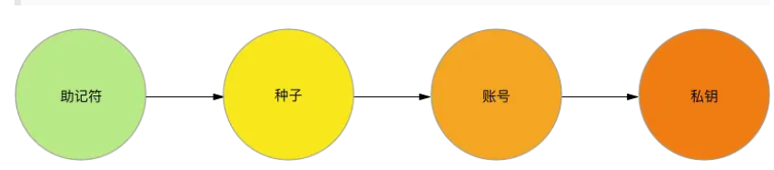

[toc]

# 1 OKChain介绍

```
swapExactToken
approve
put
setApprovalForAll
transfer
set_withdraw_address
safeTransferFrom
mint
swapExactTokensForTokens
swap（0x265c027a56fbdfc82539edb492f2034101bf5e358e47584afd2a08f2c10f5f05）
cancelOrder // 0x5e4a0611f05fb2f103af37f0a81a41e223778f03f58f0ee1903b7ab100f8bf50
stakeBatch
swapExactETHForTokens
swapExactTokensForETH
swapExactOKTForTokens
stake
withdraw(0xaafbff2322d36ab7fa156542ce0185c869a92c0c7a349c4159d050fb3e1a7123)
claimRank
claimMintReward(0xca0df3107d1486b93ac68333b42a7554c5893bb52a3ea314c3b4c792c2fb7af4)
requestWithdraw
--
withdrawERC20
invoke
getReward
setValue
deposit
unlock
swapExactETHForTokensSupportingFeeOnTransferTokens(0xd51896c409d3abc2983f36cdc9bd354ef0dcf9e1057e5e681912cbf48a9406d6)
swapExactTokensForETHSupportingFeeOnTransferTokens
bridgeGas
redeem
repayBorrow
redeemUnderlying
withdrawAll
claimWpc
sendFrom
transferOwnership（0x47c6452e679f0aaaee72103cc36985a79d17ba4ac409cbb2bcd7ab06570e3b25）
setAdmin
removeLiquidityWithPermit(0x2b98688987d811a9a341fb31f28777922839620052c60b41d268fd964f0b7bf3)
send_native20_to_ibc(0x8df790c7af29066cc38b2760246338284f15d1c51d4ba5d5a5134412a46a0dfa)
swapTokensForExactETH（0x66b967b6bfd0126bdb6de94c287095d763cf79d9bfe31124c0e095fb19853814）
withdrawETH(0x962db39c32c4505723426b82775980f8ae50ff81b8bf73c242a1be3e12351bd7)
unPlace(0x3dfac3956e827b9d2614b7ccb424f200545df333a4689f6377204febe28df2ef)
```

主链查询：


edge搜索网址：
https://cn.bing.com/search?q=google%E7%BD%91%E5%9D%80&qs=n&form=QBRE&sp=-1&lq=0&pq=googlewang%27zh&sc=10-13&sk=&cvid=26BA603FBCB54A84A90C58076AE24F1E&ghsh=0&ghacc=0&ghpl=


线上查询网址：
https://www.oklink.com/cn/oktc


- 技术架构：OKChain基于Tendermint共识算法和Cosmos SDK开发框架构建。Tendermint采用权益证明(PoS)共识机制，具有高吞吐量和快速确认的特点，可以实现快速的交易处理和区块生成。Cosmos SDK提供了开发区块链应用的工具和模块，使开发者可以构建自己的定制化区块链应用。

https://www.delicacydaily.com/cn/oktc

开发指南：
https://www.ouxyi.club/cn/oktc/docs/dev/quick-start/overview


web3钱包安装攻略
https://www.okx.com/cn/learn/how-connact-okx-wab3-wallet

<font color=red>注意</font>
- https://www.okex.me/  网址不可信

git获取
git clone -b mainnet https://github.com/okx/exchain

https://docs.tendermint.com/v0.34/tutorials/go-built-in.html

okex官方文档：
https://www.okex.com/docs/okexchain

okex社区：
https://twitter.com/OKExChain

okex官方公告：
https://www.okex.com/support/hc/zh-cn/sections/360000031171

okex开发指南：
https://www.okex.com/docs/okexchain/developer-guide

# 2 安装OKTC工具
参考网址：https://www.delicacydaily.com/cn/oktc/docs/dev/quick-start/install-oktc
```shell
# 获取下载OKT工具C
git clone https://github.com/okx/exchain

# 开启GO module
export GO111MODULE=on

cd exchain 

# 安装前置
make rocksdb

# 编译主网
make mainnet

# 编译测试网
make testnet
```

**注意**:
- OKTC要求go环境且版本在1.17及其以上。执行make命令的时候又可能会提示需要更高的go版本。

**验证是否安装成功**：
```shell
exchaind version --long
exchaincli version --long
```

# 3 安装go开发工具包
```shell
go get github.com/okx/exchain-go-sdk
go get github.com/okex/exchain-go-sdk
go get github.com/okex/exchain-go-sdk/utils
```
**注意**：
- go.mod的内容参考下载的github.com/okex/exchain-go-sdk包的go.mod.
（踩坑，go mod tidy各种报错，将go.mod的内容修改为github.com/okex/exchain-go-sdk下的go.mod后，再进行go mod tidy就好了）
```go
module github.com/okex/exchain-go-sdk

go 1.16

require (
    github.com/bartekn/go-bip39 v0.0.0-20171116152956-a05967ea095d
    github.com/ethereum/go-ethereum v1.10.8
    github.com/golang/mock v1.6.0
    github.com/kr/pretty v0.2.1 // indirect
    github.com/minio/highwayhash v1.0.1 // indirect
    github.com/okex/exchain v1.6.4
    github.com/prometheus/client_golang v1.8.0 // indirect
    github.com/stretchr/testify v1.8.0
    golang.org/x/net v0.0.0-20210903162142-ad29c8ab022f // indirect
)

replace (
    github.com/ethereum/go-ethereum => github.com/okex/go-ethereum v1.10.8-oec3
    github.com/gogo/protobuf => github.com/regen-network/protobuf v1.3.3-alpha.regen.1
    github.com/tendermint/go-amino => github.com/okex/go-amino v0.15.1-okc4
)
```

# 3 概念和名词

- **TPS**： 每秒交易单数
- **Dpos**： 委托权益证明
- **Bech32**: 比特币地址。
比特币地址是一串数字和字母，用于接收比特币的地方。它类似于银行账户的账号，只不过是一种数字形式的账号。比特币地址由数字和字母组成，长度为27-34个字符。每个比特币地址都是唯一的，因此您不必担心将其与其他人混淆。当您想要接收比特币时，您只需要告诉别人您的比特币地址即可。如果别人向您发送比特币，它们会在区块链网络上被广播，然后发送到您的比特币地址。
比特币地址主要分为三种格式：Legacy（传统地址）、Segwit（隔离见证地址）和Bech32（比特币原生隔离见证地址）。
1.**Legacy（传统地址）**：以“1”开头，长度为26-35个字符。这是比特币最早的地址格式，也是最常用的格式。传统地址在普通转账时费用较便宜，但在使用多重签名（multisig）和隔离见证（segwit）等高级功能时会存在一些问题。
2.**Segwit（隔离见证地址）**：以“3”或“bc1”开头，长度为27-34个字符。Segwit是比特币网络中的一项技术创新，旨在解决比特币网络中的一些问题，如拥堵和高交易费用。Segwit地址可以帮助减少交易费用，并提高交易确认速度。
3.**Bech32（比特币原生隔离见证地址）**：以“bc1”开头，长度为42个字符。这是比特币最新的地址格式，是使用隔离见证的最佳方式。由于它更短，更易于识别，并且更安全，因此越来越多的比特币用户开始使用Bech32地址。</br>
除了地址格式之外，比特币地址还可以通过使用多重签名（multi-sig）来提高安全性和可控性。多重签名是一种用于在比特币交易中签名的策略，需要多个密钥才能进行签名，从而使交易更为安全。

4. **助记符（mnemonic）**：按照一定顺序排列的单词，是恢复钱包的唯一手段。如果你对比特币有一定的了解，当你在看到这些助记符时肯定会产生疑惑，因为通常人们理解的是：只有私钥才需要保管，且只有私钥才能恢复钱包，但创建钱包时并没有要求你保存私钥，而是记录一些助记符，那么我们很容易的做出推断——私钥和助记符之间一定有着某种联系。

用算法生成助记符，再通过助记符产生种子,用种子算出一个账号数据,通过这个账号，可以产生无数个私钥.
只要种子不变，通过种子算出的账号也是不变的。你可以给每个产生的私钥分配一个序号，例如0、1、2等，只要序号确定，那么私钥的数值就是一定的。这也是为什么我们可以在钱包里创建多个账号的原因，这么多账号虽然都各自拥有一对公、私钥，但我们只需要一个种子，就可以把它们全部恢复，保存种子比直接保存私钥效率要高很多。

5. **gas**: 当提到区块链中的“gas”时，通常是指执行和操作智能合约或交易所需的计算资源和费用。在以太坊和其他基于以太坊虚拟机（EVM）的区块链网络中，gas是一种计量单位，用于衡量计算操作的复杂性和消耗的资源。</br>
在这些区块链平台上，每个操作都会消耗一定数量的gas。例如，执行智能合约、发送交易、改变状态等操作都需要消耗gas。不同的操作具有不同的gas消耗量，根据复杂性和执行成本而定。</br>
为了执行操作或交易，用户需要支付相应的gas费用。这个费用是以网络代币（如以太币ETH）的形式支付。费用的大小取决于所执行操作的复杂性和消耗的资源量。</br>
通过设定合适的gas价格和gas限制，用户可以控制其交易被确认的速度和可靠性。较高的gas价格可以促使矿工优先确认交易，但费用较高；而较低的gas价格则可能导致交易延迟或不被确认。</br>
总之，gas是区块链中衡量计算资源和费用消耗的单位，对于使用区块链进行智能合约和交易的操作是非常重要和必要的。</br>
gas费是用于测量在以太坊区块链上执行特定操作所需的成本。这个名字本身并不是偶然选定的。gas其实类似于汽油，后者作为汽车的能量保证汽车可以正常行驶，以太坊网络上的gas为交易行为进行“加油”，并允许用户执行不同的操作。以太坊本质上是一个虚拟机，这个虚拟机是去中心化的，全世界的人都可以在上面操作，联合起来形成一个世界级的计算网络。假如你需要向其他账户转帐1 ETH ，以太坊链在处理这笔交易，需要进行计算，这个计算过程需要消耗网络资源。这样一来，你必须支付一笔燃料费，也就是gas，才能让矿工为你打包交易。简单来说，gas费相当于手续费，或者给矿工的辛苦费。处理链上数据的手续费，用来平衡整个网络交易速度。处理速度一定，当交易数据多了，那么谁出的价格高就优先处理谁的订单。gas费是必要的，是整个网络应承担的成本，因为网络上的每个节点都必须花费存储和计算资源，用来验证每条消息并保持网络的一致状态，这时候就需要消耗gas来补偿网络。 所以每个币的转账都有最低额度要求，这个最低额度要求往往也是目前需要的最少gas费额度。如果钱包中 ETH 的数量不足以支付 gas 费用时，交易无法进行。


# API接口文档地址
https://www.delicacydaily.com/cn/oktc/docs/dev/api/oktc-api/http