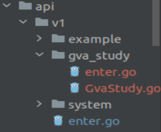
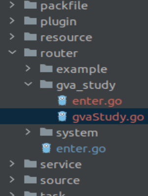

想要在gin-view-admin中添加路由需要
1. 在api中添加路由处理方法
- 在`api/v1`下新增一个文件夹，用于存放自己定义的路由处理方法的代码，例如起名为`gva_study`。在`gva_study`下添加`enter.go`文件，这个文件作为访问自己定义的路由处理方法的入口。
<font color=gray>在gin-vue-admin的总体设计中，大模块被分为几个小模块，如果小模块下面还有子模块，也会继续往下分割，每个模块都有自己的入口(entry.go文件)，从而访问模块中的方法</font>
例如：
```go
package gva_study

import "github.com/flipped-aurora/gin-vue-admin/server/service"

// 定义一个结构体，继承另一个自定义的名为`GvaStudy`的结构体，
// 在`GvaStudy`中定义了多个gin的路由请求方法
type ApiGroup struct {
	GvaStudy
}
```
GvaStudy的定义：
```go
type GvaStudy struct {
}

func (v *GvaStudy) SayHello(c *gin.Context) {
	response.OkWithMessage("hello gin-vue-admin", c)
}
```

2. 将添加的`ApiGroup`结构体注册到`api/v1/enter.go`中。
```go
package v1

...

type ApiGroup struct {
	SystemApiGroup  system.ApiGroup
	ExampleApiGroup example.ApiGroup
	GvaTest         gva_study.ApiGroup // 我们添加的子模块
}

var ApiGroupApp = new(ApiGroup) // 实例化ApiGroup
```

对应的模块结构目录如下：

其中`api/v1/enter.go`是api模块的入口，`api/v1/gva_study/enter.go是我们自己添加的路由处理方法的访问入口`

<font color=gray>api/v1/enter.go这个文件是api模块的入口，将我们自定义的路由处理方法添加添加到这里，后续就可以通过`v1.ApiGroupApp.GvaTest`来访问我们添加了路由处理方法了</font>

3. 在router中添加路由组和绑定路由与路由处理方法。
在`router`文件夹下的代码结构与第一步提到的`apy/v1/`下的代码结构是一样的。
同样需要先添加自定义模块的入口，然后在入口中编写绑定路由与路由处理方法的方法。
**添加入口**:
```go
type RouterGroup struct {
	GvaStudy
}
```

GvaStudy的定义
```go
type GvaStudy struct {
}

func (v *GvaStudy) InitGvaStudy(router *gin.RouterGroup) {
	gva_study_group := router.Group("gva_study")
	{
		gva_study_group.GET("say_hello", v1.ApiGroupApp.GvaTest.SayHello)
	}
}
```

将子模块注册到router模块中
```go
type RouterGroup struct {
	System   system.RouterGroup
	Example  example.RouterGroup
	GvaStudy gva_study.RouterGroup  // 自定义的路由模块
}

var RouterGroupApp = new(RouterGroup) // 实例化路由模块
```
对应的模块代码目录结构如下


4. 在initialize中调用router中注册路由的方法 
在这一步中，将调用第3步中的绑定路由和路由组的方法。
在`initialize/router.go`中的`Routers()`方法中去调用绑定路由和路由组中的方法。
```go
func Routers() *gin.Engine {

    // 设置为发布模式
    if global.GVA_CONFIG.System.Env == "public" {
        gin.SetMode(gin.ReleaseMode) //DebugMode ReleaseMode TestMode
    }

    Router := gin.New()

    if global.GVA_CONFIG.System.Env != "public" {
        Router.Use(gin.Logger(), gin.Recovery())
    }

    InstallPlugin(Router) // 安装插件
    systemRouter := router.RouterGroupApp.System
    exampleRouter := router.RouterGroupApp.Example

    // 获取自定义的绑定路由与路由处理方法的入口，后续可以通过gvaStudyRouter来访问自定义的绑定路由的方法
    gvaStudyRouter := router.RouterGroupApp.GvaStudy
    // 如果想要不使用nginx代理前端网页，可以修改 web/.env.production 下的
    // VUE_APP_BASE_API = /
    // VUE_APP_BASE_PATH = http://localhost
    // 然后执行打包命令 npm run build。在打开下面3行注释
    // Router.Static("/favicon.ico", "./dist/favicon.ico")
    // Router.Static("/assets", "./dist/assets")   // dist里面的静态资源
    // Router.StaticFile("/", "./dist/index.html") // 前端网页入口页面

    Router.StaticFS(global.GVA_CONFIG.Local.StorePath, http.Dir(global.GVA_CONFIG.Local.StorePath)) // 为用户头像和文件提供静态地址
    // Router.Use(middleware.LoadTls())  // 如果需要使用https 请打开此中间件 然后前往 core/server.go 将启动模式 更变为 Router.RunTLS("端口","你的cre/pem文件","你的key文件")
    // 跨域，如需跨域可以打开下面的注释
    // Router.Use(middleware.Cors()) // 直接放行全部跨域请求
    // Router.Use(middleware.CorsByRules()) // 按照配置的规则放行跨域请求
    //global.GVA_LOG.Info("use middleware cors")
    docs.SwaggerInfo.BasePath = global.GVA_CONFIG.System.RouterPrefix
    Router.GET(global.GVA_CONFIG.System.RouterPrefix+"/swagger/*any", ginSwagger.WrapHandler(swaggerFiles.Handler))
    global.GVA_LOG.Info("register swagger handler")
    // 方便统一添加路由组前缀 多服务器上线使用

    PublicGroup := Router.Group(global.GVA_CONFIG.System.RouterPrefix)
    {
        // 健康监测
        PublicGroup.GET("/health", func(c *gin.Context) {
            c.JSON(http.StatusOK, "ok")
        })
    }
    {
        systemRouter.InitBaseRouter(PublicGroup) // 注册基础功能路由 不做鉴权
        systemRouter.InitInitRouter(PublicGroup) // 自动初始化相关
    }
    PrivateGroup := Router.Group(global.GVA_CONFIG.System.RouterPrefix)
    PrivateGroup.Use(middleware.JWTAuth()).Use(middleware.CasbinHandler())
    {
        systemRouter.InitApiRouter(PrivateGroup, PublicGroup)    // 注册功能api路由
        systemRouter.InitJwtRouter(PrivateGroup)                 // jwt相关路由
        systemRouter.InitUserRouter(PrivateGroup)                // 注册用户路由
        systemRouter.InitMenuRouter(PrivateGroup)                // 注册menu路由
        systemRouter.InitSystemRouter(PrivateGroup)              // system相关路由
        systemRouter.InitCasbinRouter(PrivateGroup)              // 权限相关路由
        systemRouter.InitAutoCodeRouter(PrivateGroup)            // 创建自动化代码
        systemRouter.InitAuthorityRouter(PrivateGroup)           // 注册角色路由
        systemRouter.InitSysDictionaryRouter(PrivateGroup)       // 字典管理
        systemRouter.InitAutoCodeHistoryRouter(PrivateGroup)     // 自动化代码历史
        systemRouter.InitSysOperationRecordRouter(PrivateGroup)  // 操作记录
        systemRouter.InitSysDictionaryDetailRouter(PrivateGroup) // 字典详情管理
        systemRouter.InitAuthorityBtnRouterRouter(PrivateGroup)  // 字典详情管理
        systemRouter.InitChatGptRouter(PrivateGroup)             // chatGpt接口

        exampleRouter.InitCustomerRouter(PrivateGroup)              // 客户路由
        exampleRouter.InitFileUploadAndDownloadRouter(PrivateGroup) // 文件上传下载功能路由

        gvaStudyRouter.InitGvaStudy(PrivateGroup) // 绑定自定义的路由与路由处理方法
    }

    global.GVA_LOG.Info("router register success")
    return Router
}
```

<font color=gray>initialize这个目录下是用于进行初始化相关操作的</font>


4. 如果需要调用数据库、redis以及其他服务，还需要在service中定义，并在api中获取对应服务的入口。这样就可以调用对应服务的方法了。


