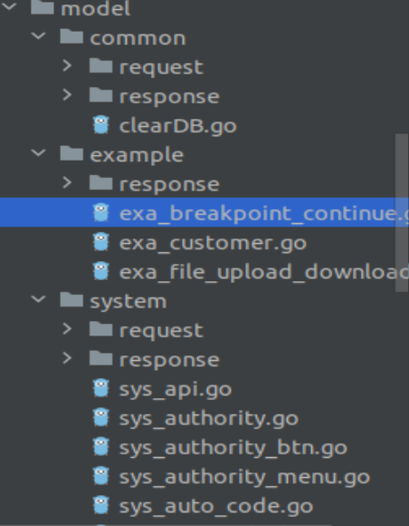

[toc]

# 1 初始化数据库
在gin-vue-admin中，数据库操作是使用的gorm库。
数据库相关的初始化是在`initialize/gorm.go`中的`Gorm()`方法中进行的。这个放在在`main`函数中调用。

# 2 数据库表的模型定义
数据库表的模型定义位于`model/`下的各个子目录下，其中的一些go文件定义一张数据库表对应的struct。

**request子目录**： 定义gin的http请求对应的结构体
**response子目录**: 定义gin中响应http请求所对应的结构体
