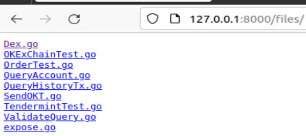

[toc]

# 1 启动web服务
```go
package gin
import (
	"github.com/gin-gonic/gin"
)

func handleIndex(ctx *gin.Context) {
	ctx.String(200, "hello world!")
}

func Index() {
    // 创建一个默认的路由
	router := gin.Default()

    /* 绑定路由规则和路由函数
    访问/index路由的时候会由handleIndex函数来处理*/
	router.GET("/index", handleIndex)
	
	// 启动监听，gin会把web服务运行在0.0.0.0:8000上
	router.Run("127.0.0.1:8000")

    // 也可以用这个方法来启动，上面的Run方法是对这个函数的封装
    // http.ListenAndServe(":8000", router)
}
```

# 2 gin.Engine.GET方法
GET方法在Web中一般是用于请求服务器数据。GET 请求是幂等的，这意味着对同一 URL 的多个请求应该返回相同的结果。GET 请求应该只用于获取数据，不应当引起服务器上数据的变化。

```go
func (group *RouterGroup) GET(relativePath string, handlers ...HandlerFunc) IRoutes
```
**作用**：
绑定路由函数

**参数**：
|参数名|类型|描述|
|------|----|---|
|relativePath|string|路由路径|
|handlers|HandlerFunc|处理函数，当访问relativePath路由时，由这个函数来处理|

# 3 gin.Engine.Run方法
在指定的web路由下开启服务
```go
func (engine *Engine) Run(addr ...string) (err error)
```
**参数**：
|参数名|类型|描述|
|------|----|---|
|addr|string|路由路径，格式为 <ip>:<port>。如果要在内网访问，可以将<ip>设置为0.0.0.0|

# 4 响应数据
## 4.1 响应字符串
响应字符串使用 gin.Context.String方法。可以在访问对应路由时，在web上输出对应的字符串。示例见[启动web服务](#1-启动web服务)
```go
func (c *Context) String(code int, format string, values ...any)
```
**参数**：
|参数名|类型|描述|
|------|----|---|
|code|int|响应状态码|
|format|string|响应的字符串内容|
|values|any|字符串的格式化|

**使用示例**：
```go
package gin

import (
	"github.com/gin-gonic/gin"
	"net/http"
)

func handleIndex(ctx *gin.Context) {
	ctx.String(http.StatusOK, "233")
}

func Index() {
	router := gin.Default()
	router.GET("/index", handleIndex)
	router.Run(":8000")
}
```


## 4.2 响应json数据
```go
// any可以是字符串或者结构体、map
func (c *Context) JSON(code int, obj any)
```

**使用示例--结构体**:
```go
type User struct {
	Name   string `json:"name"`
	Age    int    `json:"age"`
	PassWd string `json:"-"`  // 忽略转化未json
}

func handleIndex(ctx *gin.Context) {
	ctx.JSON(200, User{"jake", 23, "123"})
}
```


**使用示例--字符串**
```go
func handleIndex(ctx *gin.Context) {
	ctx.JSON(200, `{"name":"jake","age":23}`)
}
```

**使用示例--json相应map**:
```go
func handleIndex(ctx *gin.Context) {
	user := map[string]string{"name": "terry", "age": "222"}
	ctx.JSON(200, user)
}
```


**使用示例--gin.H**:
```go
func handleIndex(ctx *gin.Context) {
	// gin.H的值也可以是gin.H
	ctx.JSON(200, gin.H{"ViewGroup": "title", "ViewGroup2": gin.H{"content": "123"}})
}
```


## 4.3 响应xml
```go
func (c *Context) XML(code int, obj any)
```
**使用示例**：
```go
func handleIndex(ctx *gin.Context) {
	// gin.H的值也可以是gin.H
	ctx.XML(200, gin.H{"ViewGroup": "title", "ViewGroup2": gin.H{"content": "123"}})
}
```


## 4.4 响应yaml
```go
func handleIndex(ctx *gin.Context) {
	ctx.YAML(200, gin.H{"ViewGroup": "title", "ViewGroup2": gin.H{"content": "123"}})
}
```
通过在浏览器访问路由时，会将这个yaml的内容以文件的形式下载下来。如果通过post访问就不会。

## 4.5 响应html
```go
func (c *Context) HTML(code int, c string, obj any)
```
**参数**：
|参数名|类型|描述|
|------|---|----|
|code|int|http状态码|
|code|string|html文件名||
|obj|any|html的参数,可以是gin.H或结构体|


**使用示例**：
```go
func handleIndex(ctx *gin.Context) {
	// 响应html，同时将username=jake传给hello.html
	ctx.HTML(200, "hello.html", gin.H{"username": "jake"})
}

func Index() {
	router := gin.Default()
	// 需要先指定加载html文件的路径
	router.LoadHTMLGlob("gin/templates/*")
	router.GET("/index", handleIndex)

	// run on 127.0.0.1:8000/index
	router.Run(":8000")
}
```

hello.html文件
```html
<!DOCTYPE html>
<html lang="en">
<head>
    <meta charset="UTF-8">
    <title>ttp</title>
</head>

<body>
<!--定义参数username, 通过后端传入-->
<header>hello {{ .username }}</header>
</body>
</html>
```

运行效果


**使用示例--传入结构体**：
```go
type User struct {
	Name   string 
	Age    int    
	PassWd string 
}

func handleIndex(ctx *gin.Context) {
	// 需要html的参数名跟结构体字段名一致
	ctx.HTML(200, "hao123.html", User{"terry", 12, "33"})
}
```

## 4.6 文件响应
指定可以从网站访问到的文件
```go
// 访问具体文件
func (group *RouterGroup) StaticFile(relativePath, filepath string) IRoutes

// 访问目录下的全部文件
func (group *RouterGroup) StaticFS(relativePath string, fs http.FileSystem) IRoutes
```
**参数**:
|参数名|类型|描述|
|------|----|---|
|relativePath|string|网址上的访问路径|
|filepath|string|服务器上的文件路径, 相对于包的路径|

**示例**:
```go
func Index() {
	router := gin.Default()
	router.LoadHTMLGlob("gin/templates/*")

	// 设置访问图片文件img.png的路径
	router.StaticFile("/img", "gin/static/img.png")

	// 设置访问/files路由时可以访问okb目录下的文件
	router.StaticFS("/files", http.Dir("okb"))
	router.GET("/index", handleIndex)

	// run on 127.0.0.1:8000/index
	router.Run(":8000")
}
```
 

## 4.7 重定向
```go
func (c *Context) Redirect(code int, location string)
```
**参数**:
|参数名称|类型|描述|
|--------|----|---|
|code|int|http状态码，重定向相关的一般是301,302. 301是永久重定向，该重定向会缓存到浏览器中，即使后面重定向的代码改了，还是会重定向到先前的网址，关机重启也还是访问的以前的地址。 302是临时重定向|
|location|string|新的路由网址|

**示例**:
```go

```

# 5 响应头信息
## 5.1 设置响应头
```go
func (c *Context) Header(key, value string)
```
**参数**:
|参数名称|描述|
|-------|----|
|key|响应头的属性|
|value|响应头的属性的值|


**使用示例**：
```go
func responseHeader(ctx *gin.Context) {
	ctx.Header("name", "jake")
	ctx.JSON(200, "1233")
}

func Index() {
	router.GET("/responseHeader", responseHeader)
	// run on 127.0.0.1:8000/index
	router.Run(":8000")
}
```
