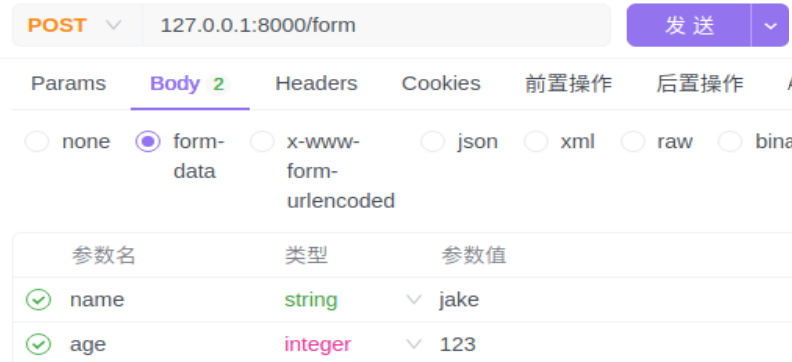
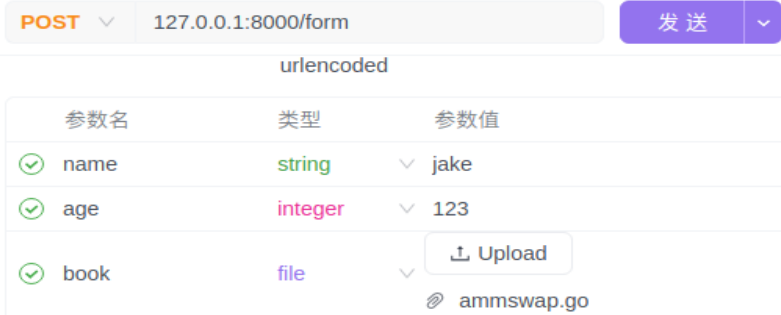
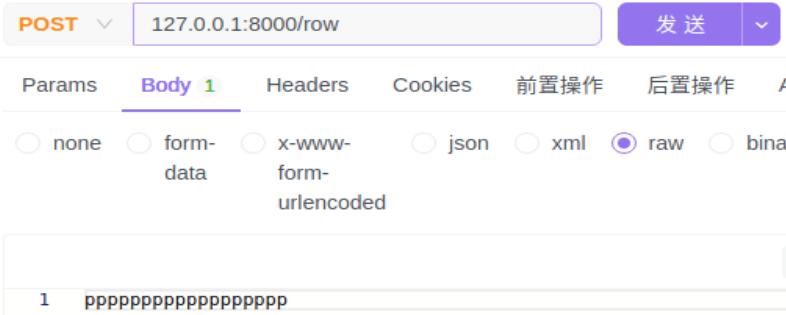

[toc]

# 1 请求参数
获取网页请求的参数
```go
func (c *Context) Query(key string) (value string)

// 跟Query方法功能，只不过多了一个bool返回值，如果为true表示从浏览器中取得了对应的参数的值，false表示没有取到
func (c *Context) GetQuery(key string) (string, bool)

// 对于参数有重复的，这个方法可以拿到全部参数，例如请求127.0.0.1/query?name=jake&name=terry, 使用这个方法可以拿到[jake terry]
func (c *Context) QueryArray(key string) (values []string)

// 获取参数多个相同的参数，例如访问 127.0.0.1:8000/query?score[en]=99&score[zh]=100, 那么就会得到map{en:99 zh:100}
func (c *Context) QueryMap(key string) (dicts map[string]string)

// 请求参数（127.0.0.1:8000/query?name=jake）,如果没有key则返回默认的值
func (c *Context) DefaultQuery(key, defaultValue string) string
```
**参数**:
|参数名称|类型|描述|
|--------|----|---|
|key|string|请求的参数|

**返回值**：
|返回值|类型|描述|
|------|----|----|
|value|string|参数的值|


**使用示例**:
```go
func handleQuery(ctx *gin.Context) {
    // 访问不127.0.0.1/query?name=jake&id=3时，获取name的值为jake, id值为3
	name := ctx.Query("name")
    id := ctx.Query("id")
	fmt.Println("name=", name, "id=",id)
    // name= jake id= 3
}

func main() {
	router := gin.Default()

	router.GET("/query", handleQuery)

	// run on 127.0.0.1:8000/index
	router.Run(":8000")
}
```

# 2 动态参数
```go
func (c *Context) Param(key string) string
```

**使用示例**:
```go
func handleQuery(ctx *gin.Context) {

	id := ctx.Param("user_id")

    // userId= ttery
	fmt.Println("userId=", id)
}

func query() {
	router := gin.Default()
	router.GET("/query/:user_id", handleQuery)

	// run on 127.0.0.1:8000/index
	router.Run(":8000")
}
```
当我们访问 `127.0.0.1:8000/query/ttery`时就会获取到ttery字符串。
**注意**：`127.0.0.1:8000/query/`后面不能再有路径符`\`, 不然就会报404.
除非在query方法中再添加`router.GET("/query/:user_id/:book_id", handleQuery)`、 handleQuery方法中添加`bookid := ctx.Param("book_id")`,则`127.0.0.1:8000/query/ttery`下还可以有一层路径，这样两个参数user_id和book_id也都可以获取得到

# 3 表单参数
```go
// 获取form中的指定字段的值
func (c *Context) PostForm(key string) (value string)

// 获取表单中指定字段的全部值，即如果表单中的key有重复的，则获取全部key对应的值
func (c *Context) PostFormArray(key string) (values []string)

// 获取表单中指定key的值，如果没有这个key则使用默认的defaultValue值
func (c *Context) DefaultPostForm(key, defaultValue string) string


// 获取表单的全部数据,包括键值对和文件
func (c *Context) MultipartForm() (*multipart.Form, error)
type Form struct {
	Value map[string][]string
	File  map[string][]*FileHeader
}
```

**注意**:
使用表单需要使用POST请求

**使用示例**：
```go
func handleQuery(ctx *gin.Context) {
	name := ctx.PostForm("name")

    // name= jake
	fmt.Println("name=", name)
}

func Index() {
	router := gin.Default()
	router.POST("/form", handleQuery)
	// run on 127.0.0.1:8000/index
	router.Run(":8000")
}
```


**使用示例--获取表单全部信息**：
```go
func handleQuery(ctx *gin.Context) {
    forms, _ := ctx.MultipartForm()
    /* name : [jake]
        age : [123] */
    for key, value := range forms.Value {
        fmt.Println(key, ":", value)
    }

    /* book : [0xc00058f2c0] */
    for fileName, fileValue := range forms.File {
		fmt.Println(fileName, ":", fileValue)
	}
}

func Index() {
    router := gin.Default()
    router.POST("/form", handleQuery)
    // run on 127.0.0.1:8000/index
    router.Run(":8000")
}
```


# 4 原始参数
获取原始参数
```go
func (c *Context) GetRawData() ([]byte, error)
```

**使用示例**:
```go
func handleQuery(ctx *gin.Context) {
	data, err := ctx.GetRawData()
	if err != nil {
		panic("get raw data failed")
	}
	
	// data= pppppppppppppppppp
	fmt.Println("data=", string(data))
}

func Index() {
	router := gin.Default()
	router.POST("/row", handleQuery)
	// run on 127.0.0.1:8000/index
	router.Run(":8000")
}
```


# 5 请求头信息
请求头是由一个个键值对组成，可以通过以下方法获取
```go
// 获取请求头的单个属性
func (c *Context) GetHeader(key string) string

// 获取请求头的全部属性, 这个变量是map[string][]string类型
gin.Context.Request.Header
```
**参数**：
- **key**: 请求头的属性名，首字母大小写不区分，单词之间使用`-`连接

**Note**：也可以使用自定义的请求头，获取请求头属性也是一样的方法

## 5.1 Content-Type
Content-Type描述了请求消息体的类型
**使用示例**：
```go
func handleQuery(ctx *gin.Context) {
	contentType := ctx.GetHeader("Content-Type")

	// text/plain
	fmt.Println("contentType=", contentType)
}

func Index() {
	router := gin.Default()
	router.POST("/row", handleQuery)
	// run on 127.0.0.1:8000/index
	router.Run(":8000")
}
```

**扩展**:
不同的请求body获取的Content-Type不同，可以根据这个值来确认对应的数据应该怎么处理。
|Content-Type值|对应的请求body类型|描述|
|--------------|-----------------|----|
|text/plain|row|原始数据|
|application/json|json|json数据|
|application/xml|xml|xml数据|
|application/x-www-form-urlencoded|x-www-form-urlencoded|x-www-form-urlencoded数据|
|multipart/form-data|form-data|表单数据|
|空值|没有值|没有值|
|application/octet-stream|binary|二进数据|

## 5.2 其他请求头信息
|请求头的key|描述|
|-----------|----|
|Accept|指定客户端可以处理的内容类型。</br> <font color=red> `*/*` </font>: 表示客户端可以接收全部类型的内容|
|User-Agent|包括了有关客户端软件的信息，通常用于区分不同的浏览器和客户端。 |
|Content-Type|指定请求主体的 MIME 类型，如 application/x-www-form-urlencoded，multipart/form-data 等|
|Accept-Encoding|指定可接受的内容编码，如 gzip, deflate, br|
|Connection|控制网络连接的选项，如 keep-alive 或 close。|
|Authorization|包含了认证信息，通常用于 Bearer token 或者基本认证。|


# 6 四大请求方式定义
- **POST**：在服务器新建一个资源，对应增
- **DELETE**：从从服务器删除资源，对应删
- **PUT**：在服务器更新资源（客户端提供完整资源数据），对应改
- **GET**：从服务器获取资源，对应查
- **PATCH**：在服务器更新资源（客户端提供要修改的资源数据）

**示例代码**:
```go
package gin

import (
	"encoding/json"
	"fmt"
	"github.com/gin-gonic/gin"
	"log"
	"net/http"
	"strconv"
)

type User struct {
	Name string `json:"name"`
	Age  int    `json:"age"`
}

var userList = []User{
	{"jake", 23},
	{"terry", 26},
	{"mack", 22},
}

// 显示User list
// 127.0.0.1:8000/list
func getList(ctx *gin.Context) {
	ctx.JSON(http.StatusOK, userList)
}

// 添加User
// 127.0.0.1:8000/adduser
// form
func addUser(ctx *gin.Context) {
	form, err := ctx.MultipartForm()
	if err != nil {
		log.Fatal("MultipartForm failed:", err.Error())
	}
	var user User
	for key, value := range form.Value {
		if key == "name" {
			user.Name = value[0]
		} else if key == "age" {
			user.Age, _ = strconv.Atoi(value[0])
		}
		fmt.Println("add", key, value)
	}

	userList = append(userList, user)
	ctx.JSON(200, userList)
}

// 编辑User
// 127.0.0.1:8000/edit
// {"name":"jake","age":20} -- raw data
func editUser(ctx *gin.Context) {
	data, err := ctx.GetRawData()
	if err != nil {
		log.Fatal("edit failed:", err.Error())
	}
	user := User{}
	json.Unmarshal(data, &user)
	fmt.Println("update:", user.Name, user.Age)

	for idx, item := range userList {
		if item.Name == user.Name {
			userList[idx].Age = user.Age
		}
	}
	ctx.JSON(200, userList)
}


// 删除User
// 127.0.0.1:8000/deleteUser
// {"name":"jake"}  -- raw data
func deleteUser(ctx *gin.Context) {
	data, err := ctx.GetRawData()
	if err != nil {
		log.Fatal("edit failed:", err.Error())
	}
	user := User{}
	json.Unmarshal(data, &user)
	fmt.Println("delete user:", user.Name, user.Age)
	for idx, item := range userList {
		if item.Name == user.Name {
			if len(userList) > 1 {
				userList[idx].Name = userList[len(userList)-1].Name
				userList[idx].Age = userList[len(userList)-1].Age
				userList = userList[:len(userList)-1]
			}
		}
	}
	ctx.JSON(200, userList)
}

func Index() {
	router := gin.Default()
	router.GET("/list", getList)
	router.POST("/adduser", addUser)
	router.PUT("/edit", editUser)
	router.DELETE("/deleteUser", deleteUser)
	// run on 127.0.0.1:8000/index
	router.Run(":8000")
}

```


