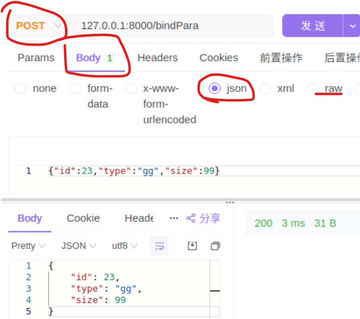
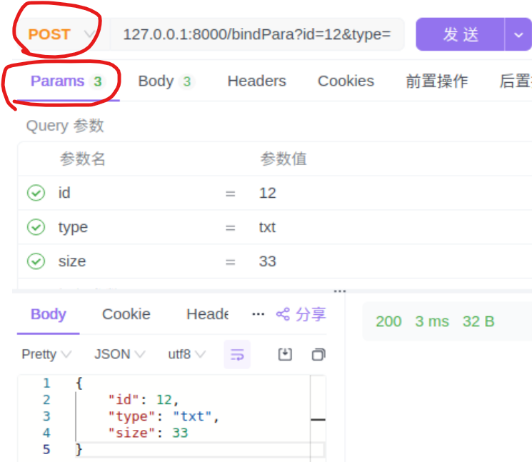
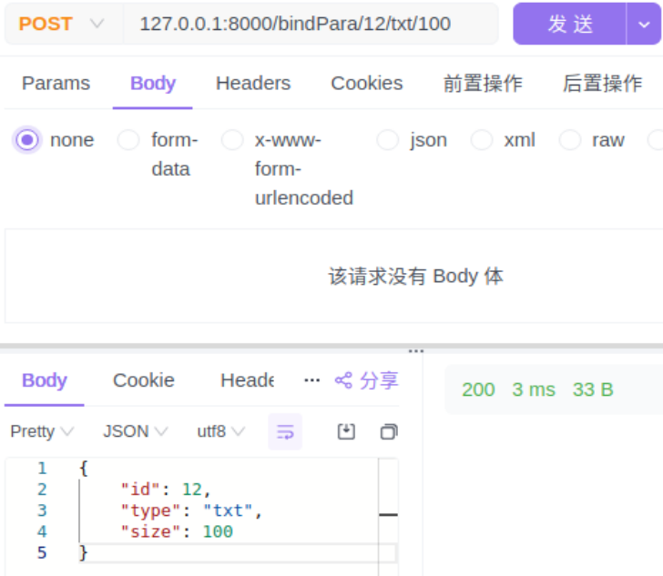
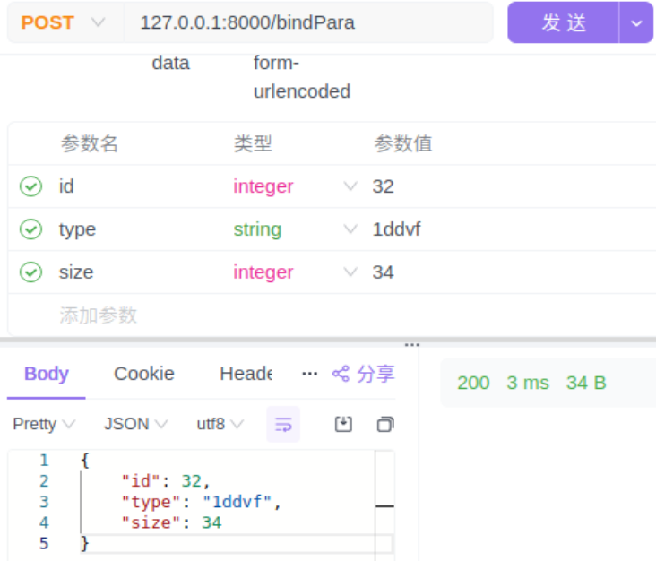

[toc]
# 1 绑定消息体参数
gin中的bind可以很方便地将前端传递来的数据与结构体进行参数绑定，以及参数校验。
在使用参数绑定的时候，需要给结构体加上Tag, 像 json、form、uri、xml、yaml

```go
func (c *Context) ShouldBindJSON(obj any) error
```
**注意**: 这个方法获取的是请求的Body的参数

**使用示例**:
 URL = 127.0.0.1:8000/bindPara
```go
type Info struct {
	ID   int    `json:"id"`
	Type string `json:"type"`
	Size int    `json:"size"`
}

func bindPara(ctx *gin.Context) {
	var info Info
	err := ctx.ShouldBindJSON(&info)
	if err != nil {
		fmt.Println("bind failed:", err.Error())
		ctx.JSON(200, "bind error")
	}else{
	    ctx.JSON(200, info)
    }
}
func main() {
    router := gin.Default()

    // 访问 127.0.0.1:8000/bindPara
    // POST请求 {"id":23,"type":"gg","size":99}
    // 请求体的格式为json、raw data
    router.POST("/bindPara", bindPara)
    router.Run(":8000")
}
```



# 2 绑定查询参数
要使用绑定查询参数，需要在结构体中添加 form标签
```go
func (c *Context) ShouldBindQuery(obj any) error
```
**注意**: 这个方法获取的是请求的Params的Query参数

**使用示例**:
URL = 127.0.0.1:8000/bindPara?id=12&type=txt&size=33
```go
type Info struct {
	ID   int    `json:"id" form:"id"`
	Type string `json:"type" form:"type"`
	Size int    `json:"size" form:"size"`
}

func bindPara(ctx *gin.Context) {
	var info Info
	err := ctx.ShouldBindQuery(&info)
	if err != nil {
		ctx.JSON(200, gin.H{"status": "error"})
	} else {
		ctx.JSON(200, info)
	}
}

func Index() {
	router := gin.Default()
	router.POST("/bindPara", bindPara)
	// run on 127.0.0.1:8000/index
	router.Run(":8000")
}
```


# 3 绑定uri动态参数参数
要使用绑定uri参数，需要在结构体上添加 uri标签
```go
func (c *Context) ShouldBindUri(obj any) error
```

**使用示例**:
```go
type Info struct {
	ID   int    `json:"id" form:"id" uri:"id"`
	Type string `json:"type" form:"type" uri:"type"`
	Size int    `json:"size" form:"size" uri:"size"`
}

func bindPara(ctx *gin.Context) {
	var info Info
	err := ctx.ShouldBindUri(&info)
	if err != nil {
		fmt.Println("bind failed:", err.Error())
		ctx.JSON(200, "bind error")
	}else{
	    ctx.JSON(200, info)
    }
	ctx.JSON(200, info)
}

func main() {
	router := gin.Default()
	router.POST("/bindPara/:id/:type/:size", bindPara)
	// run on 127.0.0.1:8000/index
	router.Run(":8000")
}
```

**拓展**: 请求方式改为GET也可以（代码也要改为GET）

# 4 绑定Form Data
需要在结构体中添加form标签
```go
func (c *Context) ShouldBind(obj any) error
```

**使用示例**：
URL = 127.0.0.1:8000/bindPara
```go
type Info struct {
	ID   int    `json:"id" form:"id" uri:"id"`
	Type string `json:"type" form:"type" uri:"type"`
	Size int    `json:"size" form:"size" uri:"size"`
}

func bindForm(ctx *gin.Context) {
	var info Info
	err := ctx.ShouldBind(&info)
	if err != nil {
		fmt.Println("bind failed:", err.Error())
		ctx.JSON(200, "bind error")
	}else{
	    ctx.JSON(200, info)
    }
	fmt.Println("bindPara")
}

func Index() {
	router := gin.Default()
	router.POST("/bindPara", bindForm)
	// run on 127.0.0.1:8000/index
	router.Run(":8000")
}
```

