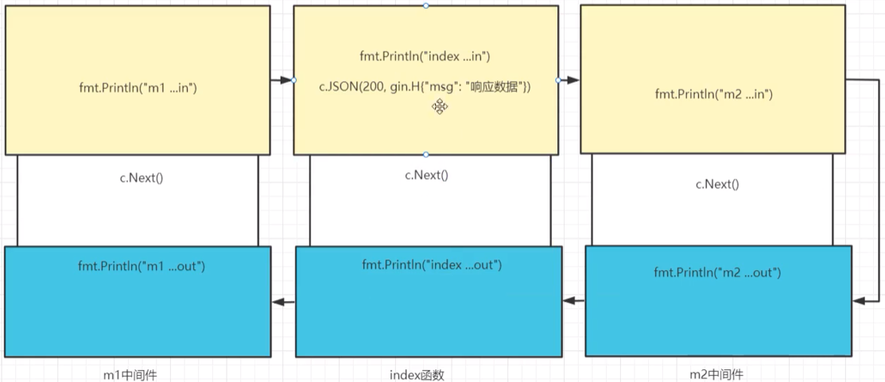

[toc]

# 1 gin中间件
Gin框架允许开发者在处理请求的过程中，加入用户自己的钩子(Hook)函数。这个钩子函数就叫中间件，中间件适合处理一些公共的业务逻辑，比如登录认证、权限校验、数据分页、记录日志、耗时统计等即比如，如果访问一个网页的话，不管访问什么路径都需要进行登录，此时就需要为所有路径的处理函数进行统—个中间件
Gin中的中间件必须是一个gin.HandlerFunc类型

使用中间件的目的就是让多个路由执行一些统一的处理

# 2 单独注册中间件
单独给一个路由注册中间件
```go
func (group *RouterGroup) GET(relativePath string, handlers ...HandlerFunc) IRoutes
```
以上的GET方法中的参数可以传入多个`HandlerFunc`类型（实际是一个函数），每一个`HandlerFunc`都可以看成是一个中间件。当传入有多个`HandlerFunc`时，每个函数按传入的顺序依次执行。
```go
package gin

import (
	"fmt"
	"github.com/gin-gonic/gin"
)

func login1(ctx *gin.Context) {
	fmt.Println("login1")
	ctx.JSON(200, gin.H{"data": "login 1"})
	
    // 如果执行了这个方法，那么后续的login2方法就不再会执行了
    //ctx.Abort()
}
func login2(ctx *gin.Context) {
	fmt.Println("login2")
	ctx.JSON(200, gin.H{"data": "login 2"})
}

func Main() {
	engine := gin.Default()

	/*login1
	login2*/
	engine.GET("/", login1, login2)
	engine.Run(":8000")
}
```

# 3 请求中间件和响应中间件
```go
package gin

import (
	"fmt"
	"github.com/gin-gonic/gin"
)

func login1(ctx *gin.Context) {
	fmt.Println("login1---req")
	ctx.Next()
	fmt.Println("login1----res")
}
func login2(ctx *gin.Context) {
	fmt.Println("login2---req")
	ctx.Next()
	fmt.Println("login2----res")
}

func login3(ctx *gin.Context) {
	fmt.Println("login3---req")
	ctx.Next()
	fmt.Println("login3----res")
}

func Main() {
	engine := gin.Default()

	/*  login1---req
        login2---req
        login3---req
        login3----res
        login2----res
        login1----res*/
	engine.GET("/", login1, login2, login3)
	engine.Run(":8000")
}
/*打印顺序如上，是先将ctx.Next()方法之前的执行后，再执行的ctx.Next()之后的。并且对于ctx.Next()之前的，是按顺序依次执行，对于ctx.Next()之后的是按逆序执行*/
```
各个中间件的ctx.Next()前后执行顺序如下图

如果在某个流程的`ctx.Next()`方法<font color=red>之前</font>执行了`ctx.Abort()`，那么后面的流程就不会走了

# 4 注册全局中间件
```go
func login1(ctx *gin.Context) {
	fmt.Println("login1---req")
}

func common(ctx *gin.Context) {
	fmt.Println("common handle")
}

func Main() {
	engine := gin.Default()

    // 这样在访问路由时，会先执行common函数，再执行各个路由绑定的中间件
	engine.Use(common)

    
	engine.GET("/", login1)
	engine.Run(":8000")
}
```

# 5 接收前面的中间件所设置的值
```go
package gin

import (
	"fmt"
	"github.com/gin-gonic/gin"
)

func common(ctx *gin.Context) {
	fmt.Println("common handle")
    
    // 设置name为jake
	ctx.Set("name", "jake")
}
func login1(ctx *gin.Context) {
	fmt.Println("login1---req")

    // 接收name的值，如果要拿结构体的值，那么就需要断言
    /*  common handle
        login1---req
        name= jake*/
	name, exist := ctx.Get("name")
	if exist {
		fmt.Println("name=", name)
	}
}

func Main() {
	engine := gin.Default()
	engine.Use(common)
	engine.GET("/", login1)
	engine.Run(":8000")
}
```

# 6 几种自定义的中间件
## 6.1 耗时统计
统计访问路由所耗费的时间
```go
func timeCompute(ctx *gin.Context) {
	startTime := time.Now()
	ctx.Next()
	since := time.Since(startTime)
	fmt.Printf("router %s spend time %d ns\n", ctx.HandlerName(), since)
}
```