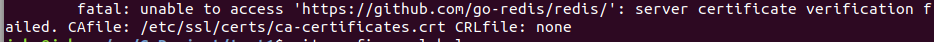

# 1 获取go-redis包
```shell
# redis 6使用
go get github.com/go-redis/redis/v8

# redis 7使用
go get github.com/go-redis/redis/v9

# go-redis
go get github.com/go-redis/redis
```
如果在get redis的时候报错:
fatal: unable to access 'https://github.com/go-redis/redis/': server certificate verification failed. CAfile: /etc/ssl/certs/ca-certificates.crt CRLfile: none

在终端执行
```shell
export GIT_SSL_NO_VERIFY=1
```
在继续执行`go get`