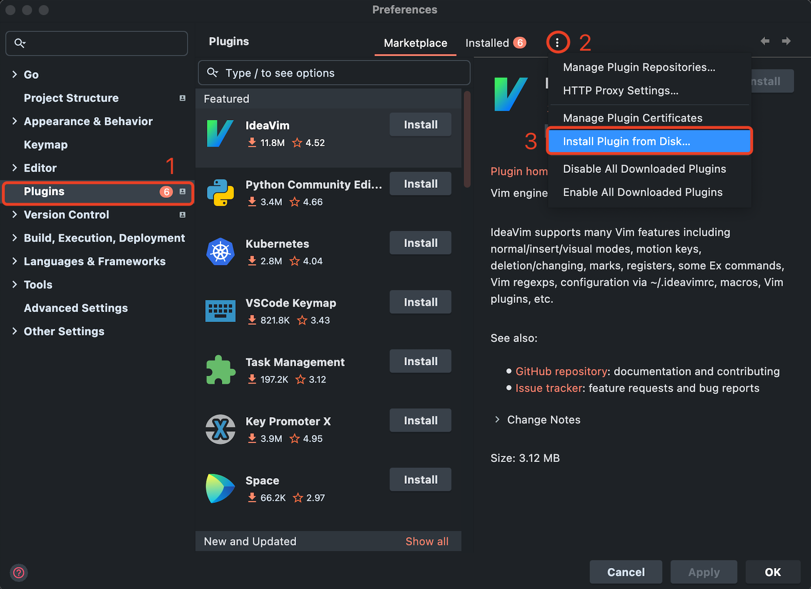

[toc]

# 1 介绍
用于构建高性能的微服务应用。它由中国的开源组织 zeromicro 开发，旨在提供一种高效、可靠且易于使用的解决方案来开发和管理大规模的微服务系统。

Go-zero 提供了多种功能和特性，包括：

微服务框架：支持微服务架构的开发，内置了服务发现、负载均衡、熔断等功能。
RPC 支持：提供了高性能的 RPC（远程过程调用）功能，简化了服务间的通信。
代码生成：通过代码生成工具，可以自动生成一些常用的代码，提升开发效率。
高性能：在设计上考虑了性能优化，适合构建高并发的系统。
易用性：有较好的文档和示例，帮助开发者快速上手。
这个框架特别适合需要处理高并发请求的应用场景，能够帮助开发者高效地构建和管理微服务系统。

# 2 获取go-zero


# 3 相关文档
- **官网**: https://go-zero.dev

# 4 安装

## 4.1 goctl安装

goctl 是 go-zero 的内置脚手架，是提升开发效率的一大利器，可以一键生成代码、文档、部署 k8s yaml、dockerfile 等。
- **对于go1.16之前的版本**: `go get -u github.com/zeromicro/go-zero/tools/goctl@latest` 
- **对于go1.16及其后续版本**： `go install github.com/zeromicro/go-zero/tools/goctl@latest`

## 4.2 protoc安装
通过 goctl 可以一键安装 protoc，protoc-gen-go，protoc-gen-go-grpc 相关组件，你可以执行如下命令：
```shell
goctl env check --install --verbose --force
```

**拓展**： 你可以通过`goctl env check --verbose`命令来检测goctl环境是否完整

## 4.3 go-zero安装

```shell
go get -u github.com/zeromicro/go-zero@latest
```

## 4.4 goctl-intellij 安装
goctl-intellij 是 go-zero api 描述语言的 intellij 编辑器插件，支持 api 描述语言高亮、语法检测、快速提示、创建模板特性。

项目地址：https://github.com/zeromicro/goctl-intellij
goctl-intellij 安装方式有 2 种

- **从磁盘安装**：
1. 从`https://github.com/zeromicro/goctl-intellij/releases/download/v1.1.3/Goctl-1.1.3.zip`下载。
2. 下载的 zip 文件无需解压，然后打开 Goland | Preferences... | Plugins，找到更多图标 ，选择 Install Plugin from Disk...


- **从插件中心安装**:
1. 打开 Goland | Preferences... | Plugins，选中 Marketplace 选项栏，在搜索框输入 Goctl 进行搜索安装


## 4.5 goctl-vscode 安装
goctl vscode 编辑器插件可以安装在 1.46.0+ 版本的 Visual Studio Code 上，首先请确保你的 Visual Studio Code 版本符合要求，并已安装 goctl 命令行工具。如果尚未安装 Visual Studio Code，请安装并打开 Visual Studio Code。

打开 Visual Studio Code | Extensions，搜索 goctl，点击 install 安装。
