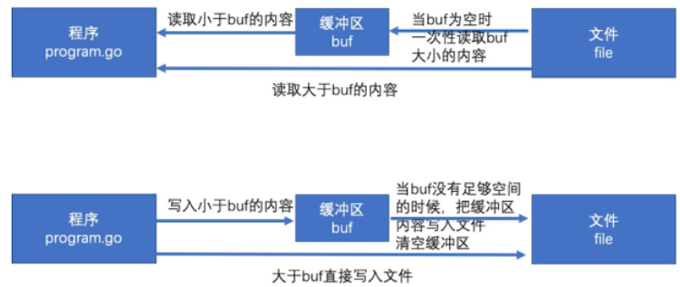

[toc]
# 1 bufio包原理
bufio 是通过缓冲来提高效率。

io操作本身的效率并不低，低的是频繁的访问本地磁盘的文件。所以bufio就提供了缓冲区(分配一块内存)，读和写都先在缓冲区中，最后再读写文件，来降低访问本地磁盘的次数，从而提高效率。当对性能有要求时可以使用bufio包进行读取输入输出。


# 2 bufio包的接口
## 2.1 Scanner对象
**获取终端**:
```go
package main
import (
    "bufio"
    "fmt"
    "os"
)
func main() {
    // 创建一个Scanner
    var scanner *bufio.Scanner = bufio.NewScanner(os.Stdin)

    // 获取终端输入
    scanner.Scan()
    fmt.Println(scanner.Text())
}
```
## 2.2 Writer对象
Writer用于将内容写到文件中
```go
package main

import (
    "bufio"
    "fmt"
    "os"
)

func main() {
    var err error
    var file *os.File
    file, err = os.OpenFile("./test.txt", os.O_RDWR|os.O_APPEND, os.ModeAppend)
    defer file.Close()
    if err != nil {
        fmt.Println("can't open file with", err.Error())
        return
    }

    var writer *bufio.Writer
    writer = bufio.NewWriter(file)

    for i := 0; i < 100; i++ {
        writer.WriteString(fmt.Sprintf("test %d\n", i))
    }
    // 将writer中的数据全部写入文件中
    writer.Flush()
}
```
提示： bufio.NewWriter(...)的参数还可以是os.Stdout用于在终端输出

## 2.3 Reader对象
### 2.3.1 bufio.Reader原理
bufio.Reader 是bufio中对io.Reader 的封装
bufio.Read(p []byte) 相当于读取大小len(p)的内容，思路如下：

1. 当缓存区有内容的时，将缓存区内容全部填入p并清空缓存区
2. 当缓存区没有内容的时候且len(p)>len(buf),即要读取的内容比缓存区还要大，直接去文件读取即可
3. 当缓存区没有内容的时候且len(p)<len(buf),即要读取的内容比缓存区小，缓存区从文件读取内容充满缓存区，并将p填满（此时缓存区有剩余内容）
4. 以后再次读取时缓存区有内容，将缓存区内容全部填入p并清空缓存区（此时和情况1一样）

### 2.3.2 bufio.Reader读取文件内容
函数原型：```func (b *Reader) Read(p []byte) (n int, err error)```
```go
package main
import (
	"bufio"
	"fmt"
	"os"
)
func main() {
    var err error
    var file *os.File
    // 打开一个文件
    file, err = os.Open("./go.mod")
    if err != nil {
        fmt.Println(err.Error())
    }
    defer file.Close()
    // 创建一个bufio.reader并读取文件内容
    var reader *bufio.Reader = bufio.NewReader(file)
    buf := make([]byte, 8)
    for {
        // 读取文件内容到buf切片中，下次读取会继续从上次读取的地方开始读
        if _, err := reader.Read(buf); err != io.EOF {
            fmt.Println(string(buf))
        } else {
            break
        }
    }
}
```
此外bufio.NewReader(...)方法的参数还可以是

### 2.3.3 Reader读取直到指定的字符出现
函数原型：```func (b *Reader) ReadString(delim byte) (string, error)```
```go
package main
import (
    "bufio"
    "fmt"
    "os"
)
func main() {
    var err error
    var file *os.File
    file, err = os.Open("./go.mod")
    if err != nil {
        fmt.Println(err.Error())
    }
    defer file.Close()

    var reader *bufio.Reader = bufio.NewReader(file)
    // 读取字符串，直到遇到'@'字符（包括@字符，例如对于内容"jake@com"会返回"jake@"
    str, _ := reader.ReadString('@')
    fmt.Println(str)
}
```
bufio.Reader是一个接口。定义如下
```go
type Reader interface {
    Read(p []byte) (n int, err error)
}
```