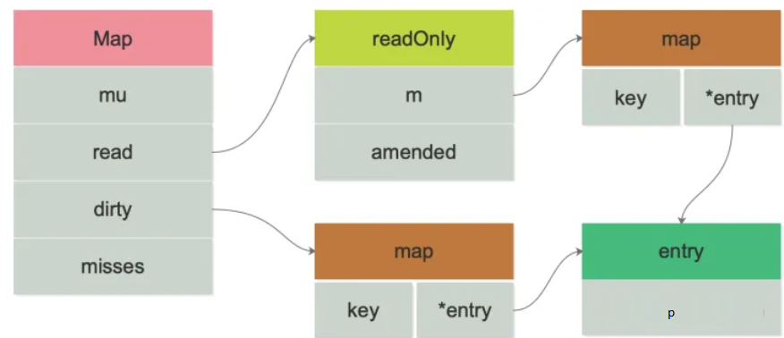

[toc]
# 1 sync.Map介绍
工作中，经常会碰到并发读写 map 而造成 panic 的情况，为什么在并发读写的时候，会 panic 呢？因为在并发读写的情况下，map 里的数据会被写乱，之后就是 Garbage in, garbage out，还不如直接 panic 了。

Go 语言原生 map 并不是线程安全的，对它进行并发读写操作的时候，需要加锁。而 sync.map 则是一种并发安全的 map，在 Go 1.9 引入。
- sync.map 是线程安全的，读取，插入，删除也都保持着常数级的时间复杂度。
- sync.map 的零值是有效的，并且零值是一个空的 map。在第一次使用之后，不允许被拷贝。

使用 sync.map 之后，对 map 的读写，不需要加锁。并且它通过空间换时间的方式，使用 read 和 dirty 两个 map 来进行读写分离，降低锁时间来提高效率。

# 2 sync.Map使用
## 2.1 向sync.Map中存入键值对
**方法原型**：
```go
func (m *Map) Store(key, value any)
```
**描述**:
向sync.Map中存入一对键值对
**参数**：
- **<font color=green>key</font>** : 空接口类型
- **<font color=green>value</font>** : 空接口类型

**注意**:
1. 在适应sync.Map中的Store方法进行存储键值对时，是以第一个存进去的键值对为准的。例如第一次存入的键值对是<int, string>类型的，那么后面存入的键值对也应该是<int,string>类型的。不然虽然不会编译报错，但会执行报错。

## 2.2 读取key对应的value
**方法原型**:
```go
func (m *Map) Load(key any) (value any, ok bool) 
```
**描述**：
获取key对应的value值，如果key不存在，则返回该value类型的默认值，并且ok为false
**参数**：
- **<font color=green>key</font>**： 键值对的key
**返回值**:
- **<font color=blue>key</font>**: 获取到的键值对的value
- **<font color=blue>ok</font>**: 如果key不存在，就为false

**示例代码**：
```go
package main
import (
    "fmt"
    "sync"
)
func main() {
    var m sync.Map
    // 1. 写入
    m.Store("jake", 18)
    m.Store("terry", 12)

    // 2. 读取
    age, _ := m.Load("jake")
    fmt.Println(age.(int)) // 18

    // 3. 遍历
    m.Range(func(key, value interface{}) bool {
        name := key.(string)
        age := value.(int)
        fmt.Println(name, age)
        return true
    })

    // 4. 删除
    m.Delete("jake")
    age, ok := m.Load("jake")
    fmt.Println(age, ok) // <nil> false

    // 5. 读取或写入(如果terry不存在就写入，如果存在就返回terry的值)
    m.LoadOrStore("terry", 100)
    age, _ = m.Load("terry")
    fmt.Println(age) // 12  --- （terry存在，返回原本的12，传入的1000忽略）

    // 读取并删除
    value,isLoaded := m.LoadAndDelete("jake") // 返回key为"jake"的value并删除该键值对
}
```

# 3 适用场景
- sync.map 适用于读多写少的场景。对于写多的场景，会导致 read map 缓存失效，需要加锁，导致冲突变多；而且由于未命中 read map 次数过多，导致 dirty map 提升为 read map，这是一个 O(N) 的操作，会进一步降低性能。

# 4 sync.Map原理
sync.Map的数据结构
```go
type Map struct {
    mu Mutex
    read atomic.Value // readOnly
    dirty map[interface{}]*entry
    misses int
}

//atomic.Value 数据类型
type Value struct {
    v any // 实际是一个readOnly结构体
}
```
**Map成员变量描述**：
- **<font color=blue>mu</font>**： 互斥量 mu 保护 read 和 dirty。
- **<font color=blue>read</font>**：可以并发地读。但如果需要更新 read，则需要加锁保护。对于 read 中存储的 entry 字段，可能会被并发地 CAS 更新。但是如果要更新一个之前已被删除的 entry，则需要先将其状态从 expunged 改为 nil，再拷贝到 dirty 中，然后再更新
- **<font color=blue>dirty</font>**：  是一个非线程安全的原始 map。包含新写入的 key，并且包含 read 中的所有未被删除的 key。这样，可以快速地将 dirty 提升为 read 对外提供服务。如果 dirty 为 nil，那么下一次写入时，会新建一个新的 dirty，这个初始的 dirty 是 read 的一个拷贝，但除掉了其中已被删除的 key。
- **<font color=blue>misses</font>**：每当从 read 中读取失败，都会将 misses 的计数值加 1，当加到一定阈值以后，需要将 dirty 提升为 read，以期减少 miss 的情形。

<font color=gray>read map 和 dirty map 的存储方式是不一致的。
前者使用 atomic.Value，后者只是单纯的使用 map。
原因是 read map 使用 lock free 操作，必须保证 load/store 的原子性；而 dirty map 的 load+store 操作是由 lock（就是 mu）来保护的。</font>

read 字段里实际上是存储的是：
```go
// readOnly is an immutable struct stored atomically in the Map.read field.
type readOnly struct {
    m       map[interface{}]*entry
    amended bool // true if the dirty map contains some key not in m.
}

type entry struct {
    p unsafe.Pointer // *interface{}
}
```
read 和 dirty 各自维护一套 key，key 指向的都是同一个 value。也就是说，只要修改了这个```entry```，对 read 和 dirty 都是可见的。这个指针<font color=red>p</font>的状态有三种：
- **nil** : 当 <font color=red>p</font> == nil 时，说明这个键值对已被删除，并且 m.dirty == nil，或 m.dirty[k] 指向该 entry。
- **expunged** :当 <font color=red>p</font> == expunged 时，说明这条键值对已被删除，并且 m.dirty != nil，且 m.dirty 中没有这个 key。
- **正常状态**: <font color=red>p</font> 指向一个正常的值，表示实际 interface{} <font color=gray>(key)</font> 的地址，并且被记录在 m.read.m[key] 中。如果这时 m.dirty 不为 nil，那么它也被记录在 m.dirty[key] 中。两者实际上指向的是同一个值。

当删除 key 时，并不实际删除。一个 entry 可以通过原子地（CAS 操作）设置 p 为 nil 被删除。如果之后创建 m.dirty，nil 又会被原子地设置为 expunged，且不会拷贝到 dirty 中。

如果 p 不为 expunged，和 entry 相关联的这个 value 可以被原子地更新；如果 p == expunged，那么仅当它初次被设置到 m.dirty 之后，才可以被更新。

sync.Map的整体结构如下


## 4.1 Store流程
先来看 expunged：
```go
var expunged = unsafe.Pointer(new(interface{}))
```
它是一个指向任意类型的指针，用来标记从 dirty map 中删除的 entry。
```go
// Store sets the value for a key.
func (m *Map) Store(key, value interface{}) {
    // 如果 read map 中存在该 key  则尝试直接更改(由于修改的是 entry 内部的 pointer，因此 dirty map 也可见)
    read, _ := m.read.Load().(readOnly)
    if e, ok := read.m[key]; ok && e.tryStore(&value) {
        return
    }

    m.mu.Lock()
    read, _ = m.read.Load().(readOnly)
    if e, ok := read.m[key]; ok {
        if e.unexpungeLocked() {
            // 如果 read map 中存在该 key，但 p == expunged，则说明 m.dirty != nil 并且 m.dirty 中不存在该 key 值 此时:
            //    a. 将 p 的状态由 expunged  更改为 nil
            //    b. dirty map 插入 key
            m.dirty[key] = e
        }
        // 更新 entry.p = value (read map 和 dirty map 指向同一个 entry)
        e.storeLocked(&value)
    } else if e, ok := m.dirty[key]; ok {
        // 如果 read map 中不存在该 key，但 dirty map 中存在该 key，直接写入更新 entry(read map 中仍然没有这个 key)
        e.storeLocked(&value)
    } else {
        // 如果 read map 和 dirty map 中都不存在该 key，则：
        //    a. 如果 dirty map 为空，则需要创建 dirty map，并从 read map 中拷贝未删除的元素到新创建的 dirty map
        //    b. 更新 amended 字段，标识 dirty map 中存在 read map 中没有的 key
        //    c. 将 kv 写入 dirty map 中，read 不变
        if !read.amended {
            // 到这里就意味着，当前的 key 是第一次被加到 dirty map 中。
            // store 之前先判断一下 dirty map 是否为空，如果为空，就把 read map 浅拷贝一次。
            m.dirtyLocked()
            m.read.Store(readOnly{m: read.m, amended: true})
        }
        // 写入新 key，在 dirty 中存储 value
        m.dirty[key] = newEntry(value)
    }
    m.mu.Unlock()
}
```
整体流程：

如果在 read 里能够找到待存储的 key，并且对应的 entry 的 p 值不为 expunged，也就是没被删除时，直接更新对应的 entry 即可。
第一步没有成功：要么 read 中没有这个 key，要么 key 被标记为删除。则先加锁，再进行后续的操作。
再次在 read 中查找是否存在这个 key，也就是 double check 一下，这也是 lock-free 编程里的常见套路。如果 read 中存在该 key，但 p == expunged，说明 m.dirty != nil 并且 m.dirty 中不存在该 key 值 此时: a. 将 p 的状态由 expunged 更改为 nil；b. dirty map 插入 key。然后，直接更新对应的 value。
如果 read 中没有此 key，那就查看 dirty 中是否有此 key，如果有，则直接更新对应的 value，这时 read 中还是没有此 key。
最后一步，如果 read 和 dirty 中都不存在该 key，则：a. 如果 dirty 为空，则需要创建 dirty，并从 read 中拷贝未被删除的元素；b. 更新 amended 字段，标识 dirty map 中存在 read map 中没有的 key；c. 将 k-v 写入 dirty map 中，read.m 不变。最后，更新此 key 对应的 value。
再来看一些子函数：
```go
// 如果 entry 没被删，tryStore 存储值到 entry 中。如果 p == expunged，即 entry 被删，那么返回 false。
func (e *entry) tryStore(i *interface{}) bool {
    for {
        p := atomic.LoadPointer(&e.p)
        if p == expunged {
            return false
        }
        if atomic.CompareAndSwapPointer(&e.p, p, unsafe.Pointer(i)) {
            return true
        }
    }
}
```
tryStore 在 Store 函数最开始的时候就会调用，是比较常见的 for 循环加 CAS 操作，尝试更新 entry，让 p 指向新的值。
s
unexpungeLocked 函数确保了 entry 没有被标记成已被清除：

```go
// unexpungeLocked 函数确保了 entry 没有被标记成已被清除。
// 如果 entry 先前被清除过了，那么在 mutex 解锁之前，它一定要被加入到 dirty map 中
func (e *entry) unexpungeLocked() (wasExpunged bool) {
    return atomic.CompareAndSwapPointer(&e.p, expunged, nil)
}
```

## 4.2 Load原理
```go
func (m *Map) Load(key interface{}) (value interface{}, ok bool) {
    read, _ := m.read.Load().(readOnly)
    e, ok := read.m[key]
    // 如果没在 read 中找到，并且 amended 为 true，即 dirty 中存在 read 中没有的 key
    if !ok && read.amended {
        m.mu.Lock() // dirty map 不是线程安全的，所以需要加上互斥锁
        // double check。避免在上锁的过程中 dirty map 提升为 read map。
        read, _ = m.read.Load().(readOnly)
        e, ok = read.m[key]
        // 仍然没有在 read 中找到这个 key，并且 amended 为 true
        if !ok && read.amended {
            e, ok = m.dirty[key] // 从 dirty 中找
            // 不管 dirty 中有没有找到，都要"记一笔"，因为在 dirty 提升为 read 之前，都会进入这条路径
            m.missLocked()
        }
        m.mu.Unlock()
    }
    if !ok { // 如果没找到，返回空，false
        return nil, false
    }
    return e.load()
}
```
处理路径分为 fast path 和 slow path，整体流程如下：

首先是 fast path，直接在 read 中找，如果找到了直接调用 entry 的 load 方法，取出其中的值。
如果 read 中没有这个 key，且 amended 为 fase，说明 dirty 为空，那直接返回 空和 false。
如果 read 中没有这个 key，且 amended 为 true，说明 dirty 中可能存在我们要找的 key。当然要先上锁，再尝试去 dirty 中查找。在这之前，仍然有一个 double check 的操作。若还是没有在 read 中找到，那么就从 dirty 中找。不管 dirty 中有没有找到，都要"记一笔"，因为在 dirty 被提升为 read 之前，都会进入这条路径
这里主要看下 missLocked 的函数的实现：
```go
func (m *Map) missLocked() {
    m.misses++
    if m.misses < len(m.dirty) {
        return
    }
    // dirty map 晋升
    m.read.Store(readOnly{m: m.dirty})
    m.dirty = nil
    m.misses = 0
}
```
直接将 misses 的值加 1，表示一次未命中，如果 misses 值小于 m.dirty 的长度，就直接返回。否则，将 m.dirty 晋升为 read，并清空 dirty，清空 misses 计数值。这样，之前一段时间新加入的 key 都会进入到 read 中，从而能够提升 read 的命中率。

再来看下 entry 的 load 方法：
```go
func (e *entry) load() (value interface{}, ok bool) {
    p := atomic.LoadPointer(&e.p)
    if p == nil || p == expunged {
        return nil, false
    }
    return *(*interface{})(p), true
}
```
对于 nil 和 expunged 状态的 entry，直接返回 ok=false；否则，将 p 转成 interface{} 返回。

## 4.3 Delete
```go
// Delete deletes the value for a key.
func (m *Map) Delete(key interface{}) {
    read, _ := m.read.Load().(readOnly)
    e, ok := read.m[key]
    // 如果 read 中没有这个 key，且 dirty map 不为空
    if !ok && read.amended {
        m.mu.Lock()
        read, _ = m.read.Load().(readOnly)
        e, ok = read.m[key]
        if !ok && read.amended {
            delete(m.dirty, key) // 直接从 dirty 中删除这个 key
        }
        m.mu.Unlock()
    }
    if ok {
        e.delete() // 如果在 read 中找到了这个 key，将 p 置为 nil
    }
}
```
可以看到，基本套路还是和 Load，Store 类似，都是先从 read 里查是否有这个 key，如果有则执行 entry.delete 方法，将 p 置为 nil，这样 read 和 dirty 都能看到这个变化。

如果没在 read 中找到这个 key，并且 dirty 不为空，那么就要操作 dirty 了，操作之前，还是要先上锁。然后进行 double check，如果仍然没有在 read 里找到此 key，则从 dirty 中删掉这个 key。但不是真正地从 dirty 中删除，而是更新 entry 的状态。

来看下 entry.delete 方法：
```go
func (e *entry) delete() (hadValue bool) {
    for {
        p := atomic.LoadPointer(&e.p)
        if p == nil || p == expunged {
            return false
        }
        if atomic.CompareAndSwapPointer(&e.p, p, nil) {
            return true
        }
    }
}
```
它真正做的事情是将正常状态（指向一个 interface{}）的 p 设置成 nil。没有设置成 expunged 的原因是，当 p 为 expunged 时，表示它已经不在 dirty 中了。这是 p 的状态机决定的，在 tryExpungeLocked 函数中，会将 nil 原子地设置成 expunged。

tryExpungeLocked 是在新创建 dirty 时调用的，会将已被删除的 entry.p 从 nil 改成 expunged，这个 entry 就不会写入 dirty 了。
```go
func (e *entry) tryExpungeLocked() (isExpunged bool) {
    p := atomic.LoadPointer(&e.p)
    for p == nil {
        // 如果原来是 nil，说明原 key 已被删除，则将其转为 expunged。
        if atomic.CompareAndSwapPointer(&e.p, nil, expunged) {
            return true
        }
        p = atomic.LoadPointer(&e.p)
    }
    return p == expunged
}
```
注意到如果 key 同时存在于 read 和 dirty 中时，删除只是做了一个标记，将 p 置为 nil；而如果仅在 dirty 中含有这个 key 时，会直接删除这个 key。原因在于，若两者都存在这个 key，仅做标记删除，可以在下次查找这个 key 时，命中 read，提升效率。若只有在 dirty 中存在时，read 起不到“缓存”的作用，直接删除。

## 4.4 Range
Range 的参数是一个函数：

f func(key, value interface{}) bool
由使用者提供实现，Range 将遍历调用时刻 map 中的所有 k-v 对，将它们传给 f 函数，如果 f 返回 false，将停止遍历。
```go
func (m *Map) Range(f func(key, value interface{}) bool) {
    read, _ := m.read.Load().(readOnly)
    if read.amended {
        m.mu.Lock()
        read, _ = m.read.Load().(readOnly)
        if read.amended {
            read = readOnly{m: m.dirty}
            m.read.Store(read)
            m.dirty = nil
            m.misses = 0
        }
        m.mu.Unlock()
    }

    for k, e := range read.m {
        v, ok := e.load()
        if !ok {
            continue
        }
        if !f(k, v) {
            break
        }
    }
}
```
当 amended 为 true 时，说明 dirty 中含有 read 中没有的 key，因为 Range 会遍历所有的 key，是一个 O(n) 操作。将 dirty 提升为 read，会将开销分摊开来，所以这里直接就提升了。

之后，遍历 read，取出 entry 中的值，调用 f(k, v)。

# 5 总结
关于为何 sync.map 没有 Len 方法，参考资料里给出了 issue，bcmills 认为对于并发的数据结构和非并发的数据结构并不一定要有相同的方法。例如，map 有 Len 方法，sync.map 却不一定要有。就像 sync.map 有 LoadOrStore 方法，map 就没有一样。

有些实现增加了一个计数器，并原子地增加或减少它，以此来表示 sync.map 中元素的个数。但 bcmills 提出这会引入竞争：atomic 并不是 contention-free 的，它只是把竞争下沉到了 CPU 层级。这会给其他不需要 Len 方法的场景带来负担。

sync.map 是线程安全的，读取，插入，删除也都保持着常数级的时间复杂度。
1. 通过读写分离，降低锁时间来提高效率，适用于读多写少的场景。
Range 操作需要提供一个函数，参数是 k,v，返回值是一个布尔值：f func(key, value interface{}) bool。
2. 调用 Load 或 LoadOrStore 函数时，如果在 read 中没有找到 key，则会将 misses 值原子地增加 1，当 misses 增加到和 dirty 的长度相等时，会将 dirty 提升为 read。以期减少“读 miss”。
3. 新写入的 key 会保存到 dirty 中，如果这时 dirty 为 nil，就会先新创建一个 dirty，并将 read 中未被删除的元素拷贝到 dirty。
4. 当 dirty 为 nil 的时候，read 就代表 map 所有的数据；当 dirty 不为 nil 的时候，dirty 才代表 map 所有的数据。