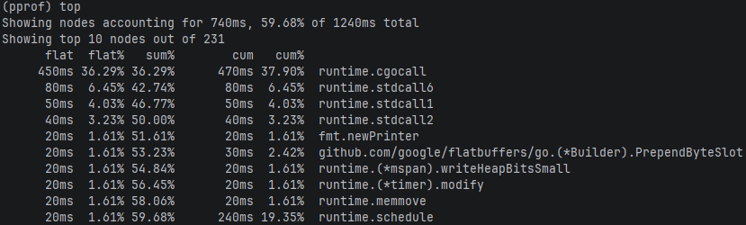

### CUP使用情况

```shell
# 默认采集30秒的CPU数据
go tool pprof http://localhost:6060/debug/pprof/profile
```

执行以上命令后，会进入终端，通过再终端中执行命令来分析数据。终端中的命令如下

- top

  显示占用资源最多的函数列表， 默认展示前10条，可以再top后面跟数字来指定展示前几条，例如‘top3’表示展示占用资源最多的前3个函数。
  输出的数据示例如下：
  

  下面将逐条拆解所展示的内容：
  `Showing nodes accounting for 740ms, 59.68% of 1240ms total
Showing top 10 nodes out of 231`表明在采样期间（通常为 30 秒），CPU 总共消耗了 1240ms 的时间。其中，59.68% 的时间（即 740ms）集中在前 10 个最耗时的函数上。

表格中的每一列的含义

|列名|含义|示例解释|
|----|----|-------|
|flat|该函数自身代码消耗的 CPU 时间（不包括它调用的其他函数）。|runtime.cgocall 自身消耗了 450ms。|
|flat%|flat 时间占总采样时间 (1240ms) 的百分比。|450 / 1240 ≈ 36.29%，说明它自己就占了超过三分之一的 CPU 时间。|
|sum%|从第一行到当前行的 flat% 的累计百分比。|前两行的累计 flat% 是 36.29% + 6.45% = 42.74%。|
|cum|该函数累计消耗的 CPU 时间，包含它调用的所有子函数。|runtime.cgocall 累计消耗了 470ms，其中 20ms 花在了它调用的其他函数上。|
|cum%|cum 时间占总采样时间的百分比。|例如第一行：470 / 1240 ≈ 37.90%。|
|最后一列|调用的函数|本实例中最耗时的函数为runtime.cgocall|

- list

如果需要进一步分析函数中是各行代码的耗时时间，可以继续使用命令<font color=red>list <函数名></font>，例如以下示例中entersyscall()耗时450ms, exitsyscall()耗时20ms。
这说明性能瓶颈在`entersyscall()`中, 即在准备进入C代码的准备工作中耗时较多。如果是C代码本身耗时较多，则应是`errno := asmcgocall(fn, arg)`这行代码耗时较多，但本示例中这里没有怎么耗时；因此性能瓶颈就在频繁调用C代码，在进入C代码调用的准备工作上花了较多的时间, 优化方向为减少cgo代码的调用。

```shell
(pprof) list runtime.cgocall
Total: 1.24s
ROUTINE ======================== runtime.cgocall in C:\Program Files\Go\src\runtime\cgocall.go
     450ms      470ms (flat, cum) 37.90% of Total
         .          .    134:func cgocall(fn, arg unsafe.Pointer) int32 {
         .          .    135:   if !iscgo && GOOS != "solaris" && GOOS != "illumos" && GOOS != "windows" {
         .          .    136:           throw("cgocall unavailable")
         .          .    137:   }
         .          .    138:
         .          .    139:   if fn == nil {
         .          .    140:           throw("cgocall nil")
         .          .    141:   }
         .          .    142:
         .          .    143:   if raceenabled {
         .          .    144:           racereleasemerge(unsafe.Pointer(&racecgosync))
         .          .    145:   }
         .          .    146:
         .          .    147:   mp := getg().m
         .          .    148:   mp.ncgocall++
         .          .    149:
         .          .    150:   // Reset traceback.
         .          .    151:   mp.cgoCallers[0] = 0
         .          .    152:
         .          .    153:   // Announce we are entering a system call
         .          .    154:   // so that the scheduler knows to create another
         .          .    155:   // M to run goroutines while we are in the
         .          .    156:   // foreign code.
         .          .    157:   //
         .          .    158:   // The call to asmcgocall is guaranteed not to
         .          .    159:   // grow the stack and does not allocate memory,
         .          .    160:   // so it is safe to call while "in a system call", outside
         .          .    161:   // the $GOMAXPROCS accounting.
         .          .    162:   //
         .          .    163:   // fn may call back into Go code, in which case we'll exit the
         .          .    164:   // "system call", run the Go code (which may grow the stack),
         .          .    165:   // and then re-enter the "system call" reusing the PC and SP
         .          .    166:   // saved by entersyscall here.
     450ms      450ms    167:   entersyscall()
         .          .    168:
         .          .    169:   // Tell asynchronous preemption that we're entering external
         .          .    170:   // code. We do this after entersyscall because this may block
         .          .    171:   // and cause an async preemption to fail, but at this point a
         .          .    172:   // sync preemption will succeed (though this is not a matter
         .          .    173:   // of correctness).
         .          .    174:   osPreemptExtEnter(mp)
         .          .    175:
         .          .    176:   mp.incgo = true
         .          .    177:   // We use ncgo as a check during execution tracing for whether there is
         .          .    178:   // any C on the call stack, which there will be after this point. If
         .          .    179:   // there isn't, we can use frame pointer unwinding to collect call
         .          .    180:   // stacks efficiently. This will be the case for the first Go-to-C call
         .          .    181:   // on a stack, so it's preferable to update it here, after we emit a
         .          .    182:   // trace event in entersyscall above.
         .          .    183:   mp.ncgo++
         .          .    184:
         .          .    185:   errno := asmcgocall(fn, arg)
         .          .    186:
         .          .    187:   // Update accounting before exitsyscall because exitsyscall may
         .          .    188:   // reschedule us on to a different M.
         .          .    189:   mp.incgo = false
         .          .    190:   mp.ncgo--
         .          .    191:
         .          .    192:   osPreemptExtExit(mp)
         .          .    193:
         .          .    194:   // Save current syscall parameters, so m.winsyscall can be
         .          .    195:   // used again if callback decide to make syscall.
         .          .    196:   winsyscall := mp.winsyscall
         .          .    197:
         .       20ms    198:   exitsyscall()
         .          .    199:
         .          .    200:   getg().m.winsyscall = winsyscall
         .          .    201:
         .          .    202:   // Note that raceacquire must be called only after exitsyscall has
         .          .    203:   // wired this M to a P.
```

- traces

作用：查看完整的调用栈

