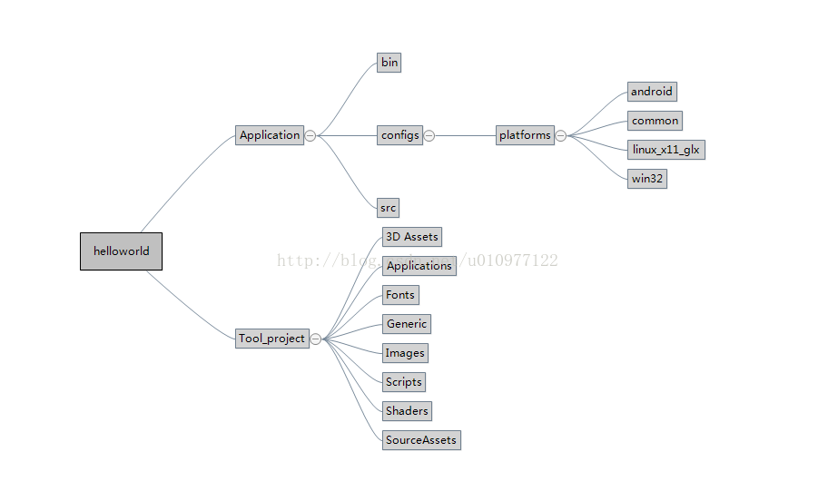

# 1 kanzi工程目录结构
**Tool_project**： 文件夹中存放的是设计师设计的工程，包含kanzi UI的工程的所有文件。
**Application**： 文件夹则为代码的工程文件夹。该文件夹下的bin文件夹存放设计师导出的kzb文件，src文件夹存放编写的代码，config里面存放对应的vs、vc、eclipse工程文件。

UI设计师和软件工程师通过bin目录下的kzb资源文件联系起来。UI设计师通过kanzi studio设计工具导出kzb资源文件到该目录，而软件工程师使用engine读取该kzb文件创建界面，监听点击事件，传递数据，实现具体功能。

# 2 Application下的目录结构
## 2.1 Application-->configs
Application-->configs-->platforms目录下存放的是不同平台的编译脚本，运行它们可以产生运行在不同平台的目标文件。
## 2.2 Application-->src
Application-->src是代码路径，其中Application-->src-->executable下是项目的逻辑代码入口，由一个继承自Application或ExampleApplication的类中来实现程序逻辑。