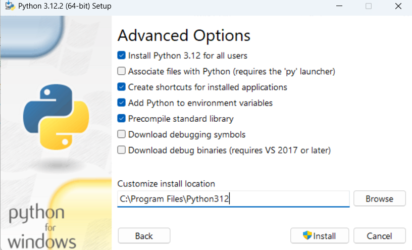
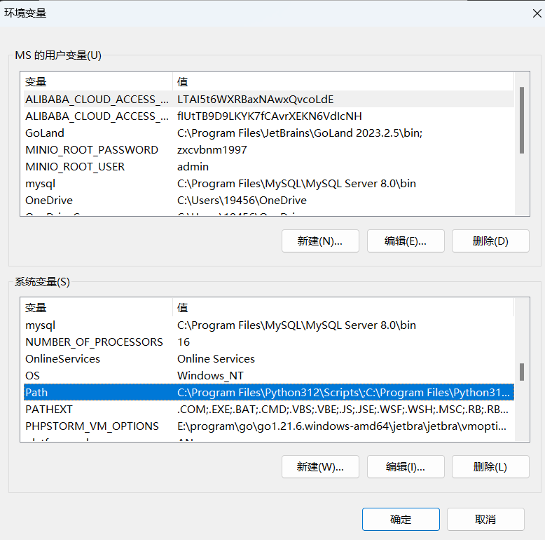
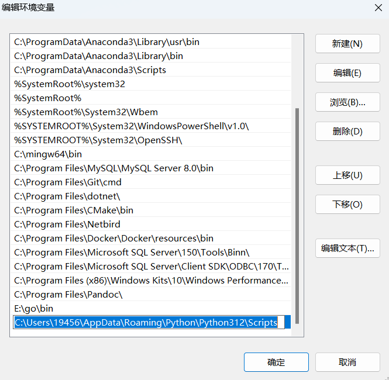

[toc]

`pandoc 1_python环境安装.md -o output.docx` 将md文档转化位word文档


# 1 安装python开发环境

1. 前往python官网`https://www.python.org/`
2. 点击下载python, 如下图（不同电脑请选择对应电脑的下载选项）

3. 下载需要的版本的python，这里我们下载了python 3.12.6 windows 64位版本的python (python-3.12.6 amd64.exe)，这是一个python环境的安装程序
4. 运行下载好的python环境安装程序，我们把如下的选项勾选, 然后点击Customize installation进行自定义安装

5. 将如下选项勾选上，然后点击Next

6. 然后勾选如下选项，然后点击Install开始进行安装python环境

7. 到这里python环境就算安装完毕，接下来可以验证一下是否安装成功。打开cmd命令行（Win+R 然后输入cmd打开）， 然后输入 `python --version`, 如果出现如下显示则表示python环境安装成功。这个命令是用于查看python环境的版本。


## 1.1 将pip添加到系统环境变量中

添加环境变量，可以让后续在安装python的第三方包时变得更方便

1. 打开设置，搜索`高级系统设置`，点击后会弹框如下：


2. 点击`环境变量`


3. 在下面系统变量栏目中找到`Path`那一行，然后双击


4. 点击新建来创建一个新的环境变量


5. 然后将pip程序所在的目录输入底部的输入框中，一般pip安装的目录在`C:\Users\<你的用户名>\AppData\Roaming\Python\Python312\Scripts`， 把`<你的用户名>`这里替换成你自己的用户名


6. 之后一直点`确认`按钮返回，然后重启电脑，环境变量配置就生效了

# 2 开发工具安装
在`https://www.jetbrains.com/pycharm/download/?section=windows`中下载PyCharm社区版 <font color=grey>（免费）</font>


在安装的时候选择将如下选项勾选上


# 3 创建第一个python程序
1. 打开pycharm
2. 点击New Project创建一个新的工程

3. 在下图的1处选想要把工程创建在哪个目录下（后面我们写的python脚本也在这个目录下）， 然后点击2处的Create来创建工程

4. 创建好工程后，接下来我们需要创建一个python文件来编写我们的python脚本。
点击选中1，然后右击，一次点击2和3来创建一个python脚本文件

5. 在弹框中输入我们希望创建的python脚本文件的名称, 输入框下面的选项选择`Python file`以表明我们希望创建的是一个python文件

6. 接下来在我们创建的python脚本文件中输入以下代码
```python
print("hello 小严同学")
```
然后点击如图所示的运行按钮来运行我们写的脚本


点击运行后，我们会在窗口的底部看到运行结果


接下就可以快乐地学习python语法啦！


