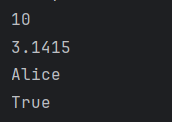

[toc]
`pandoc 2_基本语法.md -o output.docx`

# 1 变量和类型
## 1.1 什么是变量？

在 Python 中，**变量**就像一个容器，用来存储我们想要用的数据。可以把它想象成家里的抽屉，里面可以放东西，比如纸、笔、钥匙等等。每次我们需要用这些东西时，只要打开对应的抽屉就可以了。

## 1.2 变量的作用：
- 方便存储数据
- 可以重复使用这些数据
- 程序需要操作这些数据时，可以通过变量很方便地找到它们

## 1.3 变量的命名

给变量起名字就像给抽屉贴标签。我们给变量起一个合适的名字，这样以后我们就知道这个变量里存放了什么。变量名可以由字母、数字和下划线组成，但不能以数字开头，而且尽量用有意义的名字。

比如，我们可以创建一个变量叫 `age` 来存储一个人的年龄：

```python
age = 25
```

这个语句表示我们把 25 存储在 `age` 这个变量里。

## 1.4 什么是数据类型？

不同的变量可以存储不同类型的“东西”，这些“东西”我们称之为数据。数据有不同的**类型**，就像我们有不同种类的抽屉分别放置不同的东西一样。我们最常用的几种类型包括：

- **整数（int）**：像 1, 2, 100 这些数字，没有小数点。
- **浮点数（float）**：像 3.14, 2.5 这样的有小数点的数字。
- **字符串（str）**：一串文本，比如 "Hello", "Python" 这样的内容。
- **布尔值（bool）**：只有两个值，`True`（真）或 `False`（假），用来表示条件是否成立。

## 1.5 常见的数据类型

**整数（int）**

整数是一种没有小数点的数字。比如我们在计数时用到的 1, 2, 100 都是整数。在 Python 中，我们可以把一个整数赋值给变量：

```python
my_age = 25  # 这里 25 是一个整数
```

**浮点数（float）**

浮点数是带小数点的数字，比如 3.14 或 2.5。它们用来表示那些不完全是整数的数字。在 Python 中，创建浮点数的变量可以这样写：

```python
pi = 3.14  # 这里 3.14 是一个浮点数
```

**字符串（str）**

字符串就是用来表示文本的，比如 "Hello, world!"。字符串通常用引号括起来，无论是单引号（`'`）还是双引号（`"`）都可以。

```python
name = "Alice"  # 这里 "Alice" 是一个字符串
```

**布尔值（bool）**

布尔值只有两种可能：`True`（真）或 `False`（假）。它们常用于判断条件，比如判断一个人是否成年：

```python
is_adult = True  # 这里 True 是布尔值
```

## 1.6 变量和类型的关系

当我们给一个变量赋值时，Python 自动会知道这个变量的数据类型。比如：

```python
number = 10       # 这是一个整数
price = 5.99      # 这是一个浮点数
greeting = "Hi"   # 这是一个字符串
is_sunny = False  # 这是一个布尔值
```

在这里：
- `number` 是整数类型
- `price` 是浮点数类型
- `greeting` 是字符串类型
- `is_sunny` 是布尔类型

## 1.7 如何查看变量的类型？

Python 提供了一个函数 `type()`，可以帮助我们查看某个变量的数据类型。举个例子：

```python
x = 10
print(type(x))  # 输出：<class 'int'>
```

上面的代码会输出 `<class 'int'>`，表示变量 `x` 是一个整数类型。

## 1.8 类型转换

有时候我们需要把一种类型的数据转换成另一种类型。比如，我们可能想把一个数字变成字符串，或者把字符串变成数字。这在 Python 中称为**类型转换**。

- **整数转浮点数**：我们可以把一个整数转换为浮点数：
  ```python
  x = 10
  y = float(x)  # y 现在是 10.0，一个浮点数
  ```

- **浮点数转整数**：我们可以把一个浮点数转换为整数，注意这会舍弃小数部分：
  ```python
  z = 5.99
  a = int(z)  # a 现在是 5，舍弃了小数部分
  ```

- **数字转字符串**：我们可以把一个数字转换成字符串：
  ```python
  number = 123
  text = str(number)  # text 现在是 "123"，一个字符串
  ```

## 1.9 小结

- **变量**：是一个用来存储数据的容器。
- **数据类型**：不同的变量可以存储不同类型的数据，如整数、浮点数、字符串、布尔值等。
- **`type()` 函数**：可以用来查看变量的数据类型。
- **类型转换**：可以把一种类型的数据转换为另一种类型，比如整数转浮点数、数字转字符串等。

掌握这些基础知识后，我们就可以开始编写简单的 Python 程序并使用变量来存储和操作数据了！

## 1.10 代码示例
```python
# 变量定义
x = 10            # 整型
y = 3.14          # 浮点型(小数)
name = "Alice"    # 字符串
is_active = True  # 布尔型（布尔类型的变量只有两个值 True或者False）

# 打印变量值
print(x)
print(y)
print(name)
print(is_active)
```

当我们运行这段代码时会得到输出


# 2 基本运算

## 2.1 什么是运算？

在 Python 中，**运算**就是对数据进行计算或处理。就像我们在生活中会用加减乘除去做数学题一样，编程中也可以用运算符来进行各种数学操作。运算的结果会是一个新的数据。

## 2.2 常见的运算符

在 Python 中，最常见的运算符有以下几种：

- **加法（+）**：把两个数相加。
- **减法（-）**：一个数减去另一个数。
- **乘法（*）**：两个数相乘。
- **除法（/）**：一个数除以另一个数，得到浮点数。
- **整除（//）**：两个数相除，但只取整数部分。
- **取余（%）**：取两个数相除后的余数。
- **指数（**）**：计算一个数的幂次方。

## 2.3 基本运算符示例

**加法（+）**
加法运算是将两个数相加，例如：

```python
x = 5
y = 3
result = x + y  # 5 + 3 = 8
print(result)   # 输出：8
```

**减法（-）**
减法运算是将一个数从另一个数中减去：

```python
x = 5
y = 3
result = x - y  # 5 - 3 = 2
print(result)   # 输出：2
```

**乘法（*）**
乘法运算是将两个数相乘：

```python
x = 5
y = 3
result = x * y  # 5 * 3 = 15
print(result)   # 输出：15
```

** 除法（/）**
除法运算是将一个数除以另一个数，结果会是浮点数：

```python
x = 5
y = 2
result = x / y  # 5 ÷ 2 = 2.5
print(result)   # 输出：2.5
```

**整除（//）**
整除运算只保留除法的整数部分，舍弃小数部分：

```python
x = 5
y = 2
result = x // y  # 5 // 2 = 2
print(result)    # 输出：2
```

**取余（%）**
取余运算得到两个数相除后的余数：

```python
x = 5
y = 2
result = x % y  # 5 % 2 = 1 （5 除以 2 余下 1）
print(result)   # 输出：1
```

**指数运算（**）**
指数运算是计算一个数的幂次方，例如：

```python
x = 2
y = 3
result = x ** y  # 2 的 3 次方 = 8
print(result)    # 输出：8
```

## 2.4 运算符的优先级

在数学中，我们有计算顺序的规则，比如先做乘法再做加法。在 Python 中，运算符也有优先级。

- **先计算乘法和除法**，再计算加法和减法。
- 可以使用 **括号** `()` 来改变计算顺序，括号里的运算会先进行。

例如：

```python
x = 2 + 3 * 4  # 按优先级，先算 3 * 4，再加 2，结果是 14
print(x)  # 输出：14

x = (2 + 3) * 4  # 用括号改变顺序，先算 2 + 3，再乘以 4，结果是 20
print(x)  # 输出：20
```

## 2.5 赋值运算

**赋值运算**是给变量一个值，比如 `=` 就是赋值运算符。

```python
x = 10  # 把 10 赋值给变量 x
```

除此之外，Python 还有一些**简写的赋值运算**，可以同时进行运算和赋值：

- `x += 5`：等同于 `x = x + 5`
- `x -= 3`：等同于 `x = x - 3`
- `x *= 2`：等同于 `x = x * 2`
- `x /= 2`：等同于 `x = x / 2`

## 2.6 示例

**示例 1：加减乘除**

```python
a = 10
b = 3

# 加法
print(a + b)  # 输出：13

# 减法
print(a - b)  # 输出：7

# 乘法
print(a * b)  # 输出：30

# 除法
print(a / b)  # 输出：3.3333333333333335
```

**示例 2：整除、取余、指数**

```python
a = 10
b = 3

# 整除
print(a // b)  # 输出：3

# 取余
print(a % b)  # 输出：1

# 指数
print(a ** b)  # 输出：1000
```

**示例 3：运算符优先级**

```python
x = 2 + 3 * 4  # 先算 3 * 4，再加 2
print(x)  # 输出：14

x = (2 + 3) * 4  # 先算括号里的 2 + 3，然后乘以 4
print(x)  # 输出：20
```

## 2.7 总结

- Python 提供了加、减、乘、除、整除、取余、指数等常用运算符。
- 运算符的计算顺序可以通过优先级来决定，括号可以改变默认的优先级。
- 赋值运算可以把运算结果存储到变量中，Python 还提供了简写形式的赋值运算。

这些基本运算是编写 Python 程序的基础，通过理解它们，你可以开始在程序中处理和计算各种数据。

# 3 字符串操作

## 3.1 什么是字符串？

在 Python 中，**字符串（String, 简称 str）** 是用来表示一段文本的。字符串是由一系列字符组成的，比如字母、数字、符号等。我们可以用单引号 `' '` 或双引号 `" "` 把一段文本包起来，告诉 Python 这是一串字符串。

**示例：**

```python
name = "Alice"  # 使用双引号
greeting = 'Hello'  # 使用单引号
```

无论是使用单引号还是双引号，结果都是一样的，它们都创建了字符串。

## 3.2 字符串的拼接

在生活中，我们可能需要将几段文字合并在一起。在 Python 中，我们可以使用加号 `+` 来拼接多个字符串，就像把几段话连在一起一样。

**示例：**

```python
first_name = "Alice"
last_name = "Smith"
full_name = first_name + " " + last_name  # 使用加号拼接
print(full_name)  # 输出：Alice Smith
```

在这个例子中，`first_name` 和 `last_name` 是两个独立的字符串，通过加号 `+` 拼接，并在中间加了一个空格 `" "`。

## 3.3 字符串重复

如果想让字符串重复多次，可以用乘号 `*`。就像多次写一样的句子。

**示例：**

```python
word = "Hello"
result = word * 3  # 将 "Hello" 重复 3 次
print(result)  # 输出：HelloHelloHello
```

## 3.4 字符串长度

有时我们想知道字符串有多长，也就是字符串中有多少个字符。我们可以使用 `len()` 函数来获取字符串的长度。

**示例：**

```python
message = "Hello, Python!"
length = len(message)  # 获取字符串长度
print(length)  # 输出：14
```

这里的 14 表示 `message` 这个字符串有 14 个字符，包括空格和标点符号。

## 3.5 字符串索引

**索引**是指我们可以通过数字找到字符串中的某个特定字符。在 Python 中，字符串中的每个字符都有一个位置编号，从 **0** 开始编号。比如：

- 第一个字符的位置是 0
- 第二个字符的位置是 1
- 以此类推

我们可以通过 **方括号 `[]`** 来获取某个位置的字符。

**示例：**

```python
text = "Hello"
first_char = text[0]  # 获取第 1 个字符，索引是 0
third_char = text[2]  # 获取第 3 个字符，索引是 2
print(first_char)  # 输出：H
print(third_char)  # 输出：l
```

## 3.6 字符串切片

如果我们想获取字符串中的一部分，称为**切片（slice）**。我们可以通过指定字符串的开始和结束位置来获取其中的一段，格式是 `字符串[开始:结束]`。

**示例：**

```python
message = "Hello, Python!"
substring = message[0:5]  # 获取从位置 0 到 5 之间的字符（不包括 5）
print(substring)  # 输出：Hello
```

这里，我们获取了 `message` 的前 5 个字符，从第 0 位开始，到第 4 位结束（注意：结束位置不包括最后一位）。

**如果我们想从头开始获取到某个位置，可以省略开始的位置：**

```python
message = "Hello, Python!"
substring = message[:5]  # 从头开始到第 5 位（不包括 5）
print(substring)  # 输出：Hello
```

**如果我们想从某个位置获取到末尾，可以省略结束的位置：**

```python
message = "Hello, Python!"
substring = message[7:]  # 从第 7 位开始到末尾
print(substring)  # 输出：Python!
```

## 3.7 字符串中的常用操作

### 3.7.1 转换为大写或小写

- **`upper()`**：将字符串转换为全大写。
- **`lower()`**：将字符串转换为全小写。

**示例：**

```python
text = "Hello"
print(text.upper())  # 输出：HELLO
print(text.lower())  # 输出：hello
```

### 3.7.2 去掉字符串两边的空格

- **`strip()`**：去掉字符串两边的空格。
  
**示例：**

```python
text = "   Hello   "
cleaned_text = text.strip()  # 去掉两边的空格
print(cleaned_text)  # 输出：Hello
```

### 3.7.3 替换字符串中的内容

- **`replace(旧字符, 新字符)`**：将字符串中的某些字符替换成新的字符。

**示例：**

```python
message = "Hello, World!"
new_message = message.replace("World", "Python")
print(new_message)  # 输出：Hello, Python!
```

### 3.7.4 查找字符串

- **`find(字符)`**：查找某个字符或子字符串在字符串中的位置，返回索引。如果找不到，返回 `-1`。

**示例：**

```python
message = "Hello, World!"
position = message.find("World")
print(position)  # 输出：7
```

### 3.7.8. 字符串格式化

有时候我们需要把变量插入到字符串中，比如构建一段个性化的消息。我们可以使用**格式化字符串**来实现。

**使用 `f` 字符串**

在 Python 中，使用 `f` 字符串非常方便。只要在字符串前加上 `f`，然后在 `{}` 里面写上变量名，就可以把变量的值插入到字符串中。

**示例：**

```python
name = "Alice"
age = 25
message = f"My name is {name} and I am {age} years old."
print(message)  # 输出：My name is Alice and I am 25 years old.
```

## 3.8 常见的字符串操作小结

- **拼接字符串**：用加号 `+` 将两个字符串合并。
- **获取长度**：用 `len()` 函数获取字符串的字符数。
- **索引和切片**：用方括号 `[]` 来获取某个字符或一段字符串。
- **常用函数**：如 `upper()` 转大写、`lower()` 转小写、`strip()` 去空格、`replace()` 替换字符、`find()` 查找字符。
- **格式化字符串**：用 `f` 字符串将变量值插入到字符串中。

## 3.9 总结

字符串是 Python 编程中非常常见的数据类型。通过学习字符串的基本操作，我们可以处理各种文本数据，从拼接文本到查找、替换和格式化。这些操作是编写复杂程序的基础，通过掌握它们，我们可以更轻松地操控文字信息。

# 4 列表操作

## 4.1 什么是列表？

在 Python 中，**列表（List）** 是一种可以存储多个数据的容器。你可以把它想象成一个可以装很多东西的盒子。盒子里的每一样东西可以是数字、字符串，甚至是其他列表。列表中的每一项都叫做**元素**，这些元素可以是任何类型的，而且一个列表中可以有不同类型的数据。

列表用方括号 `[]` 来表示，里面的元素用逗号 `,` 隔开。

**示例：**

```python
# 一个存储数字的列表
numbers = [1, 2, 3, 4, 5]

# 一个存储字符串的列表
fruits = ["apple", "banana", "cherry"]

# 一个存储混合类型的列表
mixed = [1, "apple", 3.14, True]
```

## 4.2 列表的特点

- **有序**：列表中的元素是按顺序存储的，每个元素都有自己的位置。
- **可变**：列表中的元素可以修改、添加或删除。
- **可以包含不同类型的数据**：列表中可以同时存储数字、字符串、布尔值等各种类型的数据。

## 4.3 列表的常见操作

### 4.3.1 访问列表中的元素

和字符串一样，列表中的每个元素也有一个位置编号（**索引**），从 0 开始。我们可以通过索引来访问列表中的某个元素。

**示例：**

```python
fruits = ["apple", "banana", "cherry"]

# 访问第一个元素
print(fruits[0])  # 输出：apple

# 访问第二个元素
print(fruits[1])  # 输出：banana
```

### 4.3.2 修改列表中的元素

因为列表是**可变的**，所以我们可以直接通过索引修改列表中的某个元素。

**示例：**

```python
fruits = ["apple", "banana", "cherry"]

# 修改第二个元素
fruits[1] = "blueberry"
print(fruits)  # 输出：["apple", "blueberry", "cherry"]
```

### 4.3.3 添加元素到列表

我们可以用 **`append()`** 函数在列表的末尾添加一个新元素。

**示例：**

```python
fruits = ["apple", "banana"]

# 在列表末尾添加 "cherry"
fruits.append("cherry")
print(fruits)  # 输出：["apple", "banana", "cherry"]
```

### 4.3.4 删除列表中的元素

- **`remove(元素)`**：删除列表中第一个匹配的元素。
- **`pop(索引)`**：删除指定位置的元素，并返回该元素。如果不指定索引，会默认删除最后一个元素。

**示例：**

```python
fruits = ["apple", "banana", "cherry"]

# 删除 "banana"
fruits.remove("banana")
print(fruits)  # 输出：["apple", "cherry"]

# 删除并返回最后一个元素
last_fruit = fruits.pop()
print(last_fruit)  # 输出：cherry
print(fruits)  # 输出：["apple"]
```

### 4.3.5 列表长度

使用 **`len()`** 函数可以获取列表中元素的数量。

**示例：**

```python
fruits = ["apple", "banana", "cherry"]
print(len(fruits))  # 输出：3
```

### 4.3.6 列表切片

我们可以像操作字符串那样，获取列表中的一部分（称为**切片**）。切片格式是 `列表[开始:结束]`，不包括结束位置的元素。

**示例：**

```python
fruits = ["apple", "banana", "cherry", "date"]

# 获取前两个元素
print(fruits[0:2])  # 输出：["apple", "banana"]

# 获取从第三个到最后的元素
print(fruits[2:])  # 输出：["cherry", "date"]
```

### 4.3.7 列表排序

我们可以使用 **`sort()`** 函数将列表中的元素按顺序排列。默认是从小到大排序，如果想要从大到小排序，可以设置参数 `reverse=True`。

**示例：**

```python
numbers = [5, 2, 9, 1, 7]

# 从小到大排序
numbers.sort()
print(numbers)  # 输出：[1, 2, 5, 7, 9]

# 从大到小排序
numbers.sort(reverse=True)
print(numbers)  # 输出：[9, 7, 5, 2, 1]
```

### 4.3.8 检查元素是否在列表中

使用 **`in`** 关键字可以检查某个元素是否在列表中。

**示例：**

```python
fruits = ["apple", "banana", "cherry"]

# 检查 "banana" 是否在列表中
print("banana" in fruits)  # 输出：True

# 检查 "grape" 是否在列表中
print("grape" in fruits)  # 输出：False
```

## 4.4 列表的循环

我们可以使用 **`for`** 循环来遍历列表中的每个元素。遍历的意思是依次取出列表中的每一个元素进行操作。

**示例：**

```python
fruits = ["apple", "banana", "cherry"]

# 遍历列表中的每个元素
for fruit in fruits:
    print(fruit)

# 输出：
# apple
# banana
# cherry
```

## 4.5 嵌套列表

在列表中，我们还可以存放其他的列表。这就形成了**嵌套列表**，它类似于一个二维表格，或者说列表中的每个元素是另一个列表。

**示例：**

```python
matrix = [[1, 2, 3], [4, 5, 6], [7, 8, 9]]

# 访问第一行的第二个元素
print(matrix[0][1])  # 输出：2
```

## 4.6 列表的常见操作总结

- **创建列表**：用方括号 `[]` 创建列表。
- **访问元素**：通过索引 `[]` 访问列表中的元素，索引从 0 开始。
- **修改元素**：通过索引修改列表中的元素。
- **添加元素**：用 `append()` 在列表末尾添加元素。
- **删除元素**：用 `remove()` 删除特定元素，或用 `pop()` 删除并返回指定位置的元素。
- **获取列表长度**：用 `len()` 获取列表中元素的数量。
- **切片**：用 `列表[开始:结束]` 获取列表中的一部分。
- **排序**：用 `sort()` 对列表中的元素进行排序。
- **检查元素是否存在**：用 `in` 检查某个元素是否在列表中。

列表是 Python 中非常重要的一种数据结构，适用于存储多个数据的情况。掌握列表的创建、修改、删除、切片和排序等操作后，你可以更轻松地处理大量数据，并在编写程序时更加高效灵活。通过列表，我们可以组织和管理各种信息，比如学生的成绩、购物清单、用户的输入等等。

# 5 条件语句

## 5.1 什么是条件语句？

在生活中，我们经常根据不同的情况做出不同的决定，比如“如果今天下雨，我就带伞；如果不下雨，我就不带伞”。在编程中，**条件语句**让计算机根据条件的真假来决定执行哪些代码，哪些不执行。

Python 中的条件语句主要有 `if`、`elif` 和 `else`。它们允许我们编写根据不同情况运行的代码。

## 5.2 `if` 语句

**`if` 语句**用于检查某个条件是否为真。如果条件为真，Python 就会执行对应的代码；如果条件为假，Python 就跳过这些代码。

**结构：**

```python
if 条件:
    执行的代码
```

当**条件**为真时，缩进的代码会被执行。

**示例：**

```python
age = 18

if age >= 18:
    print("你已经成年了")
```

在这个例子中，`age >= 18` 是一个条件。如果 `age` 的值大于或等于 18，那么 Python 会执行 `print("你已经成年了")`，输出 "你已经成年了"。

## 5.3. `else` 语句

**`else` 语句**表示“否则”。它和 `if` 语句配合使用，处理当 `if` 条件为假的情况。

**结构：**

```python
if 条件:
    执行的代码
else:
    其他情况下执行的代码
```

当**条件**为假时，`else` 后面的代码会被执行。

**示例：**

```python
age = 16

if age >= 18:
    print("你已经成年了")
else:
    print("你还未成年")
```

在这个例子中，`age` 的值是 16，`age >= 18` 为假，所以 Python 执行了 `else` 下面的代码，输出 "你还未成年"。

## 5.4 `elif` 语句

有时我们有多个条件需要判断，这时可以用 **`elif`**（"else if" 的缩写）。`elif` 用于检查另一个条件，如果前面的 `if` 条件为假，它会继续检查 `elif` 的条件。

**结构：**

```python
if 条件1:
    执行的代码
elif 条件2:
    执行的代码
else:
    其他情况下执行的代码
```

当 `if` 条件为假时，Python 会检查 `elif` 条件。如果 `elif` 也为假，才会执行 `else` 下面的代码。

**示例：**

```python
age = 16

if age >= 18:
    print("你已经成年了")
elif age >= 13:
    print("你是青少年")
else:
    print("你是小孩子")
```

在这个例子中，`age` 是 16，`age >= 18` 为假，所以 Python 检查下一个条件 `age >= 13`。由于 `age` 大于 13，所以输出 "你是青少年"。

## 5.5 条件的比较运算符

在条件语句中，我们常常使用**比较运算符**来比较两个值，判断条件是真还是假。常见的比较运算符有：

- **`==`**：检查两个值是否相等。
- **`!=`**：检查两个值是否不相等。
- **`>`**：检查左边的值是否大于右边的值。
- **`<`**：检查左边的值是否小于右边的值。
- **`>=`**：检查左边的值是否大于或等于右边的值。
- **`<=`**：检查左边的值是否小于或等于右边的值。

**示例：**

```python
x = 10
y = 20

# 比较两个数是否相等
if x == y:
    print("x 和 y 相等")
else:
    print("x 和 y 不相等")
```

## 5.6 逻辑运算符

有时我们需要同时检查多个条件。Python 提供了**逻辑运算符**来组合多个条件：

- **`and`**：当所有条件都为真时，整个表达式才为真。
- **`or`**：只要有一个条件为真，整个表达式就为真。
- **`not`**：将条件的真假颠倒（如果条件为真，则返回假，反之亦然）。

**示例：**

```python
x = 15

# 同时满足两个条件
if x > 10 and x < 20:
    print("x 在 10 和 20 之间")

# 满足任意一个条件
if x < 10 or x > 20:
    print("x 在 10 和 20 之外")
else:
    print("x 在 10 和 20 之间")
```

在这个例子中，`x` 是 15，所以 `x > 10 and x < 20` 为真，输出 "x 在 10 和 20 之间"。

## 5.7. 嵌套的条件语句

我们可以把一个条件语句嵌套在另一个条件语句中。也就是说，在 `if`、`elif` 或 `else` 语句内部可以再放一个条件语句。

**示例：**

```python
age = 20
gender = "female"

if age >= 18:
    if gender == "female":
        print("你是一位成年女性")
    else:
        print("你是一位成年男性")
else:
    print("你还未成年")
```

在这个例子中，我们首先检查 `age` 是否大于等于 18。如果为真，再检查 `gender` 是 "female" 还是 "male"，并分别输出不同的内容。

## 5.8 总结

- **`if` 语句**：用于检查条件是否为真。如果为真，执行相应的代码。
- **`else` 语句**：处理 `if` 条件为假的情况，执行其他代码。
- **`elif` 语句**：用于检查另一个条件。
- **比较运算符**和**逻辑运算符**可以帮助我们组合多个条件。
- 条件语句可以嵌套，构造复杂的决策逻辑。

通过这些条件语句，你可以编写出更智能、灵活的程序，让计算机根据不同的输入和情况做出不同的反应。

# 6 循环语句

## 6.1 什么是循环语句？

在日常生活中，我们常常需要重复做一些事情，比如每周上班五天，或每天刷牙两次。在编程中，**循环语句**允许我们重复执行某些代码，直到满足某个条件为止。这对于需要多次执行相同操作的场景非常有用。

Python 中有两种主要的循环语句：`for` 循环和 `while` 循环。

## 6.2 `for` 循环

**`for` 循环**用于遍历（即逐一访问）某个序列（例如列表、字符串、元组、字典等）。在每次迭代中，Python 会将序列中的下一个元素赋给循环变量，并执行循环体中的代码。

**结构：**

```python
for 循环变量 in 序列:
    执行的代码
```

**示例：**

```python
fruits = ["apple", "banana", "cherry"]

for fruit in fruits:
    print(fruit)
```

在这个例子中，`fruits` 是一个列表，包含三个字符串。`for` 循环遍历列表中的每个元素，并将当前元素赋值给变量 `fruit`，然后执行 `print(fruit)`。输出如下：

```
apple
banana
cherry
```

**使用 `range()` 函数**

有时我们只需要循环一定次数，而不关心循环变量的值。可以用 **`range()`** 函数生成一系列数字，帮助我们实现这种循环。

**结构：**

```python
for i in range(次数):
    执行的代码
```

**示例：**

```python
# 输出 0 到 4
for i in range(5):
    print(i)
```

在这个例子中，`range(5)` 生成一个序列 `[0, 1, 2, 3, 4]`，`for` 循环依次将这些数字赋给变量 `i`，然后执行 `print(i)`。输出如下：

```
0
1
2
3
4
```

## 6.3 `while` 循环

**`while` 循环**用于反复执行某段代码，直到指定条件为假。与 `for` 循环不同，`while` 循环并不依赖于序列，而依赖于条件。

**结构：**

```python
while 条件:
    执行的代码
```

只要**条件**为真，`while` 循环就会执行循环体中的代码。

**示例：**

```python
count = 0

while count < 5:
    print(count)
    count += 1  # 增加 count 的值
```

在这个例子中，`count` 初始为 0。只要 `count < 5` 为真，Python 就会执行循环体中的代码，输出 `count` 的当前值，并将 `count` 加 1。输出如下：

```
0
1
2
3
4
```

## 6.4 循环控制语句

有时在循环中我们需要提前终止循环，或跳过某次迭代。这时可以使用循环控制语句：`break` 和 `continue`。

### 6.4.1 break

**`break`** 用于立即退出循环，不再执行后续的循环体代码。

**示例：**

```python
for i in range(5):
    if i == 3:
        break  # 退出循环
    print(i)
```

在这个例子中，当 `i` 等于 3 时，`break` 语句会终止循环，输出如下：

```
0
1
2
```

### 6.4.2 continue

**`continue`** 用于跳过当前迭代的剩余代码，立即开始下一次迭代。

**示例：**

```python
for i in range(5):
    if i == 3:
        continue  # 跳过当前循环
    print(i)
```

在这个例子中，当 `i` 等于 3 时，`continue` 语句会跳过当前迭代，直接进行下一次迭代，输出如下：

```
0
1
2
4
```

## 6.5 `else` 与循环

在 Python 中，循环语句后面可以跟一个 `else` 语句。对于 `for` 循环和 `while` 循环，`else` 中的代码在循环正常结束时执行，而不是通过 `break` 语句中断的情况。

**示例：**

```python
for i in range(5):
    print(i)
else:
    print("循环正常结束")
```

在这个例子中，循环正常完成后，会执行 `else` 中的代码，输出如下：

```
0
1
2
3
4
循环正常结束
```

如果在循环中使用 `break` 语句强制退出循环，则 `else` 部分不会执行。

**示例说明：**

```python
for i in range(5):
    if i == 3:
        break  # 退出循环
    print(i)
else:
    print("循环正常结束")
```

在这个例子中，当 `i` 等于 3 时，`break` 语句使循环终止，`else` 部分的代码不会执行，输出如下：

```
0
1
2
```

## 6.6 嵌套循环

和条件语句一样，循环也可以嵌套。在一个循环中包含另一个循环，称为**嵌套循环**。

**示例：**

```python
for i in range(3):
    for j in range(2):
        print(f"i={i}, j={j}")
```

在这个例子中，外层循环和内层循环分别运行，输出如下：

```
i=0, j=0
i=0, j=1
i=1, j=0
i=1, j=1
i=2, j=0
i=2, j=1
```

## 6.7 总结

- **`for` 循环**：用于遍历序列（列表、字符串等）中的每个元素。
- **`while` 循环**：反复执行代码，直到条件为假。
- **`break`**：用于立即退出循环。
- **`continue`**：用于跳过当前迭代，直接开始下一次迭代。
- **`else` 与循环**：循环正常结束时执行 `else` 中的代码。
- **嵌套循环**：在一个循环中包含另一个循环。

通过掌握这些循环控制语句，你能够编写更加复杂和灵活的程序，使程序可以自动重复执行某段代码，根据不同的条件和逻辑实现各种功能。这些基础知识是编程中非常重要的组成部分，助你在编写程序时得心应手。

# 7 函数定义

## 7.1. 什么是函数？

在日常生活中，我们常常需要重复做一些事情，比如洗衣服、做饭、刷牙等。编程中也是如此，某些操作可能会多次使用，为了避免重复编写同样的代码，我们可以使用**函数**。

**函数（Function）** 就是一个组织好的、可以重复使用的代码块。通过定义函数，我们可以把代码打包起来，当需要时，只需调用（使用）这个函数即可，省去了重复编写代码的麻烦。

## 7.2. 为什么要使用函数？

- **避免重复代码**：如果一个操作需要多次执行，可以用函数封装，避免重复写代码。
- **代码更简洁易读**：把复杂的逻辑拆分成函数，代码更容易理解和维护。
- **提高代码的可复用性**：函数可以在不同地方调用，增强代码的灵活性。

## 7.3 如何定义函数？

在 Python 中，使用 **`def`** 关键字定义一个函数。函数可以接受**参数**（输入），也可以返回**结果**（输出）。

**结构：**

```python
def 函数名(参数):
    执行的代码
    return 返回值
```

**示例：**

```python
def say_hello():
    print("Hello, world!")
```

在这个例子中，我们定义了一个名为 `say_hello` 的函数，这个函数不需要参数，执行的操作就是打印 "Hello, world!"。

## 7.4 如何调用函数？

函数定义好之后，我们可以通过**调用**它来执行里面的代码。调用函数的方式是直接写出函数的名字，后面跟上括号。

**示例：**

```python
def say_hello():
    print("Hello, world!")

# 调用函数
say_hello()  # 输出：Hello, world!
```

在这里，当我们调用 `say_hello()` 时，Python 执行了函数中的代码，输出 "Hello, world!"。

## 7.5 参数和返回值

函数可以接受**参数**，也可以有**返回值**。

**参数：**

参数是我们传给函数的信息。通过参数，函数可以根据传入的数据执行不同的操作。

**示例：**

```python
def greet(name):
    print(f"Hello, {name}!")
```

在这个例子中，`greet` 函数接受一个参数 `name`，调用时需要给它传入一个名字：

```python
greet("Alice")  # 输出：Hello, Alice!
greet("Bob")    # 输出：Hello, Bob!
```

**返回值：**

函数可以返回一个**结果**，我们可以通过 **`return`** 语句将计算的结果返回给调用者。

**示例：**

```python
def add_numbers(a, b):
    return a + b
```

在这个例子中，`add_numbers` 函数接受两个参数 `a` 和 `b`，并返回它们的和。

```python
result = add_numbers(3, 5)
print(result)  # 输出：8
```

## 7.6 函数的默认参数

有时我们希望给函数的某些参数设置一个**默认值**，这样调用函数时可以不用提供所有的参数。

**示例：**

```python
def greet(name="stranger"):
    print(f"Hello, {name}!")
```

在这个例子中，`name` 参数有一个默认值 `"stranger"`，如果调用时没有提供 `name`，就会使用默认值：

```python
greet()           # 输出：Hello, stranger!
greet("Alice")    # 输出：Hello, Alice!
```

## 7.7 函数的多返回值

Python 的函数可以返回多个值。多个返回值会被打包成一个**元组**（tuple）。

**示例：**

```python
def calculate(a, b):
    sum_ = a + b
    product = a * b
    return sum_, product
```

在这个例子中，`calculate` 函数同时返回两个结果：`a + b` 和 `a * b`。

```python
result_sum, result_product = calculate(3, 5)
print(result_sum)      # 输出：8
print(result_product)  # 输出：15
```

## 7.8 函数的作用域

在函数内部定义的变量只能在函数内部使用，外部无法访问。这就是**局部变量**的概念。相反，在函数外部定义的变量称为**全局变量**，它可以在整个程序中访问。

**示例：**

```python
def my_function():
    x = 10  # x 是局部变量，只能在函数内部访问
    print(x)

my_function()  # 输出：10
print(x)       # 报错：x 未定义
```

在这个例子中，`x` 是函数内部的局部变量，函数外部无法访问。

## 7.9 嵌套函数

我们可以在一个函数内部定义另一个函数，称为**嵌套函数**。这在需要分解复杂任务时非常有用。

#### 示例：

```python
def outer_function():
    def inner_function():
        print("这是内部函数")
    
    inner_function()

outer_function()  # 输出：这是内部函数
```

在这个例子中，`inner_function` 是在 `outer_function` 内部定义的嵌套函数，只有在 `outer_function` 中才能调用它。

## 7.10. 总结

- **函数**：函数是一个可以重复使用的代码块，用于封装逻辑，避免重复代码。
- **参数**：函数可以接受输入（参数），根据不同的输入执行不同的操作。
- **返回值**：函数可以返回一个或多个结果。
- **默认参数**：函数可以为某些参数设置默认值，以便调用时不必提供所有参数。
- **局部变量和全局变量**：局部变量只在函数内部可见，全局变量则可以在整个程序中使用。
- **嵌套函数**：可以在一个函数内部定义另一个函数，方便组织复杂代码。

掌握了函数的基础概念后，你可以编写更模块化、可读性更高的代码。函数是编程中非常重要的组成部分，它使得代码的组织更加灵活高效，并且可以让代码结构更清晰易懂。

# 8 类和对象

## 8.1 什么是类和对象？

在现实世界中，我们通过分类来认识和管理事物。比如，"汽车" 是一个类，而一辆特定的汽车，比如你的汽车，就是该类的一个**对象**。编程中，我们也可以通过**类**和**对象**来组织和管理数据。

- **类**：就像一个蓝图，它定义了某种类型对象的特性和行为（属性和方法）。比如“汽车”类可以定义颜色、品牌、速度等特性，和开动、刹车等行为。
- **对象**：根据类创建出来的具体实例。你的汽车就是“汽车”类的一个具体对象。

## 8.2 为什么需要类和对象？

类和对象帮助我们用一种更接近现实的方式组织程序。通过定义类和对象，程序更易于理解和维护。比如，如果我们用类来表示“学生”，可以为每个学生创建不同的对象，这些对象可以有各自的名字、年龄和成绩等特征。

## 8.3 如何定义类？

在 Python 中，定义类使用 **`class`** 关键字。一个类通常包含**属性**（数据）和**方法**（操作）。属性是对象的特性，方法是对象可以执行的行为。

**结构：**

```python
class 类名:
    def __init__(self, 参数1, 参数2, ...):
        self.属性1 = 参数1
        self.属性2 = 参数2
    
    def 方法名(self):
        执行的代码
```

**示例：**

```python
class Dog:
    def __init__(self, name, age):
        self.name = name  # name 是狗的名字
        self.age = age    # age 是狗的年龄
    
    def bark(self):
        print(f"{self.name} is barking!")
```

在这个例子中，我们定义了一个 `Dog` 类。`__init__` 是一个特殊的方法，用来初始化每个新创建的对象。在这个类中，`name` 和 `age` 是狗的属性，`bark` 是狗的行为（方法）。

## 8.4 如何创建对象？

**对象**是通过类创建的。我们称这个过程为“实例化”。当你创建一个对象时，你实际上是在创建类的一个实例。

**示例：**

```python
# 创建一个 Dog 类的对象
my_dog = Dog("Buddy", 3)

# 调用对象的方法
my_dog.bark()  # 输出：Buddy is barking!
```

在这个例子中，`my_dog` 是 `Dog` 类的一个对象，表示一只叫 "Buddy" 的狗，3 岁大。我们调用 `bark` 方法，让这只狗“叫”。

## 8.5 `self` 是什么？

在类中，`self` 代表类的实例，也就是对象本身。通过 `self`，我们可以访问对象的属性和方法。在调用类的方法时，Python 会自动将当前对象作为第一个参数传递给方法，所以你总是看到方法的第一个参数是 `self`。

**示例：**

```python
class Dog:
    def __init__(self, name, age):
        self.name = name
        self.age = age
    
    def info(self):
        print(f"My dog's name is {self.name} and it is {self.age} years old.")
```

```python
my_dog = Dog("Buddy", 3)
my_dog.info()  # 输出：My dog's name is Buddy and it is 3 years old.
```

在 `info` 方法中，`self.name` 和 `self.age` 用于访问当前对象的名字和年龄。

## 8.6 类的属性和方法

1. **属性**：类的属性定义了该类的对象有哪些数据特征。比如在 `Dog` 类中，`name` 和 `age` 是狗的属性。我们通过 `__init__` 方法初始化这些属性。

2. **方法**：类的方法是类中定义的行为或功能，比如狗的 `bark` 方法。方法通常操作对象的属性或执行一些与对象相关的操作。

## 8.7 类中的其他方法

除了 `__init__`，还有一些特殊的方法（称为魔术方法），它们以双下划线开头和结尾，常见的魔术方法包括：

- **`__str__`**：定义对象的字符串表示。
- **`__repr__`**：返回对象的详细信息，通常用于调试。

**示例：**

```python
class Dog:
    def __init__(self, name, age):
        self.name = name
        self.age = age
    
    def __str__(self):
        return f"{self.name} is {self.age} years old"
```

```python
my_dog = Dog("Buddy", 3)
print(my_dog)  # 输出：Buddy is 3 years old
```

在这个例子中，`__str__` 方法定义了当我们打印对象时，应该输出什么内容。

## 8.8 继承

在现实世界中，某些类别之间有继承关系，比如“汽车”是“交通工具”的一种。在编程中，**继承**允许我们创建一个新类，继承另一个类的属性和方法。

**示例：**

```python
class Animal:
    def __init__(self, name):
        self.name = name
    
    def speak(self):
        print(f"{self.name} is making a sound")

class Dog(Animal):
    def speak(self):
        print(f"{self.name} is barking!")
```

```python
my_dog = Dog("Buddy")
my_dog.speak()  # 输出：Buddy is barking!
```

在这个例子中，`Dog` 类继承了 `Animal` 类，但我们重写了 `speak` 方法，使狗可以“叫”。

## 8.9 总结

- **类**是定义对象的蓝图，包含属性（特征）和方法（行为）。
- **对象**是类的实例，通过类创建的实际实体。
- **`self`** 代表类的实例，可以访问对象的属性和方法。
- **继承**允许我们创建新类，基于现有类扩展功能。

掌握了类和对象后，你就能用面向对象的方式组织代码，创建具有特定属性和行为的对象，从而更好地建模现实世界的问题。这是编程中的一项重要技能，帮助你构建更复杂、模块化的应用。

# 9 异常处理

## 9.1 什么是异常？

在编程过程中，有时候会发生一些意外情况，比如文件找不到、除以零、输入数据类型错误等。这些意外情况在程序运行时称为**异常**。当异常发生时，程序会中断执行，无法继续运行。

**异常处理**就是为了解决这个问题。当异常发生时，通过捕获和处理异常，可以让程序继续运行，而不是直接崩溃。

## 9.2 为什么需要异常处理？

异常处理的主要目的是让程序更加健壮、可靠，不容易因为意外情况崩溃。通过异常处理，程序可以在遇到问题时采取相应的措施，比如给出错误提示、重试操作或者执行一些清理工作。

## 9.3 如何处理异常？

在 Python 中，使用 **`try`** 和 **`except`** 关键字来处理异常。`try` 语句块中的代码是可能会引发异常的代码，而 `except` 语句块中的代码是用于处理异常的。

**结构：**

```python
try:
    可能会出错的代码
except 异常类型:
    出现异常后的处理代码
```

**示例：**

```python
try:
    num = int(input("请输入一个数字: "))
    print(f"你输入的数字是 {num}")
except ValueError:
    print("输入的不是一个有效的数字！")
```

在这个例子中，程序尝试将用户输入的内容转换为整数。如果用户输入了非数字的字符（如 "abc"），会引发 `ValueError` 异常。通过 `except` 块，我们可以捕获这个异常，并给出一个友好的错误提示。

## 9.4 多个异常处理

有时，可能会遇到多种类型的异常。可以使用多个 `except` 语句来处理不同类型的异常。

**示例：**

```python
try:
    a = int(input("输入被除数: "))
    b = int(input("输入除数: "))
    result = a / b
    print(f"结果是: {result}")
except ValueError:
    print("输入的不是有效的数字！")
except ZeroDivisionError:
    print("除数不能为零！")
```

在这个例子中，程序既可能遇到 `ValueError` 异常（输入非数字），也可能遇到 `ZeroDivisionError` 异常（除以零）。通过分别处理这两种异常，程序可以根据不同的错误给出相应的提示。

## 9.5 捕获所有异常

如果我们不确定会发生什么类型的异常，可以使用通用的 `except` 语句捕获所有异常。

**示例：**

```python
try:
    # 可能会出错的代码
    ...
except Exception as e:
    print(f"发生了一个错误: {e}")
```

在这个例子中，`Exception` 是所有异常的基类，它可以捕获任何类型的异常。`as e` 用来获取异常对象，可以打印或记录具体的错误信息。

## 9.6. `else` 和 `finally` 语句

- **`else`**：`try` 块中的代码没有发生异常时，`else` 块中的代码会被执行。
- **`finally`**：不管是否发生异常，`finally` 块中的代码总会被执行，通常用于资源清理工作。

**示例：**

```python
try:
    num = int(input("请输入一个数字: "))
except ValueError:
    print("输入的不是一个有效的数字！")
else:
    print(f"你输入的数字是 {num}")
finally:
    print("程序执行结束。")
```

在这个例子中：

- 如果发生 `ValueError` 异常，程序会输出 "输入的不是一个有效的数字！"。
- 如果没有异常，程序会输出用户输入的数字，并执行 `else` 块中的代码。
- 无论有没有异常，程序最后都会执行 `finally` 块中的代码，输出 "程序执行结束。"

## 9.7 自定义异常

有时候，我们可能需要创建自己特定的异常类型，以便在特定情况下触发并处理。

**示例：**

```python
class MyCustomError(Exception):
    pass

def check_number(num):
    if num > 10:
        raise MyCustomError("数字不能大于10！")

try:
    check_number(15)
except MyCustomError as e:
    print(e)
```

在这个例子中，我们定义了一个自定义的异常 `MyCustomError`，并在 `check_number` 函数中使用 `raise` 语句手动引发这个异常。当 `num` 大于 10 时，程序会抛出 `MyCustomError`，然后我们可以在 `except` 块中捕获并处理这个异常。

## 9.8 总结

- **异常**是在程序运行时发生的错误，可能导致程序崩溃。
- **异常处理**通过 `try` 和 `except` 语句来捕获和处理错误，让程序在出现问题时仍能继续运行。
- 可以使用多个 `except` 块处理不同类型的异常，或使用通用的 `Exception` 捕获所有异常。
- `else` 块在没有异常时执行，`finally` 块总是执行，通常用于清理工作。
- 可以定义自己的异常类型，以便在特定情况下触发和处理自定义的错误。

通过异常处理，程序可以更稳健地应对各种意外情况，提升用户体验和程序的可靠性。这是编程中一项重要的技术，帮助开发者编写更加健壮的代码。
