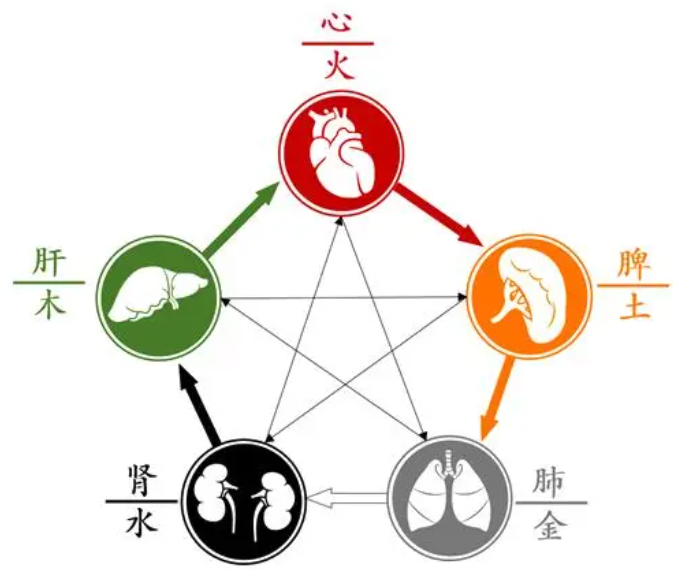

[toc]
# 1 五脏与五行的关系
在中医中，五脏与五行之间的对应关系是这样的：

1. "木"对应"肝"，肝属木，象征春天和生长。
2. "火"对应"心"，心属火，象征夏天与成熟。
3. "土"对应"脾"，脾属土，象征长夏与转换。
4. "金"对应"肺"，肺属金，象征秋天与收获。
5. "水"对应"肾"，肾属水，象征冬天与储藏。

五行生克关系表述如下：

1. 生：木生火、火生土、土生金、金生水、水生木。
2. 克：木克土、土克水、水克火、火克金、金克木。

然而，互相制约和相互生养的五行理论，对于解释和理解人体的健康、疾病和治疗等各种问题具有极其重要的意义。具体情况需要依据实际情况，通过对五行生克的理解来进行个体化调理和治疗。

# 2 肺
肺具有宜降之性，肾具有纳气及固摄之功能。从呼吸功能看，肺主呼，呼中吐浊，肺气清，至上而行；肾主呼，吸中纳清，肾气清，而下通二阴，两者通过协同的气机运动，完成了人体的呼吸功能，从而保持了生命机体的正常生存。

肺属金，肾属水，经络相贯，气血相连，功能上相互影响。行气的功能，肺是宣降的总司令，肾是主纳气，在运动机能方面，属一个上行一个下行。肺气下降，刺激肾气上升而达到平衡。

总的来说，补肺对旺肾有一定的帮助，但这并不代表补肺就等于补肾。每一个人的身体情况都不一样，某种方法是否有效，需要具体分析判断。这就需要依据中医的整体观念和辨证施治原则，根据每个人的具体情况来进行诊疗。补肺之后，肾功能是否会改善，取决于具体的病情和体质。 对于肾虚的病人，在补肾的同时也需要注意调养肺部的健康。

肺，位居胸中，左右各一，呈分叶状，质疏松。与心同居膈上，上连气管，通窍于鼻，与自然界之大气直接相通。

肺的生理功能：肺主气司呼吸，主行水，朝百脉，主治节。

1．肺主气：①肺主一身之气。肺主一身之气是指肺有主持、调节全身各脏腑之气的作用，即肺通过呼吸而参与气的生成和调节气机的作用。②肺主呼吸之气。肺为体内外气体交换的场所，肺主呼吸之气是指肺通过呼吸运动，吸入自然界的清气，呼出体内的浊气，实现体内外气体交换的功能。

2．肺主行水：是指肺的宣发和肃降对体内水液输布、运行和排泄的疏通和调节作用。由于肺为华盖，其位最高，参与调节体内水液代谢，所以说“肺为水之上源”（《血证论‘肿胀》）。

3．肺朝百脉：全身血脉均汇总流经于肺，经过肺的呼吸进行呼吸交换，因此说肺朝百脉。

4．肺主治节：治节，即治理调节。肺主治节是指肺辅助心脏治理调节全身气、血、津液及脏腑生理功能的作用。心为君主之官，为五脏六腑之大主。肺为相傅之官而主治节。“肺与心皆居膈上，位高近君，犹之宰辅”。心为君主，肺为辅相。人体各脏腑组织之所以依着一定的规律活动，有赖于肺协助心来治理和调节。因此称肺为“相傅之官”。肺的治节作用，主要体现于四个方面：⑴肺主呼吸：肺的呼吸运动有节律地一呼一吸，呼浊吸清，对保证呼吸的调匀有着极为重要的作用。（2）调节气机：肺主气，调节气的升降出入运动，使全身的气机调畅。所谓“肺主气，气调则营卫脏腑无所不治”（《类经·脏象类》）。（3）助心行血：肺朝百脉，助心行血，辅助心脏，推动和调节全身血液的运行。“诸气者皆属于肺”，气行则血亦行。（4）宣发肃降：肺的宣发和肃降，治理和调节津液的输布、运行和排泄。因此，肺主治节，实际上是对肺的主要生理功能的高度概括。

肺的生理特性：1．肺为华盖：盖，即伞。华盖，原指古代帝王的车盖。肺为华盖是指肺在体腔中位居最高，具有保护诸脏、抵御外邪的作用。肺位于胸腔，居五脏的最高位置，有覆盖诸脏的作用，肺又主一身之表，为脏腑之外卫，故称肺为华盖。2．肺为娇脏：肺为娇脏是指肺脏清虚娇嫩而易受邪侵的特性。娇是娇嫩之意。肺为清虚之体，且居高位，为诸脏之华盖，百脉之所朝，外合皮毛，开窍于鼻，与天气直接相通：六淫外邪侵犯人体，不论是从口鼻而入，还是侵犯皮毛，皆易于犯肺而致病。他脏之寒热病变，亦常波及于肺，以其不耐寒热，易于受邪，故称娇脏。

肺与形、窍、志、液、时的关系　：

肺在体合皮，其华在毛。

肺在窍为鼻，喉为肺之门户。

肺在志为悲忧。

肺在液为涕。

肺与秋气相通应。

肺外应大腹。“肺者，相傅之官，治节出焉。”

# 3 肾
肾的生理功能：肾藏精，肾主纳气，肾主水。

1．肾藏精：肾藏精是指肾具有贮存、封藏人身精气的作用。精的生理功能：肾中精气不仅能促进机体的生长、发育和繁殖，而且还能参与血液的生成，提高机体的抗病能力。①促进生殖繁衍：肾精是胚胎发育的原始物质，又能促进生殖机能的成熟c肾精的生成、贮藏和排泄，对繁衍后代起着重要的作用。人的生殖器官的发育及其生殖能力，均有赖于肾。总之，男女生殖器官的发育成熟及其生殖能力，均有赖于肾精的充盛，而精气的生成、贮藏和排泄均由肾所主，故有肾主生殖”之说。根据这一理论，固肾保精便成为治疗性与生殖机能异常的重要方法之一。 　②促进生长发育：生、长、壮、老、已是人类生命的自然规律。人从出生经过发育、成长、成熟、衰老以至死亡前机体生存的时间，称之为寿命，通常以年龄作为衡量寿命长短的尺度。③参与血液生成：肾藏精，精能生髓，精髓可以化而为血。“血即精之属也，但精藏于肾，所蕴不多，而血富于冲，所至皆是”（《景岳全书，血证》），“夫血者，水谷之精微，得命门真火蒸化”（《读医随笔·气血精神论》）。故有血之源头在于肾之说。所以，在临床上治疗血虚常用补益精髓之法。　④抵御外邪侵袭：肾精具有抵御外邪而使人免于疾病的作用。“足于精者，百病不生，穷于精者，万邪蜂起”（《冯氏锦囊秘录》）。精充则生命力强，卫外固密，适应力强，邪不易侵。反之，精亏则生命力弱，卫外不固，适应力弱，邪侵而病。故有“藏于精者，春不病温”（《素问·金匮真言论》）之说。冬不藏精，春必病温，肾精这种抵御外邪的能力属正气范畴，与“正气存内，邪不可干”，“邪之所凑，其气必虚”的意义相同。

2．肾主水液：水液是体内正常液体的总称。肾主水液，从广义来讲，是指肾为水脏，泛指肾具有藏精和调节水液的作用。从狭义而言，是指肾主持和调节人体水液代谢的功能。

3．肾主纳气：纳，固摄、受纳的意思。肾主纳气，是指肾有摄纳肺吸入之气而调节呼吸的作用。人体的呼吸运动，虽为肺所主，但吸入之气，必须下归于肾，由肾气为之摄纳，呼吸才能通畅、调匀。“气根于肾，亦归于肾，故曰肾纳气，其息深深”（《医碥·气》）。“肺为气之主，肾为气之根，肺主出气，肾主纳气，阴阳相交，呼吸乃和”（《类证治裁·卷之二》）。

肾的生理特性：肾主闭藏：封藏，亦曰闭藏，固密储藏，封固闭藏之谓。肾主封藏是指肾贮藏五脏六腑之精的作用。封藏是肾的重要生理特性。肾为先天之本，生命之根，藏真阴而寓元阳，为水火之脏。肾藏精，精宜藏而不宜泄；肾主命火，命火宜潜不宜露，人之生身源于肾，生长发育基于肾，生命活动赖于肾。肾是人体阴精之所聚，肾精充则化源足。

肾与形、窍、志等的关系：

肾在体合骨，生髓，其华在发。

肾在窍为耳及二阴。

肾在志为恐。

肾在液为唾。

肾与冬气相通应。

肾外应腰。“肾者，作强之官，伎巧出焉。”

# 4 肝
五脏之肝

肝位于腹部，横膈之下，右胁下而偏左。与胆、目、筋、爪等构成肝系统。主疏泄、藏喜条达而恶抑郁，体阴用阳。在五行属木，为阴中之阳。肝与四时之春相应。

肝的生理功能：肝主疏泄，肝主藏血。

1．肝主疏泄：指肝具有疏通、舒畅、条达以保持全身气机疏通畅达，通而不滞，散而不郁的作用。肝主疏泄在人体生理活动中的主要作用是：

（1）调畅气机：肝主疏泄的生理功能，总的是关系到人体全身的气机调畅。气机，即气的升降出入运动。升降出入是气化作用的基本形式。人体是一个不断地发生着升降出入的气化作用的机体。气化作用的升降出人过程是通过脏腑的功能活动而实现的。人体脏腑经络、气血津液、营卫阴阳，无不赖气机升降出入而相互联系，维持其正常的生理功能：肝的疏泄功能，对全身各脏腑组织的气机升降出入之间的平衡协调，起着重要的疏通调节作用。“凡脏腑十二经之气化，皆必藉肝胆之气化以鼓舞之，始能调畅而不病”（《读医随笔·卷四》）。因此，肝的疏泄功能正常，则气机调畅、气血和调、经络通利，脏腑组织的活动也就正常协调。

（2）调节精神情志：情志，即情感、情绪，是指人类精神活动中以反映情感变化为主的一类心理过程。中医学的情志属狭义之神的范畴，包括喜、怒、忧、思、悲、恐、惊，亦称之为七情。肝通过其疏泄功能对气机的调畅作用，可调节人的精神情志活动。

（3）促进消化吸收：脾胃是人体主要的消化器官。胃主受纳，脾主运化。肝主疏泄是保持脾胃正常消化吸收的重要条件。肝对脾胃消化吸收功能的促进作用，是通过协调脾胃的气机升降，和分泌、排泄胆汁而实现的。

（4）维持气血运行：肝的疏泄能直接影响气机调畅。只有气机调畅，才能充分发挥心主血脉、肺助心行血、脾统摄血液的作用，从而保证气血的正常运行。

（5）调节水液代谢：水液代谢的调节主要是由肺、脾、肾等脏腑共同完成的，但与肝也有密切关系。因肝主疏泄，能调畅三焦的气机，促进上中下三焦肺、脾、肾三脏调节水液代谢的机能，即通过促进脾之运化水湿、肺之布散水津、肾之蒸化水液，以调节水液代谢。三焦为水液代谢的通道。“上焦不治，则水犯高源；中焦不治，则水留中脘；下焦不治，则水乱二便。三焦气治，则脉络通而水道利”（《类经，脏象类》）。三焦这种司决渎的功能，实际上就是肺、脾、肾等调节水液功能的综合。肝的疏泄正常，气机调畅，则三焦气治，水道通利，气顺则一身之津液亦随之而顺，由此可见，肝脏是通过其疏利调达三焦脏腑气机的作用，来调节体内的水液代谢活动的，这就是理气以治水的理论依据。

（6）调节性与生殖①调理冲任：妇女经、带、胎、产等特殊的生理活动，关系到许多脏腑的功能，其中肝脏的作用甚为重要，向有“女子以肝为先天”之说。②调节精室：精室为男子藏精之处。男子随肾气充盛而天癸至（促进性成熟并维持生殖功能的物质），则精气溢泻，具备了生殖能力。男性精室的开合、精液的藏泄，与肝肾的功能有关。“主闭藏者，肾也，司疏泄者，肝也”（《格致余论·阳有余阴不足论》）。

2．肝主藏血：肝藏血是指肝脏具有贮藏血液、防止出血和调节血量的功能。故有肝主血海之称。

①贮藏血液：血液来源于水谷精微，生化于脾而藏受于肝。肝内贮存一定的血液，既可以濡养自身，以制约肝的阳气而维持肝的阴阳平衡、气血和调，又可以防止出血。因此，肝不藏血，不仅可以出现肝血不足，阳气升腾太过，而且还可以导致出血。

②调节血量：在正常生理情况下，人体各部分的血液量是相对恒定的。但是，人体各部分的血液，常随着不同的生理情况而改变其血量。当机体活动剧烈或情绪激动时，人体各部分的血液需要量也就相应地增加，于是肝脏所贮藏的血液向机体的外周输布，以供机体活动的需要。当人们在安静休息及情绪稳定时，由于全身各部分的活动量减少，机体外周的血液需要量也相应减少，部分血液便归藏于肝。所谓“人动则血运于诸经，人静则血归于肝脏”。因肝脏具有贮藏血液和调节血量的作用，故肝有“血海”之称。

肝的生理特性：

1．肝喜条达：条达，舒展、条畅、通达之意。抑郁，遏止阻滞。肝为风木之脏，肝气升发，喜条达而恶抑郁。肝气宜保持柔和舒畅，升发条达的特性，才能维持其正常的生理功能。

2、肝为刚脏。

肝与形、窍、志、液、时的关系：

肝在体合筋，其华在爪。

肝在窍为目。

肝在志为怒。

肝在液为泪。

肝与春气相通应。

肝外应两胁。“肝者，将军之官，谋虑出焉。”

五脏之肾

# 5 心
心位于胸腔偏左，膈膜之上，肺之下，圆而下尖，形如莲蕊，外有心包卫护。心与小肠、脉、面、舌等构成心系统。心，在五行属火，为阳中之阳脏，主血脉，藏神志，为五脏六腑之大主、生命之主宰。心与四时之夏相通应。

心的生理功能：

1、心主血脉。

指心有主管血脉和推动血液循行于脉中的作用，包括主血和主脉两个方面。血就是血液。脉，即是脉管，又称经脉，为血之府，是血液运行的通道。心脏和脉管相连，形成一个密闭的系统，成为血液循环的枢纽。心脏有规律的跳动，需要三个条件：心气充沛、血液充盈、脉道通利。

2、心藏神。

神的含义：在中医学中，神的含义主要有三：其一，指自然界物质运动变化的功能和规律。所谓“阴阳不测谓之神”（《素问·天元纪大论》）。其二，指人体生命活动的总称。一般称之为广义的神。整个人体生命活动的外在表现，如整个人体的形象以及面色、眼神、言语、应答、肢体活动姿态等，无不包含于神的范围。换言之，凡是机体表现于外的“形征”，都是机体生命活动的外在反映。其三，是指人们的精神、意识、思维活动。即心所主之神志，一般称之为狭义的神。精气是产生神的物质基础。心藏神生理作用有二：其一，主思维、意识、精神。在正常情况下，神明之心接受和反映客观外界事物，进行精神、意识、思维活动。其二，主宰生命活动。“心为身之主宰，万事之根本”（《饮膳正要·序》）。神明之心为人体生命活动的主宰。五脏六腑必须在心的统一指挥下，才能进行统一协调的正常的生命活动。心为君主而脏腑百骸皆听命于心。心藏神而为神明之用。“心者，五脏六腑之大主也，精神之所舍也”（《灵枢·邪客》）。

心的生理特性：心为阳脏而主通明。心为阳中之太阳，以阳气为用。心脏阳热之气，不仅维持了心本身的生理功能，而且对全身又有温养作用。

心与形、窍、志、液、时的关系：

心在体合脉，其华在面。

心在窍为舌。

心在志为喜。

心在液为汗。

心与夏气相通应。

心外应胸膺。“心者，君主之官，神明出焉。”

# 6 脾
脾位于腹腔上部，膈膜之下，与胃以膜相连，“形如犬舌，状如鸡冠”，与胃、肉、唇、口等构成脾系统。

脾的生理功能：脾主运化，脾主统血。

1．脾主运化：运，即转运输送，化，即消化吸收。脾主运化，指脾具有将水谷化为精微，并将精微物质转输至全身各脏腑组织的功能。实际上，脾就是对营养物质的消化、吸收和运输的功能。包括运化水谷和运化水液两个方面。

（1）运化水谷：水谷，泛指各种饮食物。脾运化水谷，是指脾对饮食物的消化吸收作用。脾运化水谷的过程为：一是胃初步腐熟消化的饮食物，经小肠的泌别清浊作用，通过脾的磨谷消食作用使之化为水谷精微（又称水谷精气）；二是吸收水谷精微并将其转输至全身；三是将水谷精微上输心肺而化为气血等重要生命物质。概言之，脾主运化水谷，包括了消化水谷、吸收转输精微并将精微转化为气血的重要生理作用。

（2）运化水湿：运化水湿又称运化水液，是指脾对水液的吸收和转输，调节人体水液代谢的作用，即脾配合肺、肾、三焦、膀胱等脏腑，调节、维持人体水液代谢平衡的作用。脾主运化水湿是调节人体水液代谢的关键环节。在人体水液代谢过程中，脾在运输水谷精微的同时，还把人体所需要的水液（津液），通过心肺而运送到全身各组织中去，以起到滋养濡润作用，又把各组织器官利用后的水液，及时地转输给肾，通过肾的气化作用形成尿液，送到膀胱，排泄于外，从而维持体内水液代谢的平衡。脾居中焦，为人体气机升降的枢纽，故在人体水液代谢过程中起着重要的枢纽作用。因此，脾运化水湿的功能健旺，既能使体内各组织得到水液的充分濡润，又不致使水湿过多而潴留。反之，如果脾运化水湿的功能失常，必然导致水液在体内的停滞，而产生水湿、痰饮等病理产物，甚则形成水肿。

2．脾主统血：脾主统血，统是统摄、控制的意思。脾主统血，指脾具有统摄血液，使之在经脉中运行而不溢于脉外的功能。脾气能够统摄周身血液，使之正常运行而不致溢于血脉之外。脾统血的作用是通过气摄血作用来实现的。脾为气血生化之源，气为血帅，血随气行。脾的运化功能健旺，则气血充盈，气能摄血；气旺则固摄作用亦强，血液也不会逸出脉外而发生出血现象。反之，脾的运化功能减退，化源不足，则气血虚亏，气虚则统摄无权，血离脉道，从而导致出血：由此可见，脾统血，实际上是气对血作用的具体体现，所谓“脾统血者，则血随脾气流行之义也”（《医碥·血》）。

脾的生理特性：1、脾气主升。脾性主升，是指脾的气机运动形式以升为要，脾升则脾气健旺。脾气维持脏器的相对位置。2、脾喜燥恶湿。，脾主湿而恶湿，因湿邪伤脾，脾失健运而水湿为患者，称为“湿困脾土”。

脾与形、窍、志、液、时的关系：

脾在体合肉，主四肢。其华在唇。

脾在窍为口。

脾在志为思。

脾在液为涎。

脾与长夏相通应。

脾外应小腹。“脾者，谏议之官，知周出焉。”

# 7 六腑
六腑

人体内胆、胃、大肠、小肠、三焦、膀胱六个脏器的合称。腑，古称府，有库府的意思。六腑的主要生理功能是受纳、腐熟水谷，泌别清浊，传化精华，将糟粕排出体外，而不使之存留。所以六腑以和降通畅为顺。六腑的生理功能具体为：饮食物入胃，经胃的腐熟，下移小肠，进一步消化，并泌别清浊，吸收其中的精微物质，大肠接受小肠中的食物残渣，吸收其中的水分，其余的糟粕经燥化与传导作用，排出体外，成为粪便。在饮食物消化、吸收过程中，胆排泄胆汁入小肠，以助消化。三焦不但是传化的通道，更重要的是主持诸气，推动了传化功能的正常进行。

胆

胆附于肝之短叶，与肝相连，呈中空的囊状器官。胆既是六腑之一，又是奇恒之府之一。

其主要功能为：

1．贮存和排泄胆汁，味苦，呈黄绿色，具有促进食物的消化吸收的作用。胆汁由肝之精气所化，贮存于胆，故称胆为“中精之府”、“清净之府”。胆汁的排泄必须依赖于肝的疏泄功能的调节和控制。肝的疏泄功能正常，则胆汁排泄畅达，脾胃运化功能健旺。若肝气郁结，胆汁排泄不利，则影响脾胃的消化功能，可见胸胁胀满、食欲不振、或大便失调；若肝的疏泄太过，胆气上逆，则见口苦、呕吐黄绿苦水；若湿热蕴结肝胆，胆汁不循常道，外溢肌肤，则见黄疸；胆汁排泄不畅，日久则导致砂石淤积。

2．主决断决断属于思维的范畴。胆主决断，是指胆具有判断事物，并作出决定的作用。胆的这一功能对防御和消除某些精神刺激的不良影响，以维持和控制气血的正常运行，确保各脏腑之间的协调关系具有重要的作用。由于肝胆相互依附，互为表里，肝主谋虑，胆主决断，所以肝胆的相互协调，共同调节着精神思维活动的正常进行。临床上常见胆气不足之人，多易惊善恐，遇事不决等。

胃.

胃位于膈下，上接食管，下通小肠。胃的上口为贲门，下口为幽门，胃分为上、中、下三部分，即上脘、中脘、下脘，因此胃又称胃脘。

胃的主要功能为：1.主受纳、腐熟水谷。受纳，接受和容纳；腐熟，是胃将饮食物进行初步消化变成食糜的过程。胃主受纳、腐熟水谷，是指胃能够容纳由食管下传的食物，并将食物进行初步消化，下传于小肠的功能，故胃有“水谷之海”、“太仓”之称。胃的受纳、腐熟作用为脾的运化功能提供了物质基础。因此，常把脾胃同称为“后天之本，气血生化之源”，把脾胃的功能概括为“胃气”。人体后天营养的来源与“胃气”的强弱有密切的关系，临床上常把“胃气”的强弱作为判断疾病的轻重、预后的一个重要依据，治疗上注重“保胃气”。如若胃的受纳、腐熟功能失常，则胃脘胀痛、纳呆厌食、嗳气酸腐、消谷善饥等；胃气大伤，则饮食难进，预后较差，甚则胃气败绝，生命垂危，故有“人有胃气则生，无胃气则死”之说。2.主通降通降，是指胃气以通畅下降为顺。饮食物入胃，经胃的腐熟后下传小肠进一步消化吸收，清者由脾转输，浊者下传大肠，化为糟粕排出体外，整个过程是靠胃气的“通降”作用来完成的。因此，胃主通降就是指胃能够将食糜下传小肠、大肠，并排出糟粕的过程。

胃主通降就是降浊，降浊是受纳的前提条件。因此，胃失通降，不仅使食欲下降，而且因浊气上逆而发生口臭、脘腹胀满疼痛，或嗳气、呃逆、大便秘结，甚则出现恶心、呕吐等症。

小肠

小肠位于腹中，上端通过幽门与胃相接，下端通过阑门与大肠相连，为中空的管状器官，呈迂曲回环叠积之状。其主要功能为：1.主受盛、化物。受盛：是接受、容纳之意。一是指小肠接受由胃初步消化的食物起到容器的作用；二是经胃初步消化的食物，须在小肠内停留一段时间，以便进一步消化吸收。化物：即消化、变化，是指小肠将初步消化的食糜，进一步消化吸收，将水谷化为精微。若小肠受盛、化物的功能失调，则可见腹胀、腹痛，或为腹泻、便溏。2.泌别清浊，泌，分泌；别，分别；清，指水谷精微；浊，指食物残渣。

大肠

大肠位于腹腔，其上口通过阑门与小肠相连，下端与肛门相接，是一个管道器官，呈回环叠积之状。大肠的主要功能为传化糟粕。传化，即传导和变化之意。大肠接受小肠下传的食物残渣，并吸收其中多余的水分，使之形成粪便，经肛门排出体外，故称大肠为“传导之官”。大肠的传导变化作用，是胃的降浊功能的延伸，且与脾的升清、肺的宣降、以及肾的气化功能密切相关。大肠传导失司，则可导致排便异常如大肠湿热，气机阻滞，则腹痛腹泻、里急后重、下痢脓血；若大肠实热，则肠液干枯而便秘；若大肠虚寒，则水谷杂下，肠鸣泄泻。

膀胱

膀胱位于小腹部，为中空的囊状器官，上有输尿管与肾相通，下通过尿道开口于前阴。膀胱的主要功能为贮存和排泄尿液。尿液为津液所化，尿液的形成依赖于肾的气化作用，下输于膀胱，并调节膀胱的开合，最后排出体外。所以说，膀胱气化功能的发挥，是以肾的气化作用为生理基础。肾和膀胱的气化功能失常，膀胱开合失司，则小便不利，或为癃闭，或尿频、尿急、尿痛以及尿失禁等。

三焦

三焦是上、中、下三焦的总称，为六腑之一。在人体脏腑中三焦最大，有名无实，有“孤腑”之称。从部位上来划分，膈肌以上为上焦，包括心肺；膈肌以下脐以上为中焦，包括肝，胆，脾胃；脐以下为下焦，包括大小肠，膀胱，肾。三焦与心包相表里。

三焦的具体功能为：

1.主持诸气，总司人体的气化活动。三焦为人体元气通行的道路。元气发源于肾，必须通过三焦输布全身，以发挥其激发、推动各脏腑组织器官功能活动的作用，从而维持人体生命活动的正常进行。元气是组织气化活动的原动力，而三焦通行元气又关系到全身气化功能的正常进行。因此说，三焦“主持诸气，总司人体的“气化活动”。

2.为人体水液运行的道路。是指三焦具有疏通水道，运行水液的作用。人体水液的代谢，虽有赖于各脏腑的共同作用来完成，但又必须以三焦水道的通畅为条件才能正常进行。若三焦水道不利，则肺、脾、肾等调节水液代谢的功能难以发挥。因此，三焦在水液代谢中起着重要的作用。

胆者，中正之官，决断出焉；胃者，仓廪之官，五味出焉；受盛之官，化物出焉；大肠者，传道之官，变化出焉；三焦者，决渎之官，水道出焉；膀胱者，州都之官，津液藏焉。

五行相生论

五脏之间关系

五行相生

如木生火，即肝木济心火，肝藏血，心主血脉，肝藏血功能正常有助于心主血脉功能的正常发挥。火生土，即心火温脾土，心主血脉、主神志，脾主运化、主生血统血，心主血脉功能正常，血能营脾；脾才能发挥主运化、生血、统血的功能。土生金，即脾土助肺金，脾能益气，化生气血，转输精微以充肺，促进肺主气的功能，使之宣肃正常。金生水，即肺金养肾水，肺主清肃，肾主藏精，肺气肃降有助于肾藏精、纳气、主水之功。水生木，即肾水滋肝木，肾藏精，肝藏血，肾精可化肝血，以助肝功能的正常发挥。这种五脏相互滋生的关系，就是用五行相生理论来阐明的。

脏与脏的关系

1．心与肺：心主血，肺主气。人体脏器组织机能活动的维持，是有赖于气血循环来输送养料。血的正常运行虽然是心所主，但必须借助于肺气的推动，而积存于肺内的宗气，要灌注到心脉，才能畅达全身。

2．心与肝：心为血液循环的动力，肝是贮藏血液的一个重要脏器，所以心血旺盛，肝血贮藏也就充盈，既可营养筋脉，又能促进人体四肢、百骸的正常活动。如果心血亏虚，引起肝血不足，则可导致血不养筋，出现筋骨凌痛、手足拘挛、抽搐等症。又如肝郁化火，可以扰及于心，出现心烦失眠等症。

3．心与脾：脾所运化的精微，需要借助血液的运行，才能输布于全身。而心血又必须依赖于脾所吸收和转输的水谷精微所生成。另方面，心主血，脾统血，脾的功能正常，才能统摄血液。若脾气虚弱，可导致血不循经。

4．心与肾：心肾两脏，互相作用，互相制约，以维持生理功能的相对平衡。在生理状态下，心阳不断下降，吕阴不断上升，上下相交，阴阳相济，称为“心肾相交”。在病理情况下，若肾阴不足，不能上济于心，会引起心阳偏亢，两者失调，称“心肾不交”。

5．肝与脾：肝藏血，脾主运化水谷精微而生血。如脾虚影响血的生成，可导致肝血不足，出现头晕、目眩、视物不清等。肝喜条达而恶抑郁，若肝气郁结，横逆犯脾，可出现腹痛、腹泻等。

6．肝与肺：肝之经脉贯脂而上注于肺，二者有一定联系，肝气升发，肺气肃降，关系到人体气机的升降运行。若肝气上逆，肺失肃降，可见胸闷喘促。肝火犯肺，又可见胸胁痛、于咳或痰中带血等症。

7．肝与肾：肾藏精，肝藏血，肝血需要依赖肾精的滋养，肾精又需肝皿不断的补充，两者是互相依存，互相资生。肾精不足，可导致肝血亏虚。反之，肝血亏虚，又可影响肾精的生成。若肾阴不足，肝失滋养，可引起肝阴不足，导致肝阳偏亢或肝风内动的证候，如眩晕、耳鸣、震颤、麻木、抽搐等。

8．肺与脾：脾将水谷的精气上输于肺，与肺吸入的精气相结合，而成宗气(又称肺气)。肺气的强弱与脾的运化精微有关，故脾气旺则肺气充。由脾虚影响到肺时，可见食少、懒言、便搪、咳嗽等症。临床上常用“补脾益肺”的方法去治疗。又如患慢性咳嗽，痰多稀白，容易咳出，体倦食少等症，病证虽然在肺，而病本则在于脾，必须用 “健脾燥湿化痰”的方法，才能收效。所谓“肺为贮痰之器，脾为生痰之源”，这些都是体现脾与肺的关系。

9.脾与肾：脾阳依靠肾阳的温养，才能发挥运化作用。肾阳不足，可使脾阳虚弱，运化失常，则出现黎明泄泻，食谷不化等症。反之，若脾阳虚衰，亦可导致肾阳不足，出现腰滕废冷、水肿等。

10．肺与肾：肺主肃降，通调水道，使水液下归于肾。肾主水液，经肾阳的蒸化，使清中之清，上归于肺，依靠脾阳的运化，共同完成水液代谢的功能。肺、脾、肾三脏，一脏功能失调，均可引起水液媚留而发生水肿。肺主呼吸，肾主纳气，两脏有协同维持人身气机出入升降的功能。

11．心与肾：心肾两脏互相作用，互相制约以维持生理功能上的相对平衡，称为“心肾相交”；如果肾阴不足，心火过盛，失去协调，称为<心肾不交>而出现健忘、失眠、心悸、遗精等症状。

心与肾还有另一种生理病理关系?就是心阳和肾阳的相万：作用，相互促进。心的阳气足，表现着血液循环畅旺，如果肾的元阳衰微(命门火衰)可以导致心m的不足；心阳不足，也可以影响肾阳的不足。

12．心与肝：心为一身血液循环的中心，肝是贮藏血液的一个重要器官。所以心血旺盛，肝血也就贮藏充盈，就可以营养筋脉，促进人体及四肢屈仲的五批活功。如果血液不足，损耗过度，以致血．亏肝虚，血不养筋，则出现筋绎痉浦，手足痔孪、抽搐等症状，这说明心血过耗，肝失所养造成的病理变化。

13．心与脾：脾的运化功能，需要心阳的推动，而心血的生成，又必须依赖于脾所吸收相转输的水谷精微。另一方面，心主血而脾统血，脾的功能正常，才能很好的统摄血液；若脾阳虑衰，就要导致血不循经等疾病。

14．肝与脾：肝藏血，脾主运化营弊，化生血液，如脾虚，影响血的生成，则肝血不足，在临床上表现为头晕眼花，视物模糊等。

15．脾与肺：肺气的强弱南·赖于水谷之‘天的供给，水谷之气与脾的远化是密切相关，故脾虚影响到肺时，常出现面色苍白、懒言、少食、消瘦、咳嗽、便溶等症状。治疗上常用“补脾益肺”的方法。又如慢性咳嗽的痰多而稀白，身倦气促，食欲不振等症状，病变虽在肺而病本在于脾，必须用健脾化痰的方法，才能奏效。所谓“肺为贮痰之器，脾为生痰之源”， 由此就可以体现脾与肺的关系。

16．脾与肾：脾阳依靠肾阳的温养才能发挥运化作用。肾阳不足可致脾阳虚弱，运化失职，出现腹脓、消化不良、大便搐泄或浮肿、腹水等肾虚症状，治疗必须用健脾补肾的方法。

17．肺与肝：肝火盛时可以灼肺，出现干咳或痰血、胸胁痛、易怒等症状，肝气上逆又可影响肺气失降，而见胸脂胀满不舒等。

18．肾与肝：肾藏精，肝得肾精的滋养， 可维持肝脏的功能正常。如肾阴不足，肝失滋养，就会引起肝阴不足，肝阳上亢，或肝风内动的疾病，如头昏眼花、耳鸣、肌肉跳动、肢体麻木、下胶无力等。常常是肝肾同治，采用滋肾养肝的方法而获得疗效。

19． 肾与肺：(1)从水液代谢方面来说，肾的经脉上连于肺，管理三焦，腕磅上靠肺的通调，下靠肾的开合，中靠脾的运化，故肺、脾、 肾三脏对全身水液代谢都有密切关系，一脏功能失职，均会使水液滞留而发生水肿。

(2) 从气的关系来说，肺主呼吸而肾主纳气，二脏有协同维持人身气机出入升降的功能。

腑与腑的关系

六腑是传导饮食物的器官，它们既分工又协作，共同完成饮食物的受纳、消化、吸收、传导和排泄过程。

脏与腑的关系

1。心与小肠：经络相通，互为表里。心经有热可出现口舌糜烂。苦心经移热于小肠，则可兼见小便短赤，尿道涩痛等症。

2。肝与胆：胆寄于肝，脏腑相联，经络相通，构成表里。胆汁来源于肝，若肝的疏泄失常，会影响到胆汁的正常排泄。反之，胆汁的排泄失常，又会影响到肝。故肝胆症候往往同时并见，如黄疽、胁痛、口苦、眩晕等。

3．脾与胃：在特性上，脾喜燥恶湿，胃喜润恶燥；脾主升，胃主降。在生理功能上，胃为水谷之海，主消化；脾为胃行其津液，主运化。二者燥湿相济，升降协调，胃纳脾化，互相为用，构成了既对立又统一的矛盾运动，共同完成水谷的消化、吸收和转输的任务。

胃气以下行为顺，胃气和降，则水谷得以下行。脾气以上行为顺，脾气上升，精微物质得以上输。若胃气不降，反而上逆，易现呢逆、呕吐等症。脾气不升，反而下陷，易现久泄、脱肛、子宫下脱等症。由于脾胃在生理上密切相关，在病理上互相影响，所以在临证时常脾胃并论，在治疗上多脾胃并治。

4．肺与大肠：经络相连，互为表里。若肺气肃降，则大肠气机得以通畅，以发挥 其传导功能。反之，若大肠保持其传导通畅，则肺气才能清肃下降。例如：肺气蛮滞，失其肃降之功，可能引起大肠传导阻滞，出现大便秘结。反之，大肠传导阻滞，又可引起肺肃降失常，出现气短咳喘等。又如：在治疗上肺有实热，可泻大肠，使热从大肠下泄。反之，大肠阻滞，又可宣通肺气，以疏利大肠的气机。

5．肾与膀胱：经络相通，互为表里。在生理上一为水脏，一为水腑，共同维持水液代谢的平衡(以肾为主)。肾阳蒸化，使水液下渗膀胱，膀肮又借肾阳的作用，通过自身的功能而排泄小便。在病理上，肾阳不足，可影响膀胱功能减弱而出现小便频数或遗尿；膀胱湿热，又可影响肾脏而出现腰痛、尿血等。

6．心包与三焦：经络相通，互为表里。例如，临床上热病中的湿热合邪，稽留三焦，出现胸闷身重，尿少便溏，表示病在气分。如果未能制止其发展，温热病邪，便由气分入营分，由三焦内陷心包，而出现昏迷、谵语等症。

实践意义

脏腑相表里的理论，在针刺治疗上也具有实践意义：例如手太阴肺经的哮喘病，常配用手阳明经的合谷穴，足阳明胃经的胃皖南，常配用足太阴脾经的阴陵泉久等进行治疗，都收到满意的效果。这些都是根据脏腑表里经气相通的理论来运用的。

脾胃是生命根本

人体是由脏腑、经络、皮毛、肌肉、筋骨、精髓和气血津液等组成的一个整体。

脏腑学说就是研究人体的脏腑生理功能和病理变化及其相互关系的学说。

脏，包括心、肝、脾、肺、肾，称为五脏。另外心包位于心脏的外围，附有络脉，是通行气血的径路，并有保护心脏的作用，故亦称为脏。腑，包括胆、胃、小肠、大肠、膀肮和三焦，称为六腑。

脏腑是化生精血津液，促进新陈代谢，维持人体机能活动的主要器官。分别来说，五脏是贮藏精气的(精气，指精血津液)，六腑是主食物的受纳、消化、吸收、传导和排泄的。因而脏以藏为主，腑以通为用。

脏腑之间无论是脏与脏、腑与腑，还是脏与腑都是互相联系的。五脏与“五体”等组织以及“五官”、“七窍”等器官，也都有密切的联系。五脏与五体的关系是：心主脉、肝主筋、脾主肌肉、肺主皮毛、肾主骨。五脏与五宫七窍的关系是心开窍于舌、肝开窍于目、脾开窍于口、肺开窍于鼻、肾开窍于耳和二阴(鼻、目和耳各有两个与口称为七窍，再加“前阴”与“后阴”二窍，又称九窍)。因为五脏与五体、五官七窍相关联，所以五脏的变化，常常反映到其所属的体表组织与孔窍。

中医对脏腑功能和病变的认识，因受当时历史条件的限制，概括的比较粗略。脏腑在中医学里不但是一个解剖的概念，而更重要的还是一个生理和病理的概念，所以祖国医学里“脏腑”的概念，与现代医学“脏器”的概念是不同的。例如：中医学里的“心”，并不完全等于现代医学的心脏，它除了在解剖上代表心脏以外，还在生理上包括了现代医学中循环系统和神经系统一些器官的功能。我们在学习祖国医学时，应当以辩证唯物主义的观点，结合现代医学，抓住它的实质进行分析研究，去芜存营，去伪存真，为创造我国统一的新医学作出贡献。

阴：三焦

脏腑之间通过经络的联系和气血的贯注，构成了一个有机的整体。在生理状态下，它们之间既分工又合作，构成复杂的生理活动。在病理状态下，也是互相影响的。因此它们之间的关系，可从生理和病理变化上反映出来。掌握这些脏腑关系的理论，对临床辨证施治，有一定的指导意义。

脏腑与形体组织

形体组织主要指脉、筋、肌肉、皮肤、骨等。它们与五脏的关系是心主脉，肝主筋，脾主肌肉(及四肢)，肺主皮毛，肾主骨。同时，人体脏气的盛衰，又会反应到最明显的部位。如；心，其华在面；肝，其华在爪；脾，其华在唇；肺，其华在皮毛；肾，其华在发。可见脏器和肌体的关系是密切的。

此外，肝有病变，病人可出现抽筋，指甲变薄变软；心有病变，可使血脉衰弱，面色无华；脾有病变，可使肌肉消瘦，口唇谈白；肺有病变，可使皮毛枯搞；肾有病变，可使骨生长不正常，毛发稀少等等。这都说明了脏器的病变反映到相应的形体组织。

中医认为“脾”、“胃”之间的相互关系如何?

中医认为，人体是一个有机的整体,各脏腑、组织、器官的功能活动不是孤立的，而是相互有关联的,是整个机体活动的一部分。它们以经络为通道，在各脏腑组织之间,相互传递着各种信息，在气血津液环周全身的情况下,形成一个非常协调的统一整体。

脾与胃通过经络相互络属而构成表里关系。胃主受纳，脾主运化,共同完成饮食物的消化吸收及其精微的输布，滋养全身,故脾胃共为“后天之本”。脾主升，胃主降,“脾宜升则健，胃宜降则和”。脾喜燥而恶湿,胃喜湿而恶燥，两者相反相成,共同完成饮食物的转化过程。如果脾气不升，则胃气就会失降,会出现纳差、恶心、腹胀、便秘等症；如果饮食不节，使胃失和降, 则会影响脾的升清，使运化失司,出现腹胀、腹泻等症。

肾与脾胃之关系

中医认为肾为“先天之本”，脾胃为“后天之本”,所以肾与脾胃是相互资助、相互依存的。

如果肾阳不足,不能温煦脾阳，则会出现腹部冷痛、下利清谷或五更泄泻及水肿等脾阳虚的证候；如果脾阳虚,日久则会导致肾阳虚，脾肾阳虚则导致肠道传送无力,使大便艰涩、排出困难，伴有腹中冷痛,四肢不温，腰膝酸冷等症。

肝对水液代谢的调节

水液代谢的调节和肝有密切关系。肝主疏泄，调畅气机，而水的运行亦有赖于气的推动。肝调节水液代谢，主要通过三个途径来实现：一是调畅三焦气机，使三焦水道通利；二是促进肺、脾、肾等脏腑气机的升降，从而发挥它们主持水液代谢的作用；三是气行则血行，血行则水利，气血运行通利，水液运行也就正常。若肝有病变，疏泄不利，气机不调，则影响气、血、水的运行；血瘀水阻，气滞水停，从而导致水液代谢障碍。临床可见臌胀、腹水等病症。

脾的调节

脾主运化，在人体水液代谢过程中，发挥着重要作用。

运化水液的含义是很广泛的，包括“脾气散精，上归于肺”，以及水液在体内各脏腑组织器官的转输、布散、排泄等升降出入过程。脾居中焦，为全身气机升降、水液代谢的枢纽。水液在体内由肺而下降于肾，或由肾蒸腾气化而上升于肺，均需靠脾的转输作用，方能维持正常。脾气充足，运化水液功能健旺，人体水液代谢才能协调平衡；若脾虚失运，则水液难于转输排泄，导致水湿内停，产生多种病症。故《素问·至真要大论》说：“诸湿肿满，皆属于脾。”即是强调了脾在水液代谢过程中的重要作用。

肺的调节

肺主宣发、肃降、通调水道。水液有清有浊，其中之清者，经肺的宣发布散作用，分布到体表和脏腑，以滋养濡润脏腑、肌腠、皮毛；而其中之浊者，则通过肺的肃降作用，经过三焦水道下降于肾。所以，肺对水液代谢的调节作用，主要是通过调节排汗和通调三焦水道来实现的，故“肺为水之上源”。肺病，则水液代谢失常，可形成水肿、小便不利等。

三焦的调节

三焦属六腑之一，为气机、水液升降之通路，是参与人体水液代谢的重要脏腑之一。《素问·灵兰秘典论》说：“三焦者，决渎之官，水道出焉。”这是对三焦通行水液功能的很好说明。因此，三焦有病，往往影响水液代谢。从临床实践看，三焦病变多属实证，常见尿闭、水肿等症。三焦壅塞，水液受阻，不但可以见到皮肤、肌肉等全身性水肿，同时，还可见到腹水、悬饮等病症。

小肠的调节

小肠具有泌别清浊的生理功能，主要体现在三个方面：(1)吸收水谷精微；(2)将食物残渣下输大肠；(3)吸收水液参与水液代谢。小肠在吸收水谷精微的同时，也吸收部分水液，下行膀胱为尿，故又称“小肠主液”。若小肠有病，清浊不分，并走大肠，则可见腹泻、小便短少等症。

中医的脏腑观

古人在《难经》中对消化系统的解剖、生理功能有过详尽的论述：

肝：肝位于腹部，横膈之下，右胁之内。肝的主要生理功能是调畅气机，即气的升降出入运动。肝的疏泄功能正常，则气机调畅，气血和调，经络通利，脏腑器官等的活动也就正常。如果肝的疏泄功能异常，则可以出现气机受阻，或肝阳的升发太过两种病症。

肝的疏泄功能在脾胃消化系统中是一个主要的环节，关系着脾的升清与胃的降浊之间是否协调平衡；肝的疏泄功能正常，是脾胃消化功能正常运作的一个重要条件。肝的疏泄有助于脾胃的运化，亦有助于胆汁的分泌和排泄，如肝能正常地疏泄，则胆汁能正常地分泌和排泄，有助于脾胃的消化和吸收，反之则出现消化功能不良的病变。故古人言，食气入胃，全赖肝气以疏泄，而水谷乃化。

胆：居六腑之首，与肝相连，互为表里。胆储存胆汁，是肝的精气所化生，胆汁注入小肠，以助饮食物消化，是脾胃运化能够正常进行的重要条件。胆汁的化生和排泄，受肝的疏泄功能控制和调节。肝的疏泄功能正常，则胆汁排泄畅达，脾胃运化功能也健旺；反之胆汁排泄不利，影响脾胃的消化功能，也可以出现胆汁外溢而导致黄疸。

胃：又称胃脘，分上、中、下部。胃的上部称上脘，包括贲门；胃的中部称中脘，即胃体的部位；胃的下部称下脘，包括幽门。胃的主要功能是储纳食物，腐熟水谷，胃气以降为顺。胃的迫降作用还包括小肠将食物残渣输于大肠及大肠传化糟粕的功能。

脾：位于中焦，在膈之下。它的主要生理功能是主运化、升清、摄血。脾胃，一脏一腑互为表里，为消化系统的主要脏器，机体的消化运动，主要依赖脾胃的生理功能。脾的运化功能主要有两点：一是运化水谷，即是对饮食物的消化和吸收。脾的功能健旺，水谷精微物质的吸收就充分，身体就健壮，气血就旺盛，所以脾胃又称为后天之本。另一点是运化水液，主要是指它把被吸收的水谷精微中多余的水分及时转输至肺和肾，通过肺肾的气化功能化为汗和尿排出体外。此外，脾还有造血、摄血的功能，脾气旺盛，气血充足，血液能循正常的轨道运行，反之气血衰败，血不能循经而出血、溢血、便血。
