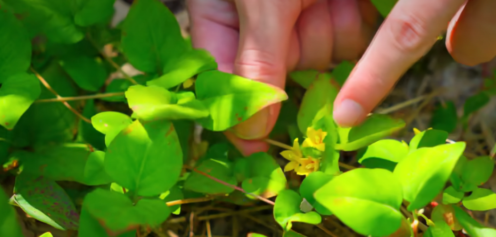

[toc]

# 1 黄芪（黄耆）
黄芪，味甘，性微温，没有毒性。
**主治**：
- 黄芪是补气的药，助肺气 实皮毛 补虚证，五劳窦伤不起。外治庸居，脱毒止痛。是中药里面气药的王。助肺气、实皮毛、补虚损五劳、痘疮不起、外治痈疽、托毒止痛
- 水肿也可以用黄芪，因为要通利三焦（三焦水道出焉），能够祛湿，腹部的积水都可以用黄芪。
- 补虚劳，长期吃黄芪，人健康长寿
- 最重要的功能是大补脾，让脾实
- 固表。
**鉴别好坏**
有一种品质不好的味道，苦的是不能用的。

**用途**：
- 孕妇在做豆浆＆的时候，添加1~2钱，生出的孩子很白（黄芪不要太重）
- 人生了脓疮，皮肤表面的脓疮一直没有收口，甚至疮凹陷下去，可以用黄芪把它升起来，【本经】--神农百草经原文“主痈疽久柏疮”
- 平常吃黄芪，可以美容

**搭配**
- 黄芪+甘草 --> 补气

**相关药方**
- 黄芪建中汤

**拓展**
- 北方的黄耆（北耆）最好
- 脾统少腹，所以腹部的问题一律归于脾脏。
- 脾主肌肉，身上四肢的肌肉，脾主四肢，所以四肢上的问题，肌肉的萎缩，人太廋，可以用黄芪来补
- 生产时，可以重用黄芪，补气，气旺血衰可以助产。

# 2 侧柏叶
**作用**：
生发
**图**:
柏树页上的叶子分支上的分支叫侧柏叶。

# 3 菟丝子
**作用**：
补肾益精，专门治疗茎中寒（茎里面比较寒，精会自动排出，精子不能自守，小便又滴几滴精液子在裤子）。

**使用**：
- 精子太淡，并且不举的人。
- 菟丝子炒菜后再放点酒，效果更强

**禁忌**：
- 阳强不痿者，忌。性功能正常的不要用，不然会不举
- 大便燥急者，忌

**拓展**：
中药所有用到种子的药，都是能补到精子的。

# 4 金钱草（过路黄）
**图**

