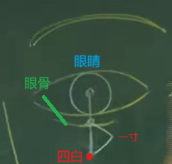
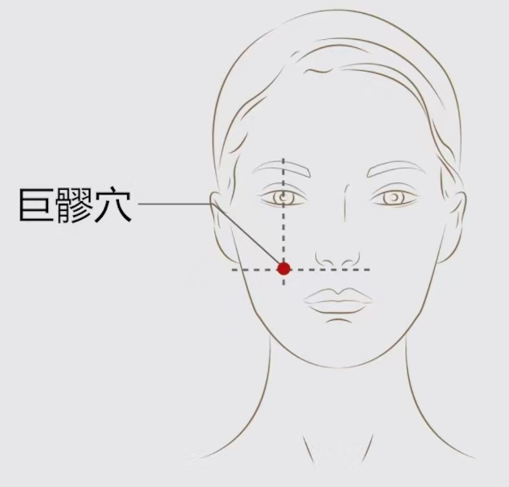
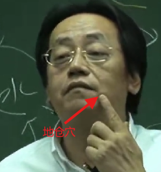
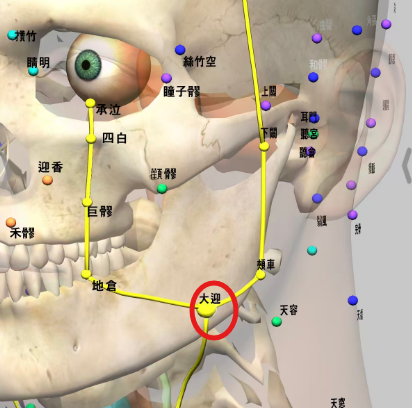

# 1 足阳明胃经介绍

足阳明胃经是从头到脚趾头，共45个穴道。气血到迎香穴手阳明大肠经走完后，就进入头维穴---足阳明胃经的第一个穴道。

辰时（7:00~9:00）气血流注于此。

胃经的把脉在右手的关部，脉实则胃实，即按得越重，脉弹得越强。虚脉就是摸上去脉很大，按下去没有脉。

|左右|寸关尺|穴位|脏腑|
|----|------|---|----|
|左|寸|太渊|心、小肠|
|左|关|经渠|肝、胆|
|左|尺|列缺|肾、膀胱|
|右|寸|太渊|肺、大肠|
|右|关|经渠|脾、胃|
|右|尺|列缺|肾、子宫、胞户|

>右手：寸(太渊)（肺/大肠）、关(经渠)（脾/胃）、尺(列缺)（肾/子宫/胞户）

>左手：寸(太渊)（心/小肠）、关(经渠)（肝/胆）、尺(列缺)（肾/膀胱）

胃是仓禀之官，五味出焉：胃可以分离五味（酸、苦、甘、辛、咸），自然界元素的酸味都是碱性，食物坏掉了也是酸味，但这是不好的酸味，吃了之后胃会呕吐来，这也体现了胃的五味出焉。

脾胃对应的颜色胃黄色，因此胃也被叫做黄肠。

|五俞|穴道|属性|
|----|---|-----|
|井|厉兑|金|
|荣|内庭|水|
|俞|陷谷|木|
|原|冲阳|-|
|经|解溪|火|
|合|三里|土|

足阳明胃经会经过脸，年轻人长青春痘，就是胃火很大，吃了很多但人仍然瘦，也是这个原因，胃气很旺；再加上通宵熬夜，吃油炸类食品，使痘痘更严重。

# 2 足阳明胃经穴位

## 2.1 头维穴

介绍:

足阳明胃经的第一个穴道。
足阳明胃经和足少阳二脉之会。

位置:

- 侧边发际线往上一点，正好在头骨转交处，有一个凹缝。跟本神穴在同一条线上。穴道的位置具体跟额头的大小有关。

摸到头维穴时，讲话会有脉在动。

- 本神旁开一寸五分

- 神庭旁开四寸五分

下针:

针3~5分，禁灸。

治疗:

主头痛。

## 2.2 下关穴

介绍:

位置:

在发际线附近，闭口时用手指摸到附近，开口时，有一个凹陷，此凹陷处即为下关穴。

下针:

《素注》：针三分；灸三壮。《铜人》：“针四分；禁灸”--因为有头发。

下针前，先针对侧合谷穴，止痛；

治疗:

- **下巴脱臼**：脱臼时，把牙龈对到下关穴，然后打上去，就能恢复脱臼。

- **中耳炎**：耳朵里面化脓发炎。

- **牙关痛，不能咬合**: 针之。西医上讲的TMJ.

## 2.3 颊车穴

介绍:

位置:

下巴侧面，咬牙时肌肉会鼓起来，放松时肌肉又松下去。咬合时鼓起来的肌肉为咬肌，咬肌的最高点为[颊车穴](#23-颊车穴)， 放松后取凹陷处。

下针:

治疗:

- **面部中风口歪眼斜**： 地仓透颊车：
（地仓：位于嘴角旁边，凸起来的部分）。
此外还可以用鳝鱼血，涂抹到另外一边，鳝鱼血干的时候拉的力量很强，把口歪拉回来。

- 主中风牙关不开，口噤不语，失音，牙车疼痛、颔颊肿，牙不可嚼物，颈强不可回顾，口眼<ruby>㖞<rt>wāi</rt></ruby>

## 2.4 承泣穴

介绍:

足阳明胃经、阳跷、任脉的会穴。

这个穴位用于辩证时很有帮助，如果眼翳从下方一直往上升，说明是足阳明胃经有问题。

位置:

眼睛中间正下方的眼骨上边缘处。

下针:

禁针，下针会让眼圈变黑。现在32号毫针下针，用于治疗眼翳。

治疗:

- **眼翳**：使用32号毫针.

## 2.5 四白穴

介绍:

位置:

从眼框**正中间**的骨头下一寸处，注意不是从眼珠子开始算。

下针:

针三分,灸七壮. 下针太深会令人目乌色.

治疗:

- 主头痛、目眩、目赤痛、僻泪不明、目痒目肤翳、口眼<ruby>㖞<rt>wāi</rt>噼<rt>pī</rt></ruby>不能言。

## 2.6 巨髎穴

介绍:

手阳明大肠经、足阳明胃经、阳跷脉之会。

位置:

眼睛正下方，与鼻翼下缘水平线的交点，如下图：

下针:

下有动脉，不要针太深，《铜人》：“针三分，得气即泻；灸七壮”

治疗:

- **拔牙后巨髎附近疼痛**： 下针，效果很好。

- **巨髎附近的肌肉麻痹**：在此处下针，下针之前需要取对侧合谷穴。

- 主<ruby>瘛<rt>chì</rt>疭<rt>zòng</rt></ruby>、唇颊肿痛、口<ruby>㖞<rt>wāi</rt>噼<rt>pī</rt></ruby>、目障无见、青盲无见、远视䀮䀮、淫肤白膜、翳覆瞳子、面风鼻<ruby>䪼<rt>zhuō</rt></ruby>肿痈痛、招摇视瞻、脚气膝肿

## 2.7 地仓穴

介绍:

手阳明大肠经、足阳明胃经、阳跷脉之会。

位置:

- 嘴角旁边一点，突起来的地方。
- 夹口吻旁四分，外如近下有脉微动。

> 有地仓说明是有房地产的, 如果没有地仓（地仓凹下去）有以下几种解释： ① 小偷没有地仓 ② 胃气不够，胃经上的气会消掉。
跟地仓对应的有天仓穴，在眉毛角上。如果没有天仓（天仓凹下去）有以下几种解释：① 没有主业 ② 身体很差时，天仓会凹

下针:

针三分

治疗:

- **面部中风--口歪眼斜**：地仓透颊车。

## 2.8 大迎穴

介绍:

很少下针。

位置:

[地仓](#27-地仓穴)和[颊车](#23-颊车穴)的中间。位于下颌骨上方。

下针:

治疗:

## 2.9 人迎穴

介绍:

位置:

下针:

下针时，将颈部的大筋捏住，然后按进入，不要碰到血管，针顺着指甲的位置进5分---治疗甲状腺肿大非常好。

治疗:

主要用于摸脉，人迎处有人迎脉，如果再这里摸得到脉的话，说明胃气是有，病人不会死。

## 2.10 水突穴

介绍:

位置:

1. 颈部大筋前，位于[人迎](#29-人迎穴)前[气舍]上面。

2. 颈大筋中间

下针:

治疗:

## 2.11 气舍穴

介绍:

位置:

1. 颈直[人迎](#29-人迎穴)下，夹[天突]()陷中。

2. 颈部大筋底部

下针:

治疗:

## 2.11 穴

介绍:

位置:

下针:

治疗:

