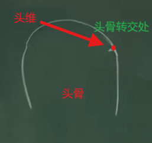
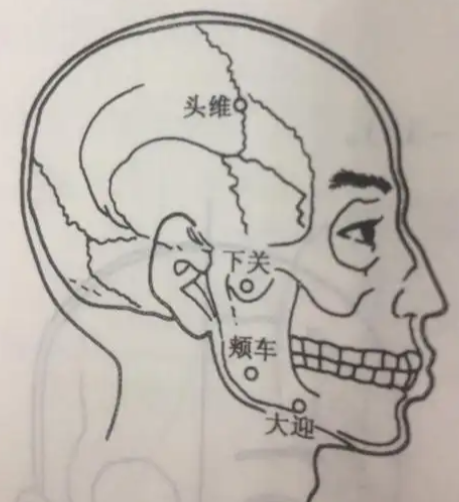

# 1 足阳明胃经介绍

足阳明胃经是从头到脚趾头，共45个穴道。气血到迎香穴手阳明大肠经走完后，就进入头维穴---足阳明胃经的第一个穴道。

辰时（7:00~9:00）气血流注于此。

胃经的把脉在右手的关部，脉实则胃实，即按得越重，脉弹得越强。虚脉就是摸上去脉很大，按下去没有脉。

|左右|寸关尺|穴位|脏腑|
|----|------|---|----|
|左|寸|太渊|心、小肠|
|左|关|经渠|肝、胆|
|左|尺|列缺|肾、膀胱|
|右|寸|太渊|肺、大肠|
|右|关|经渠|脾、胃|
|右|尺|列缺|肾、子宫、胞户|

>右手：寸(太渊)（肺/大肠）、关(经渠)（脾/胃）、尺(列缺)（肾/子宫/胞户）

>左手：寸(太渊)（心/小肠）、关(经渠)（肝/胆）、尺(列缺)（肾/膀胱）

胃是仓禀之官，五味出焉：胃可以分离五味（酸、苦、甘、辛、咸），自然界元素的酸味都是碱性，食物坏掉了也是酸味，但这是不好的酸味，吃了之后胃会呕吐来，这也体现了胃的五味出焉。

脾胃对应的颜色胃黄色，因此胃也被叫做黄肠。

|五俞|穴道|属性|
|----|---|-----|
|井|厉兑|金|
|荣|内庭|水|
|俞|陷谷|木|
|原|冲阳|-|
|经|解溪|火|
|合|三里|土|

# 2 足阳明胃经穴位

## 2.1 头维穴

介绍:

足阳明胃经的第一个穴道。
足阳明胃经和足少阳二脉之会。

位置:

- 侧边发际线往上一点，正好在头骨转交处，有一个凹缝。跟本神穴在同一条线上。穴道的位置具体跟额头的大小有关。

摸到头维穴时，讲话会有脉在动。

- 本神旁开一寸五分

- 神庭旁开四寸五分

下针:

针3~5分，禁灸。

治疗:

主头痛。

## 2.2 下关穴

介绍:

位置:

在发际线附近，闭口时用手指摸到附近，开口时，有一个凹陷，此凹陷处即为下关穴。

下针:

《素注》：针三分；灸三壮。《铜人》：“针四分；禁灸”--因为有头发。

下针前，先针对侧合谷穴，止痛；

治疗:

- **下巴脱臼**：脱臼时，把牙龈对到下关穴，然后打上去，就能恢复脱臼。

- **中耳炎**：耳朵里面化脓发炎。

- **牙关痛，不能咬合**: 针之。西医上讲的TMJ.

## 2.3 颊车穴

介绍:

位置:

下巴侧面，咬牙时肌肉会鼓起来，放松时肌肉又松下去，会跳动肌肉的地方就是[颊车穴](#23-颊车穴)。

下针:

治疗:

- **中风口歪眼斜**： 地仓透颊车：
（地仓：位于嘴角旁边，凸起来的部分）。
此外还可以用鳝鱼血，涂抹到另外一边，鳝鱼血干的时候拉的力量很强，把口歪拉回来。

## 2.4 穴

介绍:

位置:

下针:

治疗:

