# 1 足阳明胃经介绍

足阳明胃经是从头到脚趾头，共45个穴道。气血到迎香穴手阳明大肠经走完后，就进入头维穴---足阳明胃经的第一个穴道。

辰时（7:00~9:00）气血流注于此。

胃经的把脉在右手的关部，脉实则胃实，即按得越重，脉弹得越强。虚脉就是摸上去脉很大，按下去没有脉。

|左右|寸关尺|穴位|脏腑|
|----|------|---|----|
|左|寸|太渊|心、小肠|
|左|关|经渠|肝、胆|
|左|尺|列缺|肾、膀胱|
|右|寸|太渊|肺、大肠|
|右|关|经渠|脾、胃|
|右|尺|列缺|肾、子宫、胞户|

>右手：寸(太渊)（肺/大肠）、关(经渠)（脾/胃）、尺(列缺)（肾/子宫/胞户）

>左手：寸(太渊)（心/小肠）、关(经渠)（肝/胆）、尺(列缺)（肾/膀胱）

胃是仓禀之官，五味出焉：胃可以分离五味（酸、苦、甘、辛、咸），自然界元素的酸味都是碱性，食物坏掉了也是酸味，但这是不好的酸味，吃了之后胃会呕吐来，这也体现了胃的五味出焉。

脾胃对应的颜色胃黄色，因此胃也被叫做黄肠。

|五俞|穴道|属性|
|----|---|-----|
|井|厉兑|金|
|荣|内庭|水|
|俞|陷谷|木|
|原|冲阳|-|
|经|解溪|火|
|合|三里|土|

足阳明胃经会经过脸，年轻人长青春痘，就是胃火很大，吃了很多但人仍然瘦，也是这个原因，胃气很旺；再加上通宵熬夜，吃油炸类食品，使痘痘更严重。

# 2 足阳明胃经穴位

## 2.1 头维穴

介绍:

足阳明胃经的第一个穴道。
足阳明胃经和足少阳二脉之会。

位置:

- 侧边发际线往上一点，正好在头骨转交处，有一个凹缝。跟本神穴在同一条线上。穴道的位置具体跟额头的大小有关。

摸到头维穴时，讲话会有脉在动。

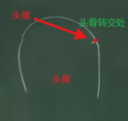

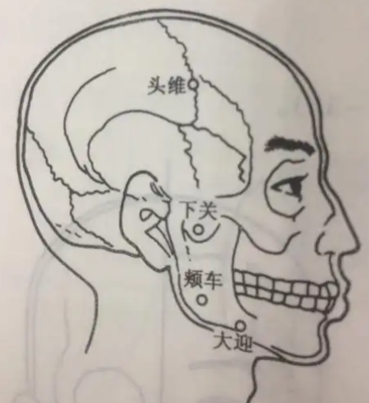

- 本神旁开一寸五分

- 神庭旁开四寸五分

下针:

针3~5分，禁灸。

治疗:

主头痛。

## 2.2 下关穴

介绍:

位置:

在发际线附近，闭口时用手指摸到附近，开口时，有一个凹陷，此凹陷处即为下关穴。

下针:

《素注》：针三分；灸三壮。《铜人》：“针四分；禁灸”--因为有头发。

下针前，先针对侧合谷穴，止痛；

治疗:

- **下巴脱臼**：脱臼时，把牙龈对到下关穴，然后打上去，就能恢复脱臼。

- **中耳炎**：耳朵里面化脓发炎。

- **牙关痛，不能咬合**: 针之。西医上讲的TMJ.

## 2.3 颊车穴

介绍:

位置:

下巴侧面，咬牙时肌肉会鼓起来，放松时肌肉又松下去。咬合时鼓起来的肌肉为咬肌，咬肌的最高点为[颊车穴](#23-颊车穴)， 放松后取凹陷处。

下针:

治疗:

- **面部中风口歪眼斜**： 地仓透颊车：
（地仓：位于嘴角旁边，凸起来的部分）。
此外还可以用鳝鱼血，涂抹到另外一边，鳝鱼血干的时候拉的力量很强，把口歪拉回来。

- 主中风牙关不开，口噤不语，失音，牙车疼痛、颔颊肿，牙不可嚼物，颈强不可回顾，口眼<ruby>㖞<rt>wāi</rt></ruby>

## 2.4 承泣穴

介绍:

足阳明胃经、阳跷、任脉的会穴。

这个穴位用于辩证时很有帮助，如果眼翳从下方一直往上升，说明是足阳明胃经有问题。

位置:

眼睛中间正下方的眼骨上边缘处。

下针:

禁针，下针会让眼圈变黑。现在32号毫针下针，用于治疗眼翳。

治疗:

- **眼翳**：使用32号毫针.

## 2.5 四白穴

介绍:

位置:

从眼框**正中间**的骨头下一寸处，注意不是从眼珠子开始算。

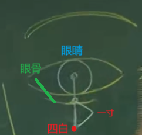

下针:

针三分,灸七壮. 下针太深会令人目乌色.

治疗:

- 主头痛、目眩、目赤痛、僻泪不明、目痒目肤翳、口眼<ruby>㖞<rt>wāi</rt>噼<rt>pī</rt></ruby>不能言。

## 2.6 巨髎穴

介绍:

手阳明大肠经、足阳明胃经、阳跷脉之会。

位置:

眼睛正下方，与鼻翼下缘水平线的交点，如下图：

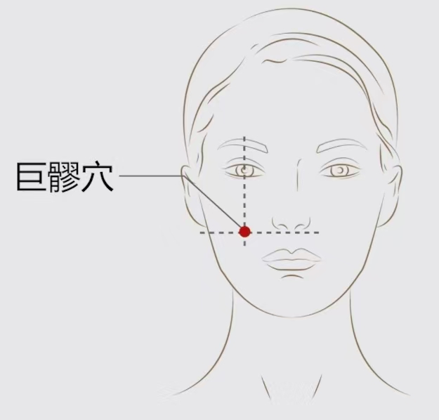

下针:

下有动脉，不要针太深，《铜人》：“针三分，得气即泻；灸七壮”

治疗:

- **拔牙后巨髎附近疼痛**： 下针，效果很好。

- **巨髎附近的肌肉麻痹**：在此处下针，下针之前需要取对侧合谷穴。

- 主<ruby>瘛<rt>chì</rt>疭<rt>zòng</rt></ruby>、唇颊肿痛、口<ruby>㖞<rt>wāi</rt>噼<rt>pī</rt></ruby>、目障无见、青盲无见、远视䀮䀮、淫肤白膜、翳覆瞳子、面风鼻<ruby>䪼<rt>zhuō</rt></ruby>肿痈痛、招摇视瞻、脚气膝肿

## 2.7 地仓穴

介绍:

手阳明大肠经、足阳明胃经、阳跷脉之会。

位置:

- 嘴角旁边一点，突起来的地方。
- 夹口吻旁四分，外如近下有脉微动。

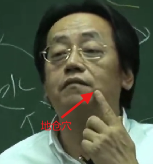

> 有地仓说明是有房地产的, 如果没有地仓（地仓凹下去）有以下几种解释： ① 小偷没有地仓 ② 胃气不够，胃经上的气会消掉。
跟地仓对应的有天仓穴，在眉毛角上。如果没有天仓（天仓凹下去）有以下几种解释：① 没有主业 ② 身体很差时，天仓会凹

下针:

针三分

治疗:

- **面部中风--口歪眼斜**：地仓透颊车。

## 2.8 大迎穴

介绍:

很少下针。

位置:

[地仓](#27-地仓穴)和[颊车](#23-颊车穴)的中间。位于下颌骨上方。

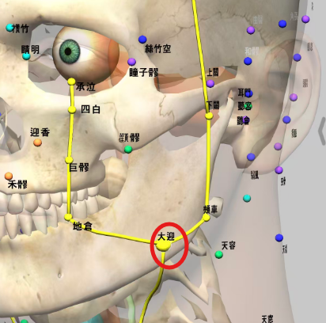

下针:

治疗:

## 2.9 人迎穴

介绍:

足阳明、足少阳之会。

**人迎穴命名**： 人为生命和身体，迎为喉结旁的动脉；此穴在迎接天地五脏之气的位置，因此被称为‘人迎’

位置:

1. 颈部大筋最上面。

2. 脖子45度扭头，可以看见脖子处的大筋，人迎穴平行于喉结，在颈大筋前缘。（甲状软骨的外缘）

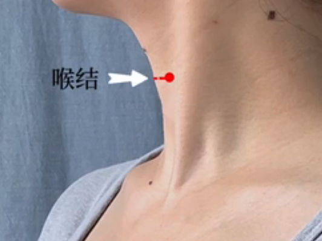

下针:

治疗:

主要用于摸脉，人迎处有人迎脉，如果再这里摸得到脉的话，说明胃气是有，病人不会死。

- <ruby>瘰<rt>luŏ</rt></ruby>疬: 

## 2.10 水突穴

介绍:

水为水谷，突为穿过，穴位临近食道和呼吸道的开关(喉软骨)，因此被称为水突穴。

位置:

1. 颈部大筋前，位于[人迎](#29-人迎穴)下、[气舍](#211-气舍穴)上面。

2. 颈大筋中间。以与喉结平行的筋大筋处为顶点，颈大筋与胸腔相连处为底点组成的线段中间。

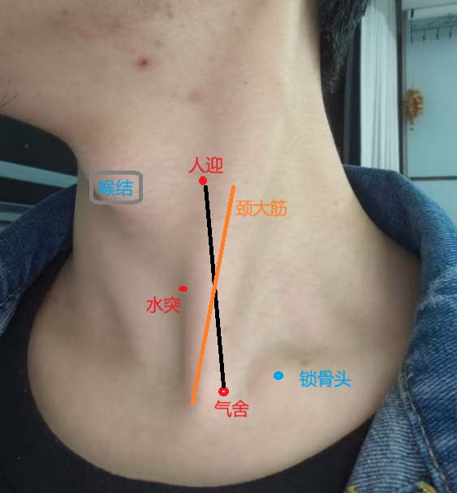

下针:

下针时，将颈部的大筋捏住，然后按进入，不要碰到血管，针顺着指甲的位置进5分---治疗甲状腺肿大非常好。

治疗:

- <ruby>瘰<rt>luŏ</rt></ruby>疬: 甲状腺肿大。

## 2.11 气舍穴

介绍:

位置:

1. 颈直[人迎](#29-人迎穴)下，夹[天突]()陷中。

2. 颈部大筋底部，锁骨头与大筋底部之间，筋大筋底部外侧。

下针:

治疗:

## 2.12 缺盆穴

介绍:

位置:

锁骨正中央，有弧度的地方。

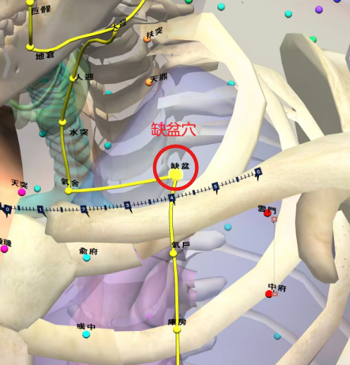

从缺盆穴到后面的乳根穴都是在一条竖线上，距离任脉四寸。
因此寻找缺盆穴，也可在乳头正上方，与锁骨交界处，在锁骨的上缘。

下针:

深针下去会扎到肺， 不可。

治疗:

“主息本、胸满、喘急、水肿、瘰疬、喉痹、汗出寒热、缺盆中肿，外溃则生、胸肿热满，伤寒胸热不已”

## 2.13 气户穴

介绍:

位置:

[气户](#213-气户穴)跟[缺盆穴](#212-缺盆穴)仅隔着一根锁骨。[缺盆穴](#212-缺盆穴)下来就是[气户](#213-气户穴)

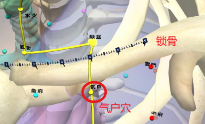

- 从乳中垂直向上，与肋骨相交，位于肋骨下缘。

下针:

针三分。下针时，针在缺盆旁开5分的位置斜刺进去。

治疗:

“主咳逆上气、胸背痛、咳不得息、不知味、胸肋支满、喘急”

## 2.14 库房穴

介绍:

位置:

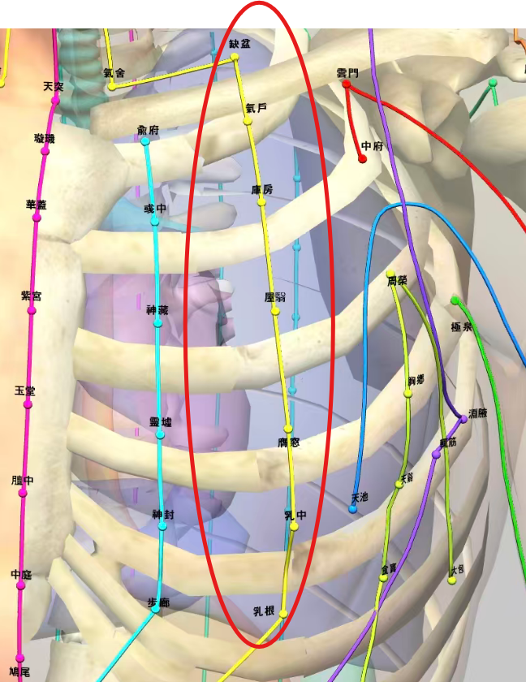

下针:

灸五壮，针三分。

治疗:

“主胸胁满、克逆上气、呼吸不至息、唾脓血浊沫”

## 2.15 房翳穴

介绍:

位置:

下针:

灸五壮，针三分。

治疗:

- 乳房硬块

## 2.16 膺窗穴

介绍:

位置:

下针:

治疗:

“主胸满短气、唇肿、肠鸣注泻、乳痈寒热，卧不安”

- 乳房硬块

- 针膺窗 + 乳根，可以让女人丰胸。

## 2.17 乳中穴

介绍:

络足阙阴肝经，这也是为什么有乳癌的病人，会转移到肝癌。如果妇女在哺乳期间，如果心情恶诅，会造成奶水淤积在乳房里。奶水在里面淤积不出，日久会变成硬块，如果不加任何干预，十几年后会引发乳癌而亡。

初为母乳的孕妇，如果奶水出不来，这时使用葱头切下来，先用葱白的地方涂抹乳中，然后再用葱的尾巴刷乳头刺激一下，奶水就出来了。因为葱白辛辣发散。

位置:

从乳中一路垂直往上看，[乳中]()-->[膺窗]()-->[房翳]()-->[库房]()-->[气户]()-->[缺盆]()都是膈一个肋骨一个穴道（骨头间隙中间）。

下针:

禁针灸。

[乳中]()--[膺窗]()-->[房翳]()-->[库房]()-->[气户]()-->[缺盆]()这几个穴道下针时，都是在前5分的地方斜刺进去，不要直刺。例如[乳中]()，左边的乳中下针时，在[左乳中]()的水平靠正中间5分的地方斜刺下针。

治疗:

从[不容穴]到[气动穴]这条足阳明胃经的竖线距离任脉是两寸。

## 2.18 乳根穴

介绍:

位置:

下针:

灸五壮，针三分。

治疗:

“主胸下闷、胸痛、膈气不下食、噎病、臂痛肿、乳痛、乳痈，凄惨寒痛，不可按仰、咳逆、霍乱转筋、四厥”

- 乳房硬块

- 同时下针膺窗根乳根，可以让女人丰胸。丰隆穴也可以丰胸。

## 2.19 不容穴

介绍:

不容，即食物不容纳。当吃饭后肚子很胀不消化，可以选取这个穴道，这就是所谓“近取穴”。近取穴的时候，不分虚实寒热，只有在手脚上才会进行补泻。

位置:

距离任脉[巨阙穴]()旁开2寸。

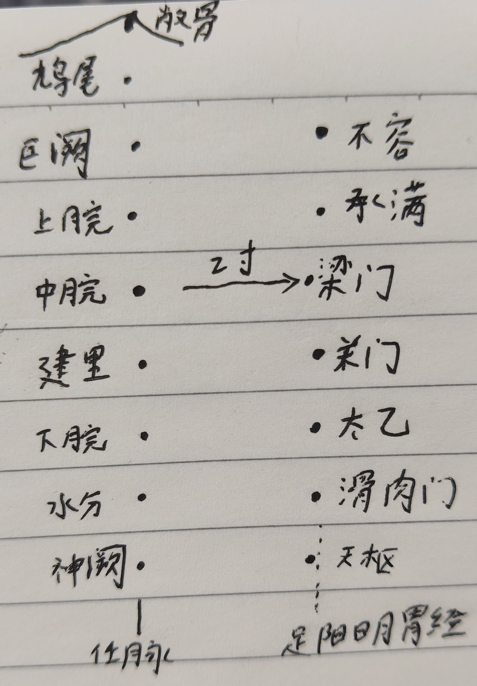

下针:

治疗:

## 2.20 承满穴

介绍:

位置:

[上脘穴]()旁开两寸。

下针:

治疗:

- 胃口不开，吃一点东西就饱了。常常胀满

## 2.21 梁门穴

介绍:

位置:

[中脘穴]()旁开两寸。

下针:

治疗:

- 可以辅助中脘穴，如果针中脘后，胃里还难过，可以下此穴。

## 2.22 关门穴

介绍:

位置:

[建里穴]()旁开两寸。

下针:

治疗:

## 2.23 太乙穴

介绍:

增高的穴道。

位置:

[下脘穴]()旁开两寸。

下针:

作用:

- 灸之后可以开胃

## 2.24 滑肉门穴

介绍:

增高的穴道。

位置:

[水分穴]()旁开两寸。

下针:

作用:

- 灸之后可以开胃

## 2.25 天枢穴

介绍:

大肠的募穴。

位置:

[神阙穴]()外开两寸。

下针:

作用:

- 辅助神阙穴，当隔盐灸神阙后，腹泻肠鸣还有则针/灸此处

- 用于帮助诊断便秘时，确认大便是否堵塞在大肠里面（可能堵塞在大肠/小肠/十二指肠/胃...）。如果指按这个穴的时候，很痛，说明是燥矢/宿便

> 燥矢到后来容易发精神病。因为小肠的火把大肠中的食物和残渣汽化后，汽化的水中还带有大肠的燥，这个燥会在横膈膜被挡住，只有清气能够上升。如果燥气太强了，横膈膜挡不住，燥气上来后，人就会发狂奔走。 因为精神病人都有便秘的现象。

> 宿便有两种，寒和热。寒说明大肠没有蠕动，病人不会痛。热说明大肠是蠕动的，但因为有宿便，因此蠕动会痛；
有宿便说明是时，又痛，说明是热，因此称为热实。
如果是寒症，在天枢穴上灸会比针好。如果是热症，则在天枢穴上针

**腹四针**： 中脘、关元、天枢穴(两边)。治理消化系统的腑病是最好的。
如果是热症，则针中脘、关元、天枢(两边)
如果是寒症，则针中脘、关元， 灸天枢穴(两边)

这里下针的时候部分虚实，平补平泻即可。

## 2.26 外陵穴

介绍:

位置:

[阴交穴]()旁开两寸

下针:

治疗:

## 2.27 大巨穴

介绍:

位置:

[石门穴]()外开两寸

下针:

治疗:

## 2.28 水道穴

介绍:

位置:

[关元穴]()外开两寸

下针:

治疗:

- [水分]()和[水到穴]()常常合并在使用；一起用的时候能够通利水，用于治疗水肿，肚子的腹水。

## 2.29 归来

介绍:

位置:

[中极穴]()旁开两寸

下针:

治疗:

- 专门治疗睾丸上缩到腹部中
- 睾丸转动导致血管缴在一起

## 2.30 气冲穴

介绍:

像中极、气冲、归来、关元这些围绕在妇人子宫卵巢附近，常常灸这些地方可以帮助妇人怀孕。

位置:

曲骨外开两寸

下针:

治疗:

## 2.31 髀关穴

介绍:

位置:

- [伏兔穴]()直上6寸

下针:

治疗:

- 脚抽筋、脚无力

## 2.32 伏兔穴

介绍:

位置:

- 膝盖头直上6寸；因为阳经在外侧，因此在膝盖头上6寸后，在外侧一点寻找肌肉与肌肉的缝隙下针

- 过去找穴道是跪下来，大腿肌肉凸起来的地方，像兔子趴在那里。那个地方就是伏兔穴。

下针:

禁灸。

治疗:

- 手脚抽筋、脚无力

- 脚膝冷

## 2.33 阴市穴

介绍:

位置:

以面对左脚为例，阴市穴位于膝盖头上一寸，再外开一寸，再上一寸；如下图所示。

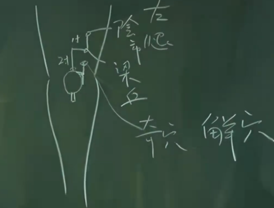

下针:

治疗:

- 感觉膝盖里面冷（近取穴原则）

## 2.34 梁秋穴

介绍:

足阳明胃经的**郄穴**。

郄穴是在炎症的时候用于消炎。

位置:

以面对左脚为例，**梁秋穴**位于膝盖头上一寸，再外开一寸；如下图所示。

下针:

没有所谓补泻，因为不是井荣俞经合穴（手不过肘，足不过膝）。

治疗:

- 青春痘生在脸上足阳明胃经经过的穴道。

## 2.35 解穴

介绍:

经外奇穴。

人身体上有两个解穴，一个是此处这个穴，另一个是[少府穴]()

位置:

以面对左脚为例，在膝盖头外侧有一个直角形状的骨头，该骨头上一寸为**解穴**

下针:

治疗:

- 如果下针[太渊]()、[经渠]()不小心碰到血管，可以在对侧针解穴。
下针引起的针感很痛，都可以在解穴把它恢复。

- 过去武功高强的人点穴后，可在解穴处解掉

## 2.36 犊鼻穴

介绍:

位置:

膝盖骨下方韧带的中间。

下针:

不可深针，会带油馕出来

治疗:

## 2.37 膝眼

介绍:

经外奇穴。

位置:

膝盖骨下方韧带两边凹陷处。

下针:

治疗:

治疗膝盖关节炎、膝盖伤痛、痛风、肿胀、扭伤的时候有“五穴四针”效果很好：
 - 膝盖骨上方骨缝处（[鹤顶穴]()）
 - 两个膝眼
 - [阳陵泉]() 透 [阴陵泉]()
>在膝眼上下针的时候，针刺进去的方向要注意，从上面看的时候是一个直角，从前面看是八字形。针刺使用雀啄术，平常使用一寸半的针，膝盖肿得很大时用三寸针，针底到骨头边。
下膝盖附近的穴位不要左右捻针，会把油囊刺破导致膝盖受伤。

## 2.38 足三里

介绍:

胃经的**合穴**(土)，在五俞穴中属土（阳经的井荣俞经合-->金水木火土），足阳明胃经属阳土，因此这个穴道也是足阳明胃经的**本穴**---虚症实症都可以在这里治疗。

足三里是一个很大的穴道，很常用，主治一切的胃症。

在中医的观念中 ，男人年过三十就要开始多灸足三里。中医认为有胃气则生，无胃气则死，常灸足三里胃气就会很好；因此在临床的时候，不管是治疗什么病，如果病人的胃口恢复了，说明治疗是正确的。

足三里可以把燥热之气导下来，因此如果在上半身灸的时候，如果灸过头了，可以灸足三里引火下行

位置:

- 膝盖头下三寸

- 度骨法：顺着足的胫骨往上摸，摸到骨头开始高起来的地方，向外开一寸即为足三里。

>如果要确定是否找准了足三里，可以摸着[冲阳脉]()，会有脉动，这时重压足三里，这个脉动会消失说明找准了穴道。

下针:

治疗:

- 恶心、呕吐
- 脚没有力
- 平时保养身体的时候也灸，灸百壮都没有关系。
- 血压高时，脸红，阳明热，可以在足三里下五分的地方，斜着45度往上刺，可以让阳明热退下来。

12章9：47

## 2.39 穴

介绍:

位置:

下针:

治疗:
