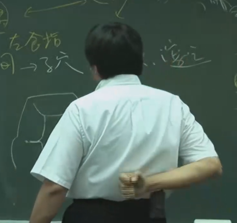

- 瘿瘤: 包含甲状腺肿瘤、淋巴腺肿瘤、腋下的肿瘤

- 我们抬肩有三个动作，
如果手没有办法往前/侧抬，说明是大肠经的问题。

手不能做梳头动作，是三焦经的问题

手不能往后摆，是小肠经的问题

- **斗鸡眼/内偏/外偏**:

病因: 
在婴儿时期, 小孩在睡觉, 但家里的一侧窗户或灯是开着的(容易吸引视线的东西), 小孩眼珠就会偏向那一侧去看. 看久了眼睛就偏向一边, 形成内偏/外偏. 当灯在中间, 就容易形成斗鸡眼. 

治症: 
点两个小灯在两边,小孩不知道该看哪个,就看中间, 回正.

- **<ruby>瘛<rt>chì</rt>疭<rt>zòng</rt></ruby>**

**医书记载**
《灵枢·热病》：“热病数惊，瘛疭而狂。”

《伤寒明理论》卷三：“瘈者筋脉急也，疭者筋脉缓也。急者则引而缩，缓者则纵而伸。或缩或伸，动而不止者，名曰瘈疭。”

**名词解释**
亦作瘈疭、痸疭，又称抽搐、搐搦、抽风等。指手足伸缩交替，抽动不已的病证。多由热盛伤阴，风火相煽，痰火壅滞，或因风痰，痰热所致。治宜平肝熄风、清心泻火、祛风涤痰等法。

亦有热伤元气者，四肢困倦，指麻瘛疭，宜人参益气汤。有脾胃虚弱者，呕吐泄泻，时作瘛疭，宜补中益气汤加桂枝、附子。有肝脏虚寒者，胁痛，眼目昏花，时时瘛疭，宜续断丸。有失血之后，气血耗伤，筋脉失养而瘛疭者，宜八珍汤加减。本证可见于外感热病、癫痫、破伤风等多种疾病。

