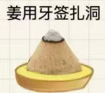
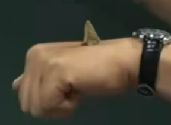
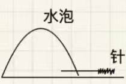
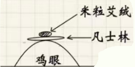
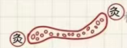
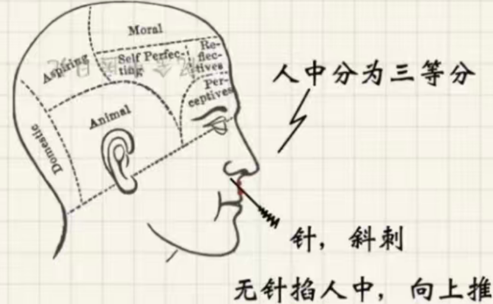
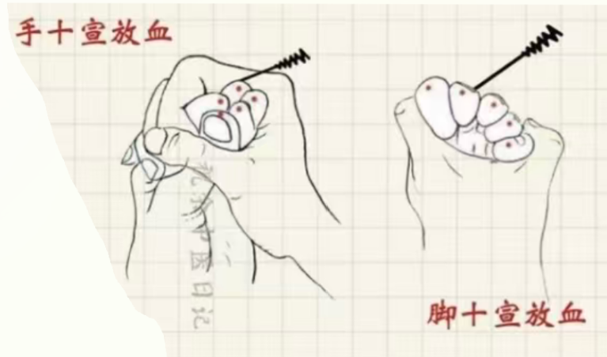
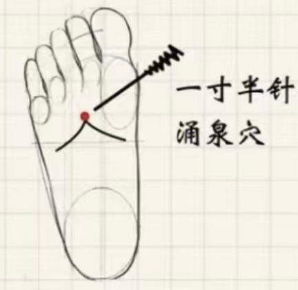
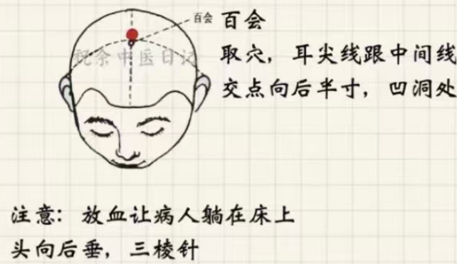
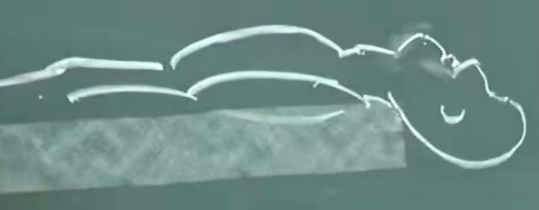

# 0 针灸介绍

针灸分为‘针’和‘灸’。针灸比中药早约一千年，在治病的时候，针灸可以用在所有的疾病上面。

在灸的时候，我们使用艾绒。

艾，性向下（药力是向下的）。在针力不能及的地方，我们常常会用到灸。

> 在古代，部队打仗开拔的时候，最重要的是水。在找水源的时候，将艾草收集起来堆成小山丘，然后用火烧，然后在方圆5里的地方找，看什么地方有烟升起。在有烟升起的地方往下挖，就可以找到水源。
因为艾的性是向下走的，在烧的时候，它会去找水源，找到后往上升。

## 0.1 针灸的原则

- **病进和病退的原则**：
    - 病进： 不管是痛、痒或者其他什么，一定是沿着四肢末梢，对着身体方向走
    - 病退：由身上往四肢走。比如开始是痛再肩膀/腰， 扎完针后，痛在四肢

   当病退的时候，处方、针灸不能改，直到退尽为止。

- **治病原则**： 下针的时候，左病右治，右病左治。例如带状疱疹在天应穴上灸。

- **判断灸的程度**: 痛灸到不痛，不痛灸到痛。
> **不痛灸到痛**：例如脂肪瘤，用隔姜灸在患处灸，本来不痛，你一直灸它，艾的力量一直往下走，当碰到患处的根时，产生疼痛，这时候停止灸。
**痛灸到不痛**：例如脓疱, 开始很痛，随着灸的进行，里面的脓被艾排挤?， 艾的力量达到下面的好的皮肤时就不痛了, 这时候停止灸。

# 1 针灸的使用时机

**以下情况不能下针**：

- 病人在气血大虚的时候不用针灸。
气血大虚：刚刚失过很多血

- 刚行完房事后

- 剧烈运动，流了大汗后

- 酒醉后（三棱针扎醒酒穴（打耳洞的地方））挤两滴血出来就好了

> 基本上大原则是：人在体力很虚的时候、元气不够的时候不针。因为扎针下去，也会伤一定的元气，这时候可以用灸的方式。

# 2 灸的种类

灸的种类分为`隔姜灸`、`隔盐灸`、`隔蒜灸`、`米粒灸`。

## 2.1 隔姜灸

隔姜灸是使用最普遍的方式。

**方式**： 使用新鲜的生姜，切片（切成厚度约2.3毫米， 直径约2.8厘米的片状， 在上面扎几个小孔），然后放**一壮**艾草放在生姜上并点燃。**一壮**艾草放手心搓成金字塔状。隔姜灸示意图：

灸到感觉到温热，就可以把艾绒拿掉，换下一壮（生姜片不用经常换， 如果灸的壮数比较多，生姜干掉了，就换下一片）。在灸的时候是灸单不灸双，灸阳数壮(3,5,7,9)，因为艾除了性向下外，也是性纯阳，因此端午节的时候，会用艾草来避邪。

> **一壮的单位**： 手掌弯曲，在手心凹一小坨称为一壮。
一壮的大小如下图：

**膏肓灸百壮**: 如果遇到重病，病人病入膏肓，束手无策的时候，可以灸膏肓穴. 灸百壮，几百壮都没有关系。灸到口干舌燥都行。按照中医的记录，无所不疗。

> 如果因操作不当，导致烫伤，皮肤处出现水泡。可用消毒后的针从水泡底部沿着皮肤扎个孔，慢慢按水泡将液体排出来。这样皮肤会贴合得很好，不会留疤。

也有故意灸出水泡的说法，叫做疤痕灸，但一般不需要这么过。

## 2.2 隔盐灸

**方式**：将盐（海盐或青盐， 不能用精炼后的盐）炒熟之后。等盐温度降下来后，放到需要灸的地方，再将艾绒放上去灸。
一般神阙穴（肚脐）比较适合用隔盐灸

> **青盐**: 青海来的盐，大小比黄豆还大一点，淡青色，炒过之后变为红色。一般海盐炒过之后就会变成红色/暗红色。

**使用时机**: 常常用于下痢不止。痢有两种--寒痢、热痢， 寒痢大部分是用灸，因为灸是阳性。

> **简单的寒热观念**：‘寒’就是没有消化，吃进去的是什么灸拍出来的什么，寒痢的大便没有什么味道。‘热’的大便很臭，腥臭。

## 2.3 隔蒜灸

**方式**：将蒜切成跟隔姜灸使用的生姜差不多的大小的片，在蒜片上戳洞；然后使用艾在上面灸。

> 有的蒜一瓣就是一整颗，建议使用这种蒜。

**使用时机**：病人久咳。将舌头伸出来，将蒜放上去，点上艾进行灸。因为蒜是白色的、辛辣的，中医上讲“色白的入肺，辛辣的也入肺”，同时“舌为心表”，舌头一直往外顶的时候心脏力量在加强，心和肺是接近的。
灸肺的问题，就会使用到**隔蒜灸**。

## 3.4 米粒灸

**方式**：将艾绒搓得像米粒那么大，使用凡士林固定到穴道上，用香点燃艾绒进行灸。例如治疗鼻窦炎的时候，会赛一些到穴道上面、 或者治疗鸡眼的时候，在鸡眼上用米粒灸。

# 3 灸的用途

灸的用途非常广，比如毒物咬伤、破伤风。

> **破伤风灸的处理方法**: 当感染破伤风的时候，例如破伤风感染处在手指，一条红线从伤口处一直沿着手向身体延申(这叫**病进**)。 这时使用**隔姜灸**在线头处进行灸，当线往后退之后，再到新的线头处隔**隔姜灸**。一直退到手心劳宫穴后就可以不用灸了（继续灸也可以）

> **疱疹灸的处理方法**: 
①用灸的方式治疗疱疹有两种方法，对于带状疱疹（蛇缠腰），可以在‘带’的端点处进行隔姜灸。如下图所示：

② 采集蜘蛛网敷在疱疹处（薄薄一层），用火烧掉网，约5天后痊愈。
③ 也可用棉花代替蜘蛛网，薄薄一层，用一点凡士林于患处粘住，点燃棉花烧掉。（烧一次即可）
同时也可用全蝎粉，放胶囊里吃。

# 4 不适合灸的情形
一般来讲，热症不灸，例如感冒发烧。

 **不能灸的位置**

- 多汗的地方不能灸， 例如鼻子、头顶、腋下、手掌、背后
- 阴部不灸

**针灸的禁忌**

- 针和灸不能并施。

> 过去有歌诀：针而勿灸，灸勿针；针经为此长叮咛；针灸并施，徒增患者炮烙刑。

# 5 针灸的急救方式

- **针'人中'**：从鼻正中央的下方到上嘴唇上方划线，分为三等份。从下往上数，针从第一个等分点向脑部斜刺。如下图

- **'十宣'放血**: 使用放血针将十个手指头扎一遍，挤出血。十个手头放完血如果还没醒来，放脚的十个指头。如下图所示：

- **涌泉**：将脚握住，脚底板两条人字纹交汇处即为涌泉，用一寸半的针扎下去，两个脚都放血。这是急救的大穴。

- **百会**： 让病人趟床上，头向后垂 ，用放血针在百会穴处扎破，放血。

病人躺平姿势如下：

血往下走的时候，病人会感觉头部清凉，当清凉到达眼睛时，眼睛睁开；凉到达嘴巴时，嘴可以说话。

# 火罐

> 过去，郎中出门的时候灸带一个药囊，里面放有蚂蝗。疡医（专治脓疡）用于蚂蝗治疗脓，因为蚂蝗专门吸食腐坏的东西，并且蚂蝗的津液有麻醉效果。
用火罐的时候，是用罐子，将火放到罐子里将里面的氧气消耗，然后迅速扣到患处。
在今天可以用拔火罐的器械，还有不痛大小用于选择。

**火罐的用法**：
- 现代可以使用火罐，用于吸脓、活血化瘀、抽淤血(在血变红时就可以停止)。

- 如果被竹子、海胆等刺 刺到，也可以用火罐将刺抽出来，这样刺不容易断。

**不能使用火罐的地方**：乳中、多汗的地方、头部。

> 火罐一般用于四肢，用在外科急性扭伤的地方很多。例如跑步时，膝盖扭伤，可用火罐拔痛的地方，这个无所谓穴道在哪里。当时受伤就上火罐，会恢复得很快。

> **火罐治疗痔疮**：对于外痔很大时，可以用放血针在痔疮上放血然后用火罐吸。
