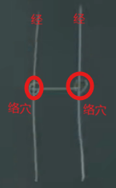

人的正经有十二条，奇经八条。其中十二正经分为6条阳经和六条阴经。

**八脉**：任脉、督脉、冲脉、带脉、阳蹻、阴蹻、阳维、阴维

十二正经中每条经都有井、荣、俞、经、合的穴道。在下针的时候在手肘以下和膝盖以下，原则上在井荣俞经合上取穴，所谓“手不过肘，足不过膝”， 在这上面取穴是安全的，不会死人。

阴经的井荣俞经合穴道对应的五行属性为木火土金水，阳经对应的井荣俞经合对应的五行属性为，金水木火土

|穴|阳经|阴经|
|---|---|---|
|井|金|木|
|荣|水|火|
|俞|木|土|
|经|火|金|
|合|土|水|

>在五行上阳经的井荣俞经合对应的五行属性克制阴经的井荣俞经合的五行属性

十二正经每条经上都有**络穴**，阳经上还有**原穴**，阴经上没有原穴。

>**络穴**: 经之间相桥梁与经相连的点 

**井荣俞经合穴道的作用**：
|穴|作用|季节|
|--|----|----|
|井穴|井主脏，主'心下满',病在脏时取井。井穴都在手指,脚趾的末梢|主冬天。|
|荣穴|病变在颜色（青赤黄白黑），例如脸色发青，病在肝；脸色发黑，病在肾等。病症出现颜色的时候，在下针选穴时，大部分选取荣穴。|主春季|
|俞穴|病在时间者取之。即病在某段时间就发作(对应地支歌的时间)，那么下针时，通常取俞穴。例如病人每天晚上12点醒来，说明病发在胆，这时取胆经的俞穴|主夏天|
|经穴|病变于音者取之。例如感冒导致的声音沙哑，可从经穴上治疗|主长夏|
|合穴|饮食不节、胀满的病取之， 味道、气味时取之， 例如口中发苦。因此吃饭七八分饱是最好的，这样可以不断地训练胃气|主秋|
|原穴|安五脏，五脏不平衡的时候使用|

>针灸是非常灵活的，例如有病人每天晚上11点都发癫痫，11点是开胆经，似乎癫痫合胆没有什么关系，但通过胆经的俞穴一样可以治疗。中医并比较接近哲学

>**长夏**: 在季节交替的时候，上一个季节末尾取两周，下一个季节初始取两周，这样凑齐一个月，一年4次季节交替，总共取了3个月。这3个月的时间称为长夏。因此在说长夏的时候，是指节气、季节在交换。从这点上理解，一般在换季的时候容易感冒，感冒就很有可能导致声音改变，在井荣俞经合中，经穴一般在病变与音者取之，对应的季节也刚好是长夏。

>**中医的阴阳观念**： 春夏适合养阳，秋冬适合养阴， 因此春夏时要练力气，多运动； 秋冬的适合要收敛(房事节制、不要暴饮暴食等)。阴有形，阳无形，例如手的外观的看得见的(皮肤、肌肉、血管等)，属于阴，但手有多大力气是看不见的，属阳。

>**中医的生克**：正常人的五行是相生的木(肝)-->火(心)-->土(脾)-->金(肺)-->水(肾)， 当某个器官发生病变的适合，就会去克制别的器官，相克为金(肺)-->木(肝)-->土(脾)-->水(肾)-->火(心)-->金(肺)。
因此中医中的‘上工治未病， 而不治已病’，是指当一个脏发生病的时候，需要去强被它克制的脏，那么病就不会进。例如肝病的时候，因为木克土，图个这时候病人的胃口还可以，那么需要去强脾，这样肝病就不会进。强脏器的时候有很多种方式，在去强对应脏器的时候，也可从情志上入手。

**情志与五脏**：
|脏器|情志|
|----|----|
|肺|忧|