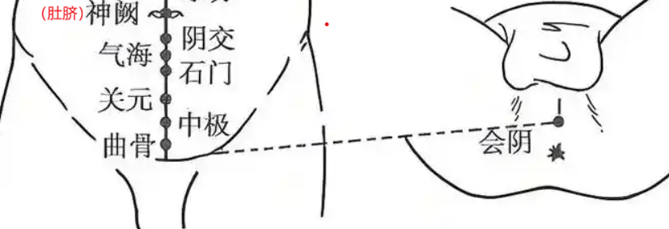
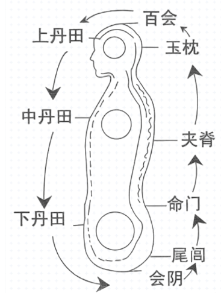
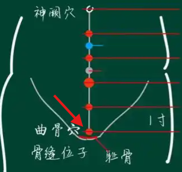
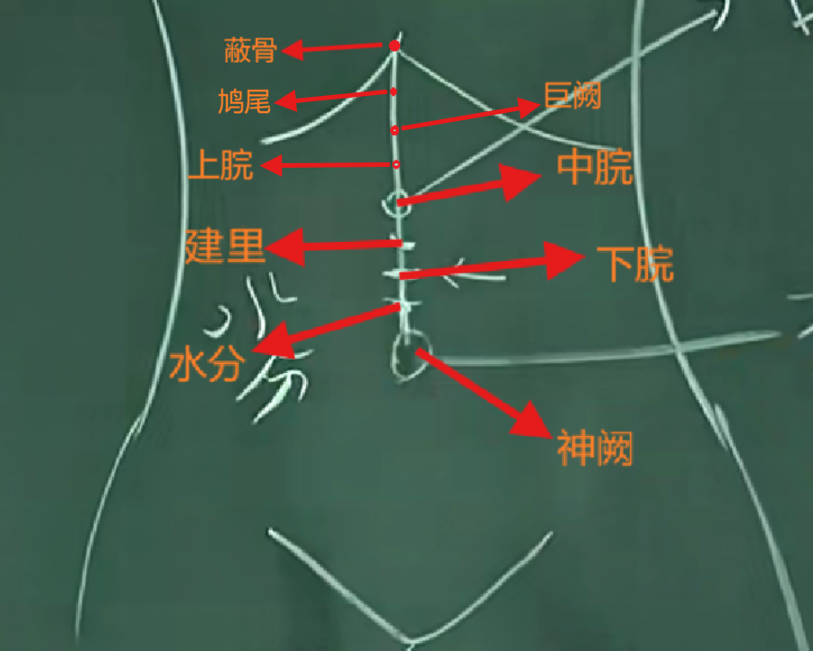

|目录|
|----|
|[1 任督二脉介绍](#1-任督二脉介绍)|
|[2 会阴穴](#2-会阴穴)|

# 1 任督二脉介绍

**任脉介绍**：“女子妊也”，女子怀孕就靠任脉。后续在找穴道时，也是以任督二脉作为基准，很快就能找到穴道。任脉是诸阴之会，所有的阴经(正经十二条种的六阴经)汇集在这里。任脉上有24个穴道，其中第一个穴道就是会阴(任脉起于会阴)
任脉**没有**井荣俞经合。

**任脉上的穴道找法**：从曲骨到神阙画一条线，这两个穴道中间隐隐可以看见黑黑的一条线，这条线就是任脉。将曲骨到神阙这条线平分为5段（一段称为一寸），每个分段点都对应一个穴道，此外从上往下的第一点第二个点的中间那点称为**气海**（脐下一寸半）。

**督脉介绍**：诸阳之会，全身的阳经(正经十二条种的六阳经)都汇集在督脉上。

>无论如何不要让别人动你的脊柱(督脉所在)。脊柱受伤的人不长寿，比如天柱倾(脖子都歪了)，命危在旦夕。

任督二脉在人中会合。说话的时候，任督二脉是打开的。当舌顶上颚（牙齿合牙龈的中间）的适合，任督二脉是通的，人会长寿。

>气脉/气血的留驻为“后升前降”，‘后升’是指从背后的督脉往上升，‘前降’为从前面的任脉向下降。

>道家在练气的时候，有人说内视(内视时需要把四个东西闭起来耳、眼、嘴， 然后慢慢把气息降下去把鼻子闭起来， 心静下来，口中产生的津液需要吞下去)关想在气海，有人认为关想在关元。从中医上来讲，将观想放在关元处是对的。

>**后升前降**：中医上认为脖子是冷却枢纽。小肠相火，肾脏在小肠的后方，肾脏相水(所以下焦是一个水火同源的地方)。小肠的火来自心脏，心产生的热，心为火，受制于金，肺气肃降，降热导入小肠(心脏合小肠中间有大动脉), 所以正常人，身体的中间是最热的地方。当小肠很热，肾脏在小肠的后面，小肠的热会把肾脏中的水气化，水从肺里的津液进入肾脏时是凉的，小肠加热汽化后，津液会沿着督脉进入脑部来滋养脑。
但水汽很热，如果直接进入脑会降脑烧坏，这时脖子起到的作用就是给这股热汽降温。这就是为什么冬天冷的时候，把脖子缩一点，就会感觉暖和一点的原因，因为把脖子的冷却开关关了。
这个气到达脑部后，会从前面回归道小肠，再回到关元， 这就是所谓的‘后升前降’。

## 1.1 会阴穴

**说明**:
任脉的起点。

**位置**:
- 对于男人，将推张开，睾丸拉起来，会阴穴位于肛门与睾丸的中间。
- 对于女人，会阴穴位于阴道和肛门的中间。

**会阴穴的用法**：

>在道家，练气时要提会阴, 比如打坐时。

>急救时也会用到会阴，比如溺水时，肺里很多水，呼吸都停掉了；这时让病人采取跪趴的姿势，用3寸的针，从会阴穴对着心脏的方向下针，针一下下去，肺里的水就喷出去。

>一个小故事：在过去，有个青年人会阴痛得很厉害，找了各种中西医都没好转。后来找到一位医师，医师针列缺，一下去就不痛，但针一起来就又开始痛。医师不解，然后去问他的老师，说遇到鬼了。后来问青年人什么时候开始痛的，青年人说前面和几个大学同学钓鱼，晚上去露营，在晚上抓河虾的时候感觉有人推自己一下，他自己感觉是有人推，但同学们都说是自己不小心坐到水里去的，下到第七针的时候，就感觉有个女人在耳边说话，“不关你的事，你 不要管”， 但看旁边没有人，听到这个就赶紧把针拔起来。然后就问这个青年人有没有什么感情上的问题，青年人坐在那儿想了一会，说“我回去看看她”。两个礼拜后青年人回来了，跟医师讲，她在上大学之前，有个很好的女朋友，跟她发生过关系，考上大学后就到外地念书了，一直没有写信给她。然后这个女孩子就想不开，就投河自尽了，当他回去的时候，刚好是女孩的头七，青年人跪在她灵堂上忏悔，晚上就在灵堂上睡着了。做梦梦见他会阴喷出来的都是黑血和树叶，因为当时跟女孩发生关系的时候是在小树林。做完梦第二天早上起来全好了。
如果遇到会阴痛，如果不是鬼附身，可以用**对侧治疗/对称治疗**， 会阴和百会是对称的，可以下百会穴治疗。

>**会阴痛案例**：又坐瓦的工人不小心从高处摔下，刚好伤到会阴， 很痛。去医院照片检查都没问题，后面下针百会，就不痛了。 

## 1.2 曲骨穴

**位置**：在耻骨上方， 骨缝的位置。

**针灸**：曲骨穴处的体毛很多，所以一般**不灸**。
可以在这里下针。以前是不可以针的，因为曲骨穴周围的血管很多，以前的针又很粗， 下针很容易出血。但现在的针已经很细了，因此可以针了

**治疗**：采取近取穴原则。女人白带等妇科的问题，可针。下针的时候不关虚实寒热都可以下针。
膀胱、尿道发炎。

## 1.3 中极穴

**介绍**: 膀胱的募穴。（募就是开口的地方， 会涉及到后面的‘俞募治疗’）足三阴与任脉的交会

**位置**：位于曲骨穴上一寸。在膀胱的上方，开口的地方(针过皮层差不多一寸的地方，一寸以内， 捻针，病人感觉到酸麻胀即可)。

**治疗**：膀胱上的问题都可以在中极穴上治疗。中极穴可针可灸, 下针的时候不要太深， 肚子大的可以适当深一点，根据体格来取。针的话正常留针20分钟， 一般这个穴道都是灸的（当灸出现的时候， 大部分都是用于寒症）。
膀胱小便失禁、小便不出、晚上小便太频繁都可治疗（中医是一个平衡的观念）。

## 1.4 关元穴

**介绍**： 关元穴是小肠的募穴。中医非常注重小肠，是第二个心脏。

**治疗**：
- 根据近取穴原则，腹部的病，比如小便不好。**可针可灸**。

- 女人经痛的时候，灸关元、灸中极效果甚佳(隔姜灸)。因为经痛，是因为寒， 一灸下去，子宫力的淤血块、硬块统统散掉。灸几次后，如果双脚热起来，灸代表血块去掉了。

 为什么脚一热灸表示血块去掉了：
(因为心脏(火)的热受到肺(金)的影响， 热量会从中间网下导到小肠， 心脏的余热从两边走到手掌， 小肠的热也会继续往下走到脚掌。热气是往下走的，所以我们的气要往下沉。 心脏管动脉，小肠管静脉， 也就是说血液从心脏流到四肢是心脏在管，从四肢流回心脏是小肠在管（所以我们经常要做腹式呼吸， 腹式呼吸前面的气是往下沉的，下沉的时候小肠的热不断地增加，不断地得到氧气， 热才能不断地透到脚上）。 如果脚是冰的，那么血管里的血就像冬天的河流会结冰，产生血块； 产生的血块沿着静脉流回， 因为靠近心脏的地方更热，血块也会逐渐消失，如果冰得更厉害， 血块消失的地方也会离心脏更近，到某天到达心脏的时候，就会发生心脏病。 所以脚热的人没有心脏病，没有中风。 心脏和小肠之间有动脉连接，如果有病人这根动脉破裂了，那说明它太冷了， **里有寒**， 这些风险都是从脚冷开始的，所谓‘上工治未病’， 需要在较冷的时候就把它遏制住； 这里的血管破裂根冬天的水管结冰破裂是一样的道理。 对于有**里寒**的病人，可灸关元. 心和小肠是表里， 关元是小肠的募穴， 因此心脏病的时候急救在关元(针关元))

>一般来说在怀孕的时候，腹部不下针，免得伤到胎儿。
 
>一个故事：在古代有个将军90岁，精力非常旺盛，相传一天可以跟十个女人做爱。人们都很奇怪，有天将军被敌人杀掉，研究他的身体，发现关元穴黑黑的一块，硬。原因是这个将军每天灸关元。因为关元是练气的根的所在，小肠的募穴，是气降下去累积的地方，所以关元是产生精子的地方。

肌肤甲错： 小腿部分的皮肤有脱落，皮屑。这种一般都是体有淤血，而且是在少腹区域。

## 1.5 石门穴

**介绍**：石门穴是三焦的募穴。

>**三焦(膲)的定义**：脏腑之间有很多油网用于炼猪油的油网

**位置**：位于关元穴上一寸、 肚脐下两寸。

**禁忌**： 女人不能针/灸石门，不然会绝子。在石门穴和关元穴的中间有隔奇穴，叫做绝孕穴，针灸后不会生小孩，效果比石门更强。

**治疗**：三焦上的病可在石门上治疗。

## 1.6 气海穴

**位置**：脐下一寸半。

## 1.7 阴交穴

**说明**：三焦的募穴。

**位置**：脐下一寸。任脉少阴冲脉之会。

**治疗**：
- 三焦上的病可在此治疗。
- “阴汗湿痒”：阴部流汗并且痒， 原因可能很多寄生虫、细菌等。都可以用阴交穴进行针/灸治疗

## 1.8 神阙穴

**描述**：

**位置**： 肚脐的位置

**禁忌**： 禁针。
>过去的传说，针了神阙后不能排大便，不然就会死掉。

**治疗**：使用隔盐灸
- 中风
- 肠鸣

# 2 心腹之间的穴道

**心腹间穴道定位法**：肋骨正中与神阙穴之间，按照等位分割。使用上腹寸。

**上腹寸**：从蔽骨到肚脐画一条线，取中点，中点与肚脐之间的距离等分为4段，每一段的长度为一寸。也就是说蔽骨与肚脐之间共分为8寸

中脘与神阙之间等分为4段，分段点上各有穴位。

## 2.1 中脘穴

**位置**：肋骨正中（蔽骨）与神阙穴的之间的正中间

## 2.2 水分

**介绍**：常人喝的水，从胃到了水分穴处时，不会入肠，而是气化进入周身，通过汗、小便排出。只有吃的食物中的水(米饭蔬菜水果等)才会进入小肠。
食物进入小肠后，因为小肠的热喝蠕动，消化，食物变为残渣和水后进入大肠。因为小肠的火在下面烧，大肠中的水会再次汽化到肺里，在口中变为嘴巴中的津液。

**位置**：神阙上一寸(上腹寸)。中脘与神阙之间等分为4段（3个点），这4段每一段为一寸，水分位于神阙上一寸

**治疗**： 针灸皆可。有水病的话灸更好
- **水肿、肠鸣**：病因分析：当水分穴功能减退的时候，过多的水进入小肠，会造成肠鸣，身体吸收了太多的水会造成水肿。
- 主水病，腹部坚入鼓，灸之。
- 不明原因的流鼻血（14岁以下的小孩流鼻血不用治，是正常的(先天体能很强的人，将要发高烧的时候，一流鼻血就不会发高烧， 因为流鼻血会把热泄掉)，超过14岁需要治疗）

>消渴：中医上将消渴症分为3种，上消、中消、下消。
上消的主要症状：渴饮百杯而不止渴、 尿频。因为水分不能分清浊，导致喝的水就进入小肠。
中消的症状：肚子饿，一直吃东西，但还是有饿的感觉
下消的症状：阳不举。
在西医上糖尿病因分两种，胰岛素依赖型(第一型)、第二型糖尿病。第一型本来是不存在的，因为打疫苗等导致胰腺功能失去引起的，中医无法医治。

## 2.3 下脘

**介绍**：胃的下口，小肠的上口。太阴任脉之会。

**位置**：。位于肚脐上两寸(上腹寸).

>常常有人下脘穴痛，胃的下口这个地方容易发炎，因为大部分的12指肠溃疡、胃溃疡都是在这个地方。同样的幽门和喷门这两个接口的地方容易发炎。

>痛的是来自压力，而不是来自发炎 --- 中医是物理医学。疼痛的时候把压力疏解掉就好了， 例如牙疼，因为发炎了，里面的脓产生压力导致疼痛，这个发炎的原因可能是细菌，处方的作用不是取杀死这些细菌，而是改变发炎的环境，发炎的环境改变，细菌就没法生存，发炎就好了。改变环境就需要从阴阳表里虚实寒热方面辩证。中药和针灸的都是这样。

## 2.4 建里

**介绍**：

**作用**：
建里和下脘、中脘的位置比较接近，因此穴的性都差不多， 因此上下常常在用，用错一点也不必斤斤计较。

## 2.5 中脘

**介绍**：胃之募穴。手太阳、少阳足阳明，任脉的会穴。《难经》中说“腑会中脘”，此外《难经》中还提到了八会穴，后面用到‘会郄疗法’会使用到。十二经每条经都有个郄穴

>**八大会穴**：腑会中脘、脏会章门、筋会阳陵泉、气会膻中、

>**腑**：包括胆、小肠、大肠、胃、膀胱、子宫、胞户
**脏**:包括肝、心、脾+胰脏、肺、肾。 中医中的脾是将胰脏也包含在里面

**位置**：肚脐与蔽骨的中点。

**治疗**：
- 可针可灸，针的时候下一寸就到了
- 胃病治此，任何的胃病都可以在中脘穴治疗
- 印堂痛，针中脘
- 怀孕期间的妊娠恶心呕吐、吃坏食物的呕吐，都可以针灸中脘
- 因为腑会中脘，因此腑上的病也都可以用中脘治疗

## 2.6 巨阙

**介绍**: 心之募穴.

**位置**：蔽骨和中脘的中间。

**治疗**:
- 下针的时候一寸即到, 可用泻的手法,用泻时针不要下太深,因为还有向下推一点.
- 心脏的病可在这里治疗, 对于任何心脏病都有一定的疗效, 效果甚佳.
- 关元胃小肠的募穴, 心和小肠又是表里关系.在治疗动脉血管堵塞的时候, 针巨阙+关元, 效果甚佳
- 妇人怀孕时,胎儿的气往上冲导致孕妇昏倒.

>**横膈膜**: 横膈膜前面与鸩尾相连. 因为有隔膜在,肠中的沼气不会上升. 横膈膜还可以压挤肝脏(吸气时横膈膜下降压挤肝脏), 让肝脏的血进入大肠, 大肠就有力量来蠕动. 这就是金(肺,大肠)和木(肝)之间的关系, 因为木要疏, 就是金在疏. 肺和大肠压挤肝脏, 肝脏就会有动能运动, 肝脏中的浊物会排掉. 肝脏和大肠之间是有个血管的,全身只有这根血管没有瓣膜, 因此在西医上大肠癌开刀后,往往会转移刀肝脏,也是因为这跟血管.

>心脏有问题的时候会又穿心痛----心痛彻背,背痛彻心, 即从前面痛到后面,再从后面痛到前面.这时因为痛在隔膜上. 为什么会这样痛呢? 是因为痰, 痰水会流动,导致痛点变化. 将痰去掉痛就会消失.

## 2.7 上脘

**介绍**： 胃的络穴。梅花灸的其中一个穴位

>梅花灸：以中脘穴胃中心，上下左右各一寸，使用隔姜灸。统治一切胃病(吐血不要灸, 会加重出血).

**位置**：中脘穴上一寸(腹寸)

## 2.8 鸠尾

**介绍**: 鸠尾穴不可以重击, 很容易导致内伤(内出血);
膏之源出于鸠尾(三焦油网伤的黄油就是膏)

**禁忌**: 禁灸 禁止重击