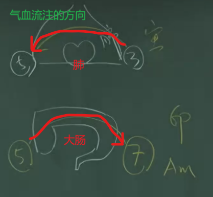

这里讲的都是**正常人**的中医生理功能。

# 1 横膈膜

**位置**：
按照《十四经发挥》：“人心下有隔膜，前齐[鸠尾](4_任督二脉.md#28-鸠尾)，后齐十一椎， 周围着脊”。即横膈膜前面连着鸠尾后面连着十一椎(就是第十椎下)，这周围围起来的就是横隔膜。

**机理**：

- 因为有横膈膜的存在，会隔绝肠中食物的沼气，让沼气不会上升
- 横膈膜还可以压挤肝脏(吸气时横膈膜下降压挤肝脏), 让肝脏的血进入大肠(肝脏和大肠之间有血管), 大肠得到来自肝脏的血后就有力量来蠕动. 这就是金(肺,大肠)和木(肝)之间的关系, 因为木要疏, 就是金在疏， 可以理解为树枝叶长得太多了，需要斧头(金)把树(木)的枝叶修剪，树才能长的更好。 肺和大肠压挤肝脏, 肝脏就会有动能运动, 肝脏中的浊物会排掉。全身只有肝脏和大肠这根血管没有瓣膜(允许血来回流动), 因此在西医上大肠癌开刀后,往往会发现转移刀肝脏, 癌细胞沿着这跟血管到肝脏。

- 心脏有问题的时候，会有穿心痛(横膈膜上)。
  >**穿心痛**：主要症状是心痛彻背，背痛彻心。即从前面痛到后面，又从后面痛回来。因为这个痛在横隔膜上。之所以以这种方式痛，是因为痰饮造成的，当身体前后晃动的时候，痰跟着流动，导致痛感的前后移动。

  # 2 肺与大肠

  肺的气血流注时间为上午3~5点（寅时），大肠气血流注时间为上午5~7点（卯时）

大肠属于腑（消化系统），属阳，因此我们在柔腹部柔丹田的时候，要从右往左（顺时针）揉。因此是阳经，可以重按。
活动肺气，按肺的时候，不用重按，因为右肋骨保护，也按不到；但肺主皮毛，只需要手掌轻轻碰到皮肤一动，气久开始动了。

中医上认为肺主呼， 肾主吸。因此在气喘的时候，看是吸气困难还是呼气困难，呼气困难病在肺，吸气困难病在肾。
当吸气的时候，横膈膜会下降，挤压肝脏，肝脏重的血就从肝和大肠之间的血管流向大肠。大肠接收到了血后才会产生力量蠕动，把大便排出来；这个过程24小时都在进行，肺和大肠两个‘金’在克肝的‘木’，肝需要疏，疏肝就要看肺和大肠。
此外小肠中的食物和水进入大肠后，因为小肠属火，在下面烧，因此大肠中的水能够汽化上升到肺中形成肺中的津液。肺中的津液会上升到嘴中形成口中的津液，人就不会口渴。

# 3 胃

正常人的脉息是一息四至，所谓一息四至的含义就是，呼吸一次，脉跳动四到五下。当然像道士/僧人打坐，一个呼吸一分钟另当别论。
正常人在一息过程中，吸气时胃蠕动两下，呼气时，胃动两下。

胃为肾之关，正常来讲，脾胃的土克制肾的水，如果肾有问题，肾中水太大了，反过来淹没了土，这叫反辱。因此肾衰竭之前，病人除了极度瞑眩，一定伴随着呕吐。

五脏六腑的气出自于胃。

