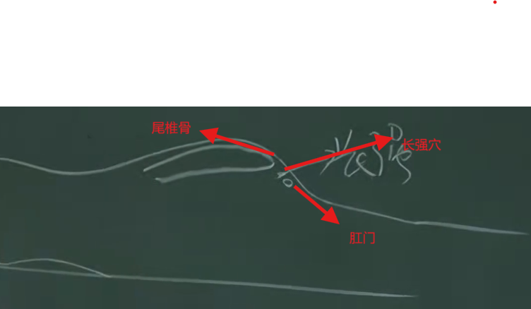
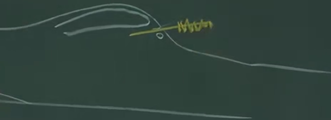
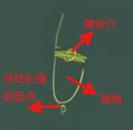
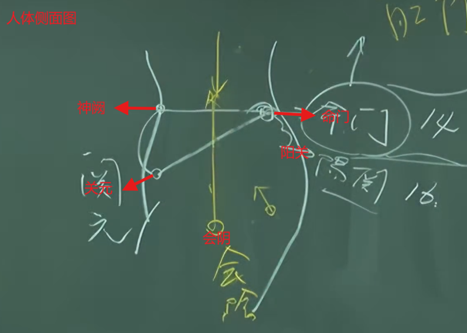
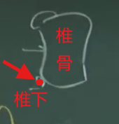
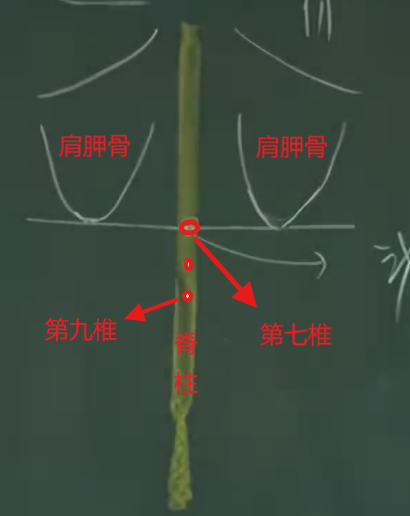
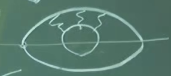
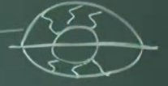
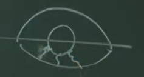
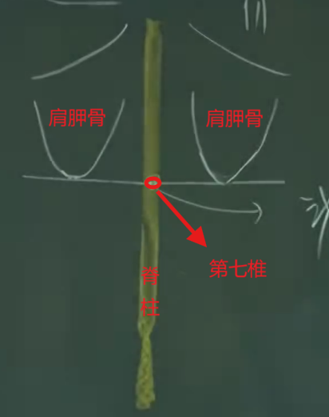

# 1 督脉介绍

齐经八脉之一，是诸阳之会。所有的阳气游行周身之后都要回到督脉，阳经好似河流，督脉就像大海，百川入海。
督脉的络别走任脉，衔接到任脉。

# 2.1 长强穴

介绍：

督脉的第一个穴道。
足少阴少阳之会。
治疗痔疮的根本

位置：

位于尾椎骨下方和肛门的中间。

治疗：
- 痔疮。下针的时候，采用斜刺法，一寸左右即到。内/外痔都可以治疗

- 对于外痔，因为肿得很大，可以用三棱针(放血针)刺下去放血，然后用小火罐(痔疮用的)把脓血抽出来，可止痛， 然后外敷枯痔散。

>中医定义**内痔**为先血后便，上大厕所的时候先排血出来，然后才是大便，不痛。
**外痔**是先便后血，上完大厕所后，用纸擦的时候有血，很痛。肛门是浊物经过的地方，如果痔疮，手术后不容易收口，从而容易形成瘘管，对于女人，瘘管会跟阴部连接在一起，大便从阴部排出来。

## 2.2 腰俞穴

说明：

位置：
尾椎骨上， 脊椎骨最尾椎的地方（呈三角形）上面， 也就是第二十一椎。

治疗：
- 主治四肢热不已
- 主治疗妇女月经不来，但少于用

## 2.3 命门

介绍: 

在练功夫的时候，想象关元和命门中间有条线，吸气的时候，这条线就往下沉，沉到会阴的地方，吐气的时候这条线往上升，升到顶后，再进一步提肛，把这条线顶上去，吐最后一口气，这最后一口气就是练功夫的地方。

在平常小便的时候，不要随时跑去小便，等到很饱满的时候，再去排便，排的时候大力的把它排出来， 到最后把肛门提起来，经常锻炼形成直觉反射，可以锻炼下焦，长命百岁。

位置: 

肚脐的正对面。第十四椎

治疗：针灸皆可
- 剧烈头痛
- 角弓反张（脑膜炎的症状）

## 2.4 阳关

介绍: 命门穴下两椎。第十六椎。

位置：针灸皆可，很少用到。

## 2.5 悬枢

介绍：三焦经会经过该穴

位置： 第十三椎下。中医上讲的椎下是在椎骨面的软骨上，而不是椎骨与椎骨的中间凹陷处， 如下所示

治疗：
- 腰痛
- 水谷不化

## 2.6 脊中

介绍：

位置：第十一椎下， 位于脾的正后方。第十一下周围是脾脏

禁忌：
- 不可灸

治疗：
- 黄疸
- 便血

## 2.7 筋缩

说明：

中医认为肝主筋，全身的筋是肝脏在管，筋缩旁开是在肝脏的正后方。

位置：

第九椎下。在找第九椎的时候，先找第七椎，第七椎往下两椎就是第九椎。
第七椎：人趴下，在两个肩胛骨下方划线与脊柱相交的地方就是第7椎。

治疗：针灸均可
- 任何抽筋、抖动、吐白沫
- 癫症、痫症、狂症

> 癫、痫、狂是不同的东西，可以通过眼诊来区分。
第一种：双眼上方有类似“鸡脚”的3根血丝贯穿眼睛黑色区域，如下图： 
 
像这样的比较容易治疗 
第二种：双眼上下均有“鸡脚”血丝 
 
像这样的比较难治疗 
第三种: 双眼下方有类似“鸡脚”的三根血丝贯穿 
 
像这样的过去医上无法治疗，现在还是可以治疗好 
一般来说只要出现癫症、痫症、狂症，大部分都有便秘，先将燥粪清掉后在做后续治疗

>癫疾狂走；痫病多言，不断讲重复的话

## 2.8 至阳

介绍：
第7椎是血会的地方，如果有血癌，第7椎会有压痛点，这是副的， 血癌标准的症是在第6椎。

位置：
第7椎下

治疗：
- 根据近取穴原则，可治疗腰脊痛（阳维上的病）

>腰背痛分为多种，在第14椎(肚脐)以下的地方痛，属于带脉上的病；在脐上横着痛属于阳维脉上的病；不同的病选的穴道不一样，阳维上的病可以用至阳穴，带脉上的选择阳关、腰俞、命门

## 2.9 消渴穴

介绍： 
经外奇穴，糖尿病可以在这里治疗，也可在这里做诊断，如果有糖尿病，在这里压就会痛。治疗到不痛的时候，糖尿病就好了。

位置：第七椎和第九椎中间

## 2.10 灵台穴

介绍：
可以帮助我们做诊断，诊断血癌，灵台穴有压痛点代表是标准的血癌，因为灵台穴旁边就是督俞穴。
督脉是诸阳之会，如果会得到过多的营养，就会在灵台穴产生白血球增加，灵台穴会有过实的现象。
反过来治疗到没有压痛，病就好了，一般疗程为14周

位置：第六椎下

位置： 禁针

