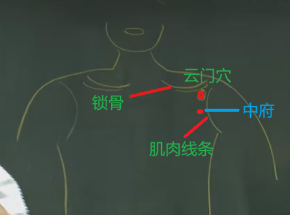
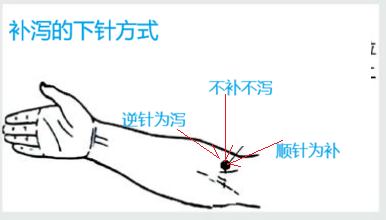

# 1 介绍

手太阴肺经共11隔穴道，起于中府，终于少商。

手太阴肺经多气少血。

气血流注的时辰是寅时(凌晨3~5点)， 肺气是从左向右走

可以根据病人发病的时机/醒来，大概判断病灶在肺部的什么位置，例如凌晨四点钟起来咳嗽，病灶就在中间，以此类推

类似的对于肝脏，气的方向是从右到左。根据1~3点醒来的时间，可判断病灶的位置所在。

# 2 穴位

## 2.1 中府穴

介绍:

手太阴肺经的第一个大穴。

位置:

[云门穴](#22-云门穴)下一寸六。有说一寸半，说一寸半是跳过了一个肋骨。
左右是对称的。

治疗:

中府直刺的时候，容易伤到肺，因此下针的时候都是一针透两穴，从中府穴透到云门穴，所以针的倒着上去的，绝对不要进肋骨，在肋骨上面下针，平着下针，这样就绝对不会碰到肺，又能扎到穴道。中府和云门的穴道穴性很近， 所以通常着这两个穴道可以一起用。

## 2.2 云门穴

介绍:

云门是肺真正的幕穴，而非中府---《难经》。
经气聚此，手、足太阴二脉之会。

位置:

锁骨和旁边肌肉的凹洞处。

治疗:

## 2.3 天府穴

介绍:

位置:

手肘内侧到肩膀正中间的地方。差不多在肱二头肌的正中间.

治疗:

下针时，将肌肉分开后下针，下到肌肉中间。

- 专门治疗流鼻血，左边鼻孔流扎右边，右边鼻孔流扎左边。（14岁以下的小孩流鼻血正常，不用治疗）

## 2.4 侠白穴

介绍:

位置:

天府下一寸。

治疗:

- 辅助天府治疗流鼻血，如天府下针后，鼻血没有止住，再针侠白。

## 2.5 尺泽穴

介绍:

手太阴肺经的合穴， 属水。

位置:

手肘内侧的大筋的外侧

治疗:

- 肺中的实症在这里泻。 下针的时候，逆着肺气的方向下针则为泻。

如果是逆向进针，再家伙再左右捻针，等气到了，再根据‘留豆许’的不屑继续进针，就是泻上加泻。

刚开始的新咳(一周)为实证，久咳为虚症（几个月），不能扎尺泽。
