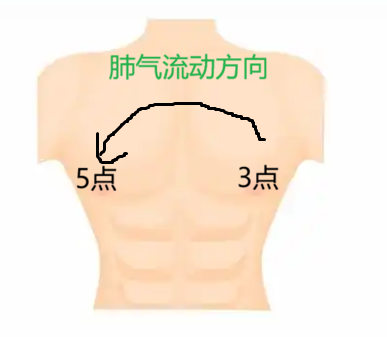
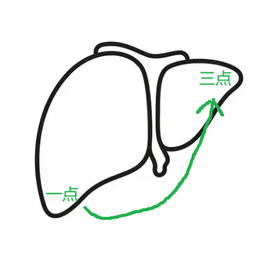
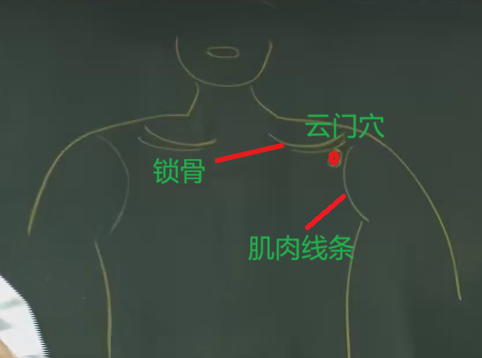

# 1 介绍

手太阴肺经共11隔穴道，起于中府，终于少商。

手太阴肺经多气少血。

气血流注的时辰是寅时(凌晨3~5点)， 肺气是从左向右走

可以根据病人发病的时机/醒来，大概判断病灶在肺部的什么位置，例如凌晨四点钟起来咳嗽，病灶就在中间，以此类推

类似的对于肝脏，气的方向是从右到左。根据1~3点醒来的时间，可判断病灶的位置所在。

# 2 穴位

## 2.1 中府穴

介绍:

手太阴肺经的第一个大穴。

位置:

[云门穴](#22-云门穴)下一寸六。有说一寸半，说一寸半是跳过了一个肋骨。
左右是对称的。

治疗:

中府直刺的时候，容易伤到肺，因此下针的时候都是一针透两穴，从中府穴透到云门穴，所以针的倒着上去的，绝对不要进肋骨，在肋骨上面下针，平着下针，这样就绝对不会碰到肺，又能扎到穴道。

## 2.2 云门穴

介绍:

肺的幕穴。

位置:

锁骨和旁边肌肉的凹洞处。

治疗:
