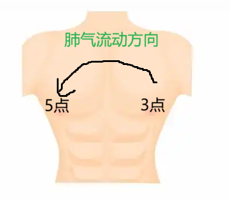
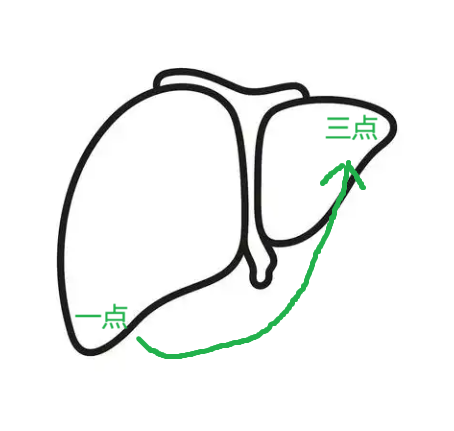
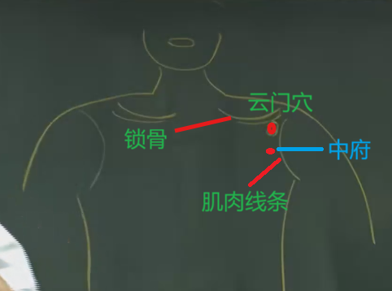
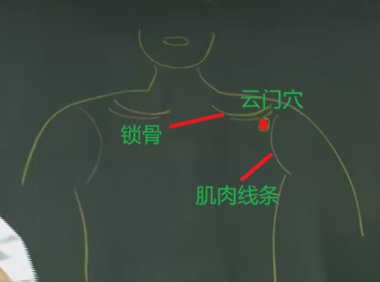
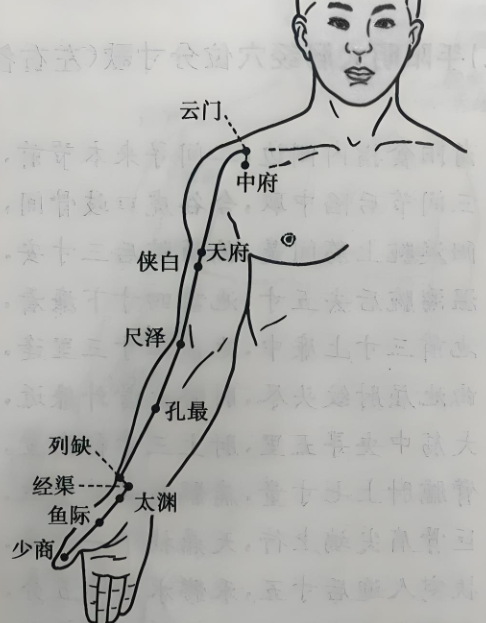
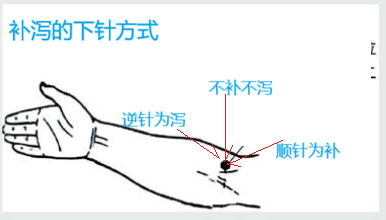
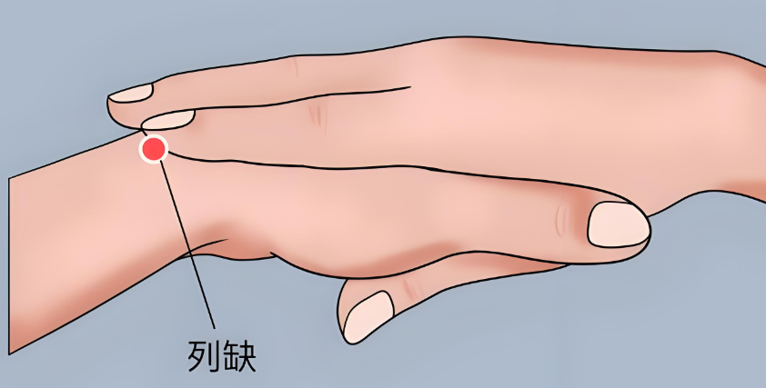
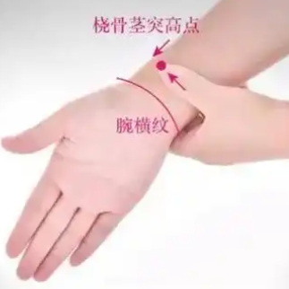
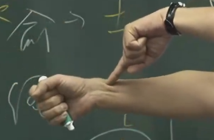

# 1 介绍

手太阴肺经共11隔穴道，起于中府，终于少商。

手太阴肺经多气少血。

气血流注的时辰是寅时(凌晨3~5点)， 肺气是从左向右走

可以根据病人发病的时机/醒来，大概判断病灶在肺部的什么位置，例如凌晨四点钟起来咳嗽，病灶就在中间，以此类推

类似的对于肝脏，气的方向是从右到左。根据1~3点醒来的时间，可判断病灶的位置所在。

# 2 穴位

## 2.1 中府穴

介绍:

手太阴肺经的第一个大穴。

位置:

[云门穴](#22-云门穴)下一寸六。有说一寸半，说一寸半是跳过了一个肋骨。
左右是对称的。

治疗:

中府直刺的时候，容易伤到肺，因此下针的时候都是一针透两穴，从中府穴透到云门穴，所以针的倒着上去的，绝对不要进肋骨，在肋骨上面下针，平着下针，这样就绝对不会碰到肺，又能扎到穴道。中府和云门的穴道穴性很近， 所以通常着这两个穴道可以一起用。

## 2.2 云门穴

介绍:

云门是肺真正的幕穴，而非中府---《难经》。
经气聚此，手、足太阴二脉之会。

位置:

锁骨和旁边肌肉的凹洞处。

治疗:

## 2.3 天府穴

介绍:

位置:

手肘内侧到肩膀正中间的地方。差不多在肱二头肌的正中间.

治疗:

下针时，将肌肉分开后下针，下到肌肉中间。

- 专门治疗流鼻血，左边鼻孔流扎右边，右边鼻孔流扎左边。（14岁以下的小孩流鼻血正常，不用治疗）

## 2.4 侠白穴

介绍:

位置:

天府下一寸。

治疗:

- 辅助天府治疗流鼻血，如天府下针后，鼻血没有止住，再针侠白。

## 2.5 尺泽穴

介绍:

手太阴肺经的合穴， 属水。因为肺属金，这跟穴道又是属于水，在五行中，金生水， 因此尺泽穴又称为肺经里的子穴。

位置:

手肘内侧的大筋的外侧。

治疗:

- 肺中的实症在这里泻。 下针的时候，逆着肺气的方向下针则为泻。

如果是逆向进针，再家伙再左右捻针，等气到了，再根据‘留豆许’的不屑继续进针，就是泻上加泻。

刚开始的新咳(一周)为实证，久咳为虚症（几个月），不能扎尺泽。

>例如一个人神经痛，从肩膀痛到手肘，持续5天。着说明是肺经，5天时间短，为实症，因此针尺泽泻。--- 经络上的痛，新病都是实症。（痛一个礼拜以上为虚症， 这时需要用母穴， 虚则补其母，实则泻其子）

## 2.6 孔最穴

介绍:

手太阴肺经的郄穴。一般郄穴都是用在炎症的时候。

（对于凹进去的穴道，灸不如针，因为凹的地方多汗， 并且灸了万一又伤疤， 凹的地方伤疤又不容易愈合， 容易发炎。）

位置:

[尺泽穴](#25-尺泽穴)下三寸，两个肌肉的中间

治疗:

- 针灸皆可
- 治疗肺的炎症， 有咳嗽带血、咳血就是有炎症， 舌苔是黄的、口渴。
- 特殊的治症---痔疮，有痔疮时，孔最穴有压痛点。可帮助诊断，治疗

**阿是穴精神**： 诊断的时候有虚症和实症，我们要确定它位置在哪里。
在按压痛点的位置下针，而不要死板地在对应的穴位上下针。例如孔最穴有压痛点，孔最穴位于尺泽下3寸，但压痛点可能在两寸半或者3寸半的位置，这时候不要死板的针3寸的孔最，而是针压痛点的位置。因为痔疮长的位置有可能不同，导致压痛点有点偏移。但针这里并不是为了治疗这里痛，而是治疗痔疮。

## 2.7 列缺穴

介绍：

主任脉，因此任脉有问题时，下针列缺。

手太阴肺经的络穴，通过这个络穴可以连接到手阳明大肠经。手太阴肺经和手阳明大肠经属于表里经，对应肺与大肠的表里关系。

太渊、经渠、列缺又被称为寸关尺。

位置：

- 两个手苦口相互交叉，两个食指尖处即为列缺。

- [经渠穴](#28-经渠穴)后5分的位置。

补泻：

下针时针斜着对着身体的方向为泻，斜着对着手指的方向为补---逆泻顺补。
如果是逆向，进针得气后在推绿豆大小的距离为泻上加泻；如果顺着进针，得气后在提针绿豆大小的距离，则为补上加补。

治疗：

- 喉咙痛：如果是刚好在天突穴（位于任脉上）

- 阴茎痛

- 总之治疗任脉上的疾病

## 2.8 经渠穴

介绍：

太渊、经渠、列缺又被称为寸关尺。

位置：

手腕高骨的下方

治疗：

## 2.9 太渊穴

介绍：

脉之会穴，是手上动脉之所在。 太渊、经渠、列缺又被称为寸关尺。

右手的寸脉(太渊)就是肺脉。

位置：

[经渠穴](#28-经渠穴)之前，靠近手横纹的位置。

太渊下针的角度: 下一寸针

治疗：

在针(32号一寸针)列缺、经渠、太渊的时候，要用指甲把脉拨开一点，从指甲旁边下进去，因为穴道在脉的下方与骨头的中间。下针后在放开，放开后，针会与脉贴在一起，因为脉会跳动，因此会带着针一起晃动，这个就称为点头针。针下的很好的就会出现点头针。