# 1 介绍

手阳明大肠经，为阳经，对应的井荣俞经合的属性分别为金水木火土。

手阳明大肠经穴起商阳穴。

手阳明大肠经的走向为手指向身上走，顺气进针为补，逆气进针为泻。

在儿科辩证的时候，左手摊开，掌心朝上，在左手食指的右侧，如果有条黑线（青筋）从指跟到风关，说明病情比较浅，好治；如果黑线到达气关，说明病情较重；如果到了命关，说明已危机生命无法治疗，但虽至此，但医者仍不能轻言放弃。

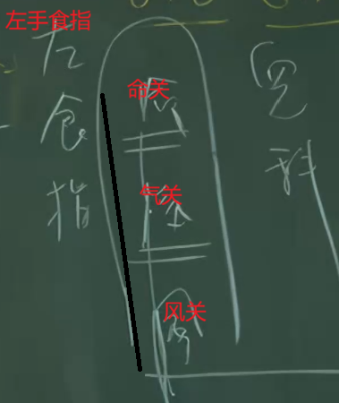

手阳明大肠经和手太阴肺经的穴道分布：大肠经属阳脉，其穴道分布在手的外侧(外侧为阳)，肺经穴道分布在手的内侧（内侧为阴）

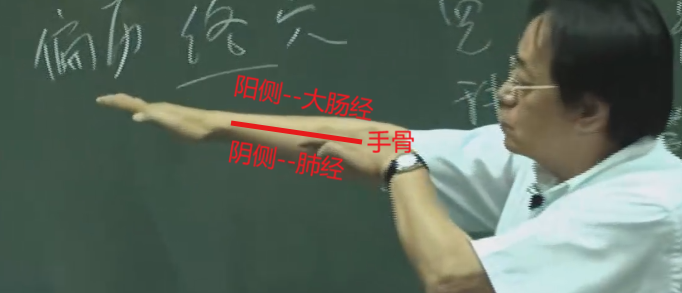

# 2 商阳穴

介绍:

商阳穴为手阳明大肠经**井穴**(金)，阳经的井穴属金，跟大肠经属性相同，因此也是手阳明大肠经的本穴。

位置:

治疗:

通常也是点刺放血， 同于退烧。（少商，商阳，大椎放血几乎所有的烧都可以退）

- 扁桃腺发炎也可治疗，但主症是在退烧上

# 2 二间穴

介绍:

手阳明大肠经的荣穴（子穴）。大肠实，可在这里泻。实证就是初病，浅，痛，拒按

位置:

位于食指跟关节骨的中间纹头上面一点点，纹头处是神经，穴位不在筋上，在于筋骨之间。

下针:

用手压一下, 这样下针比较不痛。

治疗:

# 3 三间穴

介绍:

手阳明大肠经的俞穴（木）。

位置:

食指根部关节后方的缝处。

下针:

治疗:

- 比较有名的针法---三间透劳宫，用于治疗手指的风湿关节炎肿痛，手指不能握拳。留针20分钟。

# 4 合谷穴

介绍:

合谷穴是一个非常大的穴道，气脉， 合谷的气非常旺；所以合谷穴越大越高的人，气越足；久病的人合谷上的肉就会消瘦；因此可以从合谷穴看到一个人气的兴衰。

是手阳明大肠经的原穴（阴经没有原穴， 阳经的原穴没有五行属性）。

古代孕妇要生了时候，可以通过合谷穴的跳动来判断是非要临盆：

因为合谷穴是气脉之所在，直接通到子宫。

人的身上有“四关”， 双手的合谷穴和双脚的太冲穴，这四处穴道称为人体的四关穴。开四关穴的作用的找出真正的病经，当病人说全身哪里都痛时，不知道该真没下针，就针这四关，真正的病经马上就会出来（其他痛消失，真正的病痛出现）。

合谷穴有麻醉作用，当在头上做透针的时候，因为透针会比较痛，这时候在对侧的合谷穴下针，先下合谷后再去透针，痛就会较少很多。

位置:

将大拇指合食指的根部并拢，最高点就是合谷穴。

下针:

治疗:

- **中风手掌痉挛弯曲握拳**: 合谷透后溪(沿着骨头刺过去)，然后使用捻转针法（大肠经的补方向）

- 三间透合谷穴---

- 隔江灸合谷穴----治疗脸出油多，青春痘。有美白的功效，皮肤会收口。脸上出油多说明气很旺。

- 手臂酸痛，肩膀抬不起来-----痛为实，酸为虚，根据痛多酸少或者痛少酸多，可再这个穴道做先泻后补或者先补后泻。针下合谷穴，引到气后，将针提起来一点，提到皮肤旁边，让针可以动，很浅层，逆着大肠经气的方向进针，此为泻；如果需要在做补时，再将针提起来一点到皮肤方便，再顺着大肠经的方向进针，此为补。注意补泻的时候，针也不要太斜, 斜度如下图所示即可：

- **上半身皮肤痒**：当上半身（肚脐以上）皮肤痒的时候，肺主皮毛，大肠与肺又是表里关系，合谷穴是气穴，皮肤管气。因此治疗上半身皮肤痒的最好的大穴，就是[合谷穴](#4-合谷穴)和[曲池](#9-曲池穴)同时下针

- “面口合谷收” --- 面部和口部的病都可以再合谷穴下针，比如面部中风。

禁忌:

- 怀孕的时候禁针河谷。医书上讲的可泻不可补（也就是可以逆着下针，而不能顺着下针）

## 4.1 牙痛合谷穴

奇穴，位于大拇指合食指指骨后快要相接的地方，如下图：

- 治疗上牙齿痛---手阳明大肠经是走到上牙齿，因此上牙痛时下针牙痛河谷。右边上牙痛下针左手牙痛合谷穴，左边上牙痛下针右边牙痛合谷穴；门牙痛下针双手的牙痛合谷穴。如果门牙痛，旁边的门牙肿大，可龈交放血。

**注意**：

- 这附近有脉，因此下针的时候需要切一下脉，避开青筋(静脉)；

- 下针时不要太贴近骨头，以免伤到骨膜（很痛）。

- 这个穴道很大，不用太精细

# 6 阳溪穴

介绍:

手阳明大肠经的经穴(火)。

位置:

手掌张开，大拇指往外翘，会看到大拇指根部两根筋之间有凹陷，凹陷处为阳溪穴。

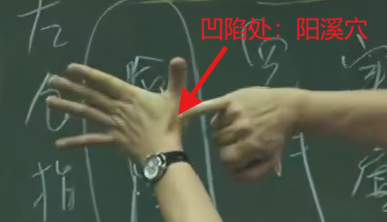

下针:

治疗:

- 狂言喜笑见鬼: 
- 热病烦心：
- 厥逆头痛：
- 胸满不得息：
- 寒热疟疾：临床上用得比较少，因为有很多其他更好的穴道可以用，除非用到对称取穴的原则。
- 寒嗽呕沫：
- 喉痹：
- 耳鸣，耳聋：
- 惊掣：
- 肘臂不举：
- 痂疥：

# 7 偏历穴

介绍:

手阳明大肠经的络穴，与手太阴肺经的络穴（列缺）是相连的， 这相连的中间是反关脉的地方。

因为有络穴的存在，所以正常人阴阳是互相协调、互相制衡的

位置:

跟寻找列缺的手法类似，只是用中指所落的位置即为偏历穴

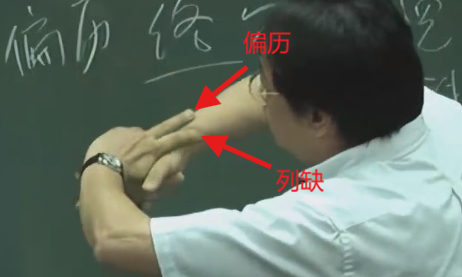

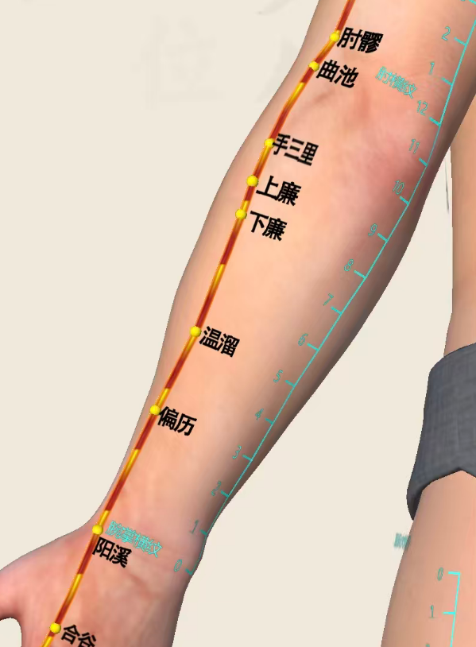

下针:

《针灸大成》：“针三分，留七呼，灸三壮”。

补：由于手阳明大肠经的气流向是从手指到身体，因此在进行补时，进针的方向是朝着身体的方向；如果需要补上加补，可以在得气后，提针绿豆大小的深度。

泻：在遍历穴进行泻时，进针的方向需要逆着气流的方向，即朝向手指方向进针；如果需要泻上加泻，则在得气后，再进针绿豆大小的深度。

治疗:

- 实则<ruby>齲<rt>qǔ</rt></ruby>聋，泻之；虚则齿寒痹膈，补之：即大肠经出现实症时，有牙齿痛，耳鸣的现象时，泻遍历穴；大肠经出现虚症时，牙齿怕冰冷和风吹，补遍历穴。 （络穴和原穴，可以在上面做补泻）

- 主肩<ruby>膊<rt>bó</rt></ruby>肘腕酸疼: 

# 8 温溜穴

介绍:

手阳明大肠经的<ruby>郄<rt>xī</rt>穴

位置:

[偏历穴](#7-偏历穴)上2寸。

下针:

顺着骨头缝的角度下针，如下图：

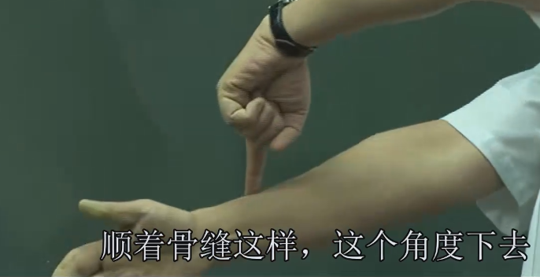

治疗:

可用于治疗大肠经的炎症。

# 9 曲池穴

介绍:

大穴位；是手阳明大肠经的合穴(土)， 母穴。

曲池穴是上半身（肚脐以上）的消炎穴：

位置:

拱起手后在手肘和纹头的中间，不能太靠近肘骨，不然进针会很痛；大概位于肌肉和骨头的中间，**直针**进去。

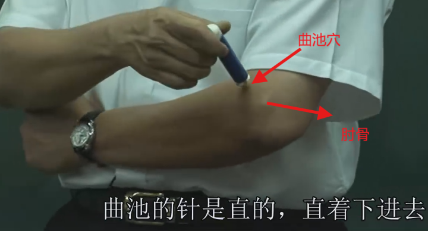

下针:

**直针**进去.

治疗:

- 肩痛抬不起来，时间久为虚症。可补手阳明大肠经的母穴---曲池穴。这时在对侧的曲池下针，左肩下右曲池，右肩下左曲池。

- **上半身皮肤痒**：当上半身（肚脐以上）皮肤痒的时候，肺主皮毛，大肠与肺又是表里关系，合谷穴是气穴，皮肤管气。因此治疗上半身皮肤痒的最好的大穴，就是[合谷穴](#4-合谷穴)和[曲池](#9-曲池穴)同时下针。 因为曲池穴有消炎的作用。

# 10 三里穴

介绍:

也被称为手三里（扭伤穴）

位置:

[曲池穴](#9-曲池穴)下两寸。

下针:

治疗:

- **急性腰扭伤**、**落枕**：下针后左右捻针，同时让病人慢慢活动受伤的地方，活动开了就好了。

落枕的时候如果不想针三里穴，可以让仰身，让头自然垂在床头，肩膀放松，慢慢呼吸，如下图所示。保持这个姿势3分钟以上，回来的时候用手跟脚慢慢把身体扭回来，头慢慢回到床面上放平，慢慢坐起来，当场即好。

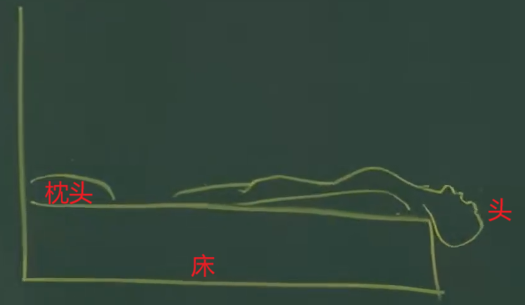

人摔倒之后受伤，真正受伤是在事后，而不是在事前，即摔下去之后是因为起来得太快受伤的（突然出现摔伤的姿势，气血还没有适应它）；因此摔倒之后，保持原姿势不要动，让身体去适应这个姿势，大概3分钟后，慢慢站起来，身体不会受伤。（这里的摔伤没有高空摔伤那么重）

- **霍乱遗矢**：

# 11 下廉穴

介绍: 

位置:

[上廉穴](#12-上廉穴)下一寸。

下针:

斜针无分，留五呼，灸三壮。

治疗:

**主<ruby>飧<rt>sūn</ru></ruby>泄，小腹满**：

**小便黄，便血**：

**狂言**：

**偏风热风**：

**冷痹不遂**：

**风湿痹**：

**小肠气不足，面无颜色**：

**<ruby>痃<rt>xuán</rt>癖<rt>pǐ</rt></ruby>**：

**腹痛若刀不可忍、腹肋痛满**：

**狂走**：

**夹脐痛**：

**食不化**：

**喘息不能行**：

**唇干涎出**：

**乳痈**： 乳癌

# 12 上廉穴

介绍: 

位置:

[三里穴](#10-三里穴)下一寸。[曲池穴](#9-曲池穴)下三寸。

下针:

针五分，灸五壮。

治疗:

- **小便难、黄、赤**：

- **肠鸣**：

- **胸痛**：

- **偏风半身不遂**：

- **骨髓冷**：

- **手足不仁**:

- **喘息**：

- **大肠气**：

- **脑风头痛**：

# 13 肘髎穴

介绍: 

位置:

[曲池穴](#9-曲池穴)正对着手臂大骨外面。

下针:

针三分，灸三壮。

治疗:

-  **手肘受伤**：例如大羽毛球手肘受伤，可在肘髎穴点刺放血后用火罐吸。

- **风劳<ruby>嗜<rt>shì</rt></ruby>卧**：

- **肘节风痹、臂痛不举、屈伸挛急、麻木不仁**：

# 14 五里穴

介绍: 

位置:

[肘髎穴](#13-肘髎穴)上三寸。

下针:

禁针，因为附近有大动脉。灸十壮。

治疗:

- **风劳惊恐**：

- **吐血咳嗽**：

- **肘臂痛**：

- **嗜卧、四肢不得动**：

- **心下胀满**：

- **上气**：

- **身黄，时有微热**：

- **<ruby>瘰<rt>luŏ</rt>疬<rt>lì</rt></ruby>**：

- **目视<ruby>䀮<rt>máng</rt></ruby>䀮**:

- **<ruby>痎<rt>jiē</rt></ruby>疟**:

# 15 臂<ruby>臑<rt>náo</rt></ruby>穴

介绍: 

手阳明络、手足太阴、阳维脉之会。

位置:

手肘上七寸、肩<ruby>髃<rt>yú</rt></ruby>穴下两寸.

位于两个肌肉的中间。

下针:

《铜人》：“针三分，灸三壮”。《明堂》：“宜灸不宜针，宜灸气壮至两百壮。若针，不得过三、五分”。

治疗:

- **<ruby>瘰<rt>luŏ</rt>疬<rt>lì</rt></ruby>**：

- **寒热臂痛，肩不得举**：

- **颈项<ruby>拘<rt>jū</rt></ruby>急**：

# 16 肩<ruby>髃<rt>yú</rt></ruby>穴

介绍: 

手阳明大肠经和阳蹻脉的交会。

治疗中风的大穴---中风有八大穴（百会、肩髃、曲池、合谷、风府、）。

位置:

手侧面抬起，肩膀处出现一个凹洞，即为肩髃穴。

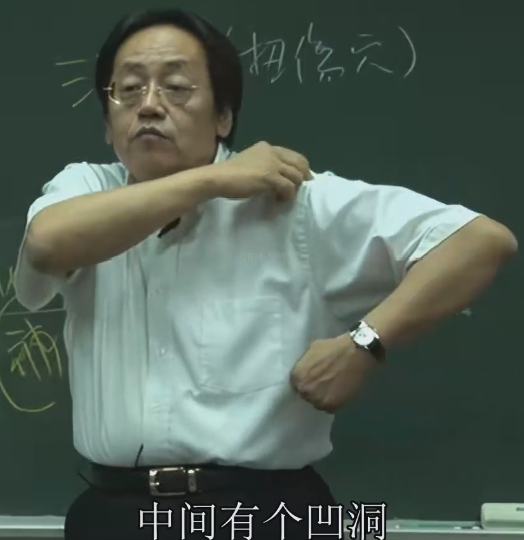

下针:

治疗:

- **中风手足不遂**：

- **偏风、风<ruby>痪<rt>huàn</rt></ruby>、<ruby>风痿<rt>wĕi</rt></ruby>、风病**：

- **半身不遂、热风肩中热、头不可回顾、肩臂疼痛臂无力、手不能向头、挛急**：

- **风热瘾疹**：

- **颜色枯焦、劳气泄精**：

- **伤热不已，四肢热，<ruby>诸<rt>zhū</rt>瘿<rt>yǐng</rt>气</ruby>**：

- **肩髃透极泉**：专门治疗狐臭。

# 17 巨骨穴

介绍: 

手阳明大肠经和阳蹻脉的会。

位置: 

[肩髃穴](#16-肩髃yú穴)上面一点，两个骨头中间的缝隙处， 用手压下去很酸。

下针: 

通常禁针，因为下面就是肺。针则倒悬一食顷，乃得下针，针四分，泄之勿补，针出始得正卧。

治疗: 

通常这个穴道不下针，其对应的症，有其他更好的穴道治疗。这里只需要知道穴道的位置，方便辩证。

- 主惊痫，破心吐血，臂膊痛，胸中有瘀血（说明是内伤），肩臂不得屈伸。

# 18 天鼎穴

介绍: 

位置:

颈部大筋的外侧，大筋与胸肋骨上面交接的地方。（颈部大筋的外侧是大肠经，内存是胃经）

下针: 

在脖子上下针都是用手指把筋抓住，指头推进去，把动脉移开，再下针，入针3~5分。

治疗: 

# 19 扶突穴

介绍: 

位置: 

廉泉穴（喉结）横着过，在颈部大筋的外侧。

下针: 

治疗: 

这个穴道很少下针，除非是很严重的喉咙肿胀，讲不出话。

- 咳嗽多唾，上气，咽引喘息，喉中如水鸡声（声音比较尖锐，持续不断），暴暗气哽

# 20 禾髎穴

介绍: 

位置: 

鼻孔的正下方，水沟正中央旁开处。

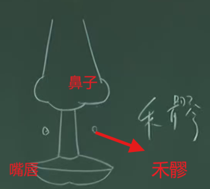

下针: 

治疗: 

- **鼻窦炎**：

- **鼻子不通**：

# 21 迎香穴

介绍: 

手阳明大肠经的最后一个穴道。

位置: 

鼻子旁开5分。

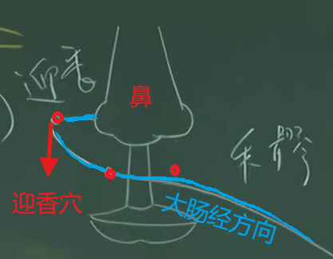

下针: 

迎香透内迎香，详见治疗。

治疗: 

- **鼻不闻香臭、鼻窦炎、鼻塞**： 下针时，直接扎没有效果；需要针扎入迎香穴皮层后，把皮肤捏起来，平行透到内迎香处（不要超过眼骨）。效果非常好。在透迎香穴前，在对侧的合谷穴下针，减少疼痛

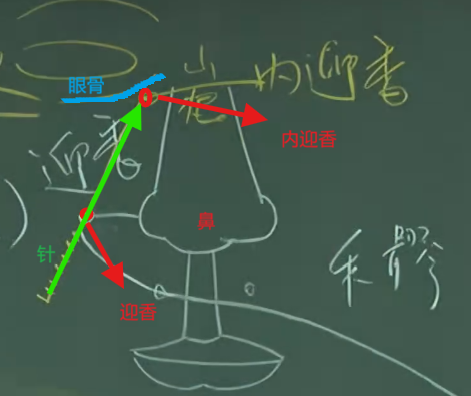