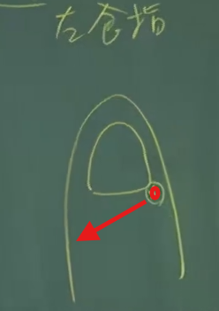
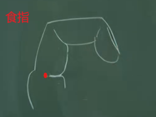
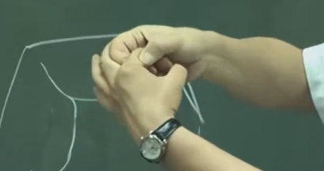
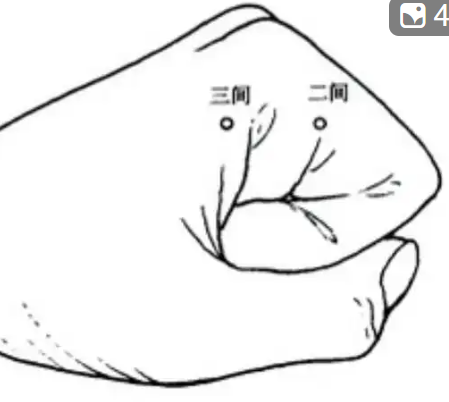
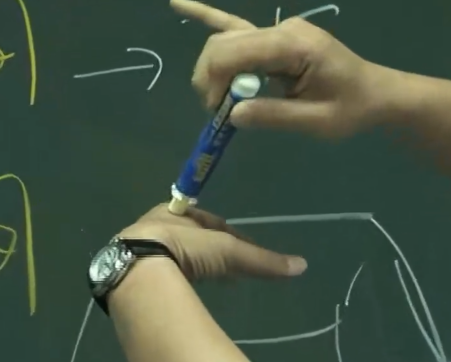
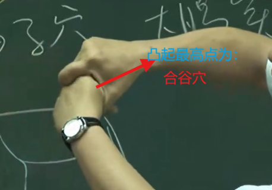
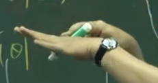
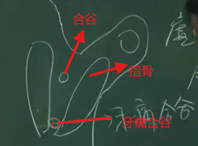

# 1 介绍

手阳明大肠经，为阳经，对应的井荣俞经合的属性分别为金水木火土。

手阳明大肠经穴起商阳穴。

手阳明大肠经的走向为手指向身上走，顺气进针为补，逆气进针为泻。

# 2 商阳穴

介绍:

商阳穴为手阳明大肠经井穴，阳经的井穴属金，跟大肠经属性相同，因此也是手阳明大肠经的本穴。

位置:

治疗:

通常也是点刺放血， 同于退烧。（少商，商阳，大椎放血几乎所有的烧都可以退）

- 扁桃腺发炎也可治疗，但主症是在退烧上

# 2 二间穴

介绍:

手阳明大肠经的荣穴（子穴）。大肠实，可在这里泻。实证就是初病，浅，痛，拒按

位置:

位于食指跟关节骨的中间纹头上面一点点，纹头处是神经，穴位不在筋上，在于筋骨之间。

下针:

用手压一下, 这样下针比较不痛。

治疗:

# 3 三间穴

介绍:

手阳明大肠经的俞穴（木）。

位置:

食指根部关节后方的缝处。

下针:

治疗:

- 比较有名的针法---三间透劳宫，用于治疗手指的风湿关节炎肿痛，手指不能握拳。留针20分钟。

# 4 合谷穴

介绍:

合谷穴是一个非常大的穴道。

是手阳明大肠经的原穴（阴经没有原穴， 阳经的原穴没有五行属性）。

位置:

将大拇指合食指的根部并拢，最高点就是合谷穴。

下针:

治疗:

- 三间透合谷穴---

- 隔江灸合谷穴----治疗脸出油多，青春痘。有美白的功效，皮肤会收口。脸上出油多说明气很旺。

- 手臂酸痛，肩膀抬不起来-----痛为实，酸为虚，根据痛多酸少或者痛少酸多，可再这个穴道做先泻后补或者先补后泻。针下合谷穴，引到气后，将针提起来一点，提到皮肤旁边，让针可以动，很浅层，逆着大肠经气的方向进针，此为泻；如果需要在做补时，再将针提起来一点到皮肤方便，再顺着大肠经的方向进针，此为补。注意补泻的时候，针也不要太斜, 斜度如下图所示即可：

禁忌:

- 怀孕的时候禁针河谷。医书上讲的可泻不可补（也就是可以逆着下针，而不能顺着下针）

## 4.1 牙痛合谷穴

奇穴，位于大拇指合食指指骨后快要相接的地方，如下图：

- 治疗上牙齿痛---手阳明大肠经是走到上牙齿，因此上牙痛时下针牙痛河谷。右边上牙痛下针左手牙痛合谷穴，左边上牙痛下针右边牙痛合谷穴；门牙痛下针双手的牙痛合谷穴。如果门牙痛，旁边的门牙肿大，可龈交放血。

**注意**：

- 这附近有脉，因此下针的时候需要切一下脉，避开青筋(静脉)；

- 下针时不要太贴近骨头，以免伤到骨膜（很痛）。

- 这个穴道很大，不用太精细

# 5 穴

介绍:

位置:

下针:

治疗: