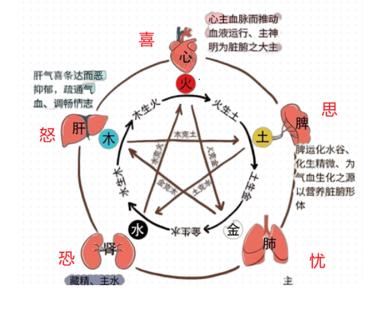
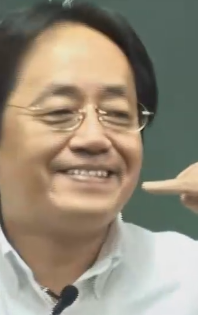

# 1 介绍

## 1.1 肺的功能

中医认为肺为“传导之官”， 所谓“治节出焉”---身上所有的规矩、节度都是肺脏在管。

**肺藏‘魄’**

>**魄**: 简单来讲就是白天见鬼，人看到不应该看到的东西（异象）。如果一个人不喜欢光，白天躲到衣柜里，看到人就躲躲闪闪的，那说明魄已失。 
魄在肺上的时候，才能治节、知进退。身体里的功能才能规矩地执行，而不逾矩。人也会自律，自己控制自己。

**肺为气之本**

>**气**：气就是热气、蒸汽。气体现在很多地方:
    1. 对于可见的气，大气到玻璃上，看见的气
    2. 头发油是气的表现。病人快要去世的时候，气快没有了，头发就是干的、蓬松的。

**肺主皮毛**：

皮肤毛孔都是肺在管，中医上治疗皮肤病，也是从肺入手。

脸上的眉毛也是肺在管，所以眉毛根头发、胡子不太一样，头发、胡子剃了还会再长，但眉毛不容易长出来。如果一个人年龄大了，Ta生活非常规律，这种人长寿，长寿的时候，肺很好，眉毛就开始长长，越来越长；所以长眉就相等于长寿。如果眉毛掉了，那说明魄不守，一天到晚忧虑

人在过热的环境会伤皮毛。

**肺开窍在鼻**

所谓开窍

**肺主忧**

因为有肺脏，所以才会有忧虑， 但忧太过，会伤到肺脏，所谓“忧伤肺”。

如果一个人有咳嗽，同时又有事情让TA很忧虑，这跟人咳嗽不会好。 喜能胜忧，因为在五行上肺属金，而心属火；火能克金，心脏主理的情志为喜， 因此喜能胜忧。

因此当因为情志太过导致问题，可以用克它的情志来治疗

**肺主商**

在五音(宫商角徵羽)中，肺主的音是‘商’。商的声音发‘si’。

**其类金**：

肺在五行钟是属燥金的。所谓燥金，因为辛辣的东西；金会生水，所以金中的水不断地释放出来，所以正常的金是燥金。

**在声为哭**

哭的声音是从肺里出来的，肺出现问题后，变动为咳。

**苦胜辛**

苦在五行中属于火，辛属金，因为火克金，因此苦胜辛。

任何东西烧过之后，味道是苦的。

如果煮的东西太辣了，可加一点苦的东西去中和它。

**脉居右侧， 秋令**：

把脉时，在右手。

在秋天的时候，摸肺的脉气在皮毛上面，就是正常的---手轻轻碰到皮肤上就可以感觉到脉，就是脉气在皮毛，这定义为浮脉。

瓜果吃太多会伤到肺，这时用薤白粥（薤白煮稀饭）+羊肾，如果每羊肾可用猪腰来代替， 这笔独参汤还补气。

正常人头、面部、皮肤毛孔都是冷的，手脚是温热的。

**肺法象天幕**

整个天幕就好像肺脏， 皮肤把身体里的好的坏的东西都包起来，所以说肺主皮毛。

## 1.2 五脏逼法

**肺**：

在练肌肉的时候可以练到四肢，但因为肺被肋骨包围着，如果要练到肺，需要一定的技巧。我们需要一个动作让上下，肋骨挤压，让肺里的浊气向上往外走，在往外走的时候，需要发一个声音来触动它而不影响到其他的脏。

肺脏逼毒技巧：

一次做5~6次，在做五脏逼毒的时候，出现咳吐等现象是好的。在练功夫之前，先逼毒，身体会很轻松，然后再开始练功夫。

**商音**： 发‘商’音时，牙齿咬合，舌头顶住齿间，嘴唇张开，往两边拉开一点, 如下图：

然后发‘si’声。

