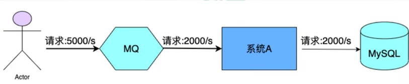
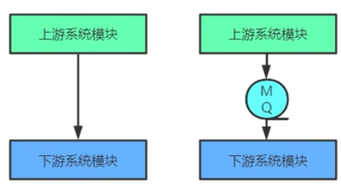
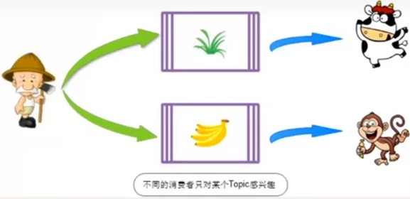
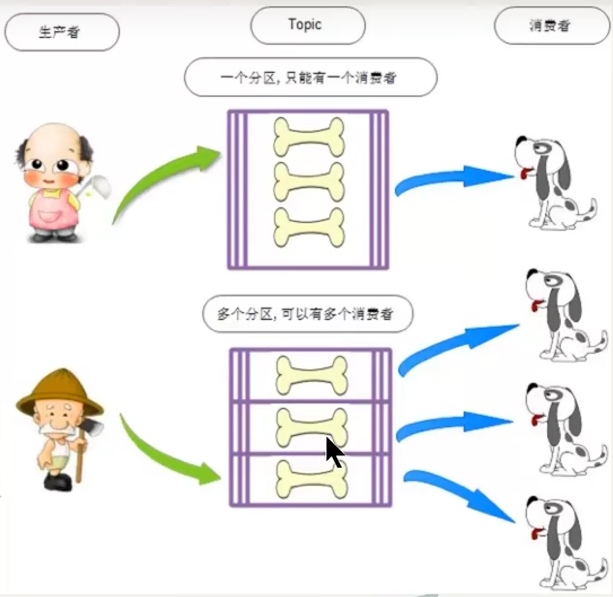
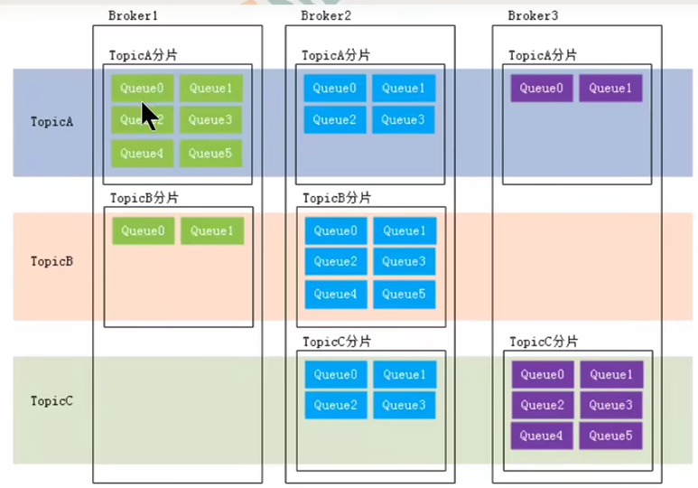

[toc]
 
RocketMQ中文文档
https://github.com/apache/rocketmq-externals/tree/master/docs/connect/cn

# 1 RocketMQ概念
RocketMQ 是一个开源的分布式消息队列系统，由阿里巴巴集团开发和维护。它在可靠性、扩展性和性能方面进行了优化，旨在为大规模分布式系统提供高性能、低延迟的消息通信和异步数据传输。

RocketMQ 的工作原理类似于其他消息队列系统，它包括生产者（Producer）、消费者（Consumer）和消息代理（Broker）三个主要角色。

- 生产者负责发送消息到消息队列中，可以将消息发送到指定的主题（Topic）中。
- 消费者订阅感兴趣的主题并从消息队列中消费消息。
- 消息代理（Broker）作为消息的中间件，负责存储、路由和转发消息，以及处理消息的持久化、高可用性和负载均衡等问题。

RocketMQ 支持丰富的消息传输模式，包括同步传输、异步传输和单向传输。它还提供了消息顺序传输和广播传输的功能，可以根据不同的应用场景选择合适的传输模式。

RocketMQ 具有以下特点：
- 高吞吐量和低延迟：支持百万级别的消息传输和处理。
- 可靠性：提供消息的持久化和高可用性，确保消息不丢失。
- 扩展性：支持水平扩展，可以根据需求增加消息代理实例和消费者实例。
- 运维管理：提供了丰富的监控和运维工具，方便管理和监控整个消息队列系统。

RocketMQ 在分布式系统、微服务架构、实时计算等场景下广泛应用，为各种类型的应用提供了可靠的异步通信和数据传输解决方案。

MQ，Message Queue，是一种提供消息队列服务的中间件，也称为消息中间件，是一套提供了消息生产、存储、消费全过程API的软件系统。消息即数据。一般消息的体量不会很大。

# 2 RocketMQ的用途
- **限流削峰**
MQ可以将系统的超量请求暂存其中，以便系统后期可以慢慢进行处理，从而避免了请求的丢失或系统被压垮。

在一些系统中，它的处理能力是有限的，例如上图中的系统A每秒只能处理2000条消息，但请求速度有5000条。这时候可以用MQ来存储消息，系统A以每秒2000的速度读取消息，这样就做到了不至于系统A过载的。

- **异步解耦**
上游系统对下游系统的调用若为同步调用，则会大大降低系统的吞吐量与并发度，且系统耦合度太高。而异步调用则会解决这些问题。所以两层之间若要实现由同步到异步的转化，一般性做法就是，在这两层间添加一个MQ层。

- **数据收集**
分布式系统会产生海量级数据流，如:业务日志、监控数据、用户行为等。针对这些数据流进行实时或批量采集汇总，然后对这些数据流进行大数据分析，这是当前互联网平台的必备技术。通过MQ完成此类数据收集是最好的选择。

# 3 常见的MQ产品
- **ActiveMQ**
ActiveMQ是使用Java语言开发一款MQ产品。早期很多公司与项目中都在使用。但现在的社区活跃度已经很低。现在的项目中已经很少使用了。

- **RabbitMQ**
RabbitMQ是使用ErLang语言开发的一款MQ产品。其吞吐量较Kafka与RocketMQ要低，且由于其不是Java语言开发，所以公司内部对其实现定制化开发难度较大。

- **Kafka**
Kafka是使用Scala/Java语言开发的一款MQ产品。其最大的特点就是高吞吐率，常用于大数据领域的实时计算、日志采集等场景。其没有遵循任何常见的MQ协议，而是使用自研协议。

- **RocketMQ**
RocketMQ是使用Java语言开发的一款MO产品。经过数年阿里双11的考验，性能与稳定性非常高。其没有遵循任何常见的MQ协议，而是使用自研协议。

## 3.1 各个MQ的对比
|对比类型|ActiveMQ|RabbitMQ|kafka|RocketMQ|
|--------|--------|--------|-----|--------|
|开发语言|Java|ErLang|Java|Java|
|单机吞吐量|万级|万级|十万级|十万级|
|Topic|没有这个概念|没有这个概念|百级Topic时会影响系统吞吐量|千级Topic时会影响系统吞吐量|
|社区活跃度|低|高|高|高|

# 4 RocketMQ基本概念
## 4.1 消息(Message)
消息是指消息系统所传输信息的物理载体，生产和消费数据的最小单位，每条消息必须属于一个主题(Topic)

## 4.2 主题(Topic)

Topic表示一类消息的集合，每个主题包含若干条消息，每条消息只能属于一个主题，是RocketMQ进行消息订阅的基本单位。
一个生产者可以同时发送多种Topic的消息;而一个消费者只对某种特定的Topic感兴趣，即只可以订阅和消费一种Topic的消息。
可以理解为主题就是消息的分类。

## 4.3 标签(Tag)
为消息设置的标签，用于同一主题下区分不同类型的消息。来自同一业务单元的消息，可以根据不同业务目的在同一主题下设置不同标签。标签能够有效地保持代码的清晰度和连贯性，并优化RocketMQ提供的查询系统。消费者可以根据Tag实现对不同子主题的不同消费逻辑，实现更好的扩展性。

## 4.4 队列(queue)
存储消息的物理实体。一个Topic中可以包含多个Queue，每个Queue中存放的就是该Topic的消息。一个Topic的Queue也被称为一个Topic中消息的分区(partition)。
一个Topic的Queue中的消息只能被一个消费者组中的一个消费者消费。一个Queue中的消息不允许同一个消费者组中的多个消费者同时消费

在学习参考其它相关资料时，还会看到一个概念:分片(Sharding)。分片不同于分区。在RocketMQ中，分片指的是存放相应Topic的Broker。每个分片中会创建出相应数量的分区，即Queue，每个Queue的大小都是相同的。

## 4.5 消息标识(Messageid/Key)
RocketMQ中每个消息拥有唯一的Messageld，且可以携带具有业务标识的Key，以方便对消息的查询。不过需要注意的是，Messageld有两个:在生产者send)消息时会自动生成一个Messageld (msgld)，当消息到达Broker后，Broker也会自动生成一个Messageld(offsetMsgld)。msgld、 offsetMsgld与key都称为消息标识。
- msgId: 由producer端生成，其规则为
  producerIp + 进程pid + MessageClientIDSetter类的classLoader的hashCode + 当前时间 + AutomicIntger自增计数器

- offsetMsgld: 由broker端生成，其生成规则为: brokerIp ＋物理分区的offset(queue中的偏移量)
- key: 由用户指定的业务相关的唯一标识