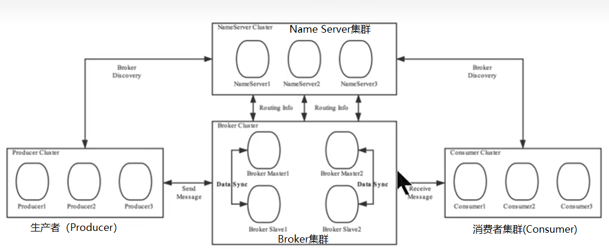
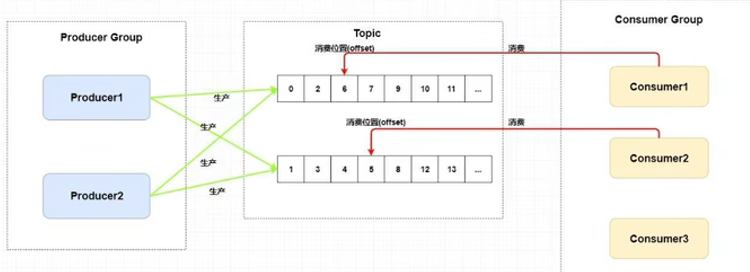
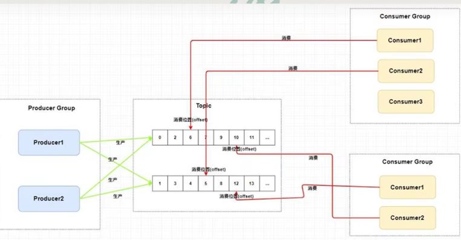
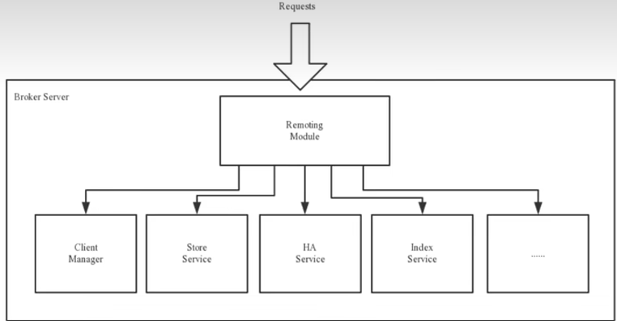

[toc]

# 1 系统架构

RocketMQ架构上主要由4部分构成
**生产者(Producer)，消费者(Consumer)，命名服务器(Name Server)，Broker**

# 2 生产者(Producer)
消息生产者，负责生产消息。Producer通过MQ的负载均衡模块选择相应的Broker集群队列进行消息投递，投递的过程支持快速失败并且低延迟。
例如，业务系统产生的日志写入到MQ的过程。就是消息生产的过程
再如，电商平台中用户提交的秒杀请求写入到MQ的过程，就是消息生产的过程
RocketMQ中的消息生产者都是以生产者组(Producer Group)的形式出现的。生产者组是同一类生产者的集合，这类Producer发送相同Topic类型的消息。一个生产者组可以同时发送多个主题的消息。|

例如，业务系统产生的日志写入到MQ的过程。就是消息生产的过程
再如，电商平台中用户提交的秒杀请求写入到MQ的过程，就是消息生产的过程

RocketMQ中的消息生产者都是以生产者组(Producer Group)的形式出现的。生产者组是同一类生产者的集合，这类Producer发送相同Topic类型的消息。一个生产者组可以同时发送多个主题的消息。|
# 3 消费者（Consumer）
消息消费者，负责消费消息。一个消息消费者会从Broker服务器中获取到消息，并对消息进行相关业务处理

例如，QoS系统从MQ中读取日志，并对日志进行解析处理的过程就是消息消费的过程。
再如，电商平台的业务系统从MQ中读取到秒杀请求，并对请求进行处理的过程就是消息消费的过程。

RocketMQ中的消息消费者都是以消费者组(Consumer Group)的形式出现的。消费者组是同一类消费者的集合，这类Consumer消费的是同一个Topic类型的消息。消费者组使得在消息消费方面，实现负载均衡和容错的目标变得非常容易。

**注意**:
- 这里的负载均衡是指 将一个Topic中的不同的Queue平均分配给同一个Consumer Group的不同的Consumer，并不是将消息负载均衡。
- 容错是指（一个Consmer挂了，该Consumer Group中的其它Consumer可以接着消费原Consumer消费的Queue)
- 消费者组中Consumer的数量应该小于等于订阅Topic的Queue数量。如果超出Queue数量，则多出的Consumer将不能消费消息。如上图，Consumer Group中的Consumer3将不能消费Topic中的消息。但是一个消费者组中的一个消费者，可以同时消费一个topic中的多个Queue。例如上图中的Consumer1可以同时消费Topic中的两个Queue中的消息
- 一个queue不能有两个消费者同时消费。例如上图中的Consumer1同时消费Topic中的两个queue的消息，那么Consumer2和Consumer3将都不能消费消息。
- 不过一个Topic中的消息可以被多个消费者组同时消费，如下图：

- 一个消费者组只能消费一个Topic的消息，不能同时消费多个Topic消息
- —个消费者组中的消费者必须订阅完全相同的Topid

# 4 Name Server
## 4.1 功能介绍
NameServer是一个Broker与Topic路由的注册中心，支持Broker的动态注册与发现。|
主要包括两个功能:
1. Broker管理:接受Broker集群的注册信息并且保存下来作为路由信息的基本数据;提供心跳检测机制，检查Broker是否还存活。
2. ·路由信息管理:每个NameServer中都保存着Broker集群的整个路由信息和用于客户端查询的队列信息。Producer和Conumser通过NameServer可以获取整个Broker集群的路由信息，从而进行消息的投递和消费。

## 4.2 路由注册
NameServer通常也是以集群的方式部署，不过，NameServer是无状态的，即NameServer集群中的各个节点间是无差异的，各节点间相互不进行信息通讯。那各节点中的数据是如何进行数据同步的喊?在Broker节点启动时，轮训NameServer列表，与每个NameServer节点建立长连接，发起注册请求。在NameServer内部维护着一个Broker列表，用来动态存储Broker的信息。

Broker节点为了证明自己是活着的，为了维护与NameServer间的长连接，会将最新的信息以心跳包的方式上报给NameServer，每30秒发送一次心跳。心跳包中包含BrokerId、Broker地址、Broker名称.

## 4.3 路由剔除
由于Broker关机、宕机或网络抖动等原因，NameServer没有收到Broker的心跳，NameServer可能会将其从Broker列表中剔除。
NameServer中有一个定时任务，每隔10秒就会扫描一次Broker表，查看每一个Broker的最新心跳时间戳距离当前时间是否超过120秒，如果超过，则会判定Broker失效，然后将其从Broker列表中剔除。

扩展:对于RocketMQ日常运维工作、例如Broker升级，需要停掉Broker的工作。OP需要怎么做?
OP(运维工程师)需要将Broker的读写权限禁掉。一旦client(Consumer或Producer)向broker发送请求，都会收到broker的NO PERMISSION响应，然后client会进行对其它Broker的重试。
当OP观察到这个Broker没有流量后，再关闭它，实现Broker 从NameServer的移除。

## 4.4 路由发现
RocketMQ的路由发现采用的是Pull模型。当Topic路由信息出现变化时，NameServer不会主动推送给客户端，而是客户端定时拉取主题最新的路由。默认客户端每0秒会拉取一次最新的路由。
拓展：
- **Pull模型**：定时主动去获取数据，看数据是否变化
  优点： 占用性能小
  缺点： 实时性较差
  应用： 适合client较多，实时性要求不高的场景
- **push模型**： 客户端订阅，当数据变化时将数据推送给客户端
  优点： 实时性强
  缺点： 需要维护连接，占用资源
  应用： 适合client数量不多，实时性要求高的场景
- **Long Pulling模型**： client定时去pull数据，如果服务器上的数据没有变化，不会立即返回，而是会保持这个连接一段时间。在这段时间内，如果数据变化了，就通知给客户端。这个模型是对Pull模型和Push模型的综合。

## 4.5 客户端NameServer先择策略
客户端（producer和consumer）在配置时必须要写上NameSeFver集群的地址，那么客户端到底连接的是哪个NameServer节点呢?客户端首先会首先一个随机数，然后再与NameServer节点数量取模，此时得到的就是所要连接的节点索引，然后就会进行连接。如果连接失败，则会采用round-robin策略，逐个尝试着去连接其它节点。

**round-robin策略**: "Round-robin"是一种常见的负载均衡策略，用于将请求均匀分发给一组服务器或服务实例。该策略按照事先定义好的顺序，逐个轮流选择服务器来处理请求。

在负载均衡中，"round-robin"策略的工作方式如下：
1. 将请求均匀地分发给可用的服务器：当有一个新的请求到达时，"round-robin"策略会按照预定的顺序选择下一个可用的服务器来处理请求。例如，如果有3个服务器（A、B、C），则第一个请求分发给A，第二个请求分发给B，第三个请求分发给C，然后重复这个轮回。
2. 循环迭代：一旦所有可用的服务器都被选中过一次，"round-robin"策略将重新开始，按照相同的顺序再次分发请求。
3. 均匀分配负载：通过轮流选择服务器，"round-robin"策略可以在服务器之间实现负载均衡，确保每个服务器获得相对平均的负载。

"round-robin"策略的优点是简单且易于实现，它不需要复杂的算法或状态管理。然而，它也有一些缺点：
1. 忽略服务器的实际负载："round-robin"策略无法根据服务器当前的负载情况进行动态调整，可能导致某些服务器过载，而其他服务器却处于空闲状态。
2. 无法应对故障：如果某个服务器出现故障，"round-robin"策略无法感知到，仍然会将请求发送给该服务器，从而影响用户体验。

因此，在实际应用中，"round-robin"策略通常与其他策略结合使用，例如健康检查、权重调整等，以提高负载均衡的效果和可靠性。

**扩展**：

- Zookeeper Client是如何选择Zookeeper Server的?
简单来说就是，经过两次Shuffle(打散)，然后选择第一台Zookeeper Server。
详细说就是，将配置文件中的zk server地址进行第一次shufle，然后随机选择一个。这个选择出的一般都是一个ostname。然后获取到读ostname对应的所有ip，再对这些p进行第二次shuffle，从shuffle过的结果中取第一个server地址进行连接。

# 5 Broker
## 5.1 功能介绍
Broker充当着消息中转角色，负责存储消息、转发消息。Broker在RocketMQ系统中负责接收并存储从生产者发送来的消息，同时为消费者的拉取请求作准备。Broker同时也存储着消息相关的元数据，包括消费者组消费进度偏移offset、主题、队列等。

>> Kafka 0.8版本之后，offset是存放在Broker中的，之前版本是存放在Zookeeper中的。

## 5.2 Broker模块构成
Broker Server功能模块示意图：

- **Remoting Modulw**:  整个Broker的实体，负责处理来自clients端的请求。而这个Broker实体则由以下模块构成。
   - **Client Manager**: 客户端管理器。负责接收、解析客户端(Producer/Consumer)请求，管理客户端。例如，维护Consumer的Topic订阅信息
   - **Store Service**: 存储服务。提供方便简单的API接口，处理消息存储到物理硬盘和消息查询功能。
   - **HA Service**: 高可用服务，提供Master Broker和Slave Broker之间的数据同步功能。这里的Slave Broker是对Master Broker的数据进行备份，如果MasterSlave挂了，由Slave Broker顶上
   - **Index Service**: 索引服务。根据特定的Message key，对投递到Broker的消息进行索引服务，同时也提供根据Message Key对消息进行快速查询的功能。

## 5.3 Broker集群部署
为了增强Broker性能与吞吐量，Broker一般都是以集群形式出现的。各集群节点中可能存放着相同Topic的不同Queue。不过，这里有个问题，如果某Broker节点宕机，如何保证数据不丢失呢?其解决方案是，将每个Broker集群节点进行横向扩展，即将Broker节点再建为一个HA集群，解决单点问题。

Broker节点集群是一个主从集群，即集群中具有Master与Slave两种角色。Master负责处理读写操作请求，而Slave仅负责对master的数据进行备份，当master挂了，slave会自动切换为masters。所以Broker集群是主备集群。一个Master可以包含多个Slave，但一个Slave只能隶属于一个Master。Master与Slave的对应关系是通过指定相同的BrokerName、不同的Brokerld 来确定的。Brokerld为0表示Master，非0表示Slave。每个Broker与NameServer集群中的所有节点建立长连接，定时注册Topic信息到所有NameServer。

# 6 工作流程
1. 启动NameServer，NameServer启动后开始监听端口，等待Broker、Producer、Consumer连接。
2. 启动Broker时，Broker会与所有的NameServer建立并保持长连接，然后每30秒向NameServer定时发送心跳包。

3. 发送消息前，可以先创建Topic，创建Topic时需要指定该Topic要存储在哪些Broker上，当然，在创建Topic时也会将Topic与Broker的关系写入到NameServer中。不过，这步是可选的，也可以在发送消息时自动创建Topic。

4. Producer发送消息，启动时先跟NameServer集群中的其中一台建立长连接，并从NameServer中获取路由信息，即当前发送的Topic消息的Queue与Broker的地址(IP+Port)的映射关系。然后根据算法策略从队选择一个Queue，与队列所在的Broker建立长连接从而向Broker发消息。当然，在获取到路由信息后，Producer会首先将路由信息缓存到本地，再每30秒从NameServer更新一次路由信息。
5. Consumer跟Producer类似，跟其中一台NameServer建立长连接，获取其所订阅Topic的路由信息，然后根据算法策略从路由信息中获取到其所要消费的Queue,然后直接跟Broker建立长连接，开始消费其中的消息。Consumer在获取到路由信息后，同样也会每30秒从NameServer更新一次路由信息。不过不同子Producer的是，Consumer还会向Broker发送心跳,以确保Broker的存活状态。

## 6.1 topic创建模式
Topic的创建有两种模式:
- **集群模式**: 该模式下创建的Topic在该集群中、所有Broker中的Queue数量是相同的。
- **Broker模式**: 该模式下创建的Topic在该集群中，每个Broker中的Queue数量可以不同。

自动创建Topic时，默认采用的是Broker模式，会为每个Broker默认创建4个Queue。

## 6.2 读/写队列
从物理上来讲，读/写队列是同一个队列。所以，不存在读/写队列数据同步问题。读/写队列是逻辑上进行区分的概念。一般情况下，读/写队列数量是相同的。

>> 例如，创建Topic时设置的写队列数量为8，读队列数量为4，此时系统会创建8个Queue，分别是012345 67。Producer会将消息写入到这8个队列，但Consumer只会消费0123这4个队列中的消息，4567中的消息是不会被消费到的。

>> 再如，创建Topic时设置的写队列数量为4，读队列数量为8，此时系统会创建8个Queue，分别是01234567。Producer会将消息写入到0 123这4个队列，但Consumer只会消费01234567这8个队列中的消息，但是4567中是没有消息的。此时假设Consumer Group中包含两个Consuer，Consumer1消费0123，而Consumer2消费4567。但实际情况是，Consumer2是没有消息可消费的。

也就是说，当读/写队列数量设置不同时，总是有问题的。那么，为什么要这样设计呢?
其这样设计的目的是为了，方便Topic的Queue的缩容。
>> 例如，原来创建的Topic中包含16个Queue，如何能够使其Queue缩容为8个，还不会丢失消息?可以动态修改写队列数量为8，读队列数量不变。此时新的消息只能写入到前8个队列，而消费都消费的却是16个队列中的数据。当发现后8个Queue中的消息消费完毕后，就可以再将读队列数量动态设置为8。整个缩容过程，没有丢失任何消息。

>> perm用于设置对当前创建Topic的操作权限:2表示只写，4表示只读，6表示读写。