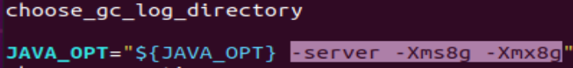

[toc]

# 1 软硬件要求
1. 64bit OS, Linux/Unix/Mac
2. 64bit JDK 1.8+
3. Maven 3.2.x （可选）
4. Git （可选）
5. 4G磁盘空间

# 2 安装RocketMQ
1. 
```shell
# 安装JDK
sudo apt install openjdk-8-jdk
```

2. 到官网下载rocketmq程序
https://rocketmq.apache.org/
选择binary下载

3. 修改启动文件的参数
- 解压后在里面的bin目录下
>> 
```shell
vim runserver.sh
```
>> 
将选中的内存配置等比例缩小（是为了单机运行）


>>
```shell
vim runbroker.sh
```
>> 
将选中的内存配置等比例缩小（是为了单机运行）


# 3 启动RocketMQ
```shell
# 启动NameServer
nohup sh mqnamesrv &

# 查看nameServer的日志，如果有打印说明启动成功
# NameServer会在这个目录下打印日志
tail -f ~/logs/rocketmqlogs/namesrv.log


# 启动broker
# 这里的9876是NameServer的地址
nohup sh mqbroker -n localhost:9876 &

# 查看broker的日志打印
tail -f ~/logs/rocketmqlogs/broker.log
```
这两个启动会创建`~/logs`和`~/store`文件夹，并在里面存放相关信息

# 4 发送/接收消息测试
在进行发送/接收消息前，需要告诉客户端NameServer的地址。可以通过以下方式来告诉
>> 设置环境变量`NAMESRV_ADDR`，例如
`export NAMESRV_ADDR=localhost:9876`

## 4.1 启动生产者
```shell
# 启动生产者 
sh tools.sh org.apache.rocketmq.example.quickstart.Producer
```
这会向RocketMQ中发送消息，发送完成后结束运行。运行时会打印很多类似这样的日志
```shell
SendResult [sendStatus=SEND_OK, 
msgId=0A00020F0E0E5FD0D5AE0243652603E6, 
offsetMsgId=0A00020F00002A9F000000000003AB18, 
messageQueue=MessageQueue [topic=TopicTest, brokerName=ubuntu, queueId=0],
queueOffset=249]
```
**sendStatus**:表示发送结果状态
**msgId**:表示消息的ID
**offsetMsgId**:
**messageQueue**:消息队列信息
  >> topic: 消息的主题
  brokerName：broker的名字
  queueId：消息队列的id, 默认创建会创建4个消息队列

**queueOffset**:偏移量

## 4.2 启动消费者
```shell
# 启动消费者
sh tools.sh org.apache.rocketmq.example.quickstart.Consumer
```

运行时，没接收到一条消息会有类似这样的打印
```shell
ConsumeMessageThread_please_rename_unique_group_name_4_1 
Receive New Messages: [MessageExt [brokerName=ubuntu, 
queueId=2, storeSize=241, queueOffset=160, sysFlag=0, 
bornTimestamp=1701397970932, bornHost=/10.0.2.15:40426, 
storeTimestamp=1701397970933, storeHost=/10.0.2.15:10911, 
msgId=0A00020F00002A9F0000000000025A12, 
commitLogOffset=154130, bodyCRC=1629961935, 
reconsumeTimes=0, preparedTransactionOffset=0, toString()
=Message{topic='TopicTest', flag=0, properties=
{CONSUME_START_TIME=1701398765626, MSG_REGION=DefaultRegion,
 UNIQ_KEY=0A00020F0E0E5FD0D5AE024363F40280, 
 CLUSTER=DefaultCluster, MIN_OFFSET=0, TAGS=TagA, WAIT=true,
  TRACE_ON=true, MAX_OFFSET=250}, body=[72, 101, 108, 108, 
  111, 32, 82, 111, 99, 107, 101, 116, 77, 81, 32, 54, 52, 
  48], transactionId='null'}]]
```
**brokerName**:broker的名字
**queueId**：消息来源与哪个消息队列ID
**storeSize**:
**queueOffset**: 消息队列的偏移量
**topic**： topic是'TopicTest'
**CLUSTER**：

# 5 关闭RocketMQ
```shell
# 先关闭broker
sh mqshutdown broker

# 再关闭NameServer
sh mqshutdown namesrv
```

# 6 RocketMQ可视化控制台的安装
下载地址：
`https://github.com/apache/rocketmq-externals/tags`
下载rocketmq-console-1.0.0

这个控制台也是NameServer的一个客户端

# 6.1 修改配置
- 在rocketmq-console/src/main/resource/application.properties文件中`server.port`配置改成一个不常用的端口号，例如7000
- 配置NameServer的地址`rocketmq.config.namesrvAddr=localhost:9876`
- 在rocketmq-console/pom.xml中添加依赖
```xml
<dependency>
    <groupId>javax.xml.bind</groupId>
    <artifactId>jaxb-api</artifactId>
    <version>2.3.0</version>
</dependency>
<dependency>
    <groupId>com.sun.xml.bind</groupId>
    <artifactId>jaxb-impl</artifactId>
    <version>2.3.0</version>
</dependency>
<dependency>
    <groupId>com.sun.xml.bind</groupId>
    <artifactId>jaxb-core</artifactId>
    <version>2.3.0</version>
</dependency>
<dependency>
    <groupId>javax.activation</groupId>
    <artifactId>activation</artifactId>
    <version>1.1.1</version>
</dependency>
```
到pom.xml中的`dependencies`标签下。
以上这个是JAXB-----Java Architechture for Xml Binding，用于XMIL.绑定的ava技术，是一个业界标准，是一项可以根据XML Schema生成ava类的技术。

```shell
# 在rocketmq-console执行
mvn clean package -Dmaven.test.skip=true
# 这会下载和编译相关项
# 编译完成后会在rocketmq-console/target下生成rocketmq-console-ng-1.0.0.jar
```

## 6.2 运行
在运行之前，需要确保NameServer和Broker都启动了
```shell
# 在rocketmq-console/target运行
java -jar rocketmq-console-ng-1.0.0.jar

# 然后在浏览器中访问
http://localhost:7000
# 即可打开可视化界面
```


