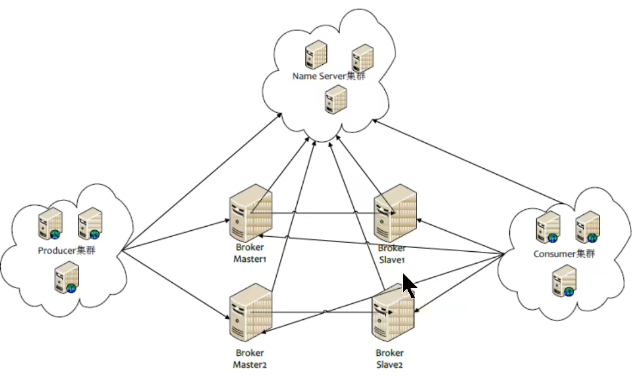
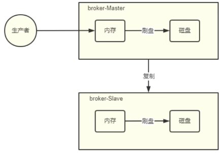

[toc]

# 集群搭建理论
NameServer、生产者、消费者、Broker都是集群

对于Producer、Consumer只要设置自己的组名一致就是一个集群。对于NameServer来说，只要启动了，就可以加入集群。
相对复杂的是Broker集群，在Broker集群中，可以有多个小集群组成，其中的小集群是以master-slave的方式搭建的，如下图所示。


# 1 赋值和刷盘策略
**赋值策略**：
复制策略是Broker的Master与Slave间的数据同步方式。分为同步复制与异步复制:
- <font color=red>同步复制</font>: 消息写入master后，master会等待slave同步数据成功后才向producer返回成功ACK·
- <font color=red>异步复制</font>: 消息写入master后，master立即向producer返回成功ACK，无需等待slave同步数据成功

>> 异步复制策略会降低系统的写入延迟，RT变小提高了系统的吞吐量

**刷盘策略**:
刷盘策略指的是broker中消息的落盘方式，即消息发送到broker内存后消息持久化到磁盘的方式。分为同步刷盘与异步刷盘:
- <font color=red>同步刷盘</font>: 当消息持久化到broker的磁盘后才算是消息写入成功。
- <font color=red>异步刷盘</font>: 当消息写入到broker的内存后即表示消息写入成功，无需等待消息持久化到磁盘。

>> 1.异步刷盘策略会降低系统的写入延迟，RT变小，提高了系统的吞吐量
2.消息写入到Broer的内存，一般是写入到了PageCache
3.对于异步刷盘策略，消息会写入到PageCache后立即返回成功ACK。但并不会立即做落盘操作，而是当PageCache到迷一定量会自动进行落盘。

# 2 Broker集群模式
## 2.1 单Master模式
只有一个broker。这种方式也只能是在测试时使用，生产环境下不能使用，因为存在单点问题。
## 2.2 多master模式
broker集群仅由多个master构成，不存在Slave。同一Topic的各个Queue会分布在各个master节点上。
- <font color=red>优点</font>:配置简单，单个Master宕机或重启维护对应用无影响，<font color=red>在磁盘配置为RAID10时</font>，即使机器宕机不可恢复情况下，由于RAID10磁盘非常可靠（磁盘阵列），消息也不会丢(异步刷盘丢失少量消息，同步刷盘一条不丢)，性能最高;
- <font color=red>缺点</font>:单台机器宕机期间，这台机器上未被消费的消息在机器恢复之前不可订阅（不可消费)，消息实时性会受到影响。

>> 以上优点的前提是，这些Master都配置了RAD磁盘阵列。如果没有配置，一旦出现某Master宕机，则会发生大量消息丢失的情况。

## 2.3 多Master多Slave模式-异步复制
broker集群由多个master构成，每个master又配置了多个slave(在配置了RAID磁盘阵列的情况下，一个master一般配置一个slave即可)。master与slave的关系是主备关系，即master负责处理消息的读写请求，而slave仅负责消息的备份与master宕机后的角色切换。

异步复制即前面所讲的复制策略中的异步复制策略，即消息写入master成功后，master立即向producer返回成功ACK，无需等待slave同步数据成功。

该模式的最大特点之一是，当master宕机后slave能够自动切换为master。不过由于slave从master的同步具有短暂的延迟（毫秒级)，所以当master宕机后，这种异步复制方式可能会存在少量消息的丢失问题。

>> Slave从Masterf同步的延迟越短，其可能丢失的消息就越少
对于Master的RAID磁盘阵列，若使用的也是异步复制策略，同样也存在延迟问题，同样也可能会丢失消息。但RAID阵列的秘诀是微秒级的（因为是由硬件支持的)，所以其丢失的数据量会更少。


## 2.3 多Master多Slave模式-同步双写
该模式是多Master多s1ave模式的同步复制实现。所谓同步双写，指的是消息写入master成功后，master会等待slave同步数据成功后才向producer返回成功ACK，即master与slave都要写入成功后才会返回成功ACK，也即双写。

该模式与异步复制模式相比，优点是消息的安全性更高，不存在消息丢失的情况。但单个消息的RT略高，从而导致性能要略低（大约低10%)。

该模式存在一个大的问题:对于目前的版本，Master宕机后，Slave不能自动切换到Master（2021-7-20）。

## 2.4 最佳实践
一般会为Master配置RAID10磁盘阵列，然后再为其配置一个Slave。即利用了RAID10磁盘阵列的高效.安全性，又解决了可能会影响订阅的问题。

>> 1. RAID磁盘阵列的效率要高于Master-Slave集群，因为RAID是硬件支持的，因此，RAID阵列的搭建成本要高。
2. 多Master + RAID阵列与多Master多Slave集群的区别是：
<font color=red>多Master + RAID阵列</font>仅仅可以保证数据不丢失，即不影响消息写入，但其可能会影响到消息的订阅。但其执行效率要远高于多Master多Slave集群
<font color=red>多Master多Slave集群</font>其不仅可以保证数据不丢失，也不会影响消息写入。其运行效率要低于多Master+RATD阵列

# 3 磁盘阵列(RAID)
## 3.1 RAID等级
RAID这种设计思想很快被业界接纳，RAID技术作为高性能、高可靠的存储技术，得到了非常广泛的应用。RAID主要利用<font color=red>镜像、数据条带和数据校验</font>三种技术来获取高性能、可靠性、容错能力和扩展性，根据对这三种技术的使用策略和组合架构，可以把RAID分为不同的等级，以满足不同数据应用的需求。
D.A.Patterson等的论文中定义了RAIDO~RAID6原始RAID等级。随后存储厂商又不断推出RAID7、RAID10、RAID01、 RAID50、RAID53、RAID100等RAID等级，但这些并无统一的标准。目前业界与学术界公认的标准是RAIDO~RAID6，而在实际应用领域中使用最多的RAID等级是RAIDO、RAID1、RAID3、RAID5、RAID6和RAID10。
RAID每一个等级代表一种实现方法和技术，等级之间并无高低之分。在实际应用中，应当根据用户的数据应用特点，综合考虑可用性、性能和成本来选择合适的RAID等级，以及具体的实现方式。

## 3.2 镜像技术
镜像技术是一种冗余技术，为磁盘提供数据备份功能，防止磁盘发生故障而造成数据丢失。对于RAID而言，采用镜像技术最典型地的用法就是，同时在磁盘阵列中产生两个完全相同的数据副本，并且分布在两个不同的磁盘上。镜像提供了完全的数据冗余能力，当一个数据副本失效不可用时，外部系统仍可正常访问另一副本，不会对应用系统运行和性能产生影响。而且，镜像不需要额外的计算和校验，故障修复非常快，直接复制即可。镜像技术可以从多个副本进行并发读取数据，提供更高的读T/O性能，但不能并行写数据，写多个副本通常会导致一定的I/O性能下降。

镜像技术提供了非常高的数据安全性，但需要至少双倍的存储空间。主要应用于至关重要的数据保护，这种场合下的数据丢失可能会造成非常巨大的损失。

## 3.3 数据条带技术
数据条带化技术是一种自动将T/O操作负载均衡到多个物理磁盘上的技术。更具体地说就是，将一块连续的数据分成很多小部分并把它们分别存储到不同磁盘上。这就能使多个进程可以并发访问数据的多个不同部分，从而获得最大程度上的I/O并行能力，极大地提升性能。

## 3.4 数据校验技术
数据校验技术是指，RAID 要在写入数据的同时进行校验计算，并将得到的校验数据存储在RAID 成员磁盘中。校验数据可以集中保存在某个磁盘或分散存储在多个不同磁盘中。当其中一部分数据出错时，就可以对剩余数据和校验数据进行反校验计算重建丢失的数据。

数据校验技术相对于镜像技术的优势在于节省大量开销，但由于每次数据读写都要进行大量的校验运算，对计算机的运算速度要求很高，且必须使用硬件RAID控制器。在数据重建恢复方面，检验技术比镜像技术复杂得多且慢得多。

## 3.5 RAID分类
从实现角度看，RAID主要分为软RAID、硬RAID以及混合RAID三种。

**软RAID**：所有功能均有操作系统和CPU来完成，没有独立的RAID控制处理芯片和I/O处理芯片，效率自然最低。

**硬RAID**：配备了专门的RAID控制处理芯片和I/O处理芯片以及阵列缓冲，不占用CPU资源。效率很高，但成本也高。(因为现在存储成本也不高)

**混合RAID**：具备RAID控制处理芯片，但没有专门的I/O处理芯片，需要CPU和驱动程序来完成。性能和成本在软RAID和硬RAID之间。

## 3.6 常见的RAID等级详解


# 4 搭建集群实践
## 4.1 集群架构
这里要搭建一个双主双从异步复制的Broker集群。为了方便，这里使用了两台主机来完成集群的搭建。这两台主机的功能与broker角色分配如下表。
|主机名|IP|功能|Broker角色|
|------|--|---|----------|
|rocketOS1|192.168.59.164|NameServer+Broker|Master1+Slave2|
|rocketOS2|192.168.59.165|NameServer+Broker|Master2+Slave1|

我们在rocketOS1/2上均运行NameServer和Broker。在rocketOS1上运行的Broker是Master1和Slave2, 在rocketOS2上运行的Broker是Master2和Slave1. 其中Master-Slave对是 “Master1-Slave1”
、“Master2-Slave2”， 搭建时这样交叉匹配是为了避免同一台机器挂了之后，Master和对应的Slave都没了。

## 4.2 启动集群
1. 启动NameServer
```shell
nohup sh mqnamesrv &
```

2. 启动broker集群的两个master
```shell
# 通过指定配置文件启动master-a
nohup sh mqbroker -c conf/2m-2s-async/broker-a.properties &
tail -f ~/logs/rocketmqlogs/broker.log

# 通过指定配置文件启动master-b
nohup sh mqbroker -c conf/2m-2s-async/broker-b.properties &
tail -f ~/logs/rocketmqlogs/broker.log
```

3. 启动两个broker的slave
```shell
# 启动broker-a的slave
nohup sh mqbroker -c conf/2m-2s-async/broker-a-s.properties &
tail -f ~/logs/rocketmqlogs/broker.log

# 启动broker-b的slave
nohup sh mqbroker -c conf/2m-2s-async/broker-b-s.properties &
tail -f ~/logs/rocketmqlogs/broker.log
```

4. 通过rocketmq-console启动客户端
- 修改配置文件rocketmq-console/src/main/resource/application.properties
```shell
server.contextPath=
server.port=7000
#spring.application.index=true
spring.application.name=rocketmq-console
spring.http.encoding.charset=UTF-8
spring.http.encoding.enabled=true
spring.http.encoding.force=true
logging.config=classpath:logback.xml

#if this value is empty,use env value rocketmq.config.namesrvAddr  NAMESRV_ADDR | now, you can set it in ops page.default localhost:9876
# nameserver集群，这里配置各个nameserver的地址，使用逗号分割
rocketmq.config.namesrvAddr=localhost1:9876,localhost2:9877

#if you use rocketmq version < 3.5.8, rocketmq.config.isVIPChannel should be false.default true
rocketmq.config.isVIPChannel=

#rocketmq-console's data path:dashboard/monitor
rocketmq.config.dataPath=/tmp/rocketmq-console/data

#set it false if you don't want use dashboard.default true
rocketmq.config.enableDashBoardCollect=true
```

设置完成后重新打包编译rocketmq-console
```shell
# 在rocketmq-console目录下执行
mvn clean package -Dmaven.test.skip=true
```

# 5 mqadmin介绍
在mq解压目录的bin目录下有一个mqadmin命令，该命令是一个运维指令，用于对mq的主题，集群,broker等信息进行管理。

1. 修改bin/tools.sh
在运行mqadmin命令之前，先要修改mq解压目录下bin/tools.sh配置的JDK的ext目录位置。本机的ext目录在/usr/java/jdk1.8.0_161/jre/lib/ext。

相关用法：
https://rocketmq.apache.org/zh/docs/deploymentOperations/02admintool