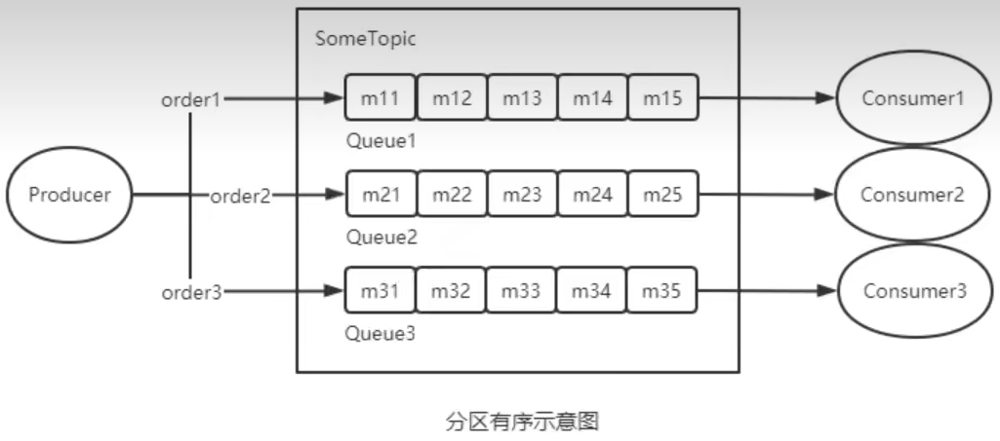

[toc]

# 1 普通消息
Producer对于消息的发送方式也有多种选择，不同的方式会产生不同的系统效果。
## 1.1 同步发送消息
同步发送消息是指，Producer发出一条消息后，会在收到MQ返回的ACK之后才发下一条消息。该方式的消息可靠性最高，但消息发送效率太低。

## 1.2 异步发送消息
异步发送消息是指，Producer发出消息后无需等待MQ返回ACK，直接发送下一条消息。该方式的消息可靠性可以得到保障，消息发送效率也可以。

## 1.3 单项发送消息
单向发送消息是指，Prorluer仅负责发送消息，不等待、不处理MQ的ACK。该发送方式时MQ也不返回ACK。该方式的消息发送效率最高，但消息可靠性较差。

# 2 顺序消息
顺序消息指的是，严格按照消息的发送顺序进行消费的消息(FIFO).
默认情况下生产者会把消息以Round Robin轮询方式发送到不同的Queue分区队列;而消费消息时会从多个Queue上拉取消息，这种情况下的发送和消费是不能保证顺序的。如果将消息仅发送到同一个Queue中，消费时也只从这个Queue上拉取消息，就严格保证了消息的顺序性。

## 2.1 为什么需要顺序消息
例如，现在有TOPIC ORDER_STATUS(订单状态)，其下有4个Queue队列，该Topic中的不同消息用于描述当前订单的不同状态。假设订单有状态:未支付、已支付、发货中、发货成功、发货失败。根据以上订单状态，生产者从时序上可以生成如下几个消息:
订单T0000001:未支付-->订单TO000001:已支付-->订单TO000001:发货中-->订单TO000001:发货失败。
消息发送到MQ中之后，Queue的选择如果采用轮询策略，消息在MQ的存储可能如下:

这种情况下，我们希望Consumer消费消息的顺序和我们发送是一致的，然而上述MQ的投递和消费方式我们无法保证顺序是正确的。对于顺序异常的消息，Consumer即使设置有一定的状态容错，也不能完全处理好这么多种随机出现组合情况。

基于上述的情况，可以设计如下方案:对于相同订单号的消息，通过一定的策略，将其放置在一个Queue中，然后消费者再采用一定的策略（例如，一个线呈独立处理一个queue，保证处理消息的顺序性)，能够保证消费的顺序性。

## 2.2 有序性分类
根据有序范围的不同，RockelMQ可以严格地保证两种消息的有序性:分区有序与全局有序。
**全局有序**：
当发送和消费参与的Queue只有一个时所保证的有序是整个Topic中消息的顺序，称为全局有序。

>> 在创建Iopic时指定Queue的数量。有三种指定方式
1）在代码中创建Producer时，可以指定其自动创建的topic的Queue数量
2）在RocketMQ可视化控制台中手动创建Topic时指定Queue数量
3）使用nqadmin命令手动创建Topic时指定Queue数量

**分区有序**：
如果有多个Queue参与，其仅可保证在该Queue分区队列上的消息顺序，则称为分区有序。

>> 如何实现Queue的选择?在定义Producer时我们可以指定消息队列选择器，而这个选择器是我们自己实现了MessageQueueSelector接口定义的

>>在定义选择器的选择算法时，一般需要使用选择key。这个选择key可以是消息key也可以是其它数据。但无论谁做选择key，都不能重复，都是唯一的。

>>一般性的选择算法是，让选择key（或其hash值）与该Topic所包含的Queue的数量取模，其结果即为选择出的Queue的QueueId。

>> 取模算法存在一个问题:不同选择key与Queue数量取模结果可能会是相同的，即不同选择key的消息可能会出现在相同的Queue，即同一个Consuemr可能会消费到不同选择key的消息。这个问题如何解决?一般性的作法是，从消息中获取到选择key,对其进行判断。若是当前Consumer需要消费的消息，则直接消费，否则，什么也不做。这种做法要求选择xey要能够随着消息一起被Consumer获取到。此时使用消息key作为选择ey是比较好的做法。

>> 以上做法会不会出现如下新的问题呢?不属于那个Consmer的消息被拉取走了，那么应该消费该消息的Consumer是否还能再消费该消息呢?同一个QIeue中的消息不可能被同一个Group中的不同Consumer同时消费。所以，消费一个Ouene的不同选择key的消息的Consumer一定属于不同的Group。而不同的Group中的Consumer间的消费是相互隔离的，互不影响的。

# 3 延迟消息
当消息写入到Broker后，仅指定的时长后才可被消费处理的消息，称为延时消息。
采用RocketMQ的延时消息可以实现定时任务的功能，而无需使用定时器。典型的应用场景是，电商交易中超时未支付关闭订单的场景，12306平台订票超时未支付取消订票的场景。

## 3.1 延时等级
延时消息的延迟时长不支持随意时长的延迟，是通过特定的延迟等级来指定的。延时等级定义在RocketMQ服务端的Messagestoreconfig类中的如下变量中:
`messageDelayLevel = "1s 5s 10s 30s 1m 2m 3m 4m 5m 6m 7m 8m 9m 10m 20m 3em 1h 2h";`
即，若指定的延时等级为3，则表示延迟时长为10s。
当然，如果需要自定义的延时等级，可以通过在broker加载的配置中新增如下配置（例如下面增加了1天这个等级1d)。配置文件在RocketMQ安装目录下的conf目录中。

## 3.2 延时消息原理

Producer将消息发送到Broker后，Broker会首先将消息写入到commitlog文件，然后需要将其分发到相应的consumequeue。不过，在分发之前，系统会先判断消息中是否带有延时等级。若没有，则直接正常分发;若有则需要经历一个复杂的过程:
- 修改消息的Topic为SCHEDULE_TOPIC_XXXX
- 根据延时等级，在consumequeue目录中SCHEDULE TOPIC_XXXX主题下创建出相应的queueld目录与consumequeue文件（如果没有这些目录与文件的话)。

>> 延迟等级与QueueID的对应关系： queueId=delatLevel-1
需要注意，在创建queueld目录时，并不是一次性地将所有延迟等级对应的目录全部创建完毕，而是用到哪个延迟等级创建哪个目录

- 修改消息索引单元内容。索引单元中的Message Tag HashCode部分原本存放的是消息的Tag的Hash值。现修改为消息的投递时间（上图中的第4步骤的发生的时间）。投递时间是指该消息被重新修改为原Topic后再次被写入到commitlog中的时间。投递时间=消息存储时间＋延时等级时间。消息存储时间指的是消息被发送到Broker时的时间戳。

- 将消息索引写入到SCHEDULE_TOPIC_XXXX主题下相应的consumequeue中

>> SCHEDULE TOPIC XXXX目录中各个延时等级Queut中的消息是如何排序的?
是按照消息投递时间排序的。一个Broker中同一等级的所有延时消息会被写入到consumequeue目录中SCHEDULE_TOPIC_XXXX目录下相同ouetle中。即一个Queue中消息投递时间的延迟等级时间是相同的。那么投递时间就取决于于消息存储时间了。即排序按照消息被发送到Broker的时间进行排序的。

**投递延时消息**
Broker内部有一个延迟消息服务类ScheuleMessageService，其会消费SCHEDULE_TOPIC_XXXX中的消息，即按照每条消息的投递时间，将延时消息投递到目标Topic中。不过，在投递之前会从commitlog中将原来写入的消息再次读出，并将其原来的延时等级设置为0，即原消息变为了一条不延迟的普通消息。然后再次将消息投递到目标Topic中。

>> ScheuleMessageService在Broker启动时，会创建并启动一个定时器Tmer，用于执行相应的定时任务。系统会根据延时等级的个数，定义相应数量的TimerTask，每个TimerTask负责一个延迟等级消息的消费与投递。每个TimerTask都会检测相应Queue队列的第一条消息是否到期。若第一条消息未到期，则后面的所有消息更不会到期〈消息是按照投递时间排序的)﹔若第一条消息到期了，则将该消息投递到目标Topic，即消费该消息。

**将消息重新写入commitlog**:
延迟消息服务类ScheuleMessageService将延迟消息再次发送给了commitlog，并再次形成新的消息索引条目，分发到相应Queue。

>> 这其实就是一次普通消息发送。只不过这次的消息Producer是延迟消息服务类ScheuleMessageService。

# 4 事务消息
## 4.1 问题引入
这里的一个需求场景是:工行用户A向建行用户B转账1万元。
我们可以使用同步消息来处理该需求场景:

1.工行系统发送一个给B增款1万元的同步消息M给Broker
2.消息被Broker成功接收后，向工行系统发送成功ACK
3.工行系统收到成功ACK后从用户A中扣款1万元
4.建行系统从Broker中获取到消息M
5.建行系统消费消息M，即向用户B中增加1万元

这其中是有问题的:若第步中的扣款操作失败，但消息已经成功发送到了Broker。对于MQ来说，只要消息写入成功，那么这个消息就可以被消费。此时建行系统中用户B增加了1万元。出现了数据不一致问题。

**解决思路**
解决思路是，让第1、2、3步具有原子性，要么全部成功，要么全部失败。即消息发送成功后，必须要保证扣款成功。如果扣款失败，则回滚发送成功的消息。而该思路即使用事务消息。这里要使用分布式事务解决.

使用事务消息来处理该需求场景：
1. 事务管理器TM向事务协调器TC发起指令，开启全局事务
2. 工行系统发一个给B增款1万元的事务消息M给TC
3. TC会向Broker发送半事务消息prepareHa1f，将消息M预提交到Broker。此时的建行系统是看不到Broker中的消息M的
4. Broker会将预提交执行结果Report给TC。
5. 如果预提交失败，则TC会向TM上报预提交失败的响应，全局事务结束;如果预提交成功，TC会调用工行系统的回调操作，去完成工行用户A的预扣款1万元的操作
6. 工行系统会向TC发送预扣款执行结果，即本地事务的执行状态
7. TC收到预扣款执行结果后，会将结果上报给TM.
> 预扣款执行结果存在3种可能性：
COMMIT_MESSAGE(本地事务执行成功)、ROLLBACK_MESSAGE(本地事务执行失败)、UNKOWN(不确定，表示需要进行回查以确定本地事务的执行结果)
8. TM会根据上报结果向TC发出不同的确认指令
   - 若预扣款成功(本地事务状态为COMMIT_MESSAGE)，则TM向TC发送Global Commit指令
   - 若预扣款失败(本地事务状态为ROLLBACK_MESSAGE)，则TM向TC发送Global Rollback指令
   - 若现未知状态(本地事务状态为UNKNOW)，则会触发工行系统的本地事务状态回查操作。回查操作会将回查结果，即COMMIT_MESSAGE或ROLLBACK_MESSAGE Report给TC。TC将结果上报给TM，TM会再向TC发送最终确认指令Global Commit或Global Rollback
9. TC在接收到指令后会向Broker与工行系统发出确认指令。
   - TC接收的若是**Global Commit**指令，则向Broker与工行系统发送Branch Commit指令。此时Broker中的消息M才可被建行系统看到;此时的工行用户A中的扣款操作才真正被确认
   - TC接收到的若是**Global Rollback**指令，则向Broker与工行系统发送Branch Rollback指令。此时Broker中的消息M将被撤销;工行用户A中的扣款操作将被回滚

> 以上方案就是为了确保消息投递与扣款操作能够在一个事务中，要成功都成功，有一个失败，则全部回滚。
以上方案并不是一个典型的XA模式。因为XA模式中的分支事务是异步的，而事务消息方案中的消息预提交与预扣款操作间是同步的。

## 4.2 概念基础
### 4.2.1 分布式事务
对于分布式事务，通俗地说就是，一次操作由若干分支操作组成，这些分支操作分属不同应用，分布在不同服务器上。分布式事务需要保证这些分支操作要么全部成功，要么全部失败。分布式事务与普通事务一样，就是为了保证操作结果的一致性。

### 4.2.2 事务消息
RocketMQ提供了类似X/Open XA的分布式事务功能，通过事务消息能达到分布式事务的最终一致。XA是一种分布式事务解决方案，一种分布式事务处理模式。

### 4.2.3 半事务消息
暂不能投递的消息，发送方已经成功地将消息发送到了Broker，但是Broker未收到最终确认指令，此时该消息被标记成“暂不能投递”状态，即不能被消费者看到。处于该种状态下的消息即半事务消息。

### 4.2.4 本地事务状态
Producer**回调操作**执行的结果为本地事务状态，其会发送给TC，而TC会再发送给TM。TM会根据TC发送来的本地事务状态来决定全局事务确认指令。

### 4.2.5 消息回查
消息回查，即重新查询本地事务的执行状态。本例就是重新到DB中查看预扣款操作是否执行成功.

> 注意，消息回查不是重新执行回调操作。回调操作是进行预扣款操作，而消息回查则是查看预扣款操作执行的结果。
引发消息回查的原因最常见的有两个:
1)回调操作返回UNKNWON
2)TC没有接收到TM的最终全局事务确认指今

### 4.2.6 RocketMQ种的消息回查设置
关于消息回查，有三个常见的属性设置。它们都在broker加载的配置文件中设置，例如:
- transactionTimeout=20，指定TM在20秒内应将最终确认状态发送给TC，否则引发消息回查。默认为60秒
- transactionCheckMax=5，指定最多回查5次，超过后将丢弃消息并记录错误日志。默认15次。
- transactionCheckInterval=10，指定设置的多次消息回查的时间间隔为10秒。默认为60秒。

# 5 XA模式三剑客
## 5.1 XA协议
XA (Unix Transaction)是一种分布式事务解决方案，一种分布式事务处理模式，是基于XA协议的
l。XA
协议由Tuxedo (Transaction for Unix has been Extended for Distributed Operation，分布式操作扎
展之
后的Unix事务系统）首先提出的，并交给X/Open组织，作为资源管理器与事务管理器的接口标准。XA协议由Tuxedo (Transaction for Unix has been Extended for Distributed Operation，分布式操作扩展之后的Unix事务系统）首先提出的，并交给X/Open组织，作为资源管理器与事务管理器的接口标准。

XA模式中有3个重要组件：TC、TM、RM

## 5.2 TC 
Transaction Coordinator，事务协调者。维护全局和分支事务的状态、驱动全局事务提交或回滚。

在RacketMQ中Broker充当TC

## 5.3 TM 
Transaction Manager，事务管理器。定义全局事务的范围:开始全局事务、提交或回滚全局事务。它实际是全局事务的发起者。

在RockeyMQ中，Producer充当TM 

## 5.4 RM
Resource Manager，资源管理器。管理分支事务处理的资源，与TC交谈以注册分支事务和报告分支事务的状态，并驱动分支事务提交或回滚。

在RocketMQ中事务消息的Producer及Broker均是RM

## 5.5 XA模式架构

 XA模式是一个典型的2PC，其执行原理如下:
 1. TM向TC发起指令，开启一个全局事务.
 2. 根据业务要求，各个RM会逐个向TC注册分支事务，然后TC会逐个向RM发出预执行指令。
 3. 各个RM在接收到指令后会在进行本地事务预执行。
 4. TC在接收到各个RM的Report后会将汇总结果上报给TM，根据汇总结果TM会向TC发出确认指令。
    - 若所有结果都是成功响应，则向TC发送Global Commit指令。
    - 只要有结果是失败响应，则向TC发送Global Rollback指令。
5. TC在接收到指令后再次向RM发送确认指令。

## 5.6 注意
- 事务消息不支持延时消息
- 对于事务消息要做好幂等性检查，因为事务消息可能不止一次被消费（因为存在回滚后再提交的情况)